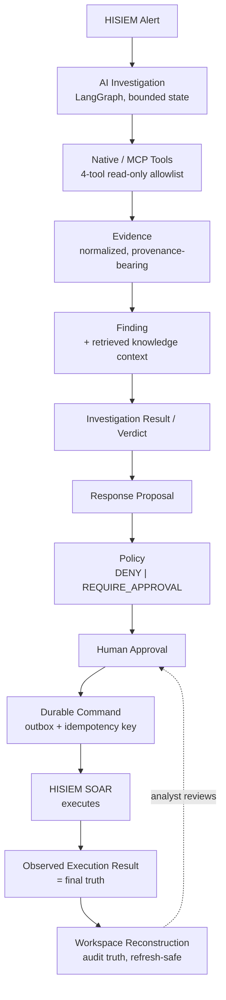
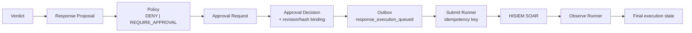

# HISIEM SOC Copilot

**AI SOC · Security Investigation · Evidence Grounding · Tool-Using Agent · Human-in-the-loop**

An AI investigation and response *decision* layer for SOC analysts. It runs agent-driven
investigations over HISIEM platform data, grounds every judgement in traceable Evidence,
and requires human approval before any side-effecting response.

> **This is the decision layer, not the platform.** The security platform it operates on
> — ingestion, detection, alerts, cases and deterministic SOAR execution — is a separate
> repository: **[HISIEM](https://github.com/xsc683/HISIEM)**. See
> [§17](#17-relationship-to-hisiem).

---

## 1. Project Summary

| | |
|---|---|
| What it is | A tool-using AI agent that investigates security alerts and proposes responses — under policy, tenant and human-authority constraints |
| Role in the portfolio | **Project 2 of 2.** The AI/agent layer above the security platform |
| Runtime | Python 3.12+, FastAPI, LangGraph, PostgreSQL |
| Engineering focus | **AI agent engineering · RAG · MCP · authority & safety · durable execution · evaluation** |
| Model-agnostic | A provider contract with a real OpenAI-compatible implementation; the agent never authorizes anything |
| Reachable tool surface | Exactly **4** model-selectable read-only tools, plus 1 system-controlled tool the model cannot call |

**The core claim this project makes:** an AI agent can be genuinely useful for security
investigation *without* being trusted with authority. Every place where a typical agent
demo would let the model act, this system inserts a boundary instead — and each boundary
is enforced in code and covered by a non-compensating acceptance gate.

---

## 2. What This Project Is / Is Not

**It is:**

- An **AI-assisted investigation system** — the agent plans investigation steps, calls
  read-only tools, and assembles evidence.
- An **evidence-driven** system — every finding traces back to normalized, provenance-bearing
  Evidence derived from a real tool result.
- A **governed** system — the model sees a deterministic allowlist of read-only tools. It
  cannot choose a server, endpoint, credential, or tenant.
- A **human-authority** system — high-risk responses require an explicit human decision.
- A **durable** system — response execution is an outbox-backed, idempotent, retryable
  command, not an in-process function call.

**It is not:**

- A SIEM. HISIEM owns security data, detection and alerts.
- A SOAR. HISIEM SOAR owns deterministic response execution.
- An autonomous SOC. There is no path by which the model authorizes an action.
- A chatbot, and not a generic security Q&A system.
- A multi-agent system. One investigating agent, deliberately — see
  [§18](#18-known-limits--deliberately-out-of-scope).

---

## 3. Core Investigation Lifecycle

This is the spine of the system. Read it top to bottom once; the rest of this document
is detail about the links in the chain.



**Where the model stops.** Everything above `PROP` is model-influenced. Everything from
`POLICY` down is not: policy is deterministic, approval is human, the command is durable,
execution happens in HISIEM, and the observed result — not Copilot's belief about it — is
the final truth.

---

## 4. Architecture Overview

```text
API (FastAPI, transport only)
  ↓
Application (commands, queries, handlers, ports)
  ↓                    ↗ Agent (LangGraph orchestration)
Domain (pure)         ↗   — orchestration, never business authority
  ↑
Infrastructure (PostgreSQL, HISIEM HTTP, MCP, LLM, OTel)  ← Bootstrap (composition root)
```

| Layer | Responsibility | Rule |
|---|---|---|
| `domain/` | Aggregates, entities, value objects, events, invariants | **Pure.** No FastAPI, SQLAlchemy, LangGraph, httpx or Pydantic |
| `application/` | Commands, queries, handlers, ports, services | Uses ports and a unit of work; never sees a SQL session |
| `agent/` | LangGraph orchestration, tools, evidence normalization, prompts | Owns orchestration, **not** business authority |
| `contracts/` | Boundary schemas (API / LLM / tools) | Pydantic lives here, not in `domain/` |
| `api/` | FastAPI transport | Depends on `application`, never on `infrastructure` |
| `infrastructure/` | PostgreSQL, HISIEM adapter, MCP, LLM providers, OTel, durable execution | Adapts external systems |
| `bootstrap/` | Composition root (container, lifespan) | Wires everything; the only place that constructs adapters |

These boundaries are **enforced by tests**, not by convention — `tests/architecture/`
fails the build if a layer imports something it should not. See [§16](#16-verification).

Visual model: [`docs/architecture-overview.md`](docs/architecture-overview.md).

---

## 5. Authority Model

Nine distinctions the system is built to preserve. Each one is a boundary that a
plausible implementation would collapse.

```text
ToolResult              !=  Evidence
Knowledge               !=  Verdict Authority
Agent Verdict           !=  Analyst Disposition
Policy                  !=  Human Approval
Human Approval          !=  Execution
Submission              !=  Execution Success
Telemetry               !=  Business Truth
Frontend                !=  Authority
LangGraph checkpoint    !=  Domain Truth

HISIEM observed execution result  =  final execution truth
```

| Distinction | Why it exists | Where it is enforced |
|---|---|---|
| ToolResult ≠ Evidence | A raw tool response is *data*, not a grounded fact. A failed or ungrounded call produces **no** Evidence | `agent/evidence/` normalizer + typed failure handling |
| Knowledge ≠ Verdict Authority | Retrieved documentation can inform a verdict; it can never *be* one | Knowledge evidence carries a distinct authority class; `KNOWLEDGE_ONLY_DEFINITIVE_VERDICT` gate |
| Agent Verdict ≠ Analyst Disposition | The model's conclusion is a recommendation, not a human's determination | Separate persisted fields; separate presentation |
| Policy ≠ Human Approval | A deterministic policy decision is not consent. `DENY` is not a rejection; `REQUIRE_APPROVAL` is not an approval | `domain/response` policy + approval aggregate |
| Human Approval ≠ Execution | An approval authorizes *intent*; it does not perform it | Durable command + outbox, decoupled from the decision |
| Submission ≠ Execution Success | Handing a command to a provider proves nothing about the outcome | Independent submission and execution status machines |
| Telemetry ≠ Business Truth | Losing traces must not change any business outcome | No business path reads spans/collector state |
| Frontend ≠ Authority | The UI derives presentation from persisted state; it invents nothing | Server/persisted truth wins on refresh |
| LangGraph checkpoint ≠ Domain Truth | Graph state is bounded working memory, not business state | Checkpoint is never read as domain state |

**The permanent rule:**

```text
Model proposes  →  Policy constrains  →  Human authorizes
Durable command records intent  →  HISIEM executes  →  Copilot observes
```

---

## 6. Four-Plane Architecture

The four planes this system closes, and the stable foundations it reuses rather than
redesigning:

| Plane | Owns | Principal modules |
|---|---|---|
| **Knowledge Plane** | Trustworthy, traceable, tenant-safe supporting context normalized into the same Evidence model | `knowledge/`, `agent/knowledge/`, `domain/knowledge/` |
| **Capability Plane** | Tool/capability discovery, trust admission, invocation and bounded results | `agent/tools/`, `infrastructure/mcp/` |
| **Observability Plane** | Spans, context propagation, metrics/log correlation | `infrastructure/observability/` |
| **Analyst Experience Plane** | What the analyst sees and decides — *hosted in the HISIEM repository* | `HISIEM: web/` |

**Reused, not re-architected:** Domain Plane, Agent Runtime Plane, Persistence Plane,
Durable Execution Plane, Human Authority Plane, HISIEM Integration Plane, Evaluation Plane.

Four global principles govern all of them:

1. **No new undefined authority.** Knowledge ≠ verdict authority; an MCP provider ≠
   authorization; telemetry ≠ business authority; the frontend ≠ command authority;
   LangGraph ≠ domain authority.
2. **No second truth source.** No parallel Investigation, Execution, Approval, Evidence,
   Tenant, Tool-authorization or Agent-business-state system.
3. **Stability means authority stability**, not "code never changes."
4. **No new technology is integrated by introducing a parallel architecture.**

---

## 7. Tool / MCP Governance

**Discovery, admission and authorization are three different things.**

- **Discovery** is what a server claims it offers.
- **Admission** is what this system has decided to trust — a hand-written, server-side
  entry declaring internal name, trusted description, configured server, external name,
  argument/result contracts, expected schema fingerprint, risk classification, tenant
  scope and per-capability bounds.
- **Selection** is what the model may choose — which is only ever an admitted, read-only
  capability.

**The model-selectable surface is exactly four tools** (asserted by an architecture test):

```text
hisiem.search_events
hisiem.get_detection_rule
knowledge.retrieve_security_guidance
knowledge.resolve_attack_technique
```

plus `hisiem.get_alert_context`, which is **system-controlled** — the graph's hydrate node
calls it directly and it is never offered to the model.

**Fail-closed by construction:**

| Rule | Effect |
|---|---|
| Unknown server | Rejected — only trusted configured endpoints are contacted |
| Write / high-risk capability | `is_model_selectable` requires `READ_ONLY`; a write capability is never selectable |
| Unadmitted dynamic tool | Discovered but unadmitted — visible to operators, invisible to the model |
| Schema drift | Deterministic SHA-256 fingerprint over canonical name + input/output schema; drift → `SCHEMA_MISMATCH` |
| Protocol downgrade | A pinned production protocol version; unsupported/legacy negotiation is rejected rather than silently downgraded |
| Tenant | Server-side trusted context only. A model-supplied tenant field is rejected |

Tool results are processed in a fixed order — protocol/result type, unsupported
interaction modes, `is_error`, supported content types, trusted contract validation, then
global and per-capability bounds — and failures map to typed categories. An oversized
result is `RESULT_TOO_LARGE`, **never silently truncated**. All remote content is treated as
untrusted data, including text that looks like instructions.

**`MCP V1 is read-only and model-selectable writes do not exist.`** That is a deliberate
scope boundary, not a pending feature.

---

## 8. Knowledge / RAG

The Knowledge Plane supplies *supporting context*, normalized into the same Evidence model
as everything else — and it is explicitly **not** verdict authority.

**Retrieval is hybrid and deterministic in its ranking:**

| Channel | Mechanism |
|---|---|
| Lexical | PostgreSQL full-text search over versioned knowledge chunks |
| Semantic | pgvector similarity over embeddings |
| Fusion | Reciprocal Rank Fusion (RRF) over the two channels |
| Re-ranking / resolution | Bounded result limit (`MAX_RESULT_LIMIT = 5`); a request for more is **rejected**, not clamped |

Ranking is implemented as plain functions over plain data, which is what makes a ranking
reproducible and testable without a database.

**Design properties worth knowing:**

- **`tenant_id` is a required keyword with no default and no scope-less variant.** No
  caller — tool, CLI or evaluation — can accidentally search the whole corpus.
- **A retrieval hit carries no control signal.** `KnowledgeHit` has no `instructions`, no
  `action`, no `severity`, no `authority` field. That absence is asserted against a frozen
  field set, so adding one fails a test rather than quietly widening what retrieval can express.
- **Citations point at immutable content chunks**, so a citation outlives an embedding
  rebuild.
- **Knowledge evidence has its own authority class** — *supporting context*, presented
  differently from a platform fact. A knowledge-only basis cannot produce a definitive
  verdict; that is a hard gate.

> **Honest limitation.** No embedding provider is configured in this repository. The
> hybrid evaluation therefore proves that fusion, ranking, tie-breaking, citation
> resolution and scoring are wired correctly end to end — it does **not** establish
> semantic retrieval quality. That gap is documented and labelled `PLUMBING_ONLY` in
> [`docs/p3/evaluation-contract.md`](docs/p3/evaluation-contract.md).

---

## 9. Durable Response Execution

The part of the system that makes "the agent recommends, a human authorizes, HISIEM
executes" more than a diagram.



| Mechanism | Implementation |
|---|---|
| Intent recorded durably | A `response_execution_queued` domain event written to an **outbox** in the same transaction as the state change |
| One logical intent, however many attempts | Idempotency key `response:<tenant>:<proposal>`; submission is keyed, not counted |
| Retry | Bounded attempts (10) with bounded backoff (120s), driven by a dispatcher |
| Uncertain outcome | `ATTENTION_REQUIRED` — an **explicit uncertainty state**, never a fabricated terminal result |
| Approval binding | The decision binds to a revision and hash; a stale approval cannot authorize changed intent (TOCTOU) |
| Execution truth | Submission status and execution status are **separate state machines**; `SUBMITTED` is not `SUCCEEDED` |
| Final truth | The state observed in HISIEM, not what Copilot believes it sent |

Three states are commonly conflated and are deliberately distinct here:

```text
PENDING / RETRYING / SUBMITTED   →  we have handed it over; we do not know the outcome
ATTENTION_REQUIRED               →  we tried, the outcome is uncertain, a human must look
SUCCEEDED / FAILED               →  HISIEM observed a terminal execution result
```

A rejection produces no dispatchable command. An uncertain submit never becomes a
success. A retry never creates a second business intent.

Resilience detail: a dispatcher resolver failure must never dead-letter a command, and
attempt accounting is exercised by a dedicated regression test — both were found and fixed
by the durability closure work rather than assumed correct.

---

## 10. Observability

OpenTelemetry-based, with a strict truth boundary.

- **Spans** for the operations the runtime actually traverses — graph invocation,
  investigation persistence, tool execution, durable dispatch, response submission and
  observation.
- **Context propagation** across the durable boundary: a persisted W3C `traceparent` from
  the HTTP request continues as a **new root span linked to** the originating trace when
  the work resumes asynchronously. A job that runs 30 seconds later is still attributable
  to the request that queued it, without pretending to be the same span.
- **Metrics** with fail-closed label safety: only allowlisted label keys are accepted, and
  an observation carrying a disallowed key is **rejected whole** rather than partially
  recorded. Forbidden identifiers never become metric labels — cardinality is a privacy
  boundary, not just a cost concern.
- **Log correlation** through bound context fields.

**Telemetry data policy.** Raw prompts, completions, full tool results, secrets,
embeddings and chain-of-thought are never emitted. Artifacts produced by the system are
secret-scanned before they reach disk.

**The truth boundary.** No business path reads spans, trace ids or collector state.
Stopping the collector while the system runs produces an **identical persisted business
outcome** — this is verified by a runtime-integrated acceptance scenario, not asserted.

---

## 11. Analyst Workspace

The workspace is the analyst's view of an investigation: evidence with authority classes,
findings, the agent verdict, the policy decision, the human decision, submission state and
observed execution result.

> **The UI lives in the HISIEM repository**: [`HISIEM/web/`](https://github.com/xsc683/HISIEM).
> This repository contains no frontend. If you are reviewing this project, that is where its
> UI is.

What the workspace is required to do:

| Requirement | Meaning |
|---|---|
| Preserve authority distinctions | A knowledge-context item is never rendered as a platform fact; an agent verdict is never rendered as an analyst disposition |
| Server truth wins | A stale client snapshot is overridden by newer server state on refresh |
| Reconstruct from durable state | A fresh load reproduces persisted truth exactly — the workspace is a projection, not a cache |
| Invent nothing | No approval, execution or submission state that the persisted lifecycle does not record |
| Never render internals | Chain-of-thought, prompts and graph checkpoints are not shown |

The authority class (platform fact vs. supporting knowledge context) is derived in the
frontend from persisted evidence source types — and the acceptance harness executes the
**real frontend module** rather than restating the mapping, so evaluation and UI cannot drift.

---

## 12. Evaluation

Three evaluation baselines exist. Two are frozen datasets with deterministic scoring; the
third is the cross-plane acceptance pack.

| Baseline | What it validates |
|---|---|
| **GP-01** | End-to-end investigation correctness on a sealed, materialized dataset: a sealed manifest → a real model run → tool/evidence quality → deterministic correctness scoring → bounded repeatability → suite summary |
| **KB-GOLDEN-V1** | The knowledge subsystem: retrieval, citations, ranking and authority boundary, against a versioned corpus |
| **XP-01** | Cross-plane acceptance — **29 scenarios** decided by **13 non-compensating hard gates**, aggregated into one machine-readable artifact |

**XP-01 in one paragraph.** Twenty-nine scenarios span nine families (Authority, Capability,
Knowledge, MCP, Tenant, Security, Reliability, Observability, Workspace). Each produces a
`cross-plane-gate-results/v1` artifact from a real run — deterministic where that suffices,
runtime-integrated against real HISIEM, Kafka and an OTel Collector where the invariant
genuinely requires real processes. The aggregate is **non-compensating**: there is no score,
weight or pass percentage anywhere in it. One failing scenario, one missing scenario, one
unknown scenario, or one missing gate result forces the whole suite to FAIL. The negative
half is tested against the real artifacts, so the aggregate can actually fail.

The thirteen gates:

```text
CROSS_TENANT_LEAK                 KNOWLEDGE_ONLY_DEFINITIVE_VERDICT
UNADMITTED_MCP_SELECTED           WRITE_MCP_SELECTED
SECRET_LEAK                       DANGLING_CITATION
CROSS_INVESTIGATION_CITATION      EXECUTION_WITHOUT_APPROVAL
SUBMISSION_TREATED_AS_SUCCESS     TELEMETRY_CHANGED_BUSINESS_STATE
ORACLE_FIREWALL                   EXPECTED_FACTS_PRESENT
FORBIDDEN_FACTS_ABSENT
```

The design intent is that these are *falsifiable*: for each gate, a directly invalid
measurement has been demonstrated to fail it. An acceptance gate that cannot fail is not
evidence.

---

## 13. Security / Tenant Boundaries

| Boundary | Enforcement |
|---|---|
| **Tenant isolation** | Tenant and actor come from the trusted server-side request context, never from a request body or from the model. An investigation is tenant-scoped end to end; cross-tenant reading is a hard gate |
| **Prompt injection** | All retrieved and tool-returned content is **data**. Content that looks like an instruction cannot change tool selection, tenant scope, the verdict, or policy |
| **Model authorization** | The model cannot authorize anything. It proposes; policy constrains; a human authorizes |
| **Write capability** | Model-selectable tools are read-only by construction. A `WRITE_MCP_SELECTED` occurrence fails the suite |
| **Secret handling** | Credentials are server-side only and never appear in model arguments, tool results, Evidence, audit payloads, logs or telemetry. Artifacts are secret-scanned before write |
| **Telemetry privacy** | Forbidden identifiers are rejected as metric labels (fail-closed); raw prompts/completions/tool results/embeddings/CoT are never emitted |
| **Evaluation containment** | The acceptance pack cannot reach production internals through an unsanctioned path, and a single sanctioned bridge is the only seam |

---

## 14. Technology Stack

| Concern | Technology |
|---|---|
| Language / runtime | Python 3.12+ (tested on 3.13) |
| HTTP framework | FastAPI + Uvicorn |
| Agent orchestration | LangGraph (+ `langgraph-checkpoint-postgres`) |
| Persistence | PostgreSQL 16 with the **pgvector** extension; SQLAlchemy 2 async + psycopg 3 |
| Migrations | Alembic (Copilot owns the `copilot` schema; LangGraph owns `langgraph_checkpoint`) |
| Retrieval | PostgreSQL full-text search + pgvector + RRF fusion |
| Model provider | A provider contract with a real OpenAI-compatible implementation (`json_schema` structured output) |
| Tool interoperability | The official MCP Python SDK; Streamable HTTP transport |
| Observability | OpenTelemetry (API, SDK, OTLP gRPC exporter, FastAPI/httpx/SQLAlchemy/psycopg instrumentation) |
| Quality gates | pytest, Ruff, mypy (strict) |

---

## 15. API Surface

Nine HTTP endpoints, derived from the routers in
`src/hisiem_soc_copilot/api/`. Everything is under a trusted-context boundary: tenant and
actor are resolved server-side and are never accepted from the body.

| Method | Path | Purpose |
|---|---|---|
| `GET` | `/healthz` | Liveness probe |
| `POST` | `/api/v1/investigations` | Start — or reuse the active — investigation for an alert |
| `GET` | `/api/v1/investigations/lookup` | Look up the investigation attached to an alert |
| `GET` | `/api/v1/investigations/{investigation_id}` | Tenant-scoped investigation overview |
| `GET` | `/api/v1/investigations/{investigation_id}/workspace` | The analyst workspace projection |
| `POST` | `/api/v1/investigations/{investigation_id}/cancel` | Cancel while still cancellable |
| `POST` | `/api/v1/investigations/{investigation_id}/response-proposals` | Create a response proposal from a completed investigation |
| `POST` | `/api/v1/investigations/response-approvals/{approval_request_id}/approve` | Record a human approval decision |
| `POST` | `/api/v1/investigations/response-approvals/{approval_request_id}/reject` | Record a human rejection decision |

Tenant and actor are resolved through the configured `TrustedContextProvider` — in
dev/test the `header` provider reads `X-Tenant-ID` / `X-Actor-Subject`; production must use
an authenticated provider.

---

## 16. Verification

The suite is large because the invariants are load-bearing, not because coverage is a goal
in itself. What matters is *what* is verified:

| Gate | What it protects |
|---|---|
| `tests/architecture/` | Import boundaries: production layers never import evaluation; the domain stays pure; the model-selectable tool surface is exactly the declared set |
| Unit + integration suites | Domain invariants, persistence constraints, API behaviour, durable execution, MCP governance, knowledge retrieval, response lifecycle |
| GP-01 | End-to-end investigation correctness against a sealed dataset |
| KB-GOLDEN-V1 | Knowledge retrieval, citation and authority behaviour |
| XP-01 | 29 cross-plane scenarios against 13 non-compensating gates, aggregated into one deterministic artifact |

**Result at the Stage E seal:**

```text
pytest                2236 passed / 17 skipped / 0 failed / 0 errors
tests/architecture     285 passed
ruff check src tests   clean
mypy src               clean (230 source files)
XP-01                  29/29 scenarios PASS · 13/13 hard gates intact · 9/9 families
aggregate              cross-plane-suite-results/v1 · overall PASS · non-compensating
```

The 17 skips are the pre-existing baseline skips plus the E6 acceptance tests, which run
additionally when their artifact directory is supplied — no skip hides a failure.

```bash
# Standard verification
ruff check .
mypy src
pytest

# The cross-plane acceptance pack (produce artifacts, then aggregate them)
pytest tests/unit/evaluation/cross_plane tests/unit/evaluation_harness \
       tests/integration/evaluation_harness --basetemp=<dir> -q
E6_ARTIFACTS_DIR=<dir> pytest \
       tests/integration/evaluation_harness/test_e6_suite_acceptance.py -q
```

Persistence and API integration tests skip automatically when PostgreSQL is not reachable,
so the suite stays green on a machine without Docker.

---

## 17. Relationship to HISIEM

**[HISIEM](https://github.com/xsc683/HISIEM)** is the security platform. This repository is
the decision layer above it.

| HISIEM owns | HISIEM SOC Copilot owns |
|---|---|
| Security event ingestion | AI-assisted investigation |
| Streaming and detection | Governed tool use |
| Alerts and operational data | Evidence organization and knowledge context |
| Case management | Findings and verdicts |
| **Deterministic SOAR execution and its execution record** | Response *proposals* and the human-authority workflow |
| Hosting the analyst-facing web application | Execution observation and workspace projection |

```text
Model proposes  →  Policy constrains  →  Human authorizes
Durable command records intent  →  HISIEM executes  →  Copilot observes
```

**Copilot never becomes a second SIEM or SOAR.** It does not detect, it does not own alert
data, and it does not execute. When an investigation recommends a response, the command is
durably recorded and then executed in HISIEM — and the execution state observed there is
the final truth, not what Copilot believes it submitted.

The two systems have been exercised together against a real runtime: real HISIEM
(PostgreSQL, Elasticsearch, Kafka, Logstash, the control API and the SOAR worker) plus the
Copilot API, agent graph, real model provider and OTel Collector, with a cross-project
end-to-end gate. The cross-plane acceptance pack was then built on top of that runtime
**without changing any HISIEM production code**.

---

## 18. Known Limits / Deliberately Out of Scope

**Verified and green**

- Cross-plane acceptance: 29/29 scenarios, 13/13 gates, one non-compensating aggregate.
- Full test suite green at the seal, with architecture boundaries enforced mechanically.
- The full runtime E2E (both projects, real components) passed as a cross-project gate.

**Implemented but with an explicit, documented gap**

- **Semantic retrieval quality is unmeasured.** No embedding provider is configured, so the
  hybrid evaluation proves wiring — fusion, ranking, citation resolution, scoring — and not
  semantic quality. Artifacts are labelled `PLUMBING_ONLY`.
- **Seven optional span operations from the broader taxonomy are not emitted**
  (`queue.wait`, `alert.hydrate`, `native.call`, `embedding`, `postgres.fts`,
  `pgvector.search`, `retrieval.merge`). Acceptance runs on the operations the runtime
  actually traverses. This is a known, non-blocking observation, not an oversight.
- **MCP provider failure classification** has a bounded, low-priority open observation: a
  provider failure is a typed failure with no false-success Evidence, but the classification
  could be finer-grained.

**Deliberately not built**

- **No multi-agent system and no agent-to-agent protocol.** One investigating agent, with a
  bounded tool surface, is the design. Adding agents would multiply the authority surface.
- **No second RAG framework, vector database, observability stack or evaluation platform.**
  Each concern has exactly one owner.
- **No model router.** One provider contract, pluggable, with no routing layer.
- **No speculative sandboxing.** The write path is *designed away* rather than sandboxed:
  writes are not model-selectable at all.
- **No frontend in this repository.** The workspace UI belongs to the platform repository.

**Known non-blocking items** (documented, with follow-up owners, in the stage reports):

`OBS-001` (optional taxonomy spans), `DEFECT-005` (MCP failure classification granularity),
`TEST-INFRA-001` (test-harness skip guard hardening), `EVAL-SEAM-001` (the single sanctioned
evaluation bridge), `E4-OBS-01/02`, `E5-OBS-01/02/03`, `E6-OBS-01`.

None of these is blocking, and none is hidden — each is recorded with its justification.

---

## 19. Documentation Reading Order

**If you have 3 minutes:** this file, plus the authority model in [§5](#5-authority-model).

**If you have 30 minutes:** add [`docs/architecture-overview.md`](docs/architecture-overview.md)
(the figure set) and [`docs/domain-model.md`](docs/domain-model.md).

**If you want the engineering depth:**

| Goal | Document |
|---|---|
| Full reading map for `docs/` | [`docs/README.md`](docs/README.md) |
| Visual architecture (8 figures) | [`docs/architecture-overview.md`](docs/architecture-overview.md) |
| Domain model and invariants | [`docs/domain-model.md`](docs/domain-model.md) |
| Commands, events, LangGraph state | [`docs/application-commands-domain-events-langgraph-state.md`](docs/application-commands-domain-events-langgraph-state.md) |
| Persistence schema and constraints | [`docs/persistence-schema.md`](docs/persistence-schema.md) |
| Package/layer boundaries | [`docs/python-package-boundary.md`](docs/python-package-boundary.md) |
| Tool contract | [`docs/investigation-tool-contract.md`](docs/investigation-tool-contract.md) |
| Model provider contract | [`docs/model-provider-contract.md`](docs/model-provider-contract.md) |
| Knowledge plane (P3) | [`docs/p3/`](docs/p3/) |
| Evaluation contracts | [`docs/evaluation/`](docs/evaluation/) |
| Observability | [`docs/observability.md`](docs/observability.md) |
| Local integrated runtime | [`docs/local-integrated-runtime.md`](docs/local-integrated-runtime.md) |
| Engineering process & acceptance history | [`docs/stage-reports/`](docs/stage-reports/) |
| Interview review material | [`docs/interview/INTERVIEW_GUIDE.md`](docs/interview/INTERVIEW_GUIDE.md) |

**On Stage A–E.** The engineering process was organised into stages (A through E), and the
stage reports are the acceptance evidence for that work — including the cross-plane
acceptance pack described in [§12](#12-evaluation). They are kept in full because they are
the verification record. They are **internal engineering history, not the product model**;
start with the architecture documents above, and read the stage reports when you want the
evidence behind a specific claim.

---

## 20. Quick Start

**Prerequisites:** Python 3.12+ (tested on 3.13), Docker, and a reachable HISIEM deployment
if you want end-to-end behaviour. PostgreSQL must be a **pgvector**-capable image — the
shipped `infra/docker-compose.yml` uses a pinned `pgvector/pgvector:pg16`.

```bash
# 1. Install
python -m venv .venv
.\.venv\Scripts\activate            # Windows PowerShell
pip install -e ".[dev]"

# 2. Start PostgreSQL (pgvector image) — hosts the `copilot` and
#    `langgraph_checkpoint` schemas
docker compose -f infra/docker-compose.yml up -d

# 3. Create the two schemas and apply the copilot migrations
docker exec copilot-postgres psql -U copilot -d copilot \
  -c "CREATE SCHEMA IF NOT EXISTS copilot;" \
  -c "CREATE SCHEMA IF NOT EXISTS langgraph_checkpoint;"
alembic upgrade head

# 4. Configure (copy the template, then edit)
cp .env.example .env.local

# 5. Run
python -m hisiem_soc_copilot.main
# health:  GET /healthz
```

> **Never `docker compose down -v`.** The volume holds every investigation, evidence row and
> knowledge document in the deployment.

Full local bring-up, including the HISIEM side and the two-process worker topology, is in
[`docs/local-integrated-runtime.md`](docs/local-integrated-runtime.md). Knowledge subsystem
operations (provisioning, ingest, search, evaluation) are in
[`docs/p3/p3-a-operations.md`](docs/p3/p3-a-operations.md).
