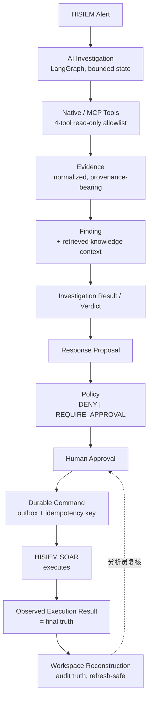
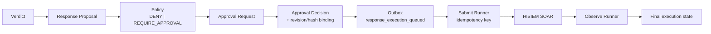

# HISIEM SOC Copilot

**AI SOC · 安全调查 · 证据落定 · 会使用工具的 Agent · 人在环中**

面向 SOC 分析员的 AI 调查与响应*决策*层。它在 HISIEM 平台数据之上运行由 agent 驱动的调查，把每一个
判断落到可追溯的 Evidence 上，并要求在任何带副作用的响应之前获得人工批准。

> **这是决策层，不是平台。** 它所运行于其上的安全平台——摄取、检测、告警、案件与确定性 SOAR 执行
> ——是一个独立的仓库：**[HISIEM](https://github.com/xsc683/HISIEM)**。见
> [§17](#17-与-hisiem-的关系)。

---

## 1. 项目摘要

| | |
|---|---|
| 它是什么 | 一个会使用工具的 AI agent，在策略、租户与人工权威约束之下调查安全告警并提出响应建议 |
| 在作品集中的位置 | **2 个项目中的第 2 个。** 安全平台之上的 AI/agent 层 |
| 运行时 | Python 3.12+、FastAPI、LangGraph、PostgreSQL |
| 工程重点 | **AI agent 工程 · RAG · MCP · 权威与安全 · 持久执行 · 评估** |
| 模型无关 | 一个 provider 契约，配一个真实的 OpenAI 兼容实现；agent 永不授权任何东西 |
| 可达的工具面 | 恰好 **4** 个模型可选的只读工具，外加 1 个模型无法调用的系统控制工具 |

**这个项目的核心主张：** 一个 AI agent 可以在*不被赋予权威*的前提下，对安全调查真正有用。一个典型
agent 演示里让模型动手的每一处，这个系统都改为插入一个边界——而每个边界都在代码里强制，并由一道
不可补偿的验收闸门覆盖。

---

## 2. 这个项目是什么 / 不是什么

**它是：**

- 一个 **AI 辅助调查系统**——agent 规划调查步骤、调用只读工具、组装证据。
- 一个**证据驱动**的系统——每个发现都追溯到从真实工具结果归一化而来、带来源的 Evidence。
- 一个**受治理**的系统——模型看到的是一份确定性的只读工具白名单。它选不了 server、endpoint、凭据
  或租户。
- 一个**人工权威**系统——高风险响应需要一次显式的人工决定。
- 一个**持久**系统——响应执行是一条由 outbox 支撑、幂等、可重试的命令，不是一次进程内函数调用。

**它不是：**

- 一个 SIEM。安全数据、检测与告警归 HISIEM。
- 一个 SOAR。确定性响应执行归 HISIEM SOAR。
- 一个自治 SOC。不存在任何路径让模型授权一个动作。
- 一个聊天机器人，也不是通用安全问答系统。
- 一个多智能体系统。刻意只有一个调查 agent——见
  [§18](#18-已知局限--刻意排除在外)。

---

## 3. 核心调查生命周期

这是整个系统的脊梁。先从头到尾读一遍；本文档剩下的部分都是关于这条链上各个环节的细节。


```mermaid
flowchart TD
    ALERT["HISIEM Alert"]
    INV["AI Investigation<br/>LangGraph, bounded state"]
    TOOLS["Native / MCP Tools<br/>4-tool read-only allowlist"]
    EV["Evidence<br/>normalized, provenance-bearing"]
    FIND["Finding<br/>+ retrieved knowledge context"]
    VERDICT["Investigation Result / Verdict"]
    PROP["Response Proposal"]
    POLICY["Policy<br/>DENY | REQUIRE_APPROVAL"]
    HUMAN["Human Approval"]
    DURABLE["Durable Command<br/>outbox + idempotency key"]
    SOAR["HISIEM SOAR<br/>executes"]
    OBS["Observed Execution Result<br/>= final truth"]
    WS["Workspace Reconstruction<br/>audit truth, refresh-safe"]

    ALERT --> INV
    INV --> TOOLS
    TOOLS --> EV
    EV --> FIND
    FIND --> VERDICT
    VERDICT --> PROP
    PROP --> POLICY
    POLICY --> HUMAN
    HUMAN --> DURABLE
    DURABLE --> SOAR
    SOAR --> OBS
    OBS --> WS
    WS -.->|"分析员复核"| HUMAN
```

**模型止于何处。** `PROP` 以上的每一步都受模型影响。从 `POLICY` 往下都不是：策略是确定性的，批准是
人做的，命令是持久的，执行发生在 HISIEM，而观测到的结果——不是 Copilot 对它的信念——才是最终真相。

---

## 4. 架构总览

```text
API (FastAPI, transport only)
  ↓
Application (commands, queries, handlers, ports)
  ↓                    ↗ Agent (LangGraph orchestration)
Domain (pure)         ↗   — orchestration, never business authority
  ↑
Infrastructure (PostgreSQL, HISIEM HTTP, MCP, LLM, OTel)  ← Bootstrap (composition root)
```

| 层 | 职责 | 规则 |
|---|---|---|
| `domain/` | 聚合、实体、值对象、事件、不变式 | **纯净。** 没有 FastAPI、SQLAlchemy、LangGraph、httpx 或 Pydantic |
| `application/` | 命令、查询、handler、端口、服务 | 使用端口与工作单元；永看不到 SQL session |
| `agent/` | LangGraph 编排、工具、证据归一化、prompt | 拥有编排，**不是**业务权威 |
| `contracts/` | 边界 schema（API / LLM / 工具） | Pydantic 住在这里，不在 `domain/` |
| `api/` | FastAPI 传输 | 依赖 `application`，永不依赖 `infrastructure` |
| `infrastructure/` | PostgreSQL、HISIEM 适配器、MCP、LLM provider、OTel、持久执行 | 适配外部系统 |
| `bootstrap/` | 组合根（container、lifespan） | 接线一切；唯一构造适配器的地方 |

这些边界**由测试强制**，不是靠约定——`tests/architecture/` 会在某一层导入了它不该导入的东西时让构建
失败。见 [§16](#16-验证)。

视觉模型：[`docs/status/architecture-overview.md`](docs/status/architecture-overview.md)。

---

## 5. 权威模型

这个系统要保住的九个区分。每一个都是一个「看起来合理的实现会把它抹掉」的边界。

```text
ToolResult              !=  Evidence
Knowledge               !=  Verdict Authority
Agent Verdict           !=  Analyst Disposition
Policy                  !=  Human Approval
Human Approval          !=  Execution
Submission              !=  Execution Success
Telemetry               !=  Business Truth
Frontend                !=  Authority
LangGraph checkpoint    !=  Domain Truth

HISIEM observed execution result  =  final execution truth
```

| 区分 | 为什么存在 | 在哪里强制 |
|---|---|---|
| ToolResult ≠ Evidence | 原始工具响应是*数据*，不是有据的事实。一次失败或无据的调用产出**零** Evidence | `agent/evidence/` 归一化器 + 类型化失败处理 |
| Knowledge ≠ Verdict Authority | 检索到的文档可以为一个判定提供信息；它永远不能*成为*一个判定 | 知识证据携带独立的权威分级；`KNOWLEDGE_ONLY_DEFINITIVE_VERDICT` 闸门 |
| Agent Verdict ≠ Analyst Disposition | 模型的结论是一份建议，不是人的认定 | 分开的持久字段；分开的呈现 |
| Policy ≠ Human Approval | 一个确定性策略决定不是同意。`DENY` 不是驳回；`REQUIRE_APPROVAL` 不是批准 | `domain/response` 的策略 + 批准聚合 |
| Human Approval ≠ Execution | 一次批准授权的是*意图*；它不执行它 | 持久命令 + outbox，与那个决定解耦 |
| Submission ≠ Execution Success | 把一条命令交给 provider，什么也证明不了 | 独立的提交与执行状态机 |
| Telemetry ≠ Business Truth | 丢掉 trace 不得改变任何业务结果 | 没有业务路径读 span/collector 状态 |
| Frontend ≠ Authority | UI 从持久化状态推导呈现；它什么都不发明 | 刷新时服务端/持久化真相优先 |
| LangGraph checkpoint ≠ Domain Truth | 图状态是有界工作记忆，不是业务状态 | checkpoint 永不被读成领域状态 |

**那条永久的规则：**

```text
Model proposes  →  Policy constrains  →  Human authorizes
Durable command records intent  →  HISIEM executes  →  Copilot observes
```

---

## 6. 四平面架构

这个系统**闭环**的四个平面，以及它复用而非重新设计的稳定地基：

| 平面 | 拥有 | 主要模块 |
|---|---|---|
| **知识平面** | 可信、可追溯、租户安全的支撑性上下文，归一化进同一套 Evidence 模型 | `knowledge/`、`agent/knowledge/`、`domain/knowledge/` |
| **能力平面** | 工具/能力的发现、信任准入、调用与有界结果 | `agent/tools/`、`infrastructure/mcp/` |
| **可观测性平面** | Span、上下文传播、metric/日志关联 | `infrastructure/observability/` |
| **分析员体验平面** | 分析员看到什么、决定什么——*托管在 HISIEM 仓* | `HISIEM: web/` |

**复用而非重构：** 领域平面、Agent 运行时平面、持久化平面、持久执行平面、人工权威平面、HISIEM 集成
平面、评估平面。

> 上面这四个平面是本仓**闭环**的那几个；冻结的契约命名的是 **十一个**（其余的是复用而非重构），而
> 验收闸门按那个十一元 `Plane` 枚举分类。两个数字**不是 1:1 映射**，不要为了对齐去改任何一边——
> 见 [`docs/status/architecture-diagrams.md`](docs/status/architecture-diagrams.md) §1。

四条全局原则统辖它们全部：

1. **没有新的未定义权威。** 知识 ≠ 判定权威；MCP provider ≠ 授权；遥测 ≠ 业务权威；前端 ≠ 命令
   权威；LangGraph ≠ 领域权威。
2. **没有第二个真相来源。** 没有平行的 Investigation、Execution、Approval、Evidence、Tenant、
   Tool-authorization 或 Agent-business-state 系统。
3. **稳定意味着权威稳定**，不是「代码永不变更」。
4. **不通过引入平行架构来集成新技术。**

---

## 7. 工具 / MCP 治理

**发现、准入与授权是三件不同的事**——发现是 server 自称提供了什么，准入是这个系统决定信任什么，而
选择是模型可以挑什么，后者永远只是一个已准入的只读能力。准入项的字段写在工具契约里，不在这里。

**模型可选面恰好四个工具**（由一条架构测试断言）：

```text
hisiem.search_events
hisiem.get_detection_rule
knowledge.retrieve_security_guidance
knowledge.resolve_attack_technique
```

外加 `hisiem.get_alert_context`，它是**系统控制**的——图的注水节点直接调用它，它永不提供给模型。

关于这个面的一切规范性内容——准入项的字段、fail-closed 规则（未知 server、写能力、未准入动态工具、
schema 漂移、协议降级、租户）、固定的结果处理顺序与类型化失败分类——都属于
[`docs/contracts/investigation-tool-contract.md`](docs/contracts/investigation-tool-contract.md)
§3，不属于本文件。规则看那里。

**`MCP V1 是只读的，模型可选的写入不存在。`** 那是一道刻意的范围边界，不是一项待做的功能。

---

## 8. 知识 / RAG

知识平面提供*支撑性上下文*，与其他一切归一化进同一套 Evidence 模型——而它明确**不是**判定权威。

**检索是混合的，其排序是确定性的：**

| 通道 | 机制 |
|---|---|
| 词法 | 在带版本的知识内容块上做 PostgreSQL 全文检索 |
| 语义 | 在 embedding 上做 pgvector 相似度 |
| 融合 | 在两个通道上做 Reciprocal Rank Fusion（RRF） |
| 重排 / 解析 | 结果上限有界（`MAX_RESULT_LIMIT = 5`）；请求更多会被**拒绝**，不是被夹到上限 |

排序被实现为作用在普通数据上的普通函数，这正是让排序可复现、可脱离数据库测试的原因。

**值得知道的设计性质：**

- **`tenant_id` 是必填关键字，没有默认值，也没有无作用域变体。** 任何调用方——工具、CLI 或评估——
  都不可能误检索整个语料。
- **一条检索命中不携带控制信号。** `KnowledgeHit` 没有 `instructions`、没有 `action`、没有
  `severity`、没有 `authority` 字段。这个「没有」是对冻结字段集的断言，所以加一个会挂测试，而不是
  悄悄扩大检索能表达的东西。
- **引用指向不可变内容块**，所以引用能在一次 embedding 重建之后存活。
- **知识证据有自己的权威分级**——*支撑性上下文*，呈现方式与平台事实不同。仅凭知识无法产出确定判定；
  这是一道硬闸门。

> **诚实的局限。** 本仓没有配置任何 embedding provider。因此混合评估证明的是：融合、排序、并列打破、
> 引用解析与评分端到端接线正确——它**不**确立语义检索质量。这个缺口有文档记录，并在
> [`docs/evaluation/knowledge-evaluation-contract.md`](docs/evaluation/knowledge-evaluation-contract.md)
> 里被标注 `PLUMBING_ONLY`。

---

## 9. 持久化响应执行

让「agent 建议、人授权、HISIEM 执行」不只是一张图的那部分。


```mermaid
flowchart LR
    V["Verdict"]
    P["Response Proposal"]
    POL["Policy<br/>DENY | REQUIRE_APPROVAL"]
    A["Approval Request"]
    D["Approval Decision<br/>+ revision/hash binding"]
    OB["Outbox<br/>response_execution_queued"]
    SUB["Submit Runner<br/>idempotency key"]
    SOAR["HISIEM SOAR"]
    OBSR["Observe Runner"]
    FIN["Final execution state"]

    V --> P --> POL --> A --> D --> OB --> SUB --> SOAR --> OBSR --> FIN
```

| 机制 | 实现 |
|---|---|
| 意图被持久记录 | 一条 `response_execution_queued` 领域事件，写进与状态变更同一个事务里的 **outbox** |
| 一个逻辑意图，无论尝试多少次 | 幂等键 `response:<tenant>:<proposal>`；提交是带键的，不是计数的 |
| 重试 | 有界尝试（10 次）配有界退避（120 秒），由派发器驱动 |
| 不确定的结果 | `ATTENTION_REQUIRED`——一个**显式不确定态**，永不捏造终态结果 |
| 批准绑定 | 决定绑定到 revision 与 hash；过期批准无法授权已改变的意图（TOCTOU） |
| 执行真相 | 提交状态与执行状态是**两个独立状态机**；`SUBMITTED` 不是 `SUCCEEDED` |
| 最终真相 | 在 HISIEM 中观测到的状态，不是 Copilot 自以为发出的东西 |

有三种状态常被混为一谈，而这里刻意区分：

```text
PENDING / RETRYING / SUBMITTED   →  we have handed it over; we do not know the outcome
ATTENTION_REQUIRED               →  we tried, the outcome is uncertain, a human must look
SUCCEEDED / FAILED               →  HISIEM observed a terminal execution result
```

一次驳回不产出可派发命令。一次不确定的提交永不变成成功。一次重试永不造出第二个业务意图。

韧性细节：派发器 resolver 失败绝不能把一条命令送进死信，而尝试计数由一条专门的回归测试演练——两者
都是持久性闭合工作发现并修掉的，不是被假定正确的。

---

## 10. 可观测性

基于 OpenTelemetry，配一道严格的真相边界。

- **Span** 覆盖运行时真正走过的操作——图调用、调查持久化、工具执行、持久派发、响应提交与观测。
- **上下文传播**跨持久边界：来自 HTTP 请求的一个持久化 W3C `traceparent`，在这份工作异步恢复时，
  继续成一个**链接到**原始 trace 的**新根 span**。一个 30 秒后才跑的作业仍然能归属到当时把它入队的
  那个请求，而不假装自己是同一个 span。
- **Metric** 配 fail-closed 标签安全：只接受白名单内的标签键，而一条携带非允许键的观测会被**整条
  拒绝**，而不是被部分记录。被禁止的标识符永远不会成为 metric 标签——基数是一条隐私边界，不只是
  成本考量。
- **日志关联**经由绑定的上下文字段。

**遥测数据策略。** 原始 prompt、completion、完整工具结果、密钥、embedding 与思维链永不被发出。系统
产出的产物在落盘之前会做密钥扫描。

**真相边界。** 没有任何业务路径读取 span、trace id 或 collector 状态。在系统运行期间停掉 collector，
会产出**完全相同的持久化业务结果**——这由一个运行时集成的验收场景验证，而不是被断言。

---

## 11. 分析员工作区

工作区是分析员对一次调查的视图：带权威分级的证据、发现、agent 判定、策略决定、人工决定、提交状态
与观测到的执行结果。

> **UI 住在 HISIEM 仓**：[`HISIEM/web/`](https://github.com/xsc683/HISIEM)。本仓不含任何前端。如果你
> 在审阅这个项目，它的 UI 在那里。

工作区被要求做到：

| 要求 | 含义 |
|---|---|
| 保留权威区分 | 一条知识上下文永远不会被渲染成平台事实；一个 agent 判定永远不会被渲染成分析员认定 |
| 服务端真相优先 | 刷新时，过期客户端快照被更新的服务端状态覆盖 |
| 从持久状态重建 | 一次全新加载精确复现持久化真相——工作区是投影，不是缓存 |
| 不发明任何东西 | 不呈现持久化生命周期没有记录的批准、执行或提交状态 |
| 永不渲染内部物 | 不显示思维链、prompt 与图 checkpoint |

权威分级（平台事实 vs 支撑性知识上下文）在前端从持久化的证据来源类型推导——而验收 harness 执行的是
**真实前端模块**，而不是复述那个映射，所以评估与 UI 不会漂移。

---

## 12. 评估

存在三条评估基线。两条是配确定性打分的冻结数据集；第三条是跨平面验收包。

| 基线 | 它验证什么 |
|---|---|
| **GP-01** | 在一个封存、已物化数据集上的端到端调查正确性：封存清单 → 真实模型运行 → 工具/证据质量 → 确定性正确性打分 → 有界可重复性 → 套件汇总 |
| **KB-GOLDEN-V1** | 知识子系统：针对一份带版本的语料，验证检索、引用、排序与权威边界 |
| **XP-01** | 跨平面验收——**29 个场景**由 **13 道不可补偿硬闸门**判定，聚合成一份机器可读产物 |

**一段话讲 XP-01。** 29 个场景横跨九个族（Authority、Capability、Knowledge、MCP、Tenant、Security、
Reliability、Observability、Workspace）。每个都从一次真实运行产出一份
`cross-plane-gate-results/v1` 产物——在确定性足够的地方是确定性的，在不变式确实要求真实进程的地方
则针对真实 HISIEM、Kafka 与 OTel Collector 做运行时集成。聚合是**不可补偿**的：里面任何地方都没有
分数、权重或通过百分比。一个失败场景、一个缺失场景、一个未知场景，或一个缺失的闸门结果，都会迫使
整个套件 FAIL。否定那一半是针对真实产物测的，所以这个聚合是真的能挂的。

十三道闸门：

```text
CROSS_TENANT_LEAK                 KNOWLEDGE_ONLY_DEFINITIVE_VERDICT
UNADMITTED_MCP_SELECTED           WRITE_MCP_SELECTED
SECRET_LEAK                       DANGLING_CITATION
CROSS_INVESTIGATION_CITATION      EXECUTION_WITHOUT_APPROVAL
SUBMISSION_TREATED_AS_SUCCESS     TELEMETRY_CHANGED_BUSINESS_STATE
ORACLE_FIREWALL                   EXPECTED_FACTS_PRESENT
FORBIDDEN_FACTS_ABSENT
```

设计意图是它们*可证伪*：每一道闸门，都有一次直接无效的测量被证明会让它失败。一道不会失败的验收
闸门不是证据。

---

## 13. 安全 / 租户边界

| 边界 | 强制方式 |
|---|---|
| **租户隔离** | 租户与 actor 来自受信的服务端请求上下文，永不来自请求体、也永不来自模型。一次调查端到端是租户作用域的；跨租户读取是一道硬闸门 |
| **提示注入** | 所有检索到的与工具返回的内容都是**数据**。看起来像指令的内容改不了工具选择、租户作用域、判定或策略 |
| **模型授权** | 模型不能授权任何东西。它提议；策略约束；人授权 |
| **写能力** | 模型可选工具在构造上就是只读的。出现一次 `WRITE_MCP_SELECTED` 就让套件失败 |
| **密钥处理** | 凭据只在服务端，永不出现在模型参数、工具结果、Evidence、审计载荷、日志或遥测里。产物在写出之前做密钥扫描 |
| **遥测隐私** | 被禁止的标识符作为 metric 标签会被拒绝（fail-closed）；原始 prompt/completion/工具结果/embedding/CoT 永不发出 |
| **评估收容** | 验收包不能经未获认可的路径触及生产内部物，唯一获认可的桥是唯一的接缝 |

---

## 14. 技术栈

| 关注点 | 技术 |
|---|---|
| 语言 / 运行时 | Python 3.12+（在 3.13 上测过） |
| HTTP 框架 | FastAPI + Uvicorn |
| Agent 编排 | LangGraph（+ `langgraph-checkpoint-postgres`） |
| 持久化 | PostgreSQL 16 带 **pgvector** 扩展；SQLAlchemy 2 async + psycopg 3 |
| 迁移 | Alembic（Copilot 拥有 `copilot` schema；LangGraph 拥有 `langgraph_checkpoint`） |
| 检索 | PostgreSQL 全文检索 + pgvector + RRF 融合 |
| 模型 provider | 一个 provider 契约，配真实的 OpenAI 兼容实现（`json_schema` 结构化输出） |
| 工具互操作 | 官方 MCP Python SDK；Streamable HTTP 传输 |
| 可观测性 | OpenTelemetry（API、SDK、OTLP gRPC exporter、FastAPI/httpx/SQLAlchemy/psycopg 埋点） |
| 质量闸门 | pytest、Ruff、mypy（strict） |

---

## 15. API 表面

九个 HTTP 端点，来自 `src/hisiem_soc_copilot/api/` 里的各 router。一切都在一条受信上下文边界之下：
租户与 actor 在服务端解析，永不从请求体接受。

| 方法 | 路径 | 用途 |
|---|---|---|
| `GET` | `/healthz` | 存活探针 |
| `POST` | `/api/v1/investigations` | 为一条告警启动——或复用当前的——调查 |
| `GET` | `/api/v1/investigations/lookup` | 查出挂在某条告警上的调查 |
| `GET` | `/api/v1/investigations/{investigation_id}` | 租户作用域的调查总览 |
| `GET` | `/api/v1/investigations/{investigation_id}/workspace` | 分析员工作区投影 |
| `POST` | `/api/v1/investigations/{investigation_id}/cancel` | 在仍可取消时取消 |
| `POST` | `/api/v1/investigations/{investigation_id}/response-proposals` | 从一次已完成的调查创建响应提案 |
| `POST` | `/api/v1/investigations/response-approvals/{approval_request_id}/approve` | 记录一次人工批准决定 |
| `POST` | `/api/v1/investigations/response-approvals/{approval_request_id}/reject` | 记录一次人工驳回决定 |

租户与 actor 经所配置的 `TrustedContextProvider` 解析——在 dev/test 里 `header` provider 读
`X-Tenant-ID` / `X-Actor-Subject`；生产必须使用一个经过认证的 provider。

---

## 16. 验证

这套测试很大，是因为不变式承重，不是因为覆盖率本身是目标。真正重要的是*验证了什么*：

| 闸门 | 它保护什么 |
|---|---|
| `tests/architecture/` | 导入边界：生产层永不导入评估；领域保持纯净；模型可选工具面恰好是声明的那个集合 |
| 单元 + 集成套件 | 领域不变式、持久化约束、API 行为、持久执行、MCP 治理、知识检索、响应生命周期 |
| GP-01 | 针对封存数据集的端到端调查正确性 |
| KB-GOLDEN-V1 | 知识检索、引用与权威行为 |
| XP-01 | 29 个跨平面场景对照 13 道不可补偿闸门，聚合成一份确定性产物 |

**跨平面验收封存时的结果（Stage E 封存）：**

```text
pytest                2236 passed / 17 skipped / 0 failed / 0 errors
tests/architecture     285 passed
ruff check src tests   clean
mypy src               clean (230 source files)
XP-01                  29/29 scenarios PASS · 13/13 hard gates intact · 9/9 families
aggregate              cross-plane-suite-results/v1 · overall PASS · non-compensating
```

那 17 个跳过是既有的基线跳过，加上 E6 验收测试——后者在提供其产物目录时会额外运行。没有任何一个跳过
掩盖失败。

```bash
# Standard verification
ruff check .
mypy src
pytest

# The cross-plane acceptance pack (produce artifacts, then aggregate them)
pytest tests/unit/evaluation/cross_plane tests/unit/evaluation_harness \
       tests/integration/evaluation_harness --basetemp=<dir> -q
E6_ARTIFACTS_DIR=<dir> pytest \
       tests/integration/evaluation_harness/test_e6_suite_acceptance.py -q
```

持久化与 API 集成测试在 PostgreSQL 不可达时会自动跳过，所以在没有 Docker 的机器上套件依然是绿的。

---

## 17. 与 HISIEM 的关系

**[HISIEM](https://github.com/xsc683/HISIEM)** 是安全平台。本仓是它之上的决策层。

| HISIEM 拥有 | HISIEM SOC Copilot 拥有 |
|---|---|
| 安全事件摄取 | AI 辅助调查 |
| 流处理与检测 | 受治理的工具使用 |
| 告警与运营数据 | 证据组织与知识上下文 |
| 案件管理 | 发现与判定 |
| **确定性 SOAR 执行及其执行记录** | 响应*提案*与人工授权流程 |
| 托管面向分析员的 web 应用 | 执行观测与工作区投影 |

```text
Model proposes  →  Policy constrains  →  Human authorizes
Durable command records intent  →  HISIEM executes  →  Copilot observes
```

**Copilot 永远不会变成第二个 SIEM 或 SOAR。** 它不检测、不拥有告警数据、也不执行。当一次调查建议
一个响应时，命令被持久记录，然后在 HISIEM 中执行——而在那里观测到的执行状态才是最终真相，不是
Copilot 自以为提交的东西。

这两个系统曾一起针对一个真实运行时被演练过：真实 HISIEM（PostgreSQL、Elasticsearch、Kafka、
Logstash、control API 与 SOAR worker）加上 Copilot API、agent 图、真实模型 provider 与 OTel
Collector，配一道跨项目端到端闸门。跨平面验收包就是在这个运行时之上建起来的，且**没有改动任何
HISIEM 生产代码**。

---

## 18. 已知局限 / 刻意排除在外

**已验证且为绿**

- 跨平面验收：29/29 场景、13/13 闸门、一个不可补偿聚合。
- 封存时整套测试为绿，架构边界由机械方式强制。
- 完整运行时 E2E（两个项目、真实组件）作为一道跨项目闸门通过。

**已实现但有明确记录的缺口**

- **语义检索质量未测量。** 没有配置 embedding provider，所以混合评估证明的是接线——融合、排序、
  引用解析、打分——而不是语义质量。产物被标注 `PLUMBING_ONLY`。
- **更广分类法里的七个可选 span 操作未被发出**（`queue.wait`、`alert.hydrate`、`native.call`、
  `embedding`、`postgres.fts`、`pgvector.search`、`retrieval.merge`）。验收只在运行时真正走过的
  操作上跑。这是一个已知、不阻塞的观察，不是疏漏。
- **MCP provider 失败分类**有一条有界、低优先级的未结观察：provider 失败是一次有界类型化失败、不
  产出假成功 Evidence，但分类可以更细。

**刻意不做**

- **没有多智能体系统，也没有 agent 间协议。** 一个带界工具面的调查 agent 就是设计。增加 agent 会让
  权威面乘一层。
- **没有第二个 RAG 框架、向量数据库、可观测性栈或评估平台。** 每个关注点恰好一个归属。
- **没有模型路由器。** 一个 provider 契约，可插拔，没有路由层。
- **没有投机性的沙箱化。** 写路径是被*设计掉*的，不是被沙箱关起来的：写入完全不可被模型选择。
- **本仓没有前端。** 工作区 UI 属于平台仓。

**已知的非阻塞项**（有文档记录，并在阶段报告里带后续负责人）：

`OBS-001`（可选分类法 span）、`DEFECT-005`（MCP 失败分类粒度）、`TEST-INFRA-001`（测试 harness
跳过守卫加固）、`EVAL-SEAM-001`（唯一获认可的评估桥）、`E4-OBS-01/02`、`E5-OBS-01/02/03`、
`E6-OBS-01`。

这些没有一个是阻塞的，也没有一个是被藏起来的——每一条都连同它的理由被记录下来。

---

## 19. 文档阅读顺序

**如果你只有 3 分钟：** 本文件，加上 [§5](#5-权威模型) 里的权威模型。

**如果你有 30 分钟：** 再加上
[`docs/status/architecture-overview.md`](docs/status/architecture-overview.md)（那套图）与
[`docs/contracts/domain-model.md`](docs/contracts/domain-model.md)。

**如果你想要工程深度：**

| 目标 | 文档 |
|---|---|
| `docs/` 的完整阅读地图 | [`docs/README.md`](docs/README.md) |
| 视觉架构（8 张图） | [`docs/status/architecture-overview.md`](docs/status/architecture-overview.md) |
| 领域模型与不变式 | [`docs/contracts/domain-model.md`](docs/contracts/domain-model.md) |
| 命令、事件、LangGraph 状态 | [`docs/contracts/application-commands-domain-events-langgraph-state.md`](docs/contracts/application-commands-domain-events-langgraph-state.md) |
| 持久化 schema 与约束 | [`docs/contracts/persistence-schema.md`](docs/contracts/persistence-schema.md) |
| 包/分层边界 | [`docs/contracts/python-package-boundary.md`](docs/contracts/python-package-boundary.md) |
| 工具契约 | [`docs/contracts/investigation-tool-contract.md`](docs/contracts/investigation-tool-contract.md) |
| 模型 provider 契约 | [`docs/contracts/model-provider-contract.md`](docs/contracts/model-provider-contract.md) |
| 知识平面 | [`docs/knowledge/`](docs/knowledge/) |
| 评估契约 | [`docs/evaluation/`](docs/evaluation/) |
| 可观测性 | [`docs/contracts/observability.md`](docs/contracts/observability.md) |
| 本地一体化运行时 | [`docs/operations/local-integrated-runtime.md`](docs/operations/local-integrated-runtime.md) |
| 面试复习材料 | [`docs/interview/INTERVIEW_GUIDE.md`](docs/interview/INTERVIEW_GUIDE.md) |

**关于 Stage A–E。** 工程过程被组织成若干阶段（A 到 E），阶段报告是那项工作的验收证据——包括
[§12](#12-评估) 描述的跨平面验收包。它们被完整保留，因为它们是验证记录。它们是**内部工程史，不是
产品模型**；先从上面那些架构文档开始，想要某条具体主张背后的证据时再去读阶段报告。

---

## 20. 快速开始

**前置条件：** Python 3.12+（在 3.13 上测过）、Docker，以及一个可达的 HISIEM 部署（如果你想要端到端
行为）。PostgreSQL 必须是**支持 pgvector** 的镜像——随仓的 `infra/docker-compose.yml` 用的是钉住的
`pgvector/pgvector:pg16`。

```bash
# 1. Install
python -m venv .venv
.\.venv\Scripts\activate            # Windows PowerShell
pip install -e ".[dev]"

# 2. Start PostgreSQL (pgvector image) — hosts the `copilot` and
#    `langgraph_checkpoint` schemas
docker compose -f infra/docker-compose.yml up -d

# 3. Create the two schemas and apply the copilot migrations
docker exec copilot-postgres psql -U copilot -d copilot \
  -c "CREATE SCHEMA IF NOT EXISTS copilot;" \
  -c "CREATE SCHEMA IF NOT EXISTS langgraph_checkpoint;"
alembic upgrade head

# 4. Configure (copy the template, then edit)
cp .env.example .env.local

# 5. Run
python -m hisiem_soc_copilot.main
# health:  GET /healthz
```

> **永远不要 `docker compose down -v`。** 这个数据卷装着这套部署里的每一次调查、每一行证据与每一份
> 知识文档。

完整的本地拉起，包括 HISIEM 一侧与双进程 worker 拓扑，见
[`docs/operations/local-integrated-runtime.md`](docs/operations/local-integrated-runtime.md)。知识子系统
的运维（供给、摄取、检索、评估）见
[`docs/knowledge/operations.md`](docs/knowledge/operations.md)。
