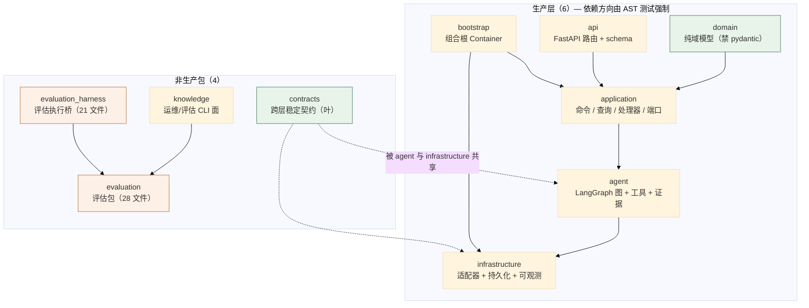
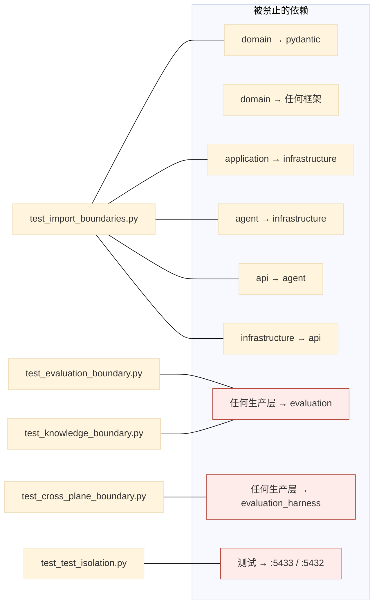
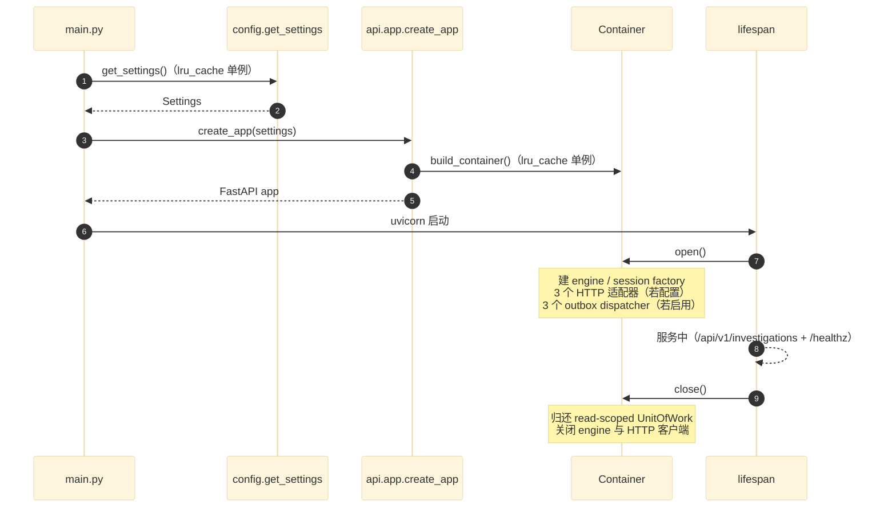
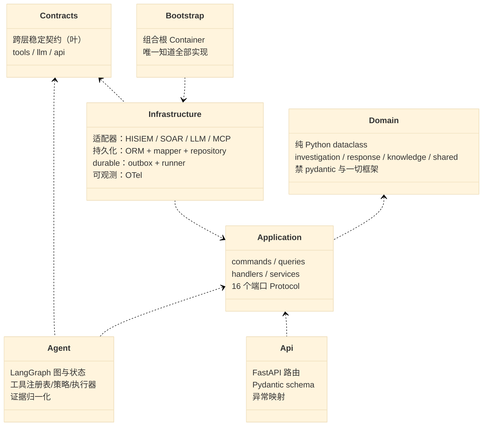
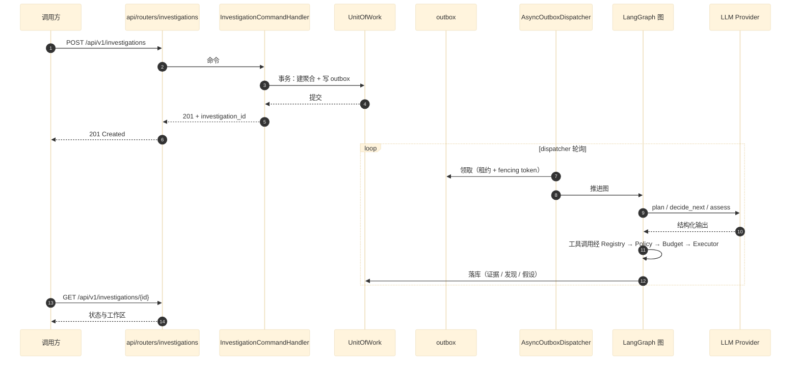

# 00 分层架构与包边界总览

> **本文性质：** 代码级取证补充，**不构成契约**。`docs/README.md` 规定「Architecture and persistence documents are authority」——冲突时以 `python-package-boundary.md` 为准。

> **文档类型**：架构总览（代码级核验，非设计提案）
> **分析对象**：`D:\Project\HISIEM-SOC-Copilot`（Hatchling `src/` layout，包根 `src/hisiem_soc_copilot/`；Python 3.12 · FastAPI · LangGraph · SQLAlchemy 2 async + psycopg 3 + pgvector · Alembic · OpenTelemetry · MCP SDK）
> **取证方式**：无 `.codegraph/` 索引，采用**源码直读 + AST 边界测试直读 + grep 统计**；每个关键论断附 `file:line` 锚点
> **结论以当前代码为准**（分支 `capability-mcp` @ `1e567be`）
> **文档集**：00–08 共 9 篇，见 [`README.md`](README.md)

---

## TL;DR

这是一个**把「层边界写成可执行断言」的 AI 调查与响应协作层**——它不替代 HISIEM，而是站在 HISIEM 之上做调查编排与响应**建议**。

工程上体现为**十层包结构**，其中：

- **6 个生产层**（`domain` / `application` / `agent` / `api` / `infrastructure` / `bootstrap`）由 **5 个架构测试**用 **AST 解析**强制依赖方向——**边界不是文档里的约定，是测试会失败的约束**。
- **4 个非生产包**（`contracts` / `knowledge` / `evaluation` / `evaluation_harness`）各自有独立的存在理由，其中 `evaluation` 与 `evaluation_harness` **被禁止被任何生产层导入**——**评估预期永远不能进入运行时**。
- **唯一知道全部具体实现的类是 `Container`**（`bootstrap/container.py:75`），717 行，是整集的组合根。

**最反直觉的一点**：`domain` 层**连 Pydantic 都不能导入**（`tests/architecture/test_import_boundaries.py:32`）。域模型是**纯 Python dataclass**，所有 schema 校验在 `contracts/`。这条约束让 domain 可以被任何环境导入——**包括只有 stdlib 的环境**（`test_import_boundaries.py:97-101` 就是这条的断言）。

---

## 1. 分层总览与依赖方向

### 1.1 包拓扑



**读法**：`domain` 与 `contracts` 是两个**叶节点**（自身零项目内依赖）。`evaluation` 被 `knowledge` 与 `evaluation_harness` 引用，但**没有任何生产层指向它**。

### 1.2 规模实测

| 包 | `.py` 数 | 文件数（含子包） | 角色 |
| --- | --- | --- | --- |
| `hisiem_soc_copilot`（根） | 2 | `config.py`、`main.py` | 配置 + 进程入口 |
| `domain` | 1 + 28 | investigation 8 / response 9 / knowledge 6 / shared 5 | 纯域模型 |
| `application` | 2 + 36 | commands 4 / handlers 7 / ports 16 / queries 3 / services 6 | 用例编排 |
| `agent` | 1 + 20 | graph 7 / tools 8 / evidence 2 / knowledge 1 / llm 1 / prompts 1 | AI 编排 |
| `api` | 4 + 6 | routers 2 / schemas 4 | HTTP 交付 |
| `infrastructure` | 1 + 68 | persistence 24 / **llm 10** / observability 6 / knowledge 6 / durable 4 / auth 3 / embedding 3 / hisiem 3 / checkpoint 2 / mcp 2 / soar 2 / messaging 1 / threat_intel 1 | 适配器 |
| `bootstrap` | 2 | `container.py`（717 行） | 组合根 |
| `contracts` | **7** | api 1 / llm 3 / tools 2（+ 3 个 `__init__`） | 跨层契约 |
| `knowledge` | 4 | `cli.py` / `evaluation.py` / `providers.py` | 运维 CLI |
| `evaluation` | 17 + 11 | cross_plane 5 / knowledge 6 | 评估包 |
| `evaluation_harness` | 21 | — | 评估执行桥 |
| **合计（src）** | **230** | | |
| `tests` | | **149** | |

> **取证命令**（可复现）：
> ```bash
> find src -name "*.py" -not -path "*__pycache__*" | wc -l     # 230
> find tests -name "*.py" | wc -l                              # 149
> ```

> **一处值得注意的比例**：`evaluation`（**28**）+ `evaluation_harness`（21）合计 **49 个文件**（`src` 230 的 **21.3%**），而 `domain` 是 **29** 个。**评估体系的代码量是业务域的 1.7 倍**——这是本项目「先建可信评估、再建功能」的取向的直接体现。

---

## 2. 包边界如何强制

### 2.1 关键论断

**论断 1：边界由 **5 个 AST 测试**强制，不是文档约定。**

`tests/architecture/` 下 5 个测试文件：

| 测试文件 | 强制什么 |
| --- | --- |
| `test_import_boundaries.py` | **6 个生产层之间的依赖方向** |
| `test_evaluation_boundary.py` | 生产层**不得导入** `evaluation`；`evaluation` 自身的允许导入面 |
| `test_cross_plane_boundary.py` | 生产层不得导入 `evaluation_harness` 与 XP-01 oracle；**生产源码不得出现场景 id** |
| `test_knowledge_boundary.py` | 知识上下文的 4 条单向规则 + P3-A 闭包保证 |
| `test_test_isolation.py` | **测试不得指向运维库**（`:5433` / `:5432`）；含 `TRUNCATE`/`DELETE FROM` 的模块不得解析运维库 URL |

**这 5 个测试全部用 `ast.parse` 读源码，不 import 被测模块**——原因写在 `test_test_isolation.py:20-23`：*「导入测试模块会执行它的模块级代码，而那正是这个守卫要管的代码」*。

**论断 2：生产层的禁导入表是显式枚举的。**

```python
# tests/architecture/test_import_boundaries.py:21-53
BOUNDARIES: dict[str, tuple[str, ...]] = {
    "domain": (
        "application", "agent", "infrastructure", "api", "bootstrap",
        "sqlalchemy", "langgraph", "fastapi", "httpx",
        "pydantic", "alembic",
    ),
    "application": (
        "infrastructure", "agent", "api", "bootstrap",
        "sqlalchemy", "langgraph", "fastapi", "httpx",
    ),
    "agent": ("infrastructure", "api", "bootstrap", "sqlalchemy"),
    "api": (
        "infrastructure.persistence", "infrastructure.hisiem",
        "langgraph", "agent",
    ),
    "infrastructure": ("api",),
}
```

**逐层解 读**：

| 层 | 禁导入 | 含义 |
| --- | --- | --- |
| **`domain`** | 其他 5 个生产层 + `sqlalchemy` / `langgraph` / `fastapi` / `httpx` / **`pydantic`** / `alembic` | **最严**：域模型是纯 Python，无任何框架 |
| **`application`** | `infrastructure` / `agent` / `api` / `bootstrap` + 4 个三方库 | 用例层不知道适配器存在；**但允许 `pydantic`**（对比 domain） |
| **`agent`** | `infrastructure` / `api` / `bootstrap` / `sqlalchemy` | agent 不知道具体适配器与 DB；**但允许 `langgraph`**（它就是图引擎） |
| **`api`** | `infrastructure.persistence` / `infrastructure.hisiem` / `langgraph` / **`agent`** | API **不得直接碰 agent**——必须经 `application` |
| **`infrastructure`** | `api` | 适配器不反向依赖 HTTP 层 |

**两处最值得注意**：

1. **`domain` 禁 `pydantic`，`application` 不禁** —— 域模型不能带 framework 类型。`test_import_boundaries.py:97-101` 用 `test_domain_imports_no_framework` 二次断言domain 在只导入 stdlib 时可用。
2. **`api` 禁 `agent`** —— 这是**唯一一条「同层横向」的禁止**。API 层不能直接调用图节点，必须经 `application` 的 handler/service。**这条让「HTTP 请求处理」与「AI 编排」之间隔了一层可测试的用例边界。**

**论断 3：`knowledge` 包被刻意排除在「生产层」之外。**

```python
# tests/architecture/test_knowledge_boundary.py:51-56
# Production layers (brief section 20). ``knowledge`` is deliberately NOT one: it
# is the operator/evaluation CLI surface, which is why it is allowed to reach the
# evaluation oracle -- see ``ALLOWED_EVALUATION_IMPORTERS``.
PRODUCTION_LAYERS = frozenset(
    {"domain", "application", "agent", "api", "infrastructure", "bootstrap"}
)
```

**所以「生产层」是一个**显式枚举的集合**，不是「src 下所有包」。** 新增包必须**刻意加进这个集合**才能被边界测试覆盖——`test_cross_plane_boundary.py:38-39` 写明：*「a new production package must be added here deliberately before it can import the evaluation planes」*。

**这是一条重要的设计**：**默认不受约束，加入集合才受约束**。反过来的做法（默认全部受约束）在加新包时容易误伤，但这种做法要求**维护者主动声明**。取舍是「宁可漏也不误伤」，由 code review 兜底。

**论断 4：`execution_boundary` 的一个 gap 被显式发现并补上。**

```python
# tests/architecture/test_cross_plane_boundary.py:5-12（docstring 节选）
1. **Production layers must not import ``evaluation_harness``.** This invariant was
   already stated in the harness package docstring ("Production code never imports
   this package") but was **not enforced anywhere**: ``test_evaluation_boundary``'s
   import matcher deliberately matches the ``evaluation`` package only, and
   ``_reaches(target, "evaluation")`` does not match ``evaluation_harness`` because
   the separator is ``_`` rather than ``.``. E1 closes that gap, because the XP-01
   adapter adds a second non-production bridge and the document-only guarantee would
   otherwise cover neither.
```

**这是本文档集里最值得读的一段工程史记录**：一条「只写在 docstring 里」的保证**事实上没有生效**——因为 `evaluation` 与 `evaluation_harness` 的匹配走的是包名，而 `_` 不是 `.`，所以「匹配 `evaluation`」**不会**匹配到 `evaluation_harness`。

**修法**是把两条都写成显式常量并断言（`test_cross_plane_boundary.py:44-45`）：

```python
EVALUATION_HARNESS = f"{PACKAGE_ROOT}.evaluation_harness"
EVALUATION = f"{PACKAGE_ROOT}.evaluation"
```

> **这条记录的价值在于它承认了「文档里的保证不等于生效的保证」**。本文档集在 铁律 3 下要求同样的诚实。

**论断 5：`test_test_isolation.py` 关注的是**测试**的安全性，不是产品代码。**

```python
# tests/architecture/test_test_isolation.py:39-46
#: Fragments that must not appear in a test string literal, except where
#: allow-listed. ``:5433`` is the operator's Copilot development database;
#: ``:5432`` is HISIEM's own.
FORBIDDEN_FRAGMENTS = (":5433", ":5432")

#: Statements that make a module destructive. Word boundaries matter: the CLI's
#: ``truncated`` result key must not read as a TRUNCATE statement.
DESTRUCTIVE_RE = re.compile(r"\bTRUNCATE\b|\bDELETE\s+FROM\b", re.IGNORECASE)
```

**两条规则**：

| 规则 | 内容 |
| --- | --- |
| 1 | 测试**不得**把运维库地址写进字符串字面量 |
| 2 | 含 `TRUNCATE` / `DELETE FROM` 的模块**也不得**解析运维库 URL |

**规则 2 是关键**——`test_test_isolation.py:14-18` 的注释解释了原因：*「单独规则 1 不会注意到一个模块 TRUNCATE 了一个它从变量构造出来的 URL」*。

**允许清单按「文件 + 字面量的稳定子串」为键，不用行号**：

```python
# tests/architecture/test_test_isolation.py:50-53
#: Deliberately keyed by file + a STABLE substring of the literal rather than by
#: line number: another agent is editing the migration round-trip test, and a
#: line-keyed allow-list would break under their edits and silently stop guarding
#: anything.
```

**这是一处很实际的工程判断**：行号键的允许清单会在别人编辑时静默失效。

### 2.2 边界全景



---

## 3. 组合根：`Container`

### 3.1 关键论断

**论断 1：只有 `Container` 知道全部具体实现，这是写在 docstring 里的定则。**

```python
# src/hisiem_soc_copilot/bootstrap/container.py:1-7
"""Composition Root container.

Only this layer knows every concrete implementation at once (python-package-
boundary.md §21). It wires domain ports to infrastructure adapters and exposes the
application services the API routers depend on. Async resources (engines,
sessions, HTTP clients) are owned by the lifespan via open()/close().
"""
```

**三条职责**：把端口接上适配器、暴露 application service 给路由、**持有异步资源的生命周期**。

**论断 2：有 5 类异步资源被显式持有。**

```python
# bootstrap/container.py:78-95（节选）
def __init__(self, settings: Settings) -> None:
    self.settings = settings
    self.copilot_engine: AsyncEngine | None = None
    self.copilot_sessions: async_sessionmaker[AsyncSession] | None = None
    self.hisiem_adapter: HisiemHttpAdapter | None = None
    self.soar_adapter: HisiemSoarAdapter | None = None
    self.embedding_adapter: EmbeddingProvider | None = None
    self.dispatcher: AsyncOutboxDispatcher | None = None
    self.response_submit_dispatcher: AsyncOutboxDispatcher | None = None
    self.response_observe_dispatcher: AsyncOutboxDispatcher | None = None
    self._mcp_providers: dict[str, Any] | None = None
```

**资源清单**：1 个 engine + 1 个 session factory + 3 个 HTTP 适配器（HISIEM / SOAR / embedding）+ **3 个 outbox dispatcher** + MCP providers。

**「3 个 dispatcher」值得注意**：调查、响应提交、响应观测**各有独立 outbox 与独立 dispatcher**——不是共用一个。

**论断 3：组合根显式处理了「无请求作用域的 UnitOfWork」的资源泄漏。**

```python
# bootstrap/container.py:89-95
# Read-only factories below hand out a UnitOfWork that no command will
# ever close (there is no request scope to close it). The connection they
# check out is returned here instead, so the pool is not left holding an
# in-transaction connection that is only released when the garbage
# collector drops it -- which is exactly the case SQLAlchemy warns about
# and cannot terminate safely.
self._read_scoped_unit_of_works: list[UnitOfWork] = []
```

**这是本项目里最具体的一处资源管理推理**：只读工厂发出的 `UnitOfWork` **没有请求作用域来关闭它**。若不处理，连接会一直挂在池里直到 GC——**而 SQLAlchemy 明确警告过这种「无法安全终结」的情形**。修法是**把连接收回到容器持有的列表里**（见 `container.py:619` 的 `_read_scoped_unit_of_work`）。

**论断 4：`build_container` 是带缓存的单例工厂。**

```python
# bootstrap/container.py:712-717
@lru_cache(maxsize=1)
def build_container() -> Container:
```

**`lru_cache(maxsize=1)` 就是单例**——比手写 `_instance` 更简洁且线程安全（在 CPython 下）。

**论断 5：MCP provider 的构建被单独抽成方法，且有类型擦除的痕迹。**

```python
# bootstrap/container.py:275
def _build_mcp_providers(self) -> dict[str, Any]:
```

**返回 `dict[str, Any]` 而非精确类型**——这是 Stage C MCP 引入后的一处泛化。**具体原因未取证**，见 §10 待核实。

### 3.2 装配入口

**论断 6：进程入口 `main.py` 的 docstring 明确禁止业务逻辑。**

```python
# src/hisiem_soc_copilot/main.py:1-5
"""Process entrypoint — loads config, builds the app, runs uvicorn.

Only composition lives here: no business logic, SQL, prompts, tool impl, or graph
node logic (python-package-boundary.md §22).
"""
```

**论断 7：Windows 上必须显式换事件循环，注释写明了根因。**

```python
# src/hisiem_soc_copilot/main.py:19-29
def _run_on_selector_loop(app: FastAPI, host: str, port: int) -> None:
    """Serve ``app`` on a SelectorEventLoop (Windows dev runtime).

    psycopg async (the SQLAlchemy async driver) cannot run on the ProactorEventLoop
    that uvicorn defaults to on Windows, so every DB-backed request and the outbox
    dispatcher would fail there. uvicorn 0.52 hard-codes that default and ignores the
    event-loop policy, so the loop factory is passed explicitly here. Non-Windows
    platforms keep uvicorn's own default (Selector/uvloop).
    """
    config = uvicorn.Config(app, host=host, port=port, log_level="info")
    asyncio.run(uvicorn.Server(config).serve(), loop_factory=asyncio.SelectorEventLoop)
```

**三段信息**：psycopg 异步驱动**不能**跑在 Proactor 循环上；uvicorn 0.52 **硬编码**了该默认值且忽略 policy；所以**必须显式传 `loop_factory`**。

**断言**：`sys.platform == "win32"` 时走这条路（`main.py:35-36`），其他平台用 uvicorn 默认。

**论断 8：FastAPI 应用由工厂函数创建，`lifespan` 管理容器生命周期。**

```python
# src/hisiem_soc_copilot/api/app.py:27,41-48
    async def lifespan(app: FastAPI) -> AsyncIterator[None]:
...
    app = FastAPI(title="HISIEM SOC Copilot", version="0.1.0", lifespan=lifespan)
...
    @app.get("/healthz", tags=["ops"])
...
    app.include_router(investigations_router)
```

**`app.py:3` 的 docstring**列出装配内容：*「The app wires: lifespan (open/close container), exception handlers, health probe, ...」*。

### 3.3 装配时序



---

## 4. 配置入口

### 4.1 关键论断

**论断 1：单一配置入口 `config.py`（516 行），13 个 `BaseSettings` 分组。**

```python
# src/hisiem_soc_copilot/config.py:494-511
class Settings(BaseSettings):
    database: DatabaseSettings = Field(default_factory=DatabaseSettings)
    langgraph: LangGraphSettings = Field(default_factory=LangGraphSettings)
    hisiem: HisiemSettings = Field(default_factory=HisiemSettings)
    soar: SoarSettings = Field(default_factory=SoarSettings)
    llm: LLMSettings = Field(default_factory=LLMSettings)
    agent_budget: AgentBudgetSettings = Field(default_factory=AgentBudgetSettings)
    observability: ObservabilitySettings = Field(default_factory=ObservabilitySettings)
    mcp: MCPSettings = Field(default_factory=MCPSettings)
    auth: AuthSettings = Field(default_factory=AuthSettings)
    evaluation: EvaluationSettings = Field(default_factory=EvaluationSettings)
    knowledge: KnowledgeSettings = Field(default_factory=KnowledgeSettings)
    embedding: EmbeddingSettings = Field(default_factory=EmbeddingSettings)
    app: ApplicationSettings = Field(default_factory=ApplicationSettings)
```

**「按域分组 + 每组一个嵌套模型」** —— 环境变量靠 `pydantic-settings` 的 `env_nested_delimiter` 展开。

**论断 2：`get_settings` 也是 `lru_cache` 单例。**

```python
# config.py:514-516（@lru_cache(maxsize=1) 装饰 get_settings）
```

**所以「配置」在进程内只被解析一次**——测试里改环境变量需要清缓存。

**论断 3：两个数据库 URL 是分开的，且都有默认值。**

```python
# config.py:28,37-42 + :43,52-55
class DatabaseSettings(BaseSettings):     # Copilot 自己的库
    database_url: str = Field(...)
class LangGraphSettings(BaseSettings):    # LangGraph checkpoint 库
    database_url: str = Field(...)
    schema_name: str = Field(...)
```

**Copilot 业务库与 LangGraph checkpoint 库是**两个独立配置**，且 checkpoint 还有独立 `schema_name`。** 这与 07 篇的持久化分层对应。

**论断 4：`llm.provider` 有两个取值，默认 `scripted`。**

```python
# config.py:95
provider: Literal["scripted", "openai_compatible"] = "scripted"
```

**默认是 `scripted`（脚本化假模型），不是真模型。** `infrastructure/llm/scripted.py` 与之对应。

**这是一条重要的默认值选择**：**未配置 LLM 时系统仍可运行**（用确定性的脚本化响应）。测试与本地开发都依赖它。

**论断 5：`llm` 有 `zdr` 与 `structured_output_mode` 两个语义选项。**

```python
# config.py:104,107
zdr: bool = Field(default=True)
structured_output_mode: str = Field(default="auto")
```

`zdr` = Zero Data Retention，默认 **`True`**。

**论断 6：Agent 预算有 6 个独立上限，全部 `ge=1`。**

```python
# config.py:119-126
max_steps: int = Field(default=20, ge=1)
max_tool_calls: int = Field(default=30, ge=1)
max_tool_calls_per_step: int = Field(default=4, ge=1)
max_llm_calls: int = Field(default=20, ge=1)
max_llm_tokens: int = Field(default=20_000, ge=1)
max_duration_seconds: int = Field(default=600, ge=1)
```

**六个配置维度，但只有 4 个真正被强制**：

| 上限 | 是否强制 | 强制点 |
| --- | --- | --- |
| `max_steps` | **是** | `RuntimeBudget.can_take_step`（`agent/graph/budget.py:66-94`） |
| `max_tool_calls` | **是** | `RuntimeBudget.can_execute_tool` |
| `max_llm_calls` | **是** | `RuntimeBudget.can_call_llm` / `can_consult_decide` |
| `max_duration_seconds` | **是** | `RuntimeBudget.deadline_exceeded` |
| **`max_tool_calls_per_step`** | **❌ 无任何强制点** | 只有定义（`config.py:121`）；`BudgetLimits` 的 5 个字段里**根本没有它** |
| **`max_llm_tokens`** | **❌ 未强制** | 代码显式标注为 *「reserved for a real provider's token accounting (**no fake accounting is done today**)」*（`domain/investigation/value_objects.py:50-53`） |

> **另外 2 个上限是惰性配置**（声明了但当前不生效）——**这说明「配置项存在」不等于「约束生效」**。

**论断 7：`auth.trusted_context_provider` 有三档，默认 `none`。**

```python
# config.py:321
trusted_context_provider: Literal["none", "header", "hisiem_bearer"] = "none"
```

**默认 `none`** ——即**默认不信任任何来源**。`infrastructure/auth/` 下有 `header_provider.py` 与 `hisiem_service_provider.py` 两个实现与之对应。

**论断 8：MCP 默认关闭，且有完整的「信任清单」校验。**

```python
# config.py:215
enabled: bool = False
```

```python
# config.py:223
def _validate_trusted_manifest(self) -> MCPSettings:
```

**MCP 的配置是三层的**（`MCPSettings` → `servers` + `admissions`）：

| 模型 | 作用 |
| --- | --- |
| `MCPServerSettings` | 服务端定义：`server_id` / `endpoint` / `protocol_version`（**字面量 `"2026-07-28"`**）/ `trusted_internal_transport` / `allowed_hosts` / `auth_token_env` / `server_category` |
| `MCPAdmissionSettings` | **准入门**：`internal_name` / `external_name` / `input_schema` / `result_schema` / **`expected_external_schema_fingerprint`** / **`risk`（`READ_ONLY` / `HIGH_RISK` / `WRITE`）** / `tenant_scope` / `model_selectable` / `result_bounds` |
| `MCPResultBoundsSettings` | 结果边界：`timeout_seconds` / `max_items` / `max_serialized_bytes` / `max_text_chars` / `max_depth` |

**`protocol_version` 是 `Literal["2026-07-28"]`**（`config.py:158,216`）——**协议版本被写死在类型里**，不是字符串配置。传别的值会**校验失败**，而不是运行时降级。

**`risk` 默认 `READ_ONLY`**（`config.py:203`）——**但准入仍要求显式声明**。见 03 篇。

**论断 9：embedding 默认 `unconfigured`，且 `is_configured` 是显式谓词。**

```python
# config.py:470
provider: Literal["unconfigured", "openai_compatible"] = "unconfigured"
# config.py:485
def is_configured(self) -> bool:
```

**`distance_metric: Literal["COSINE"]` 只有一个取值**（`config.py:479`）——**用类型表达「只支持余弦距离」**。这与 P3-A 的「无 ANN 索引」取向一致（见 06 篇）。

### 4.2 配置分组总表

| 分组 | 关键项 | 默认 | 见 |
| --- | --- | --- | --- |
| `database` | `database_url` | — | 07 篇 |
| `langgraph` | `database_url` / `schema_name` | — | 07 篇 |
| `hisiem` | `base_url` / `bearer_token` / `timeout_seconds` / `tenant_header` | `http://127.0.0.1:8080` / 空 / `10.0` / `X-Tenant-ID` | 05 篇 |
| `soar` | `base_url` / `bearer_token` / `timeout_seconds` | 同 HISIEM | 04 篇 |
| `llm` | `provider` / `model` / `base_url` / `api_key_env` / `zdr` / `structured_output_mode` | `scripted` / `deepseek/deepseek-v4-flash` / Command Code / `CMD_API_KEY` / `true` / `auto` | 03 篇 |
| `agent_budget` | 6 个上限 | 见论断 6 | 03 篇 |
| `observability` | `tracing_enabled` / `otlp_endpoint` / `trace_sample_ratio` | `False` / `127.0.0.1:4317` / `1.0` | 07 篇 |
| `mcp` | `enabled` / `protocol_version` / `servers` / `admissions` | `False` / `2026-07-28` / `[]` / `[]` | 03 篇 |
| `auth` | `trusted_context_provider` / `hisiem_service_token_env` | `none` / `HISIEM_COPILOT_SERVICE_TOKEN` | 05 篇 |
| `evaluation` | `ssh_tcp_port` / `tenant_id` / `runs_dir` / `resolve_deadline_seconds` | `5007` / `default` / `.eval-runs` / `300` | 08 篇 |
| `knowledge` | chunk 参数 / 检索参数 / `rrf_k` | 见下 | 06 篇 |
| `embedding` | `provider` / `dimension` / `normalization` / `distance_metric` | `unconfigured` / `0` / `NONE` / `COSINE` | 06 篇 |
| `app` | `debug` / `api_host` / `api_port` / `enable_dispatcher` / `enable_response_worker` | `False` / `0.0.0.0` / `8000` / `False` / `False` | 07 篇 |

> **`knowledge` 的检索参数是 RRF 风格**：`lexical_candidate_limit=20` + `vector_candidate_limit=20` + **`rrf_k=60`** + `max_hits_per_document=2`（`config.py:415-418`）。**`rrf_k=60` 是 Reciprocal Rank Fusion 的经典取值**——这直接说明混检索用的是 RRF 融合。详见 06 篇。

---

## 5. 模块职责总表



| 包 | 职责 | 关键锚点 |
| --- | --- | --- |
| `domain` | 纯域模型（聚合根、实体、值对象、事件、错误） | `domain/investigation/aggregate.py`、`domain/response/aggregate.py` |
| `application` | 用例编排（命令、查询、处理器、服务）+ 端口定义 | `application/ports/unit_of_work.py`、`application/services/workspace_service.py` |
| `agent` | LangGraph 图、工具执行、证据归一化、Prompt 与模型契约 | `agent/graph/builder.py`、`agent/tools/registry.py` |
| `api` | HTTP 交付（2 个路由模块、4 个 schema 模块） | `api/app.py`、`api/routers/investigations.py` |
| `infrastructure` | 全部具体适配器与持久化实现（**68 文件**，最大包） | `infrastructure/persistence/`、`infrastructure/durable/` |
| `bootstrap` | 组合根 | `bootstrap/container.py:75` |
| `contracts` | 跨层稳定契约（叶，被 `agent` 与 `infrastructure` 共享） | `contracts/tools/types.py`、`contracts/llm/types.py` |
| `knowledge` | 运维/评估 CLI 面（**非生产包**） | `knowledge/cli.py` |
| `evaluation` | 评估包（**28 文件**，**禁被生产层导入**） | `evaluation/oracle.py`、`evaluation/sealer.py` |
| `evaluation_harness` | 评估执行桥（21 文件，**禁被生产层导入**） | `evaluation_harness/harness.py` |

> **`infrastructure` 是最大的包（68 文件），是 `domain`（29）的 2.34 倍。** 这是「内层薄、外层厚」的典型形态——**域模型小而被复用，适配器多而各自独立**。

---

## 6. 一次调查的生命周期（控制面视角）



**证据**：`api/routers/investigations.py:53` 的 `POST ""` 返回 `status.HTTP_201_CREATED`；`container.py:309` 的 `outbox_dispatcher`、`:201` 的 `investigation_runner`；`agent/graph/builder.py` 的图构建。

> 完整数据流见 **01 篇**。

---

## 7. 运行模式开关

| 开关 | 默认 | 作用 | 证据 |
| --- | --- | --- | --- |
| **`llm.provider`** | **`scripted`** | 模型提供方；`scripted` = 确定性假模型 | `config.py:95` |
| `llm.zdr` | `true` | Zero Data Retention | `config.py:104` |
| `llm.structured_output_mode` | `auto` | 结构化输出模式 | `config.py:107` |
| **`app.enable_dispatcher`** | **`false`** | 是否启用 outbox 派发（调查推进） | `config.py:272` |
| **`app.enable_response_worker`** | **`false`** | 是否启用响应观测 worker | `config.py:276` |
| `app.response_observe_interval_seconds` | `15.0` | 响应观测轮询间隔 | `config.py:282` |
| **`observability.tracing_enabled`** | **`false`** | OTel 追踪开关 | `config.py:137` |
| `observability.trace_sample_ratio` | `1.0` | 采样率 | `config.py:139` |
| **`mcp.enabled`** | **`false`** | 是否启用 MCP provider | `config.py:215` |
| `mcp.refresh_interval_seconds` | `0.0`（即不刷新） | MCP 工具重发现间隔 | `config.py:217` |
| **`auth.trusted_context_provider`** | **`none`** | 入站信任来源；`none` = 不信任 | `config.py:321` |
| **`embedding.provider`** | **`unconfigured`** | 嵌入提供方 | `config.py:470` |
| `embedding.normalization` | `NONE` | 向量归一化 | `config.py:478` |
| `app.debug` | `false` | 调试模式 | `config.py:266` |

> **默认值画像**：**7 个关键开关默认「关闭/不信任/假实现」**——`scripted` LLM、关闭的 dispatcher、关闭的响应 worker、关闭的追踪、关闭的 MCP、不信任的 auth、未配置的 embedding。
>
> **这不是保守，而是「默认不产生外部副作用」**：新克隆的仓库 `pip install -e . && uvicorn` 起来后**不会调用真模型、不会推 outbox、不会连 MCP**。要真跑必须显式开。见 07 篇。

---

## 8. 关键设计原则（从代码反推）

| # | 原则 | 代码证据 |
| --- | --- | --- |
| 1 | **层边界是测试断言，不是文档约定** | 5 个 `tests/architecture/test_*.py` 用 `ast.parse` 强制 |
| 2 | **`domain` 无框架依赖** | `test_import_boundaries.py:32` 禁 `pydantic`；`:97-101` 断言仅 stdlib 可导入 |
| 3 | **「生产层」是显式枚举，不是全集** | `test_evaluation_boundary.py:25-27` 的 `_PRODUCTION_LAYERS` |
| 4 | **评估预期永不可进运行时** | `test_cross_plane_boundary.py` 三条规则（禁导入 harness / 禁导入 oracle / **源码不得出现场景 id**） |
| 5 | **只有组合根知道全部实现** | `bootstrap/container.py:1-7` docstring |
| 6 | **无请求作用域的资源必须显式回收** | `container.py:89-95` + `:619` |
| 7 | **契约叶节点向内收敛** | `contracts/` 被 `agent` 与 `infrastructure` 双向引用，自身不依赖任何生产层 |
| 8 | **协议版本进类型系统** | `config.py:158,216` `Literal["2026-07-28"]` |
| 9 | **默认不产生外部副作用** | 7 个关键开关默认关闭/不信任/假实现（§7） |
| 10 | **进程入口零业务逻辑** | `main.py:1-5` docstring 显式禁止 |

---

## 9. 边界与变更守则

从 5 个架构测试与代码注释提炼，均为**已在代码中体现的约束**：

1. **新增生产包必须显式加进 `PRODUCTION_LAYERS`**——否则边界测试不管它（`test_evaluation_boundary.py:25-27`、`test_cross_plane_boundary.py:38-42`）。
2. **`api` 层不得直接导入 `agent`**——必须经 `application`（`test_import_boundaries.py:46-51`）。
3. **`domain` 不得导入 `pydantic`**——schema 类型属于 `contracts/`（`test_import_boundaries.py:32`）。
4. **`evaluation` / `evaluation_harness` 不得被任何生产层导入**（`test_evaluation_boundary.py:1-13`）。
5. **生产源码不得出现评估场景 id / gate id**（`test_cross_plane_boundary.py:18-27`）。
6. **测试不得出现 `:5433` / `:5432` 字面量**，除非在允许清单里并附理由（`test_test_isolation.py:39-42`）。
7. **允许清单按「文件 + 稳定子串」为键，不用行号**（`test_test_isolation.py:50-53`）。
8. **`main.py` 只放组合，不放业务/SQL/Prompt/工具实现/图节点逻辑**（`main.py:1-5`）。
9. **新增层或改依赖方向，必须同步更新 `BOUNDARIES` 字典**（`test_import_boundaries.py:21-53`）。

---

## 待核实

> **本节 6 条待核实项均已解答**：两处结论已并入正文——`python-package-boundary.md` 只到 §39（§63-69/§88 属仓库外的 brief）；`agent_budget` 六上限中只有 4 个被强制。**0 条仍未定。**

---

## 修订记录

| 版本 | 日期 | 变更 | 作者 |
| --- | --- | --- | --- |
| 1.0 | 2026-09-22 | 首版。基于 `capability-mcp` @ `1e567be` 全量取证，覆盖 `src` 230 个 `.py` + `tests` 149 个 `.py`。 | code-level-architecture-docs skill |
