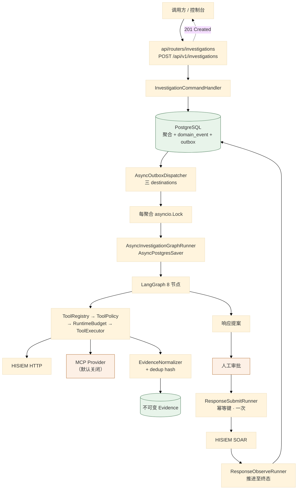
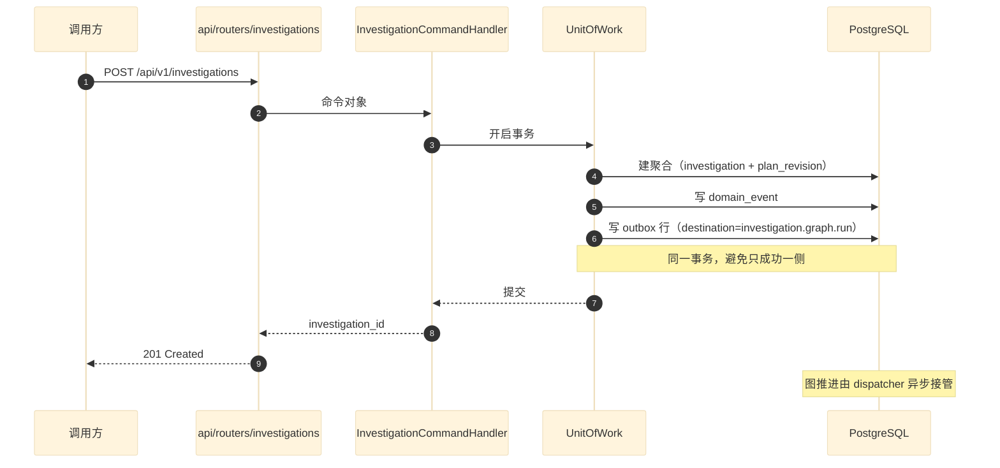
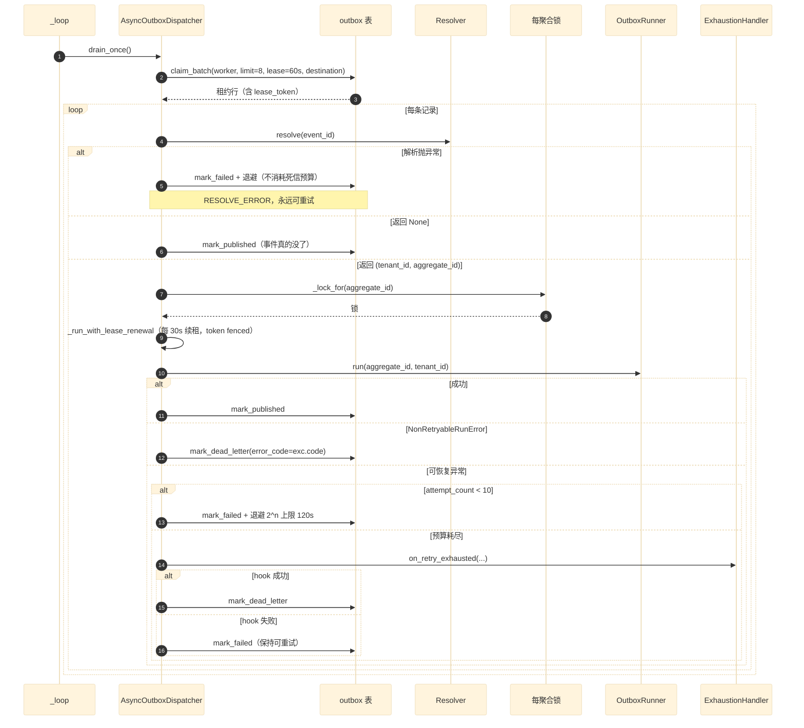
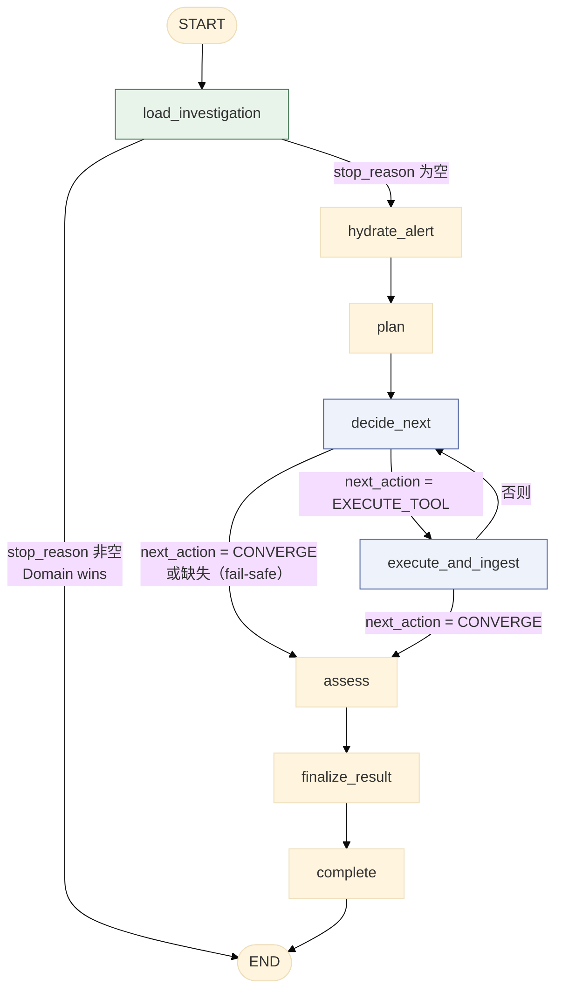
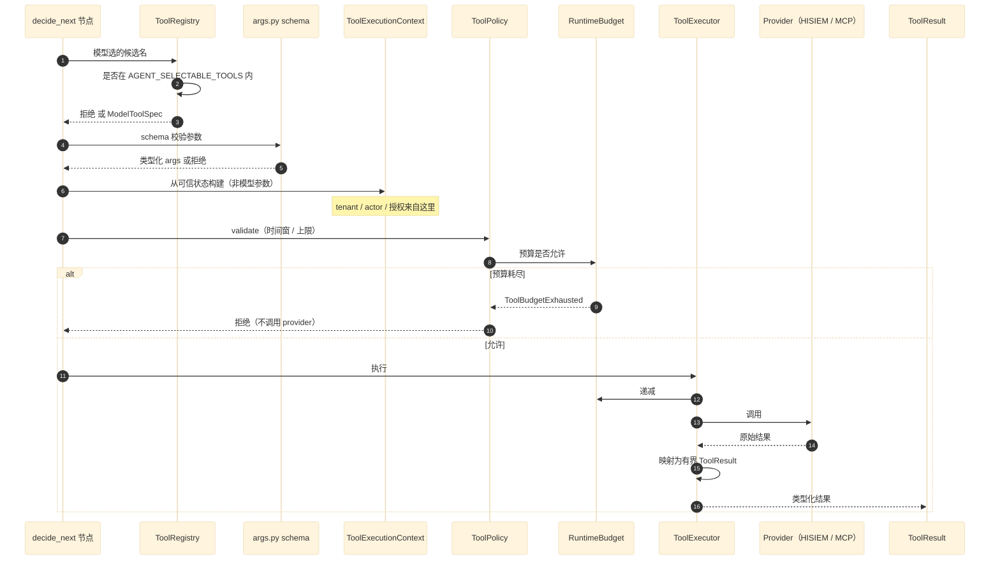
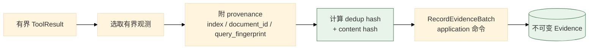
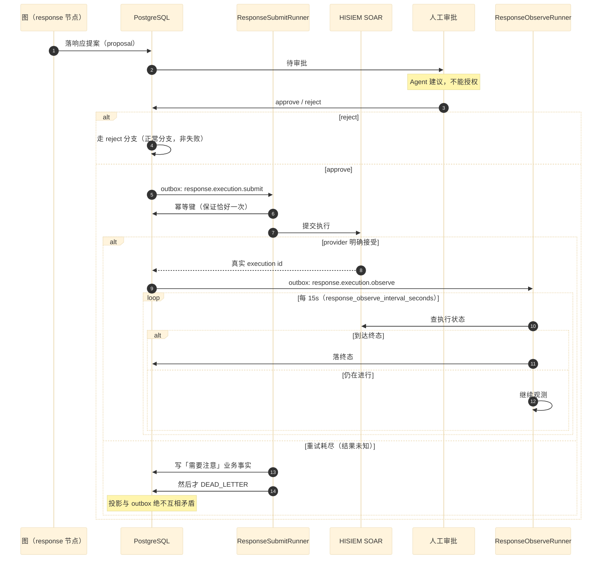
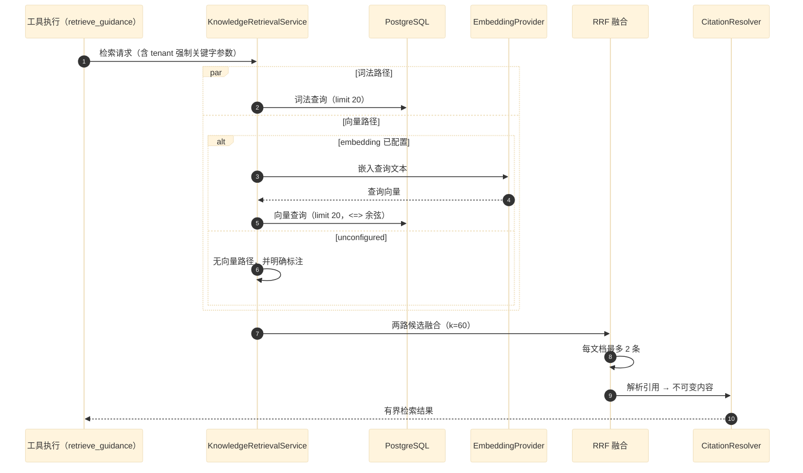

# 01 端到端关键数据流

> **本文性质：** 代码级取证补充，**不构成契约**。`docs/README.md` 规定「Architecture and persistence documents are authority」——冲突时以 `application-commands-domain-events-langgraph-state.md` 为准。

> **文档类型**：数据流取证（代码级核验，非设计提案）
> **分析对象**：`D:\Project\HISIEM-SOC-Copilot`
> **取证方式**：源码直读 + grep 统计；每个关键论断附 `file:line` 相对路径锚点
> **结论以当前代码为准**（分支 `capability-mcp` @ `1e567be`）
> **文档集**：00–08 共 9 篇，见 [`README.md`](README.md)

---

## 一句话定位

本文逐条拆解贯穿 Copilot 的 **7 条端到端数据流**——从一次 HTTP 调查请求，到响应动作被 HISIEM 执行并被观测到终态。

每条数据流的写法固定为三段：**关键论断（带 `file:line` 锚点）→ 时序图（mermaid）→ 源码落点行**。

> **模式：论断先行，图佐证论断。** 图里画的每条消息，正文都能指到对应代码行。

---

## 0. 主链总览



**源码落点行**：

| 环节 | 锚点 |
| --- | --- |
| HTTP 入口 | `api/routers/investigations.py:53`（`POST ""`） |
| 命令处理器 | `application/handlers/investigation.py` |
| outbox 派发 | `infrastructure/durable/dispatcher.py:118`（`AsyncOutboxDispatcher`） |
| 三个 destination | `dispatcher.py:45,50,51` |
| 每聚合锁 | `dispatcher.py:142,147-153` |
| 租约续期 | `dispatcher.py:268-304` |
| 图 runner | `infrastructure/durable/investigation_runner.py:63` |
| 图装配 | `agent/graph/builder.py:63-111` |
| 预算 | `agent/graph/budget.py` |
| 工具执行 | `agent/tools/executor.py`、`policy.py`、`registry.py` |
| 证据归一化 | `agent/evidence/normalizer.py:29` |
| 响应 runner | `infrastructure/durable/response_runner.py`（783 行） |

---

## 1. 数据流：调查创建（HTTP → 事务 + outbox）

### 1.1 关键论断

**论断 1：创建调查返回 `201 Created`，但**工作在图里异步发生**。**

```python
# api/routers/investigations.py:50,53
router = APIRouter(prefix="/api/v1/investigations", tags=["investigations"])

@router.post("", status_code=status.HTTP_201_CREATED, response_model=InvestigationResponse)
```

**201 而不是 202**——语义是「资源已创建」（聚合已落库），**不是**「任务已受理」。因为**聚合的创建是同步的**，异步的只是**图的推进**。

> **与 SIEM 侧的对照**：HISIEM 的 `detection-rules/deploy` 返回 **`202 PENDING`**（SIEM 01 篇 §2），因为那里连**期望态**都还没收敛。这里返回 201 是因为**聚合已经是完整的事实**。

**论断 2：HTTP 层不得直接碰 agent —— 这是 AST 强制的。**

```python
# tests/architecture/test_import_boundaries.py:46-51
"api": (
    "infrastructure.persistence", "infrastructure.hisiem",
    "langgraph", "agent",
),
```

**`api` 禁导入 `agent` 与 `langgraph`** ——所以路由层**不可能**自己构图或跑图。它只能调 `application` 的 handler。

**这是「HTTP 请求处理」与「AI 编排」之间那道可测试的边界的具体体现**（00 篇 §2.1 论断 2）。

**论断 3：创建走「命令 → 事务内落聚合 + 写 outbox」的 outbox 模式。**

**证据**：`dispatcher.py:42-44` 的注释指明入队点在 `infrastructure.persistence.repositories.durable._EVENT_DESTINATIONS`——

```python
# infrastructure/durable/dispatcher.py:42-44
# Outbox destinations — one dispatcher claims exactly one destination. The
# event→destination map that enqueues these lives in
# ``infrastructure.persistence.repositories.durable._EVENT_DESTINATIONS``.
```

**所以「事件类型 → destination」的映射是**一张显式的表**，不是散落的 if-else。** 见 07 篇。

**论断 4：三个 destination 各有独立 dispatcher —— 谁也饿不死谁。**

```python
# infrastructure/durable/dispatcher.py:45-51
INVESTIGATION_DESTINATION = "investigation.graph.run"
# The response side effect is split into TWO durable responsibilities (spec §3):
# SUBMIT obtains the real provider execution id exactly once (idempotency-keyed);
# OBSERVE advances an already-submitted execution toward a terminal state. Each
# destination has its own dispatcher/worker so neither can starve the other.
RESPONSE_SUBMIT_DESTINATION = "response.execution.submit"
RESPONSE_OBSERVE_DESTINATION = "response.execution.observe"
```

**三个 destination**：

| destination | 语义 | 为什么独立 |
| --- | --- | --- |
| `investigation.graph.run` | 推进调查图 | — |
| `response.execution.submit` | **取得真实 provider 执行 id，恰好一次**（幂等键） | 提交是**一次性**动作 |
| `response.execution.observe` | 把已提交的执行推往终态 | 观测是**长期轮询**动作 |

**「neither can starve the other」是关键理由**：如果 submit 与 observe 共用一个 dispatcher，**一个慢的 observe 会阻塞所有 submit**。拆开后两者独立进退。

### 1.2 时序图



### 1.3 源码落点行

| 行 | 内容 |
| --- | --- |
| `investigations.py:50` | `APIRouter(prefix="/api/v1/investigations")` |
| `investigations.py:53` | `POST ""` → `201` |
| `dispatcher.py:42-44` | 事件→destination 映射位置 |
| `dispatcher.py:45,50,51` | 三个 destination 常量 |

---

## 2. 数据流：outbox 派发（**三分类失败**是核心）

### 2.1 关键论断

**这条流的全部要点是「失败分三类，只有一类可以进死信」。**

**论断 1：三分类写在类 docstring 里。**

```python
# infrastructure/durable/dispatcher.py:10-15
Failures split into three classes, and only ONE of them may ever dead-letter:
- resolution failed (we cannot even name the aggregate) → retry forever, the
  dead-letter budget is never touched;
- the runner raised a deterministic ``NonRetryableRunError`` → DEAD_LETTER at once;
- the runner failed recoverably → retry with backoff, and at budget exhaustion the
  DESTINATION's exhaustion hook writes the business fact before the DEAD_LETTER.
```

| 失败类 | 处置 | 消耗死信预算？ |
| --- | --- | --- |
| **解析失败**（连聚合都叫不出来） | **永远重试** | **否** |
| **确定性不可重试**（`NonRetryableRunError`） | **立即死信** | 是（立即） |
| **可恢复失败** | 退避重试，预算耗尽时**先写业务事实**再死信 | 是（耗尽时） |

**论断 2：解析失败永不消耗死信预算——理由是一段完整的论证。**

```python
# dispatcher.py:196-213
except Exception as exc:
    # A failed RESOLUTION says nothing about the business outcome: we cannot
    # even name the aggregate this delivery belongs to, so no destination
    # hook can be consulted and no business fact can honestly be written.
    # Spending the dead-letter budget here would drop the responsibility
    # silently — a submit stuck at PENDING/RETRYING, an execution left
    # RUNNING with its reconciliation gone for good, or a local event that
    # was merely unreadable at that instant discarded permanently. The
    # delivery stays retryable; backoff still bounds the attempt rate.
    await self._retry_later(record, "RESOLVE_ERROR")
    # Bounded, internal detail only — never the exception's own text.
    logger.warning(
        "outbox %s resolve failed on attempt %d (%s)",
        record.id, record.attempt_count, type(exc).__name__,
    )
    return
```

**论证链**：解析失败**说不出业务结果**（→ 没有 destination hook 可问，→ 写不出诚实的业务事实，→ 花掉死信预算就等于**静默丢弃职责**）。所以**保持可重试**，靠退避**限制尝试速率**而非限制尝试次数。

**注意最后一行只记 `type(exc).__name__`**（`:211`），**不记异常文本**——与注释 `:206`「never the exception's own text」对应。**这是「日志不泄漏供应商细节」的一条具体落点。**

**论断 3：`Resolver` 协议把「事件没了」与「读失败」拆成两个事实。**

```python
# dispatcher.py:60-68
class Resolver(Protocol):
    """Maps a claimed outbox record to the event's (tenant_id, aggregate_id).

    ``None`` means "that event is genuinely gone" and settles the delivery. RAISING
    means "the read failed" — a different fact entirely, and the one the dispatcher
    must never turn into a dead letter (see ``AsyncOutboxDispatcher._retry_later``).
    """
    async def resolve(self, *, event_id: UUID) -> tuple[str, str] | None: ...
```

**`None` vs 抛异常是两个不同的业务事实**：`None` = 「事件真的没了」→ **标记 PUBLISHED 并了结**（`dispatcher.py:214-221`）；抛异常 = 「这次读失败」→ **保持可重试**。

**用返回值而非异常表达「没有」**，正是为了让两者可分。

**论断 4：`NonRetryableRunError` **只暴露稳定错误码**，不带供应商文本。**

```python
# infrastructure/durable/investigation_runner.py:48-60
class NonRetryableRunError(Exception):
    """A deterministic runner failure the outbox dispatcher must NEVER retry.

    Used for provider configuration/deployment failures (e.g. ``MODEL_CONFIGURATION``)
    that a bounded backoff retry can never fix. Exposes ONLY a stable safe ``code`` —
    never the underlying provider/exception text.
    """
    code = "RUN_FAILED_FATAL"

    def __init__(self, *, code: str = "RUN_FAILED_FATAL") -> None:
        self.code = code
        super().__init__(f"non-retryable run failure ({code})")
```

**死信时只写 `exc.code`**（`dispatcher.py:243`）——**供应商的异常文本不会进 outbox 行**。

**论断 5：耗尽时的业务事实由 **destination 自己**写——因为重试预算是传输概念，业务含义不是。**

```python
# dispatcher.py:71-86（ExhaustionHandler 协议）
class ExhaustionHandler(Protocol):
    """Destination-specific hook invoked BEFORE a delivery is dead-lettered.

    A retry budget is a TRANSPORT concern; what it MEANS for the business is not.
    The generic dispatcher therefore does not guess: when a destination's attempts
    run out it asks the destination's own handler to persist whatever business fact
    the exhaustion implies (for submit: "nobody knows whether the provider accepted
    it, a human must look"), and only then dead-letters the row. This keeps the
    durable projection and the outbox from ever disagreeing — an outbox row in
    DEAD_LETTER while the projection still says "retrying" is a lie the workspace
    would keep showing.
    """
    async def on_retry_exhausted(
        self, *, aggregate_id: str, tenant_id: str, error_code: str
    ) -> None: ...
```

**这是本文最值得单独记住的一段设计推理**：

> **通用 dispatcher 不猜业务含义**，而是**问 destination**：耗尽意味着什么？submit 的答案是「**没人知道 provider 收没收，得有人去看**」。

**并且顺序是硬约束**：**hook 先写业务事实，再死信**（`dispatcher.py:325-346`）。若 hook 失败，**投递保持可重试而不死信**：

```python
# dispatcher.py:333-341
except Exception as exc:
    await self._retry_later(record, error_code)
    logger.warning(
        "exhaustion handler failed for aggregate %s (%s); keeping "
        "the delivery retryable instead of dead-lettering",
        aggregate_id, type(exc).__name__,
    )
    return
```

**理由（`:317-319`）**：*「死信旁边放一个仍写着 `retrying` 的投影，是 workspace 会一直展示的谎言」*。

**论断 6：租约在长跑期间**持续续期**，且续期被 token fencing。**

```python
# dispatcher.py:226-235
# A long run (up to the runtime duration budget) must not be stolen
# by the fixed lease: renew the lease WHILE the run is in flight.
# Each renewal is token-fenced, so only the current owner extends
# the lease; a stale worker's renewal is a no-op.
await self._run_with_lease_renewal(
    record,
    lambda: self._runner.run(aggregate_id=aggregate_id, tenant_id=tenant_id),
)
```

```python
# dispatcher.py:268-277（方法 docstring）
"""Run ``run()`` while periodically renewing the record's lease.

The lease is renewed every half of ``_LEASE_TIMEOUT_SECONDS``. Renewal
failures are ignored (the run continues): if the lease was genuinely lost
to a reclaim, the final settlement will be rejected by the token fence and
the reclaiming worker owns the row.
"""
```

**「续期失败被忽略」是有意的** —— 因为**最终结算会被 token fence 拒绝**，所以「谁拥有这一行」由**结算时的 token 校验**决定，不由续期成功与否决定。**这是 fencing 的正确用法**：不靠预防，靠结算时校验。

**断言**：续期间隔 = `_LEASE_TIMEOUT_SECONDS / 2.0`（`:278`），租约超时 60 秒（`:54`）→ 每 30 秒续一次。

**论断 7：in-process 的每聚合锁防止同一调查并发跑两次。**

```python
# dispatcher.py:17-18（docstring）
An in-process per-investigation lock guarantees that duplicate/concurrent outbox
delivery never launches two runs of the same investigation.
```

```python
# dispatcher.py:141-153
# in-process guard so one aggregate is never double-run concurrently
self._running: dict[UUID, asyncio.Lock] = {}
self._guard = asyncio.Lock()
...
async def _lock_for(self, aggregate_id: UUID) -> asyncio.Lock:
    async with self._guard:
        lock = self._running.get(aggregate_id)
        if lock is None:
            lock = asyncio.Lock()
            self._running[aggregate_id] = lock
        return lock
```

**注意这是「进程内」锁**（注释 `:141` 明说 in-process）——**跨进程的重复由租约 + token fence 兜底**。**两级防护，各管一层。**

**`_running` 字典只增不减** —— 长期运行会有内存增长。见 §9 待核实。

**论断 8：退避是有界指数，保证「永远重试」不等于「无限速率」。**

```python
# dispatcher.py:373-376
@staticmethod
def _backoff_seconds(attempt_count: int) -> int:
    """Bounded exponential backoff: 2, 4, 8, … capped at ``_MAX_BACKOFF_SECONDS``."""
    return min(int(2**attempt_count), _MAX_BACKOFF_SECONDS)
```

**上界 120 秒**（`:57`）。**这就是论断 2 里「retrying indefinitely is safe」的依据**——次数无限但速率有界。

**论断 9：轮询循环吞掉所有瞬时异常，保持 worker 存活。**

```python
# dispatcher.py:396-404
async def _loop(self) -> None:
    while not self._stop:
        try:
            await self.drain_once()
        except asyncio.CancelledError:
            raise
        except Exception as exc:  # keep the worker alive on transient errors
            logger.warning("outbox drain error (%s)", type(exc).__name__)
        await asyncio.sleep(self._poll)
```

**`CancelledError` 必须重抛**（`:400-401`）——否则停机指令会被吞掉。**这是一个很容易写错的地方**：`except Exception` 在 Python 3.8+ 不会捕获 `CancelledError`（它继承 `BaseException`），但**显式写出来更清楚**。

**论断 10：destination 不匹配的行被直接死信，错误码是 `UNKNOWN_DESTINATION`。**

```python
# dispatcher.py:181-193
async def _deliver_claimed(self, record: OutboxRecord) -> None:
    if record.destination != self._destination:
        dead_lettered = await self._outbox.mark_dead_letter(
            outbox_id=record.id, lease_token=record.lease_token,
            error_code="UNKNOWN_DESTINATION",
        )
```

**这是一条防御性检查**：理论上不该发生（claim 已按 destination 过滤），但万一发生，**立即死信而不是无限重试**——因为「destination 不认识」是确定性事实。

### 2.2 时序图



### 2.3 源码落点行

| 行 | 内容 |
| --- | --- |
| `dispatcher.py:53-57` | `_MAX_ATTEMPTS=10` / `_LEASE_TIMEOUT_SECONDS=60` / `_MAX_BACKOFF_SECONDS=120` |
| `dispatcher.py:155-171` | `drain_once` 领批 + 逐条投递 |
| `dispatcher.py:181-266` | `_deliver_claimed` 主分支 |
| `dispatcher.py:196-213` | 解析失败 → 永不消耗预算 |
| `dispatcher.py:236-255` | 不可重试 → 立即死信 |
| `dispatcher.py:306-351` | `_fail` 退避 + 耗尽 hook |
| `dispatcher.py:353-376` | `_retry_later` + 有界退避 |
| `dispatcher.py:396-404` | 轮询循环 |

---

## 3. 数据流：图执行（8 节点 + 检查点）

### 3.1 关键论断

**论断 1：图是 8 个节点、两条条件边、一条回环。**

```python
# agent/graph/builder.py:1-7（docstring）
"""LangGraph builder — the real read-only Investigation graph.

Wiring (application-commands...md §19, read-only prefix):
    START → load_investigation → hydrate_alert → plan → decide_next
        decide_next.next_action:
            execute_and_ingest → decide_next   (investigate loop)
            assess → assess → finalize_result → complete → END
"""
```

```python
# agent/graph/builder.py:75-107
_add("load_investigation", nodes.load_investigation)
_add("hydrate_alert", nodes.hydrate_alert)
_add("plan", nodes.plan)
_add("decide_next", nodes.decide_next)
_add("execute_and_ingest", nodes.execute_and_ingest)
_add("assess", nodes.assess)
_add("finalize_result", nodes.finalize_result)
_add("complete", nodes.complete)

builder.add_edge(START, "load_investigation")
builder.add_conditional_edges("load_investigation", _route_after_load,
    {"hydrate_alert": "hydrate_alert", END: END})
builder.add_edge("hydrate_alert", "plan")
builder.add_edge("plan", "decide_next")
builder.add_conditional_edges("decide_next", _route_decide,
    {nodes.EXECUTE_TOOL: "execute_and_ingest", nodes.CONVERGE: "assess"})
builder.add_conditional_edges("execute_and_ingest", _route_after_tool,
    {"decide_next": "decide_next", nodes.CONVERGE: "assess"})
builder.add_edge("assess", "finalize_result")
builder.add_edge("finalize_result", "complete")
builder.add_edge("complete", END)
```

**唯一的回环**是 `decide_next ⇄ execute_and_ingest`（`builder.py:100-104`）——**对应 `execute_and_ingest` 的 `_route_after_tool` 返回值**。

**论断 2：路由由**确定性标记**驱动，不由自由文本。**

```python
# agent/graph/builder.py:15-17
Routing is driven by deterministic ``next_action`` / ``assessment`` markers that
nodes write into state (never by free text). The model is consulted only inside
nodes; edges never ask the model.
```

```python
# builder.py:34-44
def _route_decide(state: InvestigationGraphState) -> str:
    return state.get("next_action") or nodes.CONVERGE

def _route_after_tool(state: InvestigationGraphState) -> str:
    # After one tool call + evidence ingestion the investigation loops back to
    # decide_next (which routes to CONVERGE when the model/budget says FINALIZE).
    action = state.get("next_action")
    if action == nodes.CONVERGE:
        return nodes.CONVERGE
    return "decide_next"
```

**`_route_decide` 的 `or nodes.CONVERGE` 是 fail-safe 默认值**——状态里没有 `next_action` 时**收敛而不是继续循环**。**这个默认方向很重要**：默认值选「继续」会让一次状态缺失变成无限循环。

**论断 3：`execute_and_ingest` 把「一次工具调用」与「证据落库」合并成一个节点——为了检查点安全。**

```python
# builder.py:9-13
``execute_and_ingest`` performs one allowlisted read tool AND records its
normalized Evidence in a single node, so the bounded ToolResult is consumed within
one checkpoint step — a crash/replay re-runs the whole node, and both the tool
audit (by-key) and Evidence (by dedup key) are idempotent, so a checkpointed
resume never loses or duplicates evidence.
```

**这是本文里最值得单独记住的一处检查点推理**：

> **若工具调用与证据落库分成两个节点，崩在中间会丢失证据**（工具已执行但结果没落库，重放时要重新执行工具——**而工具可能有副作用或成本**）。
>
> **合并成一个节点后，崩溃只会重放整节点**，靠**工具审计按 key 幂等 + 证据按 dedup key 幂等**保证不重复。

**「一个检查点步内消费完有界的 ToolResult」** 是这条设计的准确表述。

**论断 4：加载节点可以**直接结束图**（不重跑终态调查）。**

```python
# builder.py:47-51
def _route_after_load(state: InvestigationGraphState) -> str:
    # Reconciliation: a terminal investigation stops immediately (no re-run).
    if state.get("stop_reason"):
        return END
    return "hydrate_alert"
```

```python
# investigation_runner.py:5-6（docstring）
2. refuses to re-run a terminal investigation (Domain wins over checkpoint);
```

**「Domain wins over checkpoint」是一条重要的优先级**：**领域状态胜过检查点状态**。若聚合已经是终态（取消/完成），**检查点里有什么都不重要**——直接 END。

**理由**：检查点是**执行层**的进度记录，领域聚合是**业务事实**。业务事实优先。

**论断 5：runner 的五步流程写在 docstring 里。**

```python
# infrastructure/durable/investigation_runner.py:1-15
"""Async investigation graph runner.

For one outbox record (an ``investigation_created`` domain event) the runner:

1. loads the current Domain investigation (short transactions);
2. refuses to re-run a terminal investigation (Domain wins over checkpoint);
3. ensures an OrchestrationBinding exists (deterministic thread_id);
4. bridges CREATED → RUNNING via the workflow start command;
5. compiles + runs the graph against the AsyncPostgresSaver checkpointer for the
   bound thread, resuming from whatever checkpoint already exists.

The dispatcher marks the outbox PUBLISHED after a successful run. Crash/replay
safety: workflow commands are receipt-idempotent (deterministic node keys) and
Evidence dedups, so a checkpointed resume never duplicates rows.
"""
```

**注意第 3 步的「deterministic thread_id」** —— 与 `builder.py:114-126` 的 `thread_config` 对应：

```python
# builder.py:114-126
def thread_config(investigation_id: str) -> dict[str, Any]:
    """Return the RunnableConfig dict binding a run to a thread.

    Investigation ID and LangGraph thread_id remain distinct identities; the
    orchestration_binding table records their mapping. Until a full runtime is
    wired, threads are keyed by the investigation id as a stable placeholder.
    """
    return {"configurable": {"thread_id": investigation_id, "checkpoint_ns": ""}}
```

> **「investigation_id 与 thread_id 是两个不同身份」**（`builder.py:117-118`）——**但当前实现用 investigation_id 作为 thread_id 的占位**。`orchestration_binding` 表记录这个映射。**这是一处「设计上分离、实现上暂合」的地方**，值得在评审时说明。

**论断 6：检查点是可选的（`checkpointer=None` 时也能编译）。**

```python
# builder.py:63-69,109-111
def build_investigation_graph(runtime: GraphRuntime, checkpointer: Any = None) -> Any:
    """Compile the read-only investigation graph bound to a runtime context.

    ``checkpointer`` is optional; when supplied (e.g. LangGraph's
    AsyncPostgresSaver, owned by the ``langgraph_checkpoint`` schema) the compiled
    graph persists its bounded state across node executions for restart/resume.
    """
    ...
    if checkpointer is not None:
        return builder.compile(checkpointer=checkpointer)
    return builder.compile()
```

**`checkpointer=None` 对应**无持久化**的运行**——测试与本地开发用。**生产走 `langgraph_checkpoint` schema**（独立的 DB schema，见 07 篇）。

### 3.2 图拓扑



---

## 4. 数据流：工具调用（五段链）

### 4.1 关键论断

**论断 1：五段链写在 executor 的 docstring 里。**

```python
# agent/tools/executor.py:1-8
"""ToolExecutor — the deterministic executor over allowlisted read tools.

Chain (investigation-tool-contract.md §2): candidate → schema validation →
authenticated scope binding → policy/budget → provider adapter → typed ToolResult.

The executor NEVER reads tenant/actor/authorization from model arguments; those
come from the ToolExecutionContext the graph builds from trusted state.
"""
```

**五段**：候选 → schema 校验 → **认证作用域绑定** → 策略/预算 → provider → 类型化 `ToolResult`。

**「executor 永不从模型参数读 tenant/actor/授权」**——**这是整条链的安全前提**。

**论断 2：策略层负责「模型选了候选，系统绑上边界」。**

```python
# agent/tools/policy.py:1-7
"""ToolPolicy — deterministic policy validation over model-selected tool calls.

The policy layer is where "the model chose a candidate, the system binds the
bounds". It enforces the bounded search windows / limits from
investigation-tool-contract.md §15 on top of the strict per-tool argument schema,
and it refuses execution when the investigation budget is exhausted.
"""
```

**两层校验的分工**：

| 层 | 校验什么 |
| --- | --- |
| **schema**（`args.py`） | 参数**类型与形状** |
| **policy**（`policy.py`） | 参数**在业务边界内**（时间窗、上限） |

**论断 3：单次搜索窗口硬上限 24 小时，且是常量。**

```python
# agent/tools/policy.py:16-17
MAX_SINGLE_CALL_SPAN_HOURS = 24
SECONDS_PER_HOUR = 3600
```

```python
# policy.py:28-32
def validate_search_span(args: SearchEventsArgs) -> None:
    """A single agent search must not exceed the Copilot 24h bounded window."""
    try:
        start = datetime.fromisoformat(args.from_.replace("Z", "+00:00"))
        end = datetime.fromisoformat(args.to.replace("Z", "+00:00"))
```

**「Copilot 24h bounded window」是产品级约束**——**模型不能通过构造一个超大时间窗来拉取全量日志**。

**论断 4：预算耗尽与策略违例是两个不同的异常，后者是前者的父类。**

```python
# policy.py:20-25
class ToolPolicyError(ValueError):
    """Raised when a candidate violates a deterministic tool policy."""

class ToolBudgetExhausted(ToolPolicyError):
    """Raised when the investigation budget has no room for another tool call."""
```

**`ToolBudgetExhausted` 继承 `ToolPolicyError`** —— 所以调用方可以只捕 `ToolPolicyError` 处理所有策略类拒绝，也可以单独捕预算耗尽。**这个继承关系把「预算也是一种策略」表达出来了。**

**论断 5：注册表的「模型可选面」**恰好等于** executor 真正实现的那一组。**

```python
# agent/tools/registry.py:1-12
"""Tool Registry — the deterministic read-only allowlist.

V1 only registers READ_ONLY tools (investigation-tool-contract.md §3), and the
registry's model-selectable surface is EXACTLY the set the executor actually
implements. ``hisiem.get_alert_context`` is system-controlled (the graph hydrate
node calls the HISIEM get_alert directly) and is never offered to the model.

Spec-defined but NOT-yet-implemented tools (entity activity, threat-intel,
knowledge lookups) are cataloged separately (``FUTURE_CATALOG_TOOLS``) purely as
documentation — they are NOT registered, so the model can never select a tool with
no executor, schema, or policy backing it.
"""
```

**三条规则**：

| 规则 | 含义 |
| --- | --- |
| **只有 `READ_ONLY`** | `ToolCapability = Literal["READ_ONLY"]`（`registry.py:26`）——**类型里只有一个取值** |
| **模型可选面 = executor 实现集合** | 不存在「注册了但没实现」的工具 |
| **未来工具只进 `FUTURE_CATALOG_TOOLS` 作文档，不注册** | **模型永远选不到没有执行器的工具** |

**论断 6：系统控制的工具与模型可选的工具是**两个集合**。**

```python
# agent/tools/registry.py:28-32
SYSTEM_CONTROLLED_TOOL = "hisiem.get_alert_context"

# Exactly the tools the ToolExecutor implements (investigation-tool-contract.md §6).
AGENT_SELECTABLE_TOOLS: frozenset[str] = frozenset(
    {
```

**`hisiem.get_alert_context` 是系统控制的**——由 `hydrate_alert` 节点**直接调 HISIEM**，**从不提供给模型**。

**这是一条容易忽略的安全边界**：**「取告警上下文」是调查的前提，不是模型的选项**。若它也进模型可选面，模型可以选择不取上下文就下结论。

**论断 7：预算是一个值对象，且**没有任何节点直接递减计数**。**

```python
# agent/graph/budget.py:1-22（docstring 节选）
"""RuntimeBudget — the single deterministic authority over the run's counters.

Every node-level budget decision (may the model be consulted? may a tool run? may
another step happen? has the wall-clock deadline passed?) and every decrement goes
through this one value object. No node hand-decrements ``budget_remaining_*``
directly.

The counters and the wall-clock deadline are checkpointed in the graph state, so a
crash/restart/resume naturally continues from the CONSUMED budget — never reset to
full (load_investigation seeds a FRESH run from the aggregate's BudgetLimits and
preserves checkpointed values on resume). The model can never raise the budget and
no node may write it upward.
"""
```

**三条硬约束**：

| 约束 | 理由 |
| --- | --- |
| **所有预算决策与递减都经这一个值对象** | 单一权威，没有「某节点忘了减」的可能 |
| **计数与截止时间进检查点** | **崩溃重启从「已消耗」继续，不重置为满额** |
| **模型不能提高预算，节点不能向上写** | 预算是**系统设定**，不是模型资源 |

**「never reset to full」是这里最关键的一条**：如果预算不进检查点，那么**每次崩溃重启都会拿到一份满额预算**——一个反复崩溃的运行就能无限消耗。**这是把预算放进检查点的真正理由。**

**论断 8：`max_llm_calls` 有一个显式的保留槽位不变量。**

```python
# agent/graph/budget.py:14-22
``max_llm_calls`` invariant: the total number of model consults across the run
(plan + decide + assess + verdict) is bounded by the runtime's original
``max_llm_calls`` for ANY ``max_llm_calls >= 1``. decide reserves the final two
LLM-call slots for the convergence path (assess + verdict); when fewer than two
remain it stops consulting. assess and verdict themselves only consult when a slot
remains (``can_call_llm``), otherwise the graph applies the deterministic
low-budget fallback (hypotheses UNRESOLVED; verdict INCONCLUSIVE "model-call
budget exhausted") — never an over-budget model call.
```

**这段是本项目的预算设计里最精细的一处**：

| 要点 | 说明 |
| --- | --- |
| **不管 `max_llm_calls` 多小（≥1），总量都被它界定** | 没有「最低要几次」的豁免 |
| **`decide` 为收敛路径预留最后 2 个槽**（assess + verdict） | **防止「调查到一半把预算用完，结论出不来」** |
| **不足 2 个槽时 `decide` 停止咨询** | 主动收敛 |
| **`assess` / `verdict` 只在有槽时咨询** | `can_call_llm` 守卫 |
| **没槽时走确定性降级**：假设 `UNRESOLVED`，结论 `INCONCLUSIVE("model-call budget exhausted")` | **绝不超预算调用模型** |

**「降级而非放弃」是这里的取向**：预算耗尽**不报错**，而是**给出一个诚实标为不确定的结论**。**这比抛异常有用得多**——分析员看到的是一个「因预算耗尽而未结论」的调查，而不是一个失败的调查。

### 4.2 五段链



### 4.3 源码落点行

| 行 | 内容 |
| --- | --- |
| `executor.py:1-8` | 五段链 docstring |
| `policy.py:16-17` | `MAX_SINGLE_CALL_SPAN_HOURS = 24` |
| `policy.py:20-25` | 两个异常及其继承关系 |
| `policy.py:28-32` | `validate_search_span` |
| `registry.py:26` | `ToolCapability = Literal["READ_ONLY"]` |
| `registry.py:28` | `SYSTEM_CONTROLLED_TOOL` |
| `registry.py:31-32` | `AGENT_SELECTABLE_TOOLS` |
| `budget.py:1-22` | 预算单一权威 + 保留槽不变量 |

---

## 5. 数据流：证据归一化 → 不可变 Evidence

### 5.1 关键论断

**论断 1：四段链写在 normalizer 的 docstring 里。**

```python
# agent/evidence/normalizer.py:1-8
"""Evidence Normalizer — ToolResult data → Evidence observation candidates.

Chain (investigation-tool-contract.md §24): Typed ToolResult → Evidence Normalizer
→ Deduplication → RecordEvidenceBatch → Immutable Evidence.

The normalizer selects bounded observations from a tool result, attaches
provenance/raw-reference/collection metadata and computes the dedup/content
hashes. It NEVER accepts model-supplied provenance, source ids, or authority.
The graph calls RecordEvidenceBatch (application command) to persist.
"""
```

**四段**：类型化 `ToolResult` → 归一化 → **去重** → `RecordEvidenceBatch` → **不可变 Evidence**。

**论断 2：normalizer **永不接受模型提供的**来源、来源 id 或权威级别。**

```python
# normalizer.py:7-8
It NEVER accepts model-supplied provenance, source ids, or authority.
```

**这是与 executor 同一条原则的延伸**（executor docstring 的「NEVER reads tenant/actor/authorization from model arguments」）。

**合起来是一条完整的不变式**：**模型只提供「想查什么」，不提供「我是谁」「数据从哪来」「这算不算权威」。**

**论断 3：事件来源用「原始引用三元组」，因为 HISIEM 没有稳定的单事件地址 API。**

```python
# normalizer.py:11-13
Event provenance uses the log-search raw reference (investigation-tool-contract.md
§17): {index, document_id, query_fingerprint} — never a fabricated
ExternalResourceRef (no stable event address API in HISIEM).
```

**`{index, document_id, query_fingerprint}`** —— **三个字段合起来表达「这条证据来自哪次查询的哪条文档」**。

**「never a fabricated ExternalResourceRef」是关键**：**没有稳定地址就不能编一个**——因为编出来的引用**指向不了任何东西**，比没有引用更坏。

**这是一处很好的诚实设计**：承认下游能力的边界（HISIEM 没有单事件稳定地址），并用**可复现的查询指纹**代替。

### 5.2 去重身份



> **`dedup hash` 与 `content hash` 是两个不同的哈希**（`normalizer.py:6-7`）——**前者决定「这条证据是否已存在」，后者决定「内容是否被改动」**。**不可变 Evidence 靠后者证明未被篡改。** 具体字段构成见 04 篇。

---

## 6. 数据流：响应闭环（提案 → 审批 → 提交 → 观测）

### 6.1 关键论断

**论断 1：响应侧效果被拆成两个持久职责，各有独立 dispatcher。**

```python
# infrastructure/durable/dispatcher.py:46-51
# The response side effect is split into TWO durable responsibilities (spec §3):
# SUBMIT obtains the real provider execution id exactly once (idempotency-keyed);
# OBSERVE advances an already-submitted execution toward a terminal state. Each
# destination has its own dispatcher/worker so neither can starve the other.
RESPONSE_SUBMIT_DESTINATION = "response.execution.submit"
RESPONSE_OBSERVE_DESTINATION = "response.execution.observe"
```

| 职责 | 一句话 | 关键性质 |
| --- | --- | --- |
| **SUBMIT** | 取得真实 provider 执行 id | **恰好一次**（幂等键） |
| **OBSERVE** | 把已提交的执行推往终态 | **可重复**（只读后写状态） |

**这个拆分的本质是「一次性」与「可重复」的分离**：submit 有**副作用**（在 HISIEM 侧创建执行），observe 没有。**把有副作用的操作单独隔离在一个用幂等键保护的 destination 里**，是让整条链可重放的前提。

**论断 2：submit 的耗尽含义是「没人知道 provider 收没收」。**

```python
# dispatcher.py:78-80（ExhaustionHandler docstring 节选）
(for submit: "nobody knows whether the provider accepted
it, a human must look")
```

**这句话定义了「提交结果未知」这个业务事实**——它不同于「提交失败」。**这是本项目里对「不确定」建模最清楚的一处**：

| 事实 | 含义 | 谁能了结 |
| --- | --- | --- |
| 提交成功 | HISIEM 接受了 | 自动 |
| 提交失败 | HISIEM 明确拒绝 | 自动（重试或终态） |
| **提交未知** | **provider 可能收了** | **只能人工核查** |

**论断 3：工作区里有专门的提交状态来表示「需要注意」。**

**证据**：迁移 `979070495d4f_add_attention_required_submission_state.py` —— **一个迁移专门为「需要注意的提交状态」而建**。

**论断 4：`response_runner.py` 是 durable 目录里最大的文件（783 行）。**

实测 `wc -l infrastructure/durable/*.py`：`dispatcher.py` 404 / `investigation_runner.py` 208 / **`response_runner.py` 783**。

**响应侧比调查侧复杂得多**——因为它涉及**跨系统的幂等**（HISIEM 侧的 provider 执行 id）、**人工审批的等待**、以及**长周期观测**。

**论断 5：响应执行与调查有**分离的生命周期**。**

**证据**：迁移 `c8f1a93d5b27_separate_investigation_response_lifecycles.py` —— **专门把两者的生命周期分开**。以及 `b7c2d41a90ef_response_execution_lifecycle.py`。

### 6.2 时序图



### 6.3 源码落点行

| 行 | 内容 |
| --- | --- |
| `dispatcher.py:46-51` | submit / observe 拆分与理由 |
| `dispatcher.py:78-80` | submit 耗尽的业务含义 |
| `config.py:282` | `response_observe_interval_seconds = 15.0` |
| `migrations/979070495d4f` | `attention_required` 提交状态 |
| `migrations/c8f1a93d5b27` | 分离调查与响应生命周期 |
| `response_runner.py`（783 行） | submit + observe 实现 |

---

## 7. 数据流：知识检索（混合 + 引用解析）

### 7.1 关键论断

**论断 1：检索参数是 RRF 形态的——`rrf_k = 60` 是经典取值。**

```python
# config.py:415-418
lexical_candidate_limit: int = Field(default=20, ge=1)
vector_candidate_limit: int = Field(default=20, ge=1)
rrf_k: int = Field(default=60, ge=1)
max_hits_per_document: int = Field(default=2, ge=1)
```

**四个参数**：词法候选 20 条 + 向量候选 20 条 → **RRF 融合（k=60）** → 每文档最多 2 条命中。

**`rrf_k = 60` 是 Reciprocal Rank Fusion 论文的原始取值**——这直接说明融合算法是 RRF，不是加权分数。

**论断 2：`max_hits_per_document = 2` 防的是「一份长文档占满结果」。**

**这是混检索的一个实际约束**：一份大文档可能在词法与向量两侧都排前，从而**把整页结果占满**。限制每文档 2 条让结果**覆盖更多来源**。

**论断 3：向量距离只支持余弦，且写进了类型。**

```python
# config.py:479
distance_metric: Literal["COSINE"] = Field(default="COSINE")
```

**`Literal` 只有一个取值**——**用类型表达「只支持余弦」**，而不是靠文档说明。

**论断 4：嵌入是**独立于对话 LLM** 的配置。**

```python
# config.py:452（类 docstring）
"""Embedding provider configuration, INDEPENDENT of the chat LLM (section 18).
```

```python
# config.py:459-460
provider there is no vector retrieval, and the system says so instead of
```

**「INDEPENDENT of the chat LLM」是一条明确的架构约束**——**换对话模型不影响检索，换嵌入模型不影响对话**。

**并且「未配置嵌入时没有向量检索，且系统明确说明」**（`:459-460`）——**不静默降级为纯词法**，而是**告知**。

**论断 5：引用解析有一个专门的解析器。**

`Container` 里有 `knowledge_citation_resolver`（`bootstrap/container.py:614`）与 `KnowledgeCitationResolver`（`application/services/knowledge_retrieval.py`）。

**引用的身份是「不可变内容」而非「可重建的投影行」**——`test_knowledge_boundary.py:25-26` 明确断言：*「a citation names immutable content rather than a rebuildable projection row」*。

**这是一条重要的区分**：**投影行可以被重建（内容会变），不可变内容不会**。**引用前者等于引用一个会变的地址。**

### 7.2 时序图



---

## 8. 关键不变式（代码强制）

| # | 不变式 | 强制点 | 违反后果 |
| --- | --- | --- | --- |
| 1 | **`api` 不得直接导入 `agent` / `langgraph`** | `test_import_boundaries.py:46-51` | HTTP 处理与 AI 编排耦合 |
| 2 | **`domain` 不得导入 `pydantic` 或任何框架** | `test_import_boundaries.py:22-34` | 域模型带框架依赖 |
| 3 | **解析失败永不消耗死信预算** | `dispatcher.py:196-213` | 静默丢弃职责 |
| 4 | **耗尽时必须先写业务事实再死信** | `dispatcher.py:325-346` | 投影与 outbox 互相矛盾 |
| 5 | **耗尽 hook 失败则保持可重试** | `dispatcher.py:333-341` | 死信旁边挂着「重试中」的投影 |
| 6 | **不可重试失败只携带稳定错误码** | `investigation_runner.py:48-60`；`dispatcher.py:243` | 供应商异常文本进持久层 |
| 7 | **日志不记异常文本，只记类型名** | `dispatcher.py:206-212` | 日志泄漏供应商细节 |
| 8 | **租约在长跑期间持续续期** | `dispatcher.py:226-235,268-304` | 长跑被固定租约抢走 |
| 9 | **同一聚合不并发跑两次（进程内）** | `dispatcher.py:141-153` | 重复图运行 |
| 10 | **退避有上界（120s）** | `dispatcher.py:373-376` | 无限重试变成无限速率 |
| 11 | **`CancelledError` 必须重抛** | `dispatcher.py:400-401` | 停机指令被吞 |
| 12 | **`execute_and_ingest` 是单节点（工具 + 证据原子）** | `builder.py:9-13,79` | 崩溃丢证据或重复执行工具 |
| 13 | **路由只读确定性标记，边不问模型** | `builder.py:15-17,34-44` | 用自由文本驱动控制流 |
| 14 | **`next_action` 缺失时收敛而非继续** | `builder.py:35` `or nodes.CONVERGE` | 状态缺失变成无限循环 |
| 15 | **终态调查不重跑（Domain 胜过 checkpoint）** | `builder.py:47-51`；`investigation_runner.py:5-6` | 取消后仍被推进 |
| 16 | **executor 不从模型参数读 tenant/actor/授权** | `executor.py:6-7` | 模型自授权 |
| 17 | **normalizer 不接受模型提供的来源/id/权威** | `normalizer.py:7-8` | 伪造证据来源 |
| 18 | **单次搜索窗口 ≤ 24h** | `policy.py:16,28-32` | 模型拉全量日志 |
| 19 | **模型可选面 = executor 实现集合** | `registry.py:3-4,31-32` | 模型选到无执行器的工具 |
| 20 | **系统控制工具永不提供给模型** | `registry.py:28`；`registry.py:5-6` | 模型跳过取上下文直接下结论 |
| 21 | **预算递减只经 `RuntimeBudget`** | `budget.py:1-6` | 某节点漏减 |
| 22 | **预算计数进检查点，不重置为满额** | `budget.py:8-12` | 反复崩溃 = 无限预算 |
| 23 | **`decide` 为收敛预留 2 个 LLM 槽** | `budget.py:14-22` | 结论出不来 |
| 24 | **预算耗尽走确定性降级，不超预算调用** | `budget.py:18-21` | 超预算模型调用 |
| 25 | **事件来源用 `{index, document_id, query_fingerprint}`** | `normalizer.py:11-13` | 伪造不可达的引用 |
| 26 | **submit 与 observe 各有独立 dispatcher** | `dispatcher.py:48-49` | 一方饿死另一方 |
| 27 | **嵌入独立于对话 LLM** | `config.py:452` | 换模型影响检索 |
| 28 | **未配置嵌入时明确告知而非静默降级** | `config.py:459-460` | 用户以为有向量检索 |
| 29 | **余弦是唯一支持的距离度量** | `config.py:479` `Literal["COSINE"]` | 换度量导致语义不一致 |

---

## 待核实

> **本节 10 条待核实项均已解答**：`_running` 锁字典确无清理路径；`claim_batch` 不用 `FOR UPDATE SKIP LOCKED` 而是乐观 CAS，且 `commit()` 在批循环之外；`renew_lease` 有三条件 fencing；`destination` 与 outbox 在同一张表；工具审计键是 `tool:<name>:<fingerprint>`；submit 幂等键是 `response:<tenant>:<proposal>`；`ATTENTION_REQUIRED` 有三处工作区可见性；tenant 是强制关键字参数且有 AST 测试；MCP 落在五段链第 5 段内部。

---

## 修订记录

| 版本 | 日期 | 变更 | 作者 |
| --- | --- | --- | --- |
| 1.0 | 2026-09-22 | 首版。基于 `capability-mcp` @ `1e567be` 全量取证，7 条数据流 + 29 条不变式。 | code-level-architecture-docs skill |
