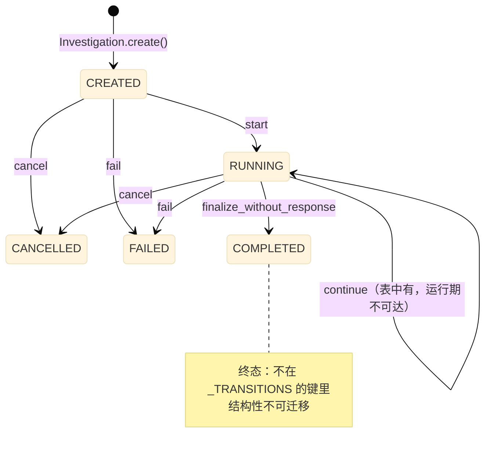
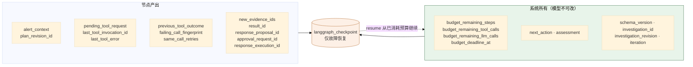
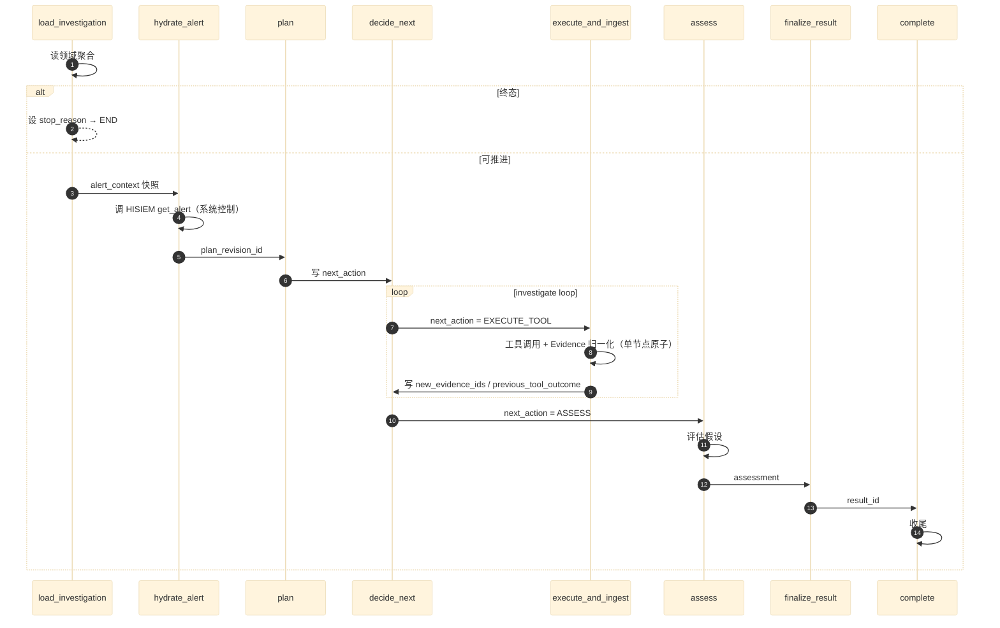

# 02 领域模型与调查编排

> **本文性质：** 代码级取证补充，**不构成契约**。`docs/README.md` 规定「Architecture and persistence documents are authority」——冲突时以 `domain-model.md` 为准。

> **文档类型**：子系统深挖（代码级核验，非设计提案）
> **分析对象**：`D:\Project\HISIEM-SOC-Copilot` 的 `domain/`（28 文件，1109 行含 shared）+ `agent/graph/`（7 文件，1788 行）
> **取证方式**：源码直读；每个关键论断附 `file:line` 锚点
> **结论以当前代码为准**（分支 `capability-mcp` @ `1e567be`）
> **文档集**：00–08 共 9 篇，见 [`README.md`](README.md)

---

## 为什么这两块合一篇

`domain` 与 `agent/graph` 是**同一个设计的两半**：

- `domain` 定义「一次调查是什么、允许发生什么状态迁移」——**业务事实**。
- `agent/graph` 定义「怎么把这次调查推进下去」——**执行过程**。

而两者之间有一条**明确的高低关系**，写在图状态的 docstring 里：

```python
# agent/graph/state.py:7-8
Graph state != Domain state. Domain is the source of truth; the graph checkpoints
(``langgraph_checkpoint`` schema) only support fault recovery/interrupt/resume.
```

**Domain 是真相，检查点只是故障恢复的辅助。** 这条关系是本篇的组织主线。

---

## 1. 领域模型：聚合根与状态机

### 1.1 关键论断

**论断 1：聚合根独占生命周期管理，外部不得直接改状态。**

```python
# domain/investigation/aggregate.py:1-6
"""Investigation Aggregate Root and state machine.

The aggregate owns the lifecycle: legal status transitions, terminal-state
immutability, and emitting domain events. Nothing outside the aggregate mutates
status/phase directly (see python-package-boundary.md §4).
"""
```

```python
# aggregate.py:44-52
@dataclass
class Investigation:
    """Aggregate root for one alert-driven investigation.

    Invariants (domain-model.md §4):
    - belongs to exactly one tenant, originates from exactly one alert (both immutable)
    - terminal status never transitions
    - every lifecycle change goes through aggregate methods below
    """
```

**三条不变式**：租户与来源告警**不可变**、**终态不迁移**、**所有生命周期变更必须经聚合方法**。

**论断 2：状态迁移表只有两个状态有出边。**

```python
# aggregate.py:24-37
# Legal transitions per domain-model.md §36 / v1-user-flow-and-scope.md §14.
_TRANSITIONS: dict[InvestigationStatus, dict[str, InvestigationStatus]] = {
    InvestigationStatus.CREATED: {
        "start": InvestigationStatus.RUNNING,
        "cancel": InvestigationStatus.CANCELLED,
        "fail": InvestigationStatus.FAILED,
    },
    InvestigationStatus.RUNNING: {
        "continue": InvestigationStatus.RUNNING,
        "finalize_without_response": InvestigationStatus.COMPLETED,
        "cancel": InvestigationStatus.CANCELLED,
        "fail": InvestigationStatus.FAILED,
    },
}
```

| 从 | 动作 | 到 |
| --- | --- | --- |
| `CREATED` | `start` | `RUNNING` |
| `CREATED` | `cancel` / `fail` | `CANCELLED` / `FAILED` |
| `RUNNING` | `continue` | `RUNNING`（自环，**运行期不可达**） |
| `RUNNING` | `finalize_without_response` | `COMPLETED`（**迁移串，不是方法名**） |
| `RUNNING` | `cancel` / `fail` | `CANCELLED` / `FAILED` |

**终态（`COMPLETED` / `CANCELLED` / `FAILED`）不在字典的键里** ——**所以「终态不迁移」是**结构性**的，不是靠 if 判断**。** 查表查不到 → 抛异常。

**注意 `continue` 是 `RUNNING → RUNNING` 的自环** ——它表达「推进一个迭代但不改变状态」。

**这两条迁移在运行期都不可达，且两个名字都不是方法。**

**聚合的真实方法是**（`aggregate.py`）：`start`(`:109`) / `update_phase`(`:122`) / `complete_without_response`(`:131`) / `link_response_proposal`(`:136`) / `cancel`(`:165`) / `fail`(`:173`)。

**`continue` 全仓只出现一次**——就是 `_TRANSITIONS` 里的这一行声明（`aggregate.py:32`）。聚合**没有 `continue()` 方法**，`_transition()` 只被 `complete_without_response` / `cancel` / `fail` 调用。

**应用侧推进迭代走的是 `inv.update_phase(command.phase)`**（`application/handlers/workflow.py:129`），**既不查 `_TRANSITIONS` 也不发 terminated 事件**。

**`finalize_without_response` 只是迁移表里的字符串动作名**，真实方法叫 `complete_without_response`。

**所以 `_TRANSITIONS` 的实际作用范围比它看起来窄**——它是 `complete_without_response` / `cancel` / `fail` 三个方法的守卫表；`update_phase` 走的是另一条不受它约束的路径。**阶段推进与生命周期迁移是两套东西。**

**论断 3：调查**刻意没有**审批/执行状态——这是一条显式声明。**

```python
# aggregate.py:38-41
# NOTE: there is deliberately NO approval/execution status here. The response
# workflow is an independent post-completion aggregate lifecycle (see
# ``InvestigationStatus``); an Investigation never transitions because a proposal
# was approved, rejected, or executed.
```

**这是本篇最值得单独记住的一条设计**：

> **响应工作流是一个独立的、完成后的聚合生命周期。调查**绝不**因为「提案被批准/拒绝/执行」而迁移状态。**

**理由**：调查的职责是「查清楚」，响应的职责是「处置」。**把两者塞进一个状态机会让「查完但没批」变成一个模糊状态**——是 `COMPLETED` 还是 `AWAITING_APPROVAL`？**分开后各自终态清晰。**

**这条与 04 篇的响应生命周期是同一件事的两面**，也与迁移 `c8f1a93d5b27_separate_investigation_response_lifecycles.py`（分离调查与响应生命周期）对应。

**论断 4：不变式在构造期与状态变更期双向强制。**

```python
# aggregate.py:109-120
    def start(self, *, actor: ActorRef, now: datetime | None = None) -> None:
        if self.status != InvestigationStatus.CREATED:
            self._raise_invalid("start")
        self.status = InvestigationStatus.RUNNING
        self.phase = InvestigationPhase.HYDRATING   # aggregate.py:113
        self.started_at = now or utc_now()
        self._bump()
        self._pending_events.append(
            ev.investigation_started(
                self.id, tenant_id=self.tenant_id, actor_subject_id=actor.subject_id
            )
        )
```

**`InvestigationPhase` 实测 5 个取值**（`enums.py:43-50`）：`HYDRATING` / `PLANNING` / `INVESTIGATING` / `VERIFYING` / `FINALIZING`。

**四步模式**（每个领域动作都一样）：**校验前置状态 → 改字段 → `_bump()` 递增版本 → 追加领域事件**。

**两个版本字段分工明确**（实证）：

| 字段 | 谁维护 | 谁读 |
| --- | --- | --- |
| **`revision`** | `_bump()`（`aggregate.py:230-234`，**只做 `self.revision += 1`**） | 图状态（`nodes.py:232`）与领域事件（`durable_support.py:76` 的 `aggregate_revision`） |
| **`lock_version`** | **repository 独占**——域方法**永不自增**（`aggregate.py:230-234` 的注释原文） | 乐观锁 UPDATE（`repositories/investigation.py:56` 的 `WHERE lock_version=expected`、`:68` 的 `SET +1`）与 mapper |

**所以「`_bump()` 与 `lock_version` 配合实现乐观锁」这个说法是错的**：`_bump()` 只碰 `revision`，乐观锁完全由 repository 层的 `lock_version` 负责（冲突时抛 `OptimisticConcurrencyError`）。

**论断 5：事件是**先积攒在聚合里**，由外部统一取走——不是当场发布。**

```python
# aggregate.py:71-76（节选）
_pending_events: list[ev.InvestigationEvent] = field(
    default_factory=list, init=False
)
...
self._pending_events.append(ev.investigation_started(...))
```

**`_pending_events` 是私有字段 + `init=False`** ——**外部无法在构造时注入事件，也无法直接操作列表**。

**这是标准的「聚合积攒事件、由 repository/UnitOfWork 统一发布」模式** ——它让「状态变更」与「事件发布」在**同一个事务**里落库。

**论断 6：`domain` 包无框架依赖——这是 AST 强制的。**

```python
# tests/architecture/test_import_boundaries.py:22-34
"domain": (
    "application", "agent", "infrastructure", "api", "bootstrap",
    "sqlalchemy", "langgraph", "fastapi", "httpx",
    "pydantic", "alembic",
),
```

```python
# tests/architecture/test_import_boundaries.py:97-101
def test_domain_imports_no_framework() -> None:
    """The domain package must be importable with only stdlib available."""
    import hisiem_soc_copilot.domain  # noqa: F401
    import hisiem_soc_copilot.domain.investigation.aggregate  # noqa: F401
    import hisiem_soc_copilot.domain.response.aggregate  # noqa: F401
```

**两条测试**：AST 扫描禁导入 + **实际导入**断言。**后者是更强的保证**——它真的在只导入 stdlib 的场景下 import 了这三个模块。

**所以域模型是 `@dataclass` 而非 Pydantic `BaseModel`**（`aggregate.py:44`）。

### 1.2 状态机



> **图上没有审批与执行状态** ——这是论断 3 的直接体现。**响应生命周期在 04 篇。**

---

## 2. 图状态：只持有跨步工作状态

### 2.1 关键论断

**论断 1：图状态的四条「不」写在 docstring 里。**

```python
# agent/graph/state.py:1-9
"""LangGraph State — bounded, structured working state.

Per domain-model.md §51 and python-package-boundary.md §13: the graph state holds
ONLY cross-step working state. It is never a copy of the Domain database, never
holds prompts/CoT/full tool results, and never holds secrets.

Graph state != Domain state. Domain is the source of truth; the graph checkpoints
(``langgraph_checkpoint`` schema) only support fault recovery/interrupt/resume.
"""
```

**四条禁止**：

| 禁止 | 含义 |
| --- | --- |
| **不是 Domain 数据库的副本** | 只放跨步需要的东西 |
| **不放 prompt / CoT** | **思维链不进检查点** |
| **不放完整工具结果** | 只放有界摘要与 id |
| **不放 secret** | — |

**「never a copy of the Domain database」是最关键的一条** ——它防止了**双份真相**。状态里的标识符**引用**领域对象（`state.py:51-52`：*「All identifiers reference domain objects persisted by the application layer — never duplicated inline」*）。

**论断 2：状态字段分五组，每组有明确的所有者。**

```python
# state.py:48-97（字段清单）
schema_version: int
investigation_id: str
investigation_revision: int

alert_context: AlertContext
plan_revision_id: str | None

iteration: int

# Runtime budget counters (system-authoritative, never model-settable). ...
budget_remaining_steps: int
budget_remaining_tool_calls: int
budget_remaining_llm_calls: int
budget_deadline_at: float | None

# Runtime routing signals (system-set, never model-authoritative).
next_action: str | None  # 实际取值 "execute_and_ingest" | "assess"
assessment: str | None  # "CONTINUE" | "FINALIZE"
...
stop_reason: str | None
```

| 组 | 字段 | 所有者 |
| --- | --- | --- |
| **身份** | `schema_version` / `investigation_id` / `investigation_revision` | 系统 |
| **输入** | `alert_context` / `plan_revision_id` | hydrate / plan 节点 |
| **进度** | `iteration` | 系统 |
| **预算** | 4 个 `budget_*` | **系统（注释明说 never model-settable）** |
| **路由** | `next_action` / `assessment` | **系统（注释明说 never model-authoritative）** |
| **工具** | `pending_tool_request` / `last_tool_invocation_id` / `last_tool_error` | 节点 |
| **重规划** | `previous_tool_outcome` / `failing_call_fingerprint` / `same_call_retries` | 节点 |
| **产出** | `new_evidence_ids` / `result_id` / `response_proposal_id` / … | 节点 |

**两处注释的措辞值得注意**：预算组用 **"system-authoritative, never model-settable"**，路由组用 **"system-set, never model-authoritative"**。**两句话都在防同一件事：模型篡改系统状态。**

**`next_action` 的实际取值与 `state.py:74` 的代码注释不符。**

`state.py:74` 的注释写 `# "CALL_TOOL" | "ASSESS"`，但**代码里的常量是**（`agent/graph/nodes.py:85-86`）：

```python
EXECUTE_TOOL = "execute_and_ingest"
CONVERGE = "assess"
```

**写入点是 `nodes.py:475/502/514/525`，`CALL_TOOL` 在源码中根本不存在**（只有那一行陈旧注释）。

**`builder.py:34-44` 的两个路由函数读的正是这两个字符串**——注释是过期的，代码是权威的。

**论断 3：`alert_context` 是**有界权威快照**，且字段全部可选。**

```python
# state.py:18-25
class AlertContext(TypedDict):
    """Bounded authoritative alert snapshot hydrated from HISIEM (read model).

    Only investigation-decision fields are carried; tenant_id is bound by the
    orchestrator scope and is NOT model-visible. All fields are optional so a
    degraded/partial hydrate never crashes the graph; the decide node reads the ones
    a real tool call needs (rule_id, detected_at, entity).
    """
```

**三个设计点**：

| 点 | 理由 |
| --- | --- |
| **只带决策需要的字段** | 有界 |
| **`tenant_id` 由编排作用域绑定，模型不可见** | 与 01 篇 §4 的「executor 不从模型参数读 tenant」一致 |
| **全部字段可选** | **降级/部分 hydrate 不会让图崩溃** |

**「全部可选」是一条容错选择**：hydrate 只拿到部分告警字段时，图继续跑（可能能力受限），而不是整体失败。

**论断 4：有一个专门的「重复尝试」三元组来约束重规划循环。**

```python
# state.py:80-88
# Failure-aware re-plan context. ``previous_tool_outcome`` is the bounded outcome
# (tool_name/status/error_code/retryable) of the most recently executed tool —
# never raw exceptions or full results. ``failing_call_fingerprint`` is the
# deterministic request fingerprint of the last call that did not SUCCEED, and
# ``same_call_retries`` counts how many consecutive times that exact call has
# been re-scheduled — together they bound the repeated-attempt re-plan loop.
previous_tool_outcome: NotRequired[dict[str, Any]]
failing_call_fingerprint: NotRequired[str | None]
same_call_retries: NotRequired[int]
```

**三个字段合起来解决一个具体问题**：**模型反复发起同一个失败的调用怎么办？**

| 字段 | 作用 |
| --- | --- |
| `previous_tool_outcome` | **有界**结果（工具名/状态/错误码/是否可重试）——**不含原始异常或完整结果** |
| `failing_call_fingerprint` | 上次**未成功**调用的**确定性请求指纹** |
| `same_call_retries` | **同一个调用**被连续重排了几次 |

**「确定性请求指纹」是这套机制的关键** ——靠指纹相等判定「这是同一个调用」，而不是靠工具名（不同参数是不同调用）。

**并且 `previous_tool_outcome` 是有界的**（`never raw exceptions or full results`）——**这与 01 篇 §2.1 论断 4 的「不带供应商文本」是同一种克制**。

**代码层对应**：`nodes.py:171` `_repeat_budget_for`、`:186` `_exceeded_repeat_budget`。

**论断 5：`SCHEMA_VERSION = 1` 是独立常量。**

```python
# agent/graph/state.py:15
SCHEMA_VERSION = 1
```

**图状态有自己的版本号** ——当状态结构变更时，检查点可以据此判定「这个旧检查点还能不能用」。**这是检查点兼容性的基础。**

### 2.2 状态字段全景



---

## 3. 八个节点

### 3.1 关键论断

**论断 1：节点函数在 `nodes.py`（1308 行）里，与 `builder.py` 分离。**

| 节点 | 行 | 职责 |
| --- | --- | --- |
| `load_investigation` | `nodes.py:202` | 加载领域聚合；判终态则设 `stop_reason` |
| `hydrate_alert` | `nodes.py:276` | 从 HISIEM 取告警快照（**系统控制工具**） |
| `plan` | `nodes.py:321` | 让模型产出初始计划 |
| `decide_next` | `nodes.py:414` | 让模型决定下一步：调工具还是收敛 |
| `execute_and_ingest` | `nodes.py:531` | **一次工具调用 + 证据落库（原子）** |
| `assess` | `nodes.py:866` | 让模型评估证据与假设 |
| `finalize_result` | `nodes.py:1123` | 固化结论 |
| `complete` | `nodes.py:1260` | 收尾 |

**论断 2：`builder.py` 与 `nodes.py` 的分离是刻意的。**

`builder.py` 只做**接线**（`_add` / `add_edge` / `add_conditional_edges`）与**两个路由函数**；`nodes.py` 只做**节点逻辑**。

**这让「图长什么样」与「每个节点做什么」可以分开阅读与评审** ——改一处不会牵动另一处。

**论断 3：节点函数签名统一为 `(runtime, state)`，由 `_bind_node` 适配。**

```python
# builder.py:54-60
def _bind_node(runtime: GraphRuntime, fn: NodeFn) -> Any:
    """Adapt ``(runtime, state)`` node coroutines to LangGraph's ``(state)``."""

    async def _node(state: InvestigationGraphState) -> dict[str, Any]:
        return await fn(runtime, state)

    return _node
```

**为什么这层适配值得存在**：节点的**依赖（`runtime`）通过闭包注入**，而不是通过 LangGraph 的 config——**节点因此可以直接单测**（传一个假 runtime）。

**`runtime.py` 只有 57 行**（`wc -l` 实测）——它是一个薄的依赖包，见 03 篇。

**论断 4：有若干辅助函数处理跨节点的通用逻辑。**

| 辅助 | 行 | 用途 |
| --- | --- | --- |
| `_inv_id` / `_inv_str` / `_inv_key` | `:91,98,102` | 构造幂等键 |
| `_model_consult` | `:112` | **模型调用的统一包装** |
| `_deadline_passed` | `:130` | 墙钟截止检查 |
| `_outcome_for` | `:142` | 构造有界工具结果摘要 |
| `_invocation_uuid` | `:190` | **由 `(inv_id, audit_key)` 派生确定性 UUID** |

**`_invocation_uuid`（`:190`）是最值得注意的一个** ——

```python
# nodes.py:190
def _invocation_uuid(inv_id: UUID, audit_key: str) -> UUID:
```

**由「调查 id + 审计键」派生出确定性 UUID** ——所以**同一个审计键永远得到同一个 invocation id**。这正是 01 篇 §2.2 论断 3 里「工具审计按 key 幂等」的实现基础。

**论断 5：幂等键是 `(investigation_id, suffix)` 拼出来的。**

```python
# nodes.py:102
def _inv_key(inv_id: UUID, suffix: str) -> str:
```

**这是「确定性节点键」的来源**（`investigation_runner.py:13` 提到的 *「workflow commands are receipt-idempotent (deterministic node keys)」*）。

**论断 6：模型调用的包装函数返回 `None` 而不是抛异常。**

```python
# nodes.py:112
async def _model_consult(coro: Awaitable[Any]) -> Any | None:
```

**返回 `Any | None`** ——所以**模型调用失败由节点决定如何降级**，而不是让异常穿过图。**这与 01 篇 §4.1 论断 8 的「预算耗尽走确定性降级」是同一种取向**：**模型相关的问题降级为「无模型输出」，而不是让整个调查失败**。

**论断 7：`decide_next` 与 `assess` 是两个最长的节点函数。**

`decide_next`（`:414-531`，117 行）与 `assess`（`:866-1049`，183 行）。

**它们是唯一两个「需要向模型要结构化决策」的节点** ——`decide_next` 要 `next_action`，`assess` 要 `assessment`。**其余节点要么是纯数据操作，要么是最终固化。**

### 3.2 节点与状态的交互



---

## 4. 关键不变式（代码强制）

| # | 不变式 | 强制点 | 违反后果 |
| --- | --- | --- | --- |
| 1 | **终态不可迁移** | `aggregate.py:25-37`（终态不在 `_TRANSITIONS` 键中） | 完成的调查被重新打开 |
| 2 | **所有生命周期变更经聚合方法** | `aggregate.py:1-6,50-51` docstring + 私有字段 | 状态绕过不变式被改 |
| 3 | **租户与来源告警不可变** | `aggregate.py:49-50` | 调查被改挂到别的租户 |
| 4 | **调查不含审批/执行状态** | `aggregate.py:38-41` 显式注释 | 调查状态与响应状态混淆 |
| 5 | **每次状态变更必发领域事件** | `aggregate.py:71-76` 每次 `_bump()` 后 `append` | 状态变了但无事件，下游不知 |
| 6 | **`_pending_events` 私有且 `init=False`** | `aggregate.py:71-73` | 外部注入伪造事件 |
| 7 | **`domain` 无框架依赖** | `test_import_boundaries.py:22-34,97-101` | 域模型绑死框架 |
| 8 | **图状态不是领域数据库的副本** | `state.py:5-6` | 双份真相 |
| 9 | **图状态不放 prompt / CoT / 完整工具结果 / secret** | `state.py:4-5` | 提示与思维链进检查点 |
| 10 | **Domain 胜过 checkpoint** | `state.py:7-8`；`builder.py:47-51` | 终态被检查点复活 |
| 11 | **预算计数器模型不可设** | `state.py:70-71` 注释 | 模型提高自己预算 |
| 12 | **路由信号模型不可写** | `state.py:75-76` 注释 | 模型决定控制流 |
| 13 | **`alert_context` 字段全可选** | `state.py:22-24` | 降级 hydrate 让图崩溃 |
| 14 | **`tenant_id` 模型不可见** | `state.py:22-23` | 模型跨租户 |
| 15 | **工具结果摘要有界（不含原始异常/完整结果）** | `state.py:82-84` | 大数据进检查点 |
| 16 | **重复尝试由确定性指纹界定** | `state.py:85-88`；`nodes.py:171,186` | 无限重试同一失败调用 |

---

## 5. 与其他子系统的边界

| 边界 | 方向 | 契约 | 锚点 |
| --- | --- | --- | --- |
| `domain` ← `application` | 入 | 命令/查询经聚合方法 | `aggregate.py` 的 `start`(:109) / `update_phase`(:122) / `complete_without_response`(:131) / `link_response_proposal`(:136) / `cancel`(:165) / `fail`(:173) |
| `domain` ← `infrastructure.persistence` | 入 | mapper 在 ORM 与聚合间转换 | `infrastructure/persistence/mappers/investigation.py` |
| `agent/graph` → `application` | 出 | **节点只能经 application 命令改领域** | `nodes.py` 导入 `application.commands.investigation` |
| `agent/graph` → `agent/tools` | 出 | 工具执行经五段链 | `nodes.py:531` `execute_and_ingest` |
| `agent/graph` → `agent/evidence` | 出 | 证据归一化 | `nodes.py` 内调 `EvidenceNormalizer` |
| `agent/graph` → `contracts/llm` | 出 | 模型契约 | `nodes.py:60-71` 导入 |
| `infrastructure.durable` → `agent/graph` | 入 | runner 编译并跑图 | `investigation_runner.py:24` |

**一条值得强调的**：`agent` **不得导入 `infrastructure`**（`test_import_boundaries.py:45`）——**所以图节点不能直接读数据库**。它只能经 `application` 的命令/查询端口，**而端口的具体实现由 `bootstrap` 注入**。

**这是「图逻辑可单测」的结构性原因**：节点的所有副作用都经端口，端口在测试里可以换成假实现。

---

## 6. 待核实

**本节 10 条待核实项均已解答**，事实已并入上文，无遗留项。

---

## 修订记录

| 版本 | 日期 | 变更 | 作者 |
| --- | --- | --- | --- |
| 1.0 | 2026-09-22 | 首版。基于 `capability-mcp` @ `1e567be` 取证，覆盖 `domain/` 28 文件 + `agent/graph/` 7 文件。 | code-level-architecture-docs skill |
