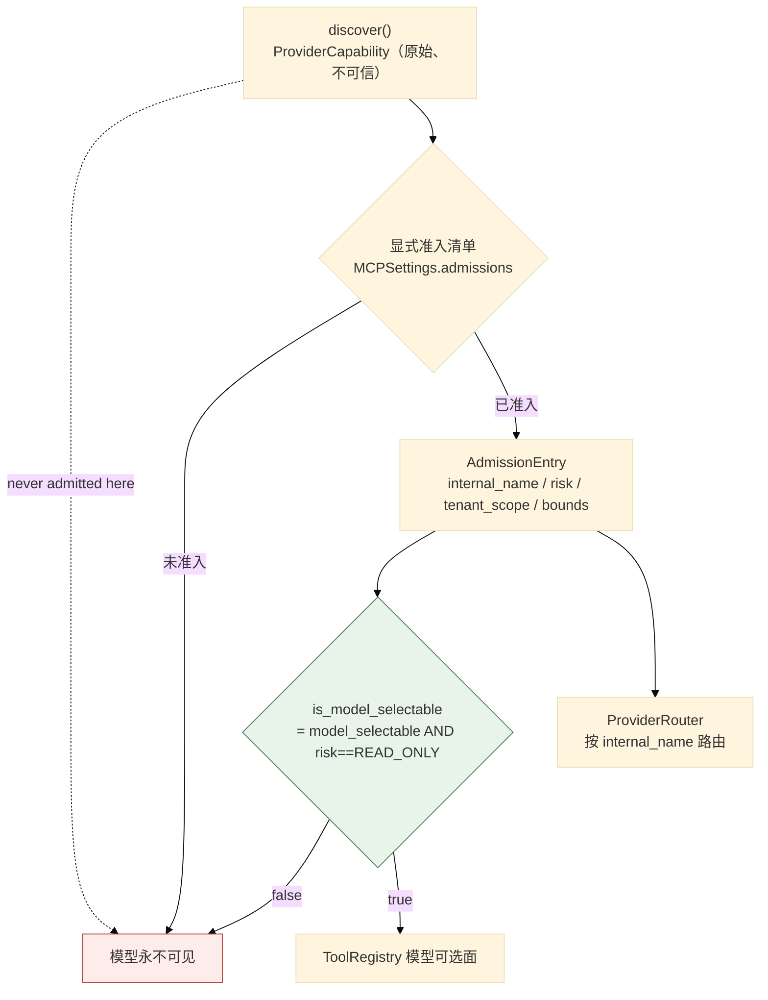
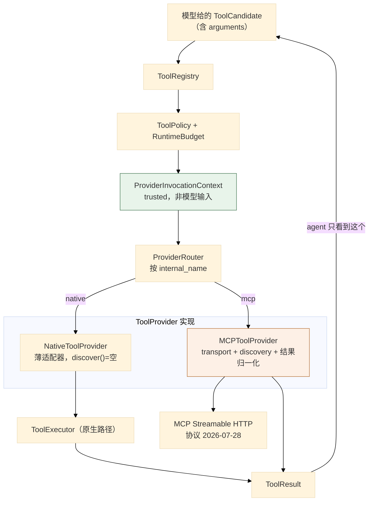
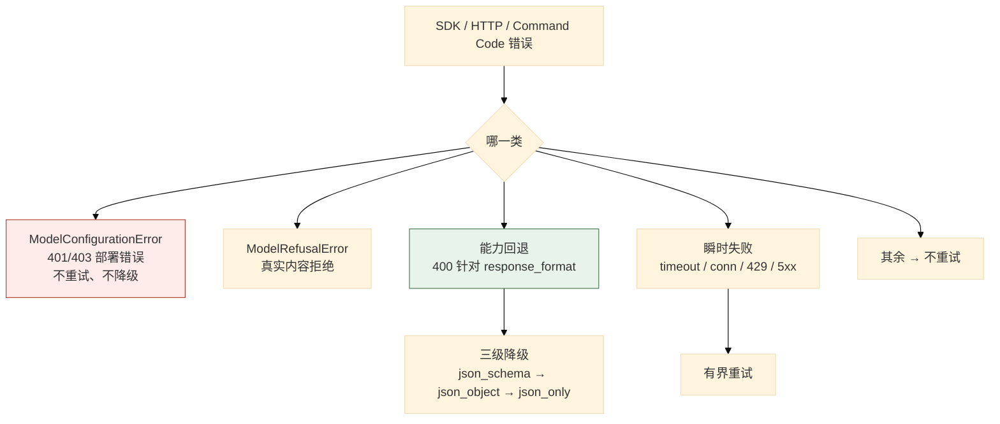
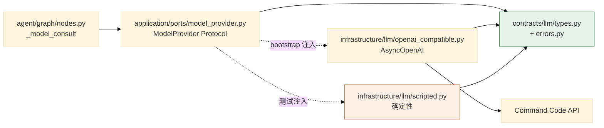

# 03 工具执行、策略与模型 Provider

> **本文性质：** 代码级取证补充，**不构成契约**。`docs/README.md` 规定「Architecture and persistence documents are authority」——冲突时以 `investigation-tool-contract.md` + `model-provider-contract.md` 为准。

> **文档类型**：子系统深挖（代码级核验，非设计提案）
> **分析对象**：`D:\Project\HISIEM-SOC-Copilot` 的 `agent/tools/`（8 文件）+ `contracts/`（**7 文件**）+ `infrastructure/llm/`（**10 文件**）+ `infrastructure/mcp/`（2 文件）
> **取证方式**：源码直读 + 在项目 venv 中实跑测试；每个关键论断附 `file:line` 锚点
> **结论以当前代码为准**（分支 `capability-mcp` @ `1e567be`）
> **文档集**：00–08 共 9 篇，见 [`README.md`](README.md)

---

## 为什么这三块合一篇

它们共同构成一条**从「模型说想做什么」到「系统决定做什么」的全部判断链**：

| 块 | 回答的问题 |
| --- | --- |
| `agent/tools/` | 模型可以选什么？参数合不合法？预算够不够？ |
| `contracts/` | 跨层传什么形状的数据？ |
| `infrastructure/llm/` + `mcp/` | 真去调外部时，协议怎么说话、失败怎么分类？ |

**主线是一句话**：**模型只提供「想查什么」，系统提供「我是谁、能查多少、从哪查」。**

---

## 1. 工具注册表与准入

### 1.1 关键论断

**论断 1：注册表的模型可选面**恰好等于** executor 实现集合——不多不少。**

```python
# agent/tools/registry.py:3-12（docstring）
V1 only registers READ_ONLY tools (investigation-tool-contract.md §3), and the
registry's model-selectable surface is EXACTLY the set the executor actually
implements. ``hisiem.get_alert_context`` is system-controlled (the graph hydrate
node calls the HISIEM get_alert directly) and is never offered to the model.

Spec-defined but NOT-yet-implemented tools (entity activity, threat-intel,
knowledge lookups) are cataloged separately (``FUTURE_CATALOG_TOOLS``) purely as
documentation — they are NOT registered, so the model can never select a tool with
no executor, schema, or policy backing it.
```

**三个集合的分工**：

| 集合 | 内容 | 模型可见？ |
| --- | --- | --- |
| `SYSTEM_CONTROLLED_TOOL` | `hisiem.get_alert_context` | **否** |
| `AGENT_SELECTABLE_TOOLS` | executor 真正实现的只读工具 | **是** |
| `FUTURE_CATALOG_TOOLS` | 规格定义但未实现 | **否**（仅作文档） |

**`FUTURE_CATALOG_TOOLS` 是「只作文档」的**（`registry.py:8-11`）——**这是一处很好的克制**：把「计划中」的工具写在代码里让读者知道，但**不注册**，所以**模型永远选不到没有执行器的工具**。

**论断 2：能力类型只有一个取值。**

```python
# registry.py:26
ToolCapability = Literal["READ_ONLY"]
```

**`Literal` 只有一个取值** ——**「只支持只读」是类型级的事实**，不是运行时判断。

**这与 MCP 侧的 `RiskClass`（三个取值）形成对照**（`providers.py:25`）：

```python
RiskClass = Literal["READ_ONLY", "HIGH_RISK", "WRITE"]
```

**原生工具只有一档，MCP 准入有三档** ——因为**原生工具由本仓库自己实现**（当然都是只读），而 **MCP 工具来自外部**（必须能表达风险分级）。

**论断 3：准入条目把「风险」与「模型可选」合成为一个属性。**

```python
# agent/tools/providers.py:87-106
@dataclass(frozen=True)
class AdmissionEntry:
    """Trusted internal contract for one explicitly admitted capability."""

    internal_name: str
    description: str
    server_id: str
    external_name: str
    input_schema: dict[str, Any] = field(default_factory=dict)
    result_schema: dict[str, Any] | None = None
    expected_external_schema_fingerprint: str = ""
    risk: RiskClass = "READ_ONLY"
    tenant_scope: TenantScope = "GLOBAL_READ_ONLY"
    model_selectable: bool = True
    result_bounds: ResultBounds = field(default_factory=ResultBounds)
    result_type: Literal["structured", "text"] = "structured"

    @property
    def is_model_selectable(self) -> bool:
        return self.model_selectable and self.risk == "READ_ONLY"
```

**`is_model_selectable` 是一个**合成属性**：`model_selectable` **且** `risk == "READ_ONLY"`。**

**这是本篇最关键的一处安全设计**：

> **即使有人在配置里写了 `model_selectable: true`，只要 `risk` 不是 `READ_ONLY`，模型仍然选不到它。**

**配置错误不会导致越权** ——因为**风险分级是一道独立的、不可绕过的闸门**。`config.py:203` 的默认 `risk = "READ_ONLY"` 只是默认值，**准入仍要求显式声明**。

**论断 4：准入条目携带**期望的外部 schema 指纹**——用于检测漂移。**

```python
expected_external_schema_fingerprint: str = ""
```

**与 `ProviderCapability.with_fingerprint()`（`providers.py:73-84`）配合**：

```python
# providers.py:73-84
def with_fingerprint(self) -> ProviderCapability:
    return ProviderCapability(
        external_name=self.external_name,
        input_schema=self.input_schema,
        output_schema=self.output_schema,
        provider=self.provider,
        description=self.description,
        annotations=self.annotations,
        schema_fingerprint=external_schema_fingerprint(
            self.external_name, self.input_schema, self.output_schema
        ),
    )
```

**指纹的输入是三元组**：`(external_name, input_schema, output_schema)`。**重发现时若指纹不等 → `SCHEMA_MISMATCH`**（`providers.py:21` 的失败码枚举里有它）。

**这防的是「外部工具悄悄改了契约」** ——一个真实的供应链风险。

**论断 5：`ProviderCapability` 被显式标注为**原始且不可信**。**

```python
# providers.py:61-63
@dataclass(frozen=True)
class ProviderCapability:
    """A raw, untrusted capability observed during provider discovery."""
```

**「discovered」与「admitted」是两个不同的状态** ——发现到的能力**不进注册表**，只有**显式准入**的才进。

**这一条在 `container.py:277-279` 有对应的实现注释**：

```python
# bootstrap/container.py:277-279
"""Build one MCP provider per trusted configured server.

Admissions are grouped by configured server before provider creation. A
discovered capability is never admitted here; only the explicit trusted
settings manifest enters the registry and router.
"""
```

**论断 6：路由只按**显式准入的名字**路由，绝不按用户输入。**

```python
# agent/tools/provider_router.py:16-27
class ProviderRouter:
    """Routes only explicitly admitted names; it never routes by user input."""

    def __init__(self, providers: Iterable[tuple[AdmissionEntry, ToolProvider]] = ()) -> None:
        self._routes: dict[str, tuple[AdmissionEntry, ToolProvider]] = {}
        for admission, provider in providers:
            self.add(admission, provider)

    def add(self, admission: AdmissionEntry, provider: ToolProvider) -> None:
        if admission.internal_name in self._routes:
            raise ValueError(f"duplicate provider route: {admission.internal_name}")
        self._routes[admission.internal_name] = (admission, provider)
```

**两处细节**：

| 细节 | 意义 |
| --- | --- |
| **键是 `admission.internal_name`** | 路由表按**内部名**建，不按外部名——**模型看到的名字是内部名**，外部名只存在于准入条目里 |
| **重复注册抛异常** | 构造期 fail-fast，同 04 篇的 SOAR handler 注册表 |

**论断 7：`providers.py` 是**内部边界**——外部协议对象、凭据、原始异常永不穿过它。**

```python
# agent/tools/providers.py:1-6
"""Provider-neutral contracts for the unified Tool Provider architecture.

The agent sees only the existing ``ToolCandidate``/``ToolResult`` contracts. The
provider contracts in this module are an internal boundary used by the executor;
external protocol objects, credentials, and raw provider exceptions never cross it.
"""
```

**「The agent sees only the existing `ToolCandidate`/`ToolResult` contracts」** ——所以**Stage C 引入的 Provider 架构对 agent 完全透明**：图节点仍然只看到原生的两个契约类型。**这是一次成功的「加架构不加表面积」的扩展。**

**论断 8：失败分类是 11 个稳定码的枚举。**

```python
# providers.py:18-25
ProviderFailureCode = Literal[
    "TIMEOUT", "UNAVAILABLE", "AUTH_FAILURE", "RATE_LIMITED",
    "REMOTE_TOOL_ERROR", "PROTOCOL_ERROR", "UNSUPPORTED_INTERACTION",
    "SCHEMA_MISMATCH", "INVALID_RESULT", "RESULT_TOO_LARGE", "PROVIDER_ERROR",
]
ProviderResultStatus = Literal["SUCCESS", "NO_DATA", "REJECTED", "UNAVAILABLE"]
TenantScope = Literal["GLOBAL_READ_ONLY", "TENANT_SCOPED"]
RiskClass = Literal["READ_ONLY", "HIGH_RISK", "WRITE"]
```

**11 个失败码 + 4 个结果状态** ——**每个都是稳定字符串，不是异常类名**。所以**失败可以被持久化、被断言、被跨进程传递**，而不必带着异常对象。

**论断 9：结果边界是**硬拒绝**，不是截断指令。**

```python
# providers.py:28-49
@dataclass(frozen=True)
class ResultBounds:
    """Hard rejection limits; no limit is a truncation instruction."""

    timeout_seconds: float = 30.0
    max_items: int = 100
    max_serialized_bytes: int = 256_000
    max_text_chars: int = 32_000
    max_depth: int = 8

    def validate(self, global_bounds: ResultBounds | None = None) -> None:
        if self.timeout_seconds <= 0 or self.max_items < 1 or self.max_serialized_bytes < 1:
            raise ValueError("result bounds must be positive")
        if self.max_text_chars < 1 or self.max_depth < 1:
            raise ValueError("result bounds must be positive")
        if global_bounds is not None:
            for field_name in (
                "timeout_seconds", "max_items", "max_serialized_bytes",
                "max_text_chars", "max_depth",
            ):
                if getattr(self, field_name) > getattr(global_bounds, field_name):
                    raise ValueError(f"per-capability {field_name} exceeds global bound")
```

**两处设计**：

| 设计 | 理由 |
| --- | --- |
| **"no limit is a truncation instruction"** | 超界**拒绝**（`RESULT_TOO_LARGE`），**不静默截断**——截断会让模型看到不完整数据却不知情 |
| **per-capability 不得超 global** | 全局上限是**天花板**，单项只能更严——**不能说「我这个工具特别，可以放宽」** |

**`validate` 在配置期就抛异常**（`providers.py:39-49`），所以越界配置**启动失败**而不是运行时才发现。

### 1.2 三层过滤



---

## 2. 五段链的深入

> 五段链的**流程**见 01 篇 §4。这里深入每一段的实现细节。

### 2.1 schema 段：`args.py`

**论断 1：参数类型是 4 个显式数据类。**

从 `executor.py:28-32` 的导入可见：

```python
# agent/tools/executor.py:28-32
from .args import (
    DetectionRuleArgs,
    ResolveTechniqueArgs,
    RetrieveGuidanceArgs,
    SearchEventsArgs,
```

**四个工具，四个 args 类型** ——**每个工具有自己的强制 schema**，不是通用的 `dict`。

### 2.2 policy 段

**论断 2：单次搜索窗口上限是 **24 小时**常量。**

```python
# agent/tools/policy.py:16-17
MAX_SINGLE_CALL_SPAN_HOURS = 24
SECONDS_PER_HOUR = 3600
```

```python
# policy.py:28-32
def validate_search_span(args: SearchEventsArgs) -> None:
    """A single agent search must not exceed the Copilot 24h bounded window."""
    try:
        start = datetime.fromisoformat(args.from_.replace("Z", "+00:00"))
        end = datetime.fromisoformat(args.to.replace("Z", "+00:00"))
```

**「Copilot 24h bounded window」是产品级约束** ——模型不能靠构造大时间窗拉全量日志。

**论断 3：策略异常有继承关系，把「预算也是一种策略」表达出来。**

```python
# policy.py:20-25
class ToolPolicyError(ValueError):
    """Raised when a candidate violates a deterministic tool policy."""

class ToolBudgetExhausted(ToolPolicyError):
    """Raised when the investigation budget has no room for another tool call."""
```

**注意两者的基类是**内置的 `ValueError`** ——所以即使调用方不 import 这两个类，也能用 `except ValueError` 兜住。

### 2.3 budget 段

**论断 4：预算是唯一权威，且**模型不能提高它、节点不能向上写**。**

```python
# agent/graph/budget.py:1-12（docstring 节选）
"""RuntimeBudget — the single deterministic authority over the run's counters.

Every node-level budget decision (may the model be consulted? may a tool run? may
another step happen? has the wall-clock deadline passed?) and every decrement goes
through this one value object. No node hand-decrements ``budget_remaining_*``
directly.

The counters and the wall-clock deadline are checkpointed in the graph state, so a
crash/restart/resume naturally continues from the CONSUMED budget — never reset to
full (load_investigation seeds a FRESH run from the aggregate's BudgetLimits and
preserves checkpointed values on resume). The model can never raise the budget and
no node may write it upward.
"""
```

**论断 5：保留槽不变量是预算设计里最精细的一处。**

```python
# agent/graph/budget.py:14-22
``max_llm_calls`` invariant: the total number of model consults across the run
(plan + decide + assess + verdict) is bounded by the runtime's original
``max_llm_calls`` for ANY ``max_llm_calls >= 1``. decide reserves the final two
LLM-call slots for the convergence path (assess + verdict); when fewer than two
remain it stops consulting. assess and verdict themselves only consult when a slot
remains (``can_call_llm``), otherwise the graph applies the deterministic
low-budget fallback (hypotheses UNRESOLVED; verdict INCONCLUSIVE "model-call
budget exhausted") — never an over-budget model call.
```

**「for ANY `max_llm_calls >= 1`」** ——**即使把预算配成 1，总量仍被界定**。没有「至少要几次」的豁免。

**降级结果是确定性的**：假设 `UNRESOLVED` + 结论 `INCONCLUSIVE("model-call budget exhausted")`。**这是「诚实的不确定」而非「失败」。**

### 2.4 executor 段

**论断 6：executor 是 492 行，是 `agent/tools/` 里最大的文件。**

实测 `wc -l`：`executor.py` **492** > `registry.py` 211 > `providers.py` 199 > `args.py` 138 > `native_provider.py` 79 > `provider_router.py` 59 > `policy.py` 58。

**论断 7：executor 的五段链顺序里，「作用域绑定」在「策略/预算」之前。**

```python
# agent/tools/executor.py:1-8
"""ToolExecutor — the deterministic executor over allowlisted read tools.

Chain (investigation-tool-contract.md §2): candidate → schema validation →
authenticated scope binding → policy/budget → provider adapter → typed ToolResult.

The executor NEVER reads tenant/actor/authorization from model arguments; those
come from the ToolExecutionContext the graph builds from trusted state.
"""
```

**顺序有意义**：**先绑定作用域，再判策略** ——因为**策略判定本身就可能依赖租户**（`tenant_scope: GLOBAL_READ_ONLY` vs `TENANT_SCOPED`）。

**论断 8：执行结果是一个带 `ToolExecution` 的复合对象。**

```python
# native_provider.py:8,37
from .executor import ToolExecution, ToolExecutor
...
execution: ToolExecution = await self._executor.execute(
    candidate=candidate,
    tenant_id=context.tenant_id,
    source_alert_ref=dict(context.source_alert_ref),
    tool_call_id=context.tool_call_id,
    investigation_id=context.investigation_id,
    budget_remaining=context.budget_remaining,
    budget_already_reserved=context.budget_already_reserved,
)
```

**`execute` 的 7 个参数里，**没有一个来自模型参数**** ——它们全部来自 `ProviderInvocationContext`（`providers.py:109-120`）：

```python
# providers.py:109-120
@dataclass(frozen=True)
class ProviderInvocationContext:
    """Trusted runtime context injected by the executor, never model input."""

    tenant_id: str
    investigation_id: str | None
    tool_call_id: str
    source_alert_ref: Mapping[str, str]
    # A graph-scheduled call has already reserved one budget slot. ``None`` is
    # used by direct callers that do not participate in graph budgeting.
    budget_remaining: int | None = None
    budget_already_reserved: bool = False
```

**`budget_already_reserved` 这一对字段值得注意**：它表达「**图已经为这次调用预留了一个槽**」——防止**重复扣减**。**`budget_remaining=None` 表示「直接调用方，不参与图预算」**（测试与手工调用用）。

---

## 3. Provider 架构（Stage C）

### 3.1 关键论断

**论断 1：原生工具经一个**薄适配器**接进 Provider 架构——不重复行为。**

```python
# agent/tools/native_provider.py:1,19-25
"""Thin NativeToolProvider adapter around the sealed native executor."""
...
class NativeToolProvider:
    """Adapt the existing native ToolExecutor without duplicating its behavior."""

    identity = ProviderIdentity(provider_type="native", server_category="internal")

    def __init__(self, executor: ToolExecutor) -> None:
        self._executor = executor
```

**`discover()` 返回空列表**（`native_provider.py:27-28`）：

```python
async def discover(self) -> list[ProviderCapability]:
    return []
```

**这是正确的**：原生工具的能力**不是「发现」来的**，而是**编译期注册的**。`discover` 是给**外部** provider（MCP）用的接口。

**论断 2：`ProviderIdentity` 的 `server_id` **只信任配置**。**

```python
# providers.py:52-58
@dataclass(frozen=True)
class ProviderIdentity:
    """Safe provider metadata. ``server_id`` is trusted only from config."""

    provider_type: Literal["native", "mcp"]
    server_id: str | None = None
    server_category: str = "internal"
```

**「trusted only from config」** —— `server_id` **不能来自外部发现结果**，只能来自 `MCPServerSettings.server_id`（配置）。

### 3.2 MCP 侧：`infrastructure/mcp/provider.py`（796 行）

**论断 3：MCP 的职责边界写在 docstring 里，是一句「只做四件事」。**

```python
# infrastructure/mcp/provider.py:1-6
"""Read-only MCP ToolProvider backed by the official high-level client.

MCP is an external capability adapter.  This module owns transport, discovery,
and safe provider-result normalization only; registry admission, policy, budget,
audit, and Evidence remain in the existing application path.
"""
```

| MCP 自己做 | 仍在原有路径 |
| --- | --- |
| **transport** | registry admission |
| **discovery** | policy |
| **安全的 provider 结果归一化** | budget |
| | audit |
| | Evidence |

**这是「加一个外部适配器，不改任何既有语义」的准确表述** ——**MCP 不引入第二套注册表、策略、预算、证据或真相系统**。

**论断 4：协议版本是硬编码常量。**

```python
# infrastructure/mcp/provider.py:40
PRODUCTION_PROTOCOL = "2026-07-28"
```

**与 `config.py:158,216` 的 `Literal["2026-07-28"]` 双重固定**：

```python
# config.py:224-225
if self.protocol_version != "2026-07-28":
    raise ValueError("MCP protocol_version must be 2026-07-28")
```

**三处独立固定同一版本**（配置类型、配置校验、provider 常量）——**协议版本降级在结构上不可能**。

**论断 5：有一份**运行时保留参数**清单，模型不得使用。**

```python
# infrastructure/mcp/provider.py:42-44
# These names are runtime-owned.  A model may not use them to change routing,
# tenant scope, or credential selection.
_PROTECTED_ARGUMENTS = frozenset(
    {
        "tenant_id", "server_id", "endpoint", "scheme", "host", "port",
        "transport", "credential", "token", "password", "passphrase",
        "secret", "api_key", "access_token", "authorization",
        ...
```

**清单的四类**：

| 类 | 参数名 |
| --- | --- |
| **路由 / 端点** | `server_id` / `endpoint` / `scheme` / `host` / `port` / `transport` |
| **租户** | `tenant_id` |
| **凭据** | `credential` / `token` / `password` / `passphrase` / `secret` / `api_key` / `access_token` / `authorization` / `bearer` |

**注释说得很准确**：*「A model may not use them to change **routing, tenant scope, or credential selection**」*。

**这是 01 篇 §4.1 论断 1（「executor 永不从模型参数读 tenant/actor/授权」）在 MCP 侧的具体实现** ——**不是靠「我们不去读它」，而是靠「这些名字被显式列为保留」**。

**论断 6：`httpx2` 来自 `mcp` 的传递依赖，不是本项目的直接依赖。**

```python
# infrastructure/mcp/provider.py:18
import httpx2
```

实测：

```bash
$ grep -n "httpx" pyproject.toml
22:    "httpx>=0.27",
31:    "opentelemetry-instrumentation-httpx>=0.59b0,<1"

$ grep -iE "^Requires-Dist" .venv/Lib/site-packages/mcp-2.2.0.dist-info/METADATA
Requires-Dist: httpx2>=2.5.0
...
```

**所以 `httpx2` 是 `mcp>=2.2,<3` 的传递依赖**（`httpx2` 是 pydantic 维护的「The next generation HTTP client」，`github.com/pydantic/httpx2`）。

> **这是一处值得记录的依赖形态**：**本项目在 `pyproject.toml` 里没有声明 `httpx2`，却直接 `import httpx2`**。它靠**传递依赖**满足——**如果 `mcp` 将来换了 HTTP 客户端或改了包名，这个模块会直接 ImportError**。
>
> **建议**（本文档集不修改代码，仅记录）：把 `httpx2` 提升为显式直接依赖。**这是「间接依赖被当作直接依赖使用」的典型情形**，不是 bug，但是一个真实的可维护性风险。

**论断 7：MCP 的验证是**真实可跑的**——实跑 24 个测试通过。**

```bash
$ ./.venv/Scripts/python.exe -m pytest \
    tests/unit/agent/test_mcp_provider.py \
    tests/integration/test_mcp_streamable_http.py -q
24 passed in 1.21s
```

**这 24 个测试覆盖**：单元契约（`test_mcp_provider.py`）+ **真实本地 Streamable HTTP 集成**（`test_mcp_streamable_http.py`，配 `tests/support/mcp_scenario_fixture.py` 的本地服务器）。

**这一条是本文档集里少数**实际执行过验证**的论断**——其余论断均为静态取证。**如实标注这一点。**

### 3.3 Provider 全景



---

## 4. 模型 Provider

### 4.1 关键论断

**论断 1：适配器是**唯一**对 OpenAI SDK 说话的地方。**

```python
# infrastructure/llm/openai_compatible.py:1-8
"""OpenAI-compatible ModelProvider for the Command Code API.

Layering (docs/model-provider-contract.md §2):
    Graph/Application → ModelProvider Protocol
    OpenAICompatibleModelProvider (this adapter) → AsyncOpenAI → Command Code API

The adapter is the ONLY place that speaks to the OpenAI SDK (agent/application never
import it). Responsibilities:
```

**这与 00 篇 §2.1 论断 2 的 `agent` 禁导入表一致**（`agent` 层没有禁 `openai`，但**分层意图**是 adapter 独占 SDK）。

**论断 2：8 项职责逐条列出，每一条都是可核验的约束。**

| # | 职责 | 关键点 |
| --- | --- | --- |
| 1 | 建 `AsyncOpenAI` 客户端 | **SDK 自带的 retry 被禁用**，总重试次数在这里控制 |
| 2 | 设 ZDR 头 | `x-cmd-zdr: 1`，当 `llm.zdr` 启用时 |
| 3 | **结构化输出三级降级** | `json_schema` → `json_object` → JSON-only prompt |
| 4 | 收集**真实**有界用量 | request id + tokens，**缺失即 `None`，绝不猜** |
| 5 | **只对瞬时失败重试** | timeout / connection / 429 / retryable 5xx |
| 6 | 错误 taxonomy 翻译 | 见论断 4 |
| 7 | **不存 API key / 完整 prompt / 原始响应 / CoT** | — |
| 8 | SDK import 延迟到构造期 | 仅 import 本模块**不需要** SDK |

**第 1 条的「SDK 自带的 retry 被禁用」很重要** ——否则**两层重试会相乘**（SDK 重试 3 次 × 适配器重试 2 次 = 最多 9 次调用），且总量不可控。

**第 4 条的「missing → None, never guessed」是一条诚实性约束** ——**usage 缺失时记录 `None`，不估算**。这与 SIEM 侧 `AlertLifecycleEventMapper` 的确定性 ID 是同一种取向：**宁可标缺失，不可编造**。

**第 8 条的「import 延迟到构造期」** ——**仅 import 这个模块不会引入 SDK**。**这让「未安装 SDK 的环境仍能导入模块」**，也解释了 00 篇 §4.1 论断 4 为什么 `llm.provider` 默认是 `scripted`：**默认路径不碰 SDK**。

**论断 3：结构化输出的三级降级，且**决策按进程缓存**。**

```python
# openai_compatible.py:13-18
- structured output: in ``auto`` mode probe ``response_format=json_schema`` first and
  downgrade to ``json_object`` then JSON-only prompt when the provider rejects the
  format (the decision is cached per process, so only the first call probes). The
  json_only mode REBUILDS the messages via the operation's prompt builder with
  ``json_only=True`` so a clear ONLY-JSON instruction is present (never the
  json_only=False messages);
```

**三级降级链**：`json_schema` → `json_object` → JSON-only prompt。

**两个细节**：

| 细节 | 理由 |
| --- | --- |
| **决策按进程缓存** | 只有第一次调用探测——避免每次调用都付一次失败的往返 |
| **json_only 模式**重建** messages** | 必须让 prompt 里真的含「只输出 JSON」的指令，**不能用 `json_only=False` 的消息** |

**第二条是一个容易做错的点**：降级到 prompt 级约束时，**如果不重建 prompt，模型根本不知道要输出 JSON**。

**论断 4：401/403 被定为**部署错误**，重试无意义。**

```python
# openai_compatible.py:23-27
- translate every SDK/HTTP/Command Code error into the provider-neutral taxonomy
  (contracts/llm/errors.py). 401/403 → ModelConfigurationError (a deployment bug:
  never retried, never silently downgraded); genuine content refusal →
  ModelRefusalError; a 400 against a requested response_format is a capability
  fallback, not a config error;
```

**三类错误的分类**：

| 输入 | 归类 | 处置 |
| --- | --- | --- |
| **401 / 403** | `ModelConfigurationError` | **不重试、不静默降级**——这是部署错误 |
| **真实内容拒绝** | `ModelRefusalError` | 是一种业务结果 |
| **请求的 `response_format` 被打 400** | **能力回退，不是配置错误** | 走三级降级 |

**第三条最微妙**：同样是 400，「参数写错了」与「这个 provider 不支持 `json_schema`」是**两件不同的事**——后者应该降级重试，前者不应该。**区分它们的依据是「这个 400 是不是针对我们请求的 `response_format` 回来的」。**

**论断 5：`scripted.py` 是默认实现，也是确定性测试的基础。**

```python
# openai_compatible.py:31-32
The openai SDK is a project dependency; the import is deferred to construction time
so merely importing this module never requires the SDK. ScriptedModelProvider remains
the default for tests.
```

```python
# config.py:95
provider: Literal["scripted", "openai_compatible"] = "scripted"
```

**`scripted.py`（159 行）提供确定性的模型响应** ——**它是「图能被确定性测试」的前提**：同一个输入永远得到同一个输出，**所以图的端到端行为可断言**。

**这也解释了评估体系为什么能工作**（08 篇）：**评估需要可复现的输出，脚本化 provider 正是为此存在。**

### 4.2 错误 taxonomy



---

## 5. Prompt 与 LLM 契约

### 5.1 关键论断

**论断 1：Prompt 被按「操作」拆成 5 个 builder。**

```
infrastructure/llm/prompts/
  common.py   70 行  共用片段
  plan.py     38 行  计划
  decide.py  156 行  下一步决策（最长）
  assess.py   84 行  证据评估
  verdict.py  59 行  结论
```

**五个 builder 对应四种模型操作** ——`plan` / `decide_next` / `assess` / `verdict`。

**`decide.py` 最长（156 行）** ——因为它是唯一需要把**工具目录 + 预算状态 + 前次工具结果**都放进 prompt 的操作。

**这解释了 `budget.py:14-22` 里为什么把 `verdict` 与 `assess` 并列为「收敛路径」**：它们各有一个 prompt builder，是两次独立的模型调用。

**论断 2：`json_only=True` 会让 builder 重建消息（见 §4.1 论断 3）。**

**所以 prompt builder 必须接受一个 `json_only` 开关** ——这是三级降级能工作的前提。

**论断 3：LLM 契约有独立的错误类型与类型定义。**

```
contracts/llm/errors.py  102 行
contracts/llm/types.py   107 行
```

**`contracts/` 是叶包**（00 篇 §1.1）——**所以 `ModelProvider` 协议与错误 taxonomy 不依赖任何生产层**，`agent` 与 `infrastructure` 都能安全引用。

**`application/ports/model_provider.py:17,23` 导入 `contracts.llm`** ——所以**端口层也用同一套契约**。

### 5.2 模型调用的契约边界



---

## 6. 关键不变式（代码强制）

| # | 不变式 | 强制点 | 违反后果 |
| --- | --- | --- | --- |
| 1 | **模型可选面 = executor 实现集合** | `registry.py:3-4,31-32` | 模型选到无执行器的工具 |
| 2 | **系统控制工具永不提供给模型** | `registry.py:28`；`registry.py:5-6` | 模型跳过取上下文 |
| 3 | **未来工具只作文档，不注册** | `registry.py:8-11` | 模型选到无实现的工具 |
| 4 | **非 `READ_ONLY` 的工具模型永远选不到** | `providers.py:104-106` `is_model_selectable` | 配置写错导致越权 |
| 5 | **准入需显式声明（含风险分级）** | `providers.py:88-102`；`config.py:193-207` | 发现即准入 |
| 6 | **发现到的能力永不自动准入** | `container.py:277-279` | 外部改契约自动生效 |
| 7 | **schema 漂移可被检测** | `providers.py:73-84,97`；失败码 `SCHEMA_MISMATCH` | 外部悄悄改契约 |
| 8 | **路由只按显式准入的内部名** | `provider_router.py:17,24-27` | 按用户输入路由 |
| 9 | **route 重复注册 fail-fast** | `provider_router.py:25-26` | 静默覆盖 |
| 10 | **provider 契约是内部边界** | `providers.py:3-5` | 外部协议对象/凭据/原始异常外泄 |
| 11 | **`server_id` 只信任配置** | `providers.py:54` | 外部伪造服务身份 |
| 12 | **结果超界是硬拒绝，不截断** | `providers.py:30` | 模型看到不完整数据却不知情 |
| 13 | **per-capability 边界不得超全局** | `providers.py:43-49` | 单项放宽全局上限 |
| 14 | **executor 不从模型参数读 tenant/actor/授权** | `executor.py:6-7` | 模型自授权 |
| 15 | **调用上下文全部来自可信状态** | `providers.py:111`；`native_provider.py:37-45` | 模型注入作用域 |
| 16 | **运行时保留参数模型不得使用** | `mcp/provider.py:42-60` `_PROTECTED_ARGUMENTS` | 模型改路由/租户/凭据 |
| 17 | **MCP 协议版本三处独立固定** | `mcp/provider.py:40`；`config.py:158,216,224-225` | 协议静默降级 |
| 18 | **单次搜索窗口 ≤ 24h** | `policy.py:16,28-32` | 拉全量日志 |
| 19 | **预算递减只经 `RuntimeBudget`** | `budget.py:4-6` | 某节点漏减 |
| 20 | **预算计数进检查点，不重置为满额** | `budget.py:8-12` | 反复崩溃 = 无限预算 |
| 21 | **模型不能提高预算，节点不能向上写** | `budget.py:11-12` | 模型给自己加预算 |
| 22 | **`decide` 为收敛预留 2 个 LLM 槽** | `budget.py:14-22` | 结论出不来 |
| 23 | **预算耗尽走确定性降级，不超预算调用** | `budget.py:18-21` | 超预算调用模型 |
| 24 | **SDK 自带重试被禁用** | `openai_compatible.py:10-11` | 两层重试相乘 |
| 25 | **usage 缺失记 `None`，绝不猜** | `openai_compatible.py:19-20` | 伪造用量数据 |
| 26 | **只对瞬时失败重试** | `openai_compatible.py:21-22` | 对拒绝/配置错误重试 |
| 27 | **401/403 是部署错误，不重试不降级** | `openai_compatible.py:24-25` | 配置错了却反复重试 |
| 28 | **不存 API key / prompt / 原始响应 / CoT** | `openai_compatible.py:28` | 敏感数据落盘 |
| 29 | **仅 import 模块不需要 SDK** | `openai_compatible.py:30-32` | 无 SDK 环境无法导入 |

---

## 7. 与其他子系统的边界

| 边界 | 方向 | 契约 | 锚点 |
| --- | --- | --- | --- |
| `agent/graph` → `agent/tools` | 出 | 五段链 | `nodes.py:531` `execute_and_ingest` |
| `agent/tools` → `contracts/tools` | 出 | `ToolCandidate` / `ToolResult` | `contracts/tools/types.py` |
| `agent/tools` → `agent/knowledge` | 出 | 知识检索目录适配 | `executor.py:24` |
| `agent/graph` → `contracts/llm` | 出 | 模型操作请求/响应 | `nodes.py:60-71` |
| `application/ports` → `contracts/llm` | 出 | `ModelProvider` 协议 | `application/ports/model_provider.py:17,23` |
| `infrastructure/llm` → `contracts/llm` | 出 | 错误 taxonomy | `openai_compatible.py:24` |
| `infrastructure/mcp` → `agent/tools/providers` | **入** | provider 契约 | `mcp/provider.py:22-36` |
| `bootstrap` → 全部 | 入 | 装配 | `container.py:275-300` |

> **特别注意第 7 行**：`infrastructure/mcp` 导入 **`agent/tools/providers`** —— 这是**唯一一处 `infrastructure` 依赖 `agent` 的地方**。
>
> **它不违反 AST 边界吗？** 不违反 ——`test_import_boundaries.py:45` 只禁止 `agent` 导入 `infrastructure`（单向）。**`infrastructure` 依赖 `agent` 的契约是允许的**，而且这里依赖的是 **provider 契约模块**（无外部协议细节），不是图的实现。

**`agent/tools/providers.py` 因此扮演了一个特殊的角色**：**它虽然位于 `agent` 包内，但事实上是跨层契约**（被 `agent/evidence/normalizer.py:26`、`infrastructure/mcp/provider.py:22`、`evaluation_harness` 多处导入）。

**`providers.py` 放在 `agent/tools/` 而非 `contracts/`，是一处**包放置取舍**，不是「会产生循环」的技术障碍**：

- `contracts/tools/types.py` 是**叶模块**，只 import `dataclasses` + `typing`（`:14-15`）；
- `contracts/` 全包**零处** import `agent`；
- `tests/architecture/test_import_boundaries.py` 的 `BOUNDARIES` 字典里**根本没有 `contracts` 条目**——`contracts` 内部**没有 AST 约束**。

**这是一处可以商榷的包放置**（见 §8 待核实）。

---

## 待核实

> **本节 12 条待核实项均已解答**：`_FAILURE_CODES` 与 `ProviderFailureCode` 逐值一致；`external_schema_fingerprint` 用 `sort_keys` 紧凑 JSON 取 SHA-256；`max_depth` 与 `max_items` 同点执行；`InputRequiredRoundsExceededError` 只在 `invoke()` 捕获；`executor.execute` 有 8 个分支；`scripted` 是**有状态调用游标**；`schemas.py` 是严格 wire 边界；`contracts/llm/errors.py` 是 7 类单继承链。

---

## 修订记录

| 版本 | 日期 | 变更 | 作者 |
| --- | --- | --- | --- |
| 1.0 | 2026-09-22 | 首版。基于 `capability-mcp` @ `1e567be` 取证，覆盖 `agent/tools` 8 + `contracts` 5 + `infrastructure/llm` 11 + `infrastructure/mcp` 2 文件。**MCP 测试在项目 venv 中实跑 24 passed（本篇是少数经过执行的论断）。** | code-level-architecture-docs skill |
