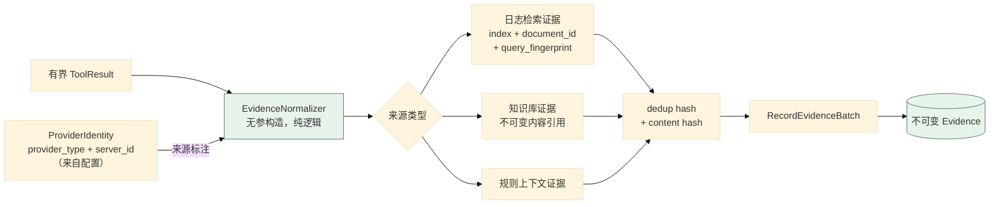
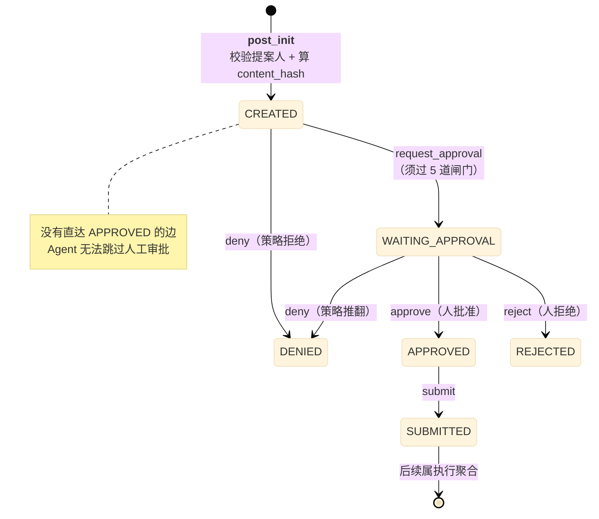
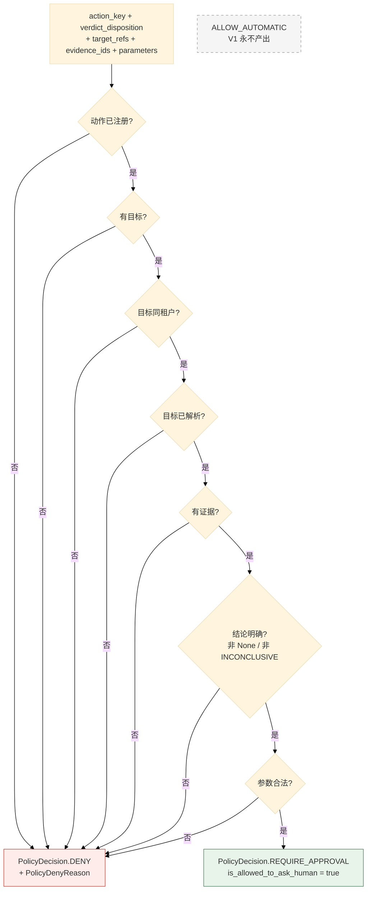
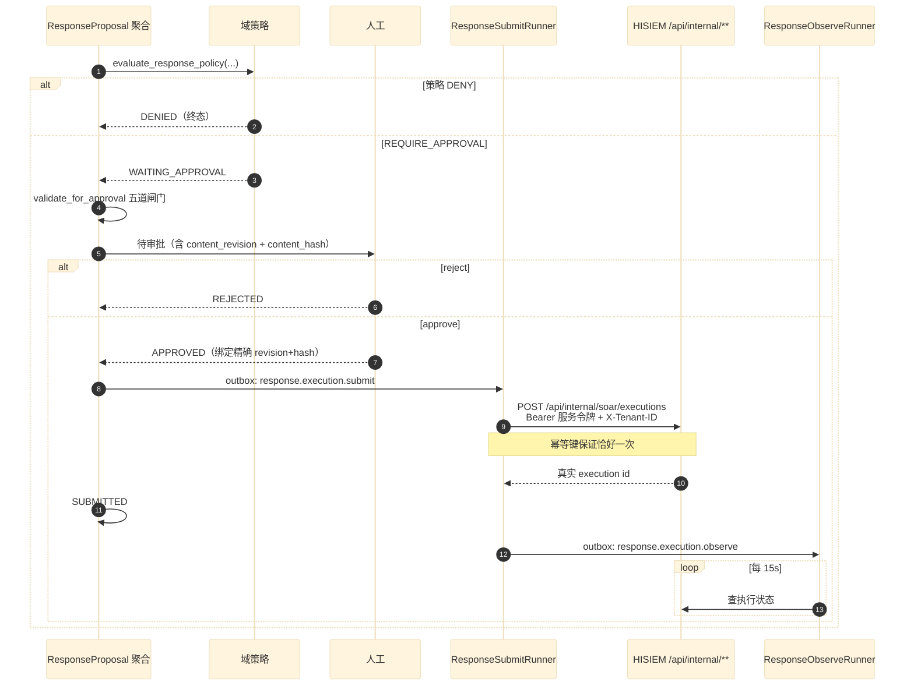

# 04 证据归一化与响应闭环

> **本文性质：** 代码级取证补充，**不构成契约**。`docs/README.md` 规定「Architecture and persistence documents are authority」——冲突时以 `investigation-tool-contract.md` 为准。

> **文档类型**：子系统深挖（代码级核验，非设计提案）
> **分析对象**：`D:\Project\HISIEM-SOC-Copilot` 的 `agent/evidence/`（2 文件）+ `domain/response/`（9 文件，1023 行）+ `infrastructure/soar/`（2 文件）
> **取证方式**：源码直读；每个关键论断附 `file:line` 锚点
> **结论以当前代码为准**（分支 `capability-mcp` @ `1e567be`）
> **文档集**：00–08 共 9 篇，见 [`README.md`](README.md)

---

## 为什么这三块合一篇

它们共同构成**「调查得出的结论 → 变成一个有记录、可授权、可执行的响应意图」**这条链：

| 块 | 角色 |
| --- | --- |
| `agent/evidence/` | **把工具结果变成不可变证据**——后续一切判断的事实基础 |
| `domain/response/` | **把证据 + 结论变成受策略约束的响应提案**——本项目的核心不变式所在 |
| `infrastructure/soar/` | **把提案变成对 HISIEM 的真实调用** |

**主线是本项目的核心不变式**：

> **Agent 建议，不能授权。**

这条不变式在前两块里是**结构性**的（策略只能产出 `DENY` / `REQUIRE_APPROVAL`），在第三块里是**协议性**的（HISIEM 侧另有独立授权）。

---

## 1. 证据归一化

### 1.1 关键论断

**论断 1：四段链与「永不接受模型提供的来源」写在同一段 docstring 里。**

```python
# agent/evidence/normalizer.py:1-14
"""Evidence Normalizer — ToolResult data → Evidence observation candidates.

Chain (investigation-tool-contract.md §24): Typed ToolResult → Evidence Normalizer
→ Deduplication → RecordEvidenceBatch → Immutable Evidence.

The normalizer selects bounded observations from a tool result, attaches
provenance/raw-reference/collection metadata and computes the dedup/content
hashes. It NEVER accepts model-supplied provenance, source ids, or authority.
The graph calls RecordEvidenceBatch (application command) to persist.

Event provenance uses the log-search raw reference (investigation-tool-contract.md
§17): {index, document_id, query_fingerprint} — never a fabricated
ExternalResourceRef (no stable event address API in HISIEM).
"""
```

**四段**：类型化 `ToolResult` → 归一化 → 去重 → `RecordEvidenceBatch` → **不可变 Evidence**。

**两条禁令**：

| 禁令 | 含义 |
| --- | --- |
| **永不接受模型提供的来源 / 来源 id / 权威级别** | 模型不能说「这条证据来自 X」 |
| **永不编造 `ExternalResourceRef`** | HISIEM 没有稳定单事件地址 API，所以**用 `{index, document_id, query_fingerprint}` 三件套** |

**论断 2：`query_fingerprint` 是「这次查询」的确定性身份。**

**三个字段合起来的语义**：

| 字段 | 回答 |
| --- | --- |
| `index` | 哪个索引 |
| `document_id` | 哪条文档 |
| `query_fingerprint` | **通过哪次查询找到的** |

**第三个字段最有意思**：**同一条文档可能被不同查询命中**，而「通过查询 Q 找到文档 D」才是完整的来源。**这让证据可复现**——重放同一个查询应当找到同一条文档。

**论断 3：两个哈希不是 normalizer 算的。**

```python
# normalizer.py:6-7 提及
computes the dedup/content hashes
```

| 哈希 | 定义位置 | 回答 |
| --- | --- | --- |
| **dedup key** | `domain/investigation/content.py:62-68` | 「这条证据是否已存在」 |
| **content hash** | `domain/investigation/content.py`（`compute_content_hash`） | 「内容是否被改动」 |

**dedup 决定幂等（01 篇 §8 不变式 12 的检查点安全依赖它），content 决定不可变性。**

**`EvidenceNormalizer` 本身不计算**这两个哈希。它只算 `query_fingerprint`（`normalizer.py:291-297`）。**两个哈希的定义在 `domain/investigation/content.py`，调用点在 `application/handlers/workflow.py`**（dedup 在 `:266-273`，content 在 `:706`）。

**normalizer 的 docstring 说它「computes the dedup/content hashes」，与实现不符**——这是一处**代码注释与实现之间的落差**。

**dedup key 的输入是四元组** `{provider, operation, raw_reference, resource_address}`（`content.py:62-68`），经 `sort_keys=True, separators=(",",":")` 的规范 JSON 取 SHA-256；**采集时间刻意不入 key**（否则同一观测每次采集都会产生新证据）。知识检索有特例：`knowledge` + `retrieve_security_guidance` 时用 `raw_reference["citation_identity"]` 替换整个 raw_reference，并剔除 `retrieval_mode` / `retrieval_profile_id` / `retrieved_at`（`content.py:45-61`）。

**论断 4：`normalizer.py` 只有 2 个文件（`__init__.py` + `normalizer.py`），且实现是纯函数式的。**

**证据**：`EvidenceNormalizer` 的构造器无参（`normalizer.py:32-33`）：

```python
# normalizer.py:29-33
class EvidenceNormalizer:
    """Normalizes typed ToolResults into EvidenceObservation candidates."""

    def __init__(self) -> None:
```

**构造器无参**（`normalizer.py:32`）——所以归一化**可以被纯单元测试**，不需要任何 fixture。**这是「把易错逻辑做成纯函数」的做法**（对照 06 篇的前端 `soarGraph.js`）。

> **一处小瑕疵**：归一化器**不是完全无状态**——`self._now`（`normalizer.py:33`）被赋值后**从未被读取**，是一个死属性。

**论断 5：证据来源类型是显式枚举。**

```python
# normalizer.py:25
from ...domain.investigation.enums import EvidenceSourceType
```

**`EvidenceSourceType`** 区分证据从哪来（日志检索 / 知识库 / 规则上下文 / …）——所以**「这条证据是外部事实还是内部文档」在类型上可辨**。

**论断 6：`ProviderIdentity` 参与了归一化。**

```python
# normalizer.py:26
from ..tools.providers import ProviderIdentity
```

**外部 provider 的身份被打进证据的来源**（`providers.py:54` 的「`server_id` is trusted only from config」在此生效）——所以**一条来自 MCP 工具的证据可以追溯回「哪个受信服务」**。

**这是一处 Stage C 与证据层的连接点**：MCP 引入后，**证据的来源多了「provider 类型 + 服务 id」两个维度**，而**它们都来自配置、不是发现结果**。

### 1.2 证据链



---

## 2. 响应提案聚合根

### 2.1 关键论断

**论断 1：聚合根的定位是「把审批绑定到**精确的内容修订 + 哈希**」。**

```python
# domain/response/aggregate.py:1-6
"""ResponseProposal Aggregate Root.

Encodes the intent to perform a deterministic, HISIEM-resolved security action,
subject to policy validation and human approval. The aggregate binds approval to
an exact content revision + hash, per domain-model.md §21/§24.
"""
```

**「binds approval to an exact content revision + hash」是本篇的核心机制** ——**审批的不是「这个提案」，而是「这个提案的这一版内容」**。

**论断 2：状态迁移表只到 `SUBMITTED` 为止——**之后不属于提案聚合**。**

```python
# aggregate.py:27-40
_TRANSITIONS: dict[ResponseProposalStatus, dict[str, ResponseProposalStatus]] = {
    ResponseProposalStatus.CREATED: {
        "deny": ResponseProposalStatus.DENIED,
        "request_approval": ResponseProposalStatus.WAITING_APPROVAL,
    },
    ResponseProposalStatus.WAITING_APPROVAL: {
        "approve": ResponseProposalStatus.APPROVED,
        "reject": ResponseProposalStatus.REJECTED,
        "deny": ResponseProposalStatus.DENIED,
    },
    ResponseProposalStatus.APPROVED: {
        "submit": ResponseProposalStatus.SUBMITTED,
    },
}
```

| 从 | 动作 | 到 |
| --- | --- | --- |
| `CREATED` | `deny` | `DENIED` |
| `CREATED` | `request_approval` | `WAITING_APPROVAL` |
| `WAITING_APPROVAL` | **`approve`** | `APPROVED` |
| `WAITING_APPROVAL` | **`reject`** | `REJECTED` |
| `WAITING_APPROVAL` | `deny` | `DENIED` |
| `APPROVED` | `submit` | `SUBMITTED` |

**三处值得注意**：

| 点 | 含义 |
| --- | --- |
| **`SUBMITTED` 没有出边** | 提交之后的状态（`RUNNING` / 终态）属于**执行聚合**，不是提案 |
| **`WAITING_APPROVAL → DENY` 仍可达** | 待审批期间**策略仍可推翻**（例如目标解析失效） |
| **`REJECTED` 与 `DENIED` 是两个不同的状态** | **`REJECTED` = 人拒绝**；**`DENIED` = 策略拒绝**。**这是「人」与「系统」的区分** |

**`REJECTED` vs `DENIED` 的区分很重要**：它让「为什么没执行」这个问题有准确答案——**是人否决了，还是策略不允许**。

**论断 3：`CREATED → WAITING_APPROVAL` **没有直达 `APPROVED` 的边**。**

**结构上**：从 `CREATED` 只能 `deny` 或 `request_approval`。**没有任何路径能让提案跳过 `WAITING_APPROVAL` 直接到 `APPROVED`。**

**这是「Agent 不能授权」在状态机层面的强制** ——不是靠「我们不去调 approve」，而是**没有那条边**。

**论断 4：`MISSING_PROPOSER` 是一个**哨兵值**，让缺失变成响亮的构造错误。**

```python
# aggregate.py:22-25
#: Sentinel that makes "no proposer recorded" a loud construction error instead of
#: a silently blank provenance column. Every legitimate caller must supply the
#: server-derived subject; only a missing argument reaches this value.
MISSING_PROPOSER = ""
```

```python
# aggregate.py:74-78
def __post_init__(self) -> None:
    if not self.created_by_subject.strip():
        raise DomainError(
            "a response proposal must record the authenticated proposer"
        )
    self.content_hash = self._compute_content_hash()
```

**`__post_init__` 在构造时校验并计算哈希** ——所以**「没有提案人」的提案根本构造不出来**。

**论断 5：提案人来源是**服务端派生**的，且**刻意排除在内容哈希之外**。**

```python
# aggregate.py:53-59
#: Immutable proposer provenance, ALWAYS server-derived from the authenticated
#: trusted context — never a body field, and never borrowed from
#: ``Investigation.initiated_by`` (that answers a different question: who ran
#: the investigation, not who proposed this response). Deliberately OUTSIDE the
#: content hash: provenance is not part of the approvable contract, so it can
#: never be used to make an approval hash match or mismatch.
created_by_subject: str = MISSING_PROPOSER
```

**这段注释包含三个独立的设计判断，值得逐条读**：

| 判断 | 理由 |
| --- | --- |
| **ALWAYS server-derived，never a body field** | 客户端不能声称「我是谁提案」 |
| **绝不借用 `Investigation.initiated_by`** | **两者回答不同问题**：谁**发起调查** ≠ 谁**提出这个响应** |
| **刻意排除在内容哈希之外** | **来源不是「可审批契约」的一部分，所以不能用它来让审批哈希匹配/不匹配** |

**第三条最精细**：**如果来源进了哈希，那么换一个提案人就会让已有的审批失效**——而审批针对的是**内容**（做什么动作、针对什么目标、什么参数），不是**谁提的**。

**论断 6：内容哈希的构成是**三个字段的规范化 JSON**。**

```python
# aggregate.py:106-121
def _compute_content_hash(self) -> str:
    canonical = {
        "action_key": self.action_key,
        "target_refs": [
            {
                "provider": t.provider,
                "resource_type": t.resource_type,
                "address_id": t.address_id,
                "business_id": t.business_id,
            }
            for t in self.target_refs
        ],
        "parameters": self.parameters,
    }
    encoded = json.dumps(canonical, sort_keys=True, default=str).encode("utf-8")
    return hashlib.sha256(encoded).hexdigest()
```

**三个入参**：`action_key`（做什么）、`target_refs`（对谁做）、`parameters`（怎么做）。

**四处细节**：

| 细节 | 理由 |
| --- | --- |
| **`target_refs` 只取四个字段** | `provider` / `resource_type` / `address_id` / `business_id`——**只取身份字段，不取整个对象** |
| **`sort_keys=True`** | 确定性序列化（同 02 篇 `ManagedDetectionService` 的 `ORDER_MAP_ENTRIES_BY_KEYS`） |
| **`default=str`** | 非 JSON 原生类型统一字符串化，避免序列化失败 |
| **`sha256`** | — |

**「只取四个身份字段」是关键**：`ExternalResourceRef` 可能携带展示用字段（标题、描述），**它们变了不该让审批失效**。

**这与 SIEM 侧的对照很有意思**：SIEM 的 `DetectionPlanCompiler` 也是「规范化 JSON → sha256」（SIEM 05 篇 §3.1 论断 3），**同一个手法在两个项目里解决同一类问题**。

**论断 7：审批绑定校验是**两个字段同时相等**。**

```python
# aggregate.py:123-125
def content_hash_matches(self, revision: int, content_hash: str) -> bool:
    """Approval contract must bind the exact revision+hash that was requested."""
    return self.content_revision == revision and self.content_hash == content_hash
```

**`revision` **与** `hash` 同时匹配** ——**为什么两个都要？**

| 字段 | 防什么 |
| --- | --- |
| `content_revision` | **快速判「改过没」**（单调整数） |
| `content_hash` | **防「修订号没变但内容变了」**（例如直接改字段绕过修订递增） |

**两个一起用是纵深防御**：修订号是**廉价的快速检查**，哈希是**昂贵的强保证**。

**论断 8：审批前的五道闸门有领域方法，但**生产路径不调用它**。**

```python
# aggregate.py:89-103
def validate_for_approval(self) -> None:
    """V1 invariant gate before entering approval (domain-model.md §24)."""
    errors: list[str] = []
    if not self.action_allowed(self.action_key):
        errors.append("action is not registered")
    if not self.target_refs:
        errors.append("target must be resolved")
    if not self.evidence_ids:
        errors.append("supporting evidence is required")
    if self.policy_decision is None:
        errors.append("policy validation must be completed")
    if self.policy_decision == PolicyDecision.DENY:
        errors.append("policy decision is DENY")
    if errors:
        raise DomainError("ResponseProposal cannot enter approval: " + "; ".join(errors))
```

| # | 闸门 | 违反 |
| --- | --- | --- |
| 1 | 动作在系统允许清单内 | `action is not registered` |
| 2 | 目标已解析 | `target must be resolved` |
| 3 | **有支撑证据** | `supporting evidence is required` |
| 4 | **策略校验已完成** | `policy validation must be completed` |
| 5 | **策略不是 DENY** | `policy decision is DENY` |

**两个设计点**：

1. **收集所有错误再抛，不是遇到第一个就抛**（`errors: list[str]`）——**这样调用方一次就能看到全部问题**，不用反复试。
2. **第 3 条「必须有支撑证据」是硬性的**——**没有证据的响应提案进不了审批**。这防的是「模型凭猜测提议处置」。

**这处校验在生产路径上从不被调用**：全仓只有定义（`aggregate.py:89`）与一条单元测试（`tests/unit/domain/test_response_proposal.py:133`）。

**生产路径的等价前置条件由 handler 内联强制**（`application/handlers/response.py:115-157`）：COMPLETED 状态、result 存在、证据服务端解析、目标服务端派生、动作可执行、策略已算。

**所以本篇 §5 不变式表第 13 条标注为「领域方法存在但生产未调用」**——把「已定义但未调用」的校验列为「代码强制的不变式」是**高估**。

**论断 9：动作必须在系统允许清单内，且检查是**独立方法**。**

```python
# aggregate.py:82-87
@staticmethod
def action_allowed(action_key: str) -> bool:
    """Actions must come from the system allowlist (domain-model.md §22)."""
    from .enums import ResponseActionKey

    return any(action_key == a.value for a in ResponseActionKey)
```

**注意 `from .enums import ResponseActionKey` 在函数体内** ——**延迟导入**（可能是为了避免模块级循环）。**具体原因未取证**，见 §4。

**「Actions must come from the system allowlist」** ——**模型不能发明动作**，只能从 `ResponseActionKey` 枚举里选。

**实测动作清单是 4 个**（`enums.py:42-45`）：

| 动作 | 含义 |
| --- | --- |
| `BLOCK_SOURCE_IP` | 封禁源 IP |
| `DISABLE_ACCOUNT` | 禁用账号 |
| `ISOLATE_HOST` | 隔离主机 |
| `START_SOAR_PLAYBOOK` | 启动 SOAR 剧本 |

**但域允许清单 ≠ 可执行清单**（`enums.py:35-39`）：

```python
# domain/response/enums.py:35-39
This is the DOMAIN allowlist (domain-model.md §22). Only the subset in
:data:`response.actions.EXECUTABLE_ACTION_KEYS` can actually be executed
against HISIEM in V1 — the rest are reserved semantic keys that map to no
supported HISIEM capability yet and therefore can never form an executable
proposal.
```

**两层清单**：域层允许 **4 个**（`enums.py:42-45`）+ 可执行子集 `EXECUTABLE_ACTION_KEYS` **只有 1 个**——`START_SOAR_PLAYBOOK`（`domain/response/actions.py:50-64` 的 `_SPECS` 只注册了它）。

**其余 3 个（`BLOCK_SOURCE_IP` / `DISABLE_ACCOUNT` / `ISOLATE_HOST`）的模块 docstring 原文是「map to NO supported HISIEM capability today」** —— 即**当前没有任何 HISIEM 能力对应**，`is_executable()` 返回 `False`，实际拒绝点在更外层的 handler（抛 `DomainError`，`handlers/response.py:135-137`）。

**所以 V1 的响应面很窄：4 个域动作里只有 1 个真能执行。**

### 2.2 提案状态机



---

## 3. 响应策略：只能 DENY 或 REQUIRE_APPROVAL

### 3.1 关键论断

**论断 1：这是全项目最核心的一句不变式。**

```python
# domain/response/policy.py:1-5
"""Response policy validation (V1 fixed rules).

Policy lives in the domain so no caller can bypass it. V1 only ever yields
DENY or REQUIRE_APPROVAL — never ALLOW_AUTOMATIC (domain-model.md §25).
"""
```

**「V1 only ever yields DENY or REQUIRE_APPROVAL — never ALLOW_AUTOMATIC」**

**两条并列的保证**：

| 保证 | 含义 |
| --- | --- |
| **Policy lives in the domain** | **没有调用方能绕过它**——策略在域层，不在某个 service 里 |
| **only DENY or REQUIRE_APPROVAL** | **不存在「自动放行」这个取值** |

**第二条在类型层面就成立——已实证。** `domain/response/enums.py:20-24`：

```python
# domain/response/enums.py:20-24
class PolicyDecision(enum.StrEnum):
    """V1 policy has only DENY and REQUIRE_APPROVAL (never ALLOW_AUTOMATIC)."""

    DENY = "DENY"
    REQUIRE_APPROVAL = "REQUIRE_APPROVAL"
```

**枚举里**只有两个取值** ——`ALLOW_AUTOMATIC` **根本不存在**，不是「存在但不用」。

> **这是全项目里最强形式的一条不变式**：它不靠「所有调用点都记得检查」，也不靠「代码评审会拦住」——**它靠「那个取值在类型系统里不存在」**。任何想让策略放行自动执行的改动，**都必须先新增一个枚举值**，而那是一次显眼的、必然被看见的改动。

**论断 2：`is_allowed_to_ask_human` 把「能不能问人」表达为一个谓词。**

```python
# policy.py:32-34
@property
def is_allowed_to_ask_human(self) -> bool:
    return self.decision == PolicyDecision.REQUIRE_APPROVAL
```

**命名很准确** ——**不是 «is_allowed»（那听起来像可以执行），而是 «is_allowed_to_ask_human»（只允许去问人）**。

**这个命名本身就是不变式的表达**：策略通过不等于可以执行，**只等于可以进入人工审批**。

**论断 3：拒绝原因是 7 个具名枚举，不是自由文本。**

```python
# policy.py:16-23
class PolicyDenyReason(StrEnum):
    UNKNOWN_ACTION = "unknown_action"
    MISSING_TARGET = "missing_target"
    CROSS_TENANT_TARGET = "cross_tenant_target"
    UNRESOLVED_TARGET = "unresolved_target"
    MISSING_EVIDENCE = "missing_evidence"
    DENYING_VERDICT = "denying_verdict"
    INVALID_PARAMETERS = "invalid_parameters"
```

| 原因 | 含义 |
| --- | --- |
| `UNKNOWN_ACTION` | 动作不在清单 |
| `MISSING_TARGET` | 没有目标 |
| **`CROSS_TENANT_TARGET`** | **目标跨租户** |
| `UNRESOLVED_TARGET` | 目标未解析 |
| `MISSING_EVIDENCE` | 缺证据 |
| **`DENYING_VERDICT`** | **结论不够明确**（`None` 或 `INCONCLUSIVE`） |
| `INVALID_PARAMETERS` | 参数非法 |

**`StrEnum` 而非普通 `Enum`** ——所以它**能直接序列化进 JSON / 落库**，不需要 `.value` 转换。

**`CROSS_TENANT_TARGET` 与 `DENYING_VERDICT` 是两个值得单独看的**：

- **跨租户目标是策略拒绝**（不是「先放过后面再查」）。
- **`DENYING_VERDICT`：结论不明确时拒绝**——`policy.py:75-87` 的判定是 `verdict_disposition is None or == INCONCLUSIVE` 时 `DENY`，detail 原文是 *「V1 policy DENies responses **without a definitive MALICIOUS/BENIGN verdict**」*。

> **`BENIGN`（明确判为良性）反而进入 `REQUIRE_APPROVAL`**——**代码的意图是「低置信度不允许绕过人工门」**（`policy.py:75` 行内注释原文：*「Low-confidence/unknown verdicts never bypass the human gate in V1」*）——**拒绝的不是「清白」，而是「不确定」**。

**论断 4：策略函数是**模块级函数**，不是类方法。**

```python
# policy.py:37-45
def action_is_registered(action_key: str) -> bool:
    return any(action_key == action.value for action in ResponseActionKey)


def evaluate_response_policy(
    *,
    action_key: str,
    verdict_disposition: VerdictDisposition | None,
    target_refs: list[object],
    ...
```

**模块级纯函数** ——与 `EvidenceNormalizer` 同为「无状态、可直接单测」。

**注意 `evaluate_response_policy` 只有关键字参数**（`*` 之后全部 keyword-only）——**7 个参数全部关键字，调用点无法靠位置传错**。

**论断 5：`PolicyOutcome` 是不可变 dataclass，且 `reason` 的类型是联合。**

```python
# policy.py:26-30
@dataclass(frozen=True)
class PolicyOutcome:
    decision: PolicyDecision
    reason: PolicyDenyReason | str | None = None
    detail: str | None = None
```

**`reason: PolicyDenyReason | str | None`** ——**允许自由字符串**，因为可能存在「枚举没覆盖到」的情形。**这是一种务实的宽松**：新原因可以先用字符串，稳定后再入枚举。

### 3.2 策略判定流



> **图的形状本身就是不变式**：**所有叶子要么是 `DENY`，要么是 `REQUIRE_APPROVAL`。** 没有通向「自动放行」的路径。

---

## 4. 与 HISIEM 的集成

### 4.1 关键论断

**论断 1：`infrastructure/soar/` 只有 2 个文件——适配器很薄。**

```
infrastructure/soar/__init__.py
infrastructure/soar/adapter.py
```

**`HisiemSoarAdapter`**（`bootstrap/container.py:327` 的 `soar()` 返回它）实现 `SoarPort`（`application/ports/soar.py`）。

**论断 2：SOAR 配置与 HISIEM 配置是**两组独立设置**，但默认值相同。**

```python
# config.py:285-303（SoarSettings）
class SoarSettings(BaseSettings):
    base_url: str = Field(default="http://127.0.0.1:8080")
    bearer_token: str = Field(default="")
    timeout_seconds: float = Field(default=10.0)
```

```python
# config.py:61-75（HisiemSettings）
class HisiemSettings(BaseSettings):
    base_url: str = Field(default="http://127.0.0.1:8080")
    bearer_token: str = Field(default="")
    timeout_seconds: float = Field(default=10.0)
    tenant_header: str = Field(default="X-Tenant-ID")
```

**两组配置字段几乎相同但分开** ——**读（HISIEM 告警/日志）与写（SOAR 执行）用不同的凭据**。**这是权限分离的配置层体现**：读凭据与处置凭据应当是不同的。

**注意 `HisiemSettings` 多一个 `tenant_header`** ——**只有查询侧需要租户头**（响应侧走内部服务端点，租户由另一条路径表达）。

**论断 3：响应执行走的是 HISIEM 的**内部服务端点**。**

**证据**：`config.py:325` 的 `hisiem_service_token_env`，默认值 `HISIEM_COPILOT_SERVICE_TOKEN`；以及 `infrastructure/auth/hisiem_service_provider.py`。

**对照 SIEM 侧**（SIEM 03 篇 §4.1 论断 4）：HISIEM 的 `/api/internal/**` 链要求**服务令牌 + `X-Tenant-ID`**，且**令牌未配置时 fail-closed**。

**所以两侧的契约是**：

| 维度 | Copilot 侧 | HISIEM 侧 |
| --- | --- | --- |
| 端点 | `/api/internal/soar/executions` | `SecurityConfig.java:53` `securityMatcher("/api/internal/**")` |
| 凭据 | `HISIEM_COPILOT_SERVICE_TOKEN` 环境变量 | `app.internal-service.token` 配置 |
| 租户 | 请求头 `X-Tenant-ID` | `InternalServiceAuthFilter.java:49` 读同名字段 |
| 失败 | — | **令牌为空即全拒（fail closed）** |

**这是两个仓库之间唯一的一条**带认证的跨系统契约**。**

**论断 4：`response_runner.py`（783 行）是响应侧的实现主体。**

**实测 `wc -l infrastructure/durable/*.py`**：`response_runner.py` **783** > `dispatcher.py` 404 > `investigation_runner.py` 208。

**为什么响应侧远大于调查侧**：

| 原因 | 说明 |
| --- | --- |
| **跨系统幂等** | submit 要在 HISIEM 侧「恰好一次」创建执行（01 篇 §6.1 论断 1） |
| **人工等待** | 审批可能等很久，恢复路径复杂 |
| **长周期观测** | observe 是持续轮询直到终态（默认 15 秒间隔） |
| **两个 destination** | submit 与 observe 各有自己的 runner 逻辑 |

**论断 5：`infrastructure/threat_intel/` 是空命名空间。**

```python
# infrastructure/threat_intel/__init__.py
"""Empty namespace marker."""
```

**但 `application/ports/threat_intel.py` 有 `ThreatIntelPort`** ——**端口已定义，适配器未实现**（与 03 篇 `registry.py:8-11` 的「future catalog tools 只作文档」是同一种「定义但不接」的状态）。

### 4.2 跨系统时序



### 4.3 跨仓库契约锚点

| 维度 | Copilot 侧锚点 | HISIEM 侧锚点 |
| --- | --- | --- |
| 服务令牌环境变量 | `config.py:325` | `SecurityConfig.java:50`（`app.internal-service.token`） |
| 租户头 | `config.py:75`（`X-Tenant-ID`） | `InternalServiceAuthFilter.java:49` |
| 常量时间比较 | — | `InternalServiceAuthFilter.java:52` `MessageDigest.isEqual` |
| 失败关闭 | 凭据空串默认 | `InternalServiceAuthFilter.java:50` |
| 端点 | `infrastructure/soar/adapter.py` | `InternalSoarController` |

---

## 5. 关键不变式（代码强制）

| # | 不变式 | 强制点 | 违反后果 |
| --- | --- | --- | --- |
| 1 | **策略只产出 DENY 或 REQUIRE_APPROVAL** | `policy.py:3-4` | 自动放行处置动作 |
| 2 | **策略在域层，调用方不可绕过** | `policy.py:3` | 某条路径绕开策略 |
| 3 | **`REQUIRE_APPROVAL` 只等于「可以问人」** | `policy.py:32-34` `is_allowed_to_ask_human` | 把「可问人」误当「可执行」 |
| 4 | **提案状态机无 `CREATED → APPROVED` 直达边** | `aggregate.py:27-40` | Agent 跳过人工审批 |
| 5 | **`REJECTED`（人拒）与 `DENIED`（策略拒）分离** | `aggregate.py:29-35` | 无法区分「谁否决的」 |
| 6 | **审批绑定精确 `content_revision` + `content_hash`** | `aggregate.py:123-125` | 审批后内容被换 |
| 7 | **提案人必须存在，否则构造失败** | `aggregate.py:22-25,74-78` | 无来源的处置记录 |
| 8 | **提案人由服务端派生，非请求体字段** | `aggregate.py:53-56` | 客户端伪造提案人 |
| 9 | **提案人**不进**内容哈希** | `aggregate.py:56-59` | 换提案人让审批失效 |
| 10 | **内容哈希只取三个语义字段** | `aggregate.py:106-121` | 展示字段变化让审批失效 |
| 11 | **内容哈希用 `sort_keys=True`** | `aggregate.py:120` | 哈希不可复现 |
| 12 | **`target_refs` 只取四个身份字段** | `aggregate.py:109-116` | 同上 |
| 13 | **进审批前必须过五道闸门**（**领域方法存在，但生产路径不调用——实际由 `handlers/response.py:115-157` 内联强制**） | `aggregate.py:89-103`（领域）/ `handlers/response.py:115-157`（生产） | 无证据的处置提案进审批 |
| 14 | **闸门一次性报全部错误** | `aggregate.py:91,102-103` | 调用方反复试错 |
| 15 | **动作必须来自系统允许清单** | `aggregate.py:82-87`；`policy.py:37-38` | 模型发明动作 |
| 16 | **无支撑证据不得进审批** | `aggregate.py:96-97` | 凭猜测提议处置 |
| 17 | **DENY 的策略结果不得进审批** | `aggregate.py:100-101` | 被拒的提案仍可被批准 |
| 18 | **normalizer 不接受模型提供的来源/id/权威** | `normalizer.py:7-8` | 伪造证据来源 |
| 19 | **永不编造 `ExternalResourceRef`** | `normalizer.py:11-13` | 不可达的引用 |
| 20 | **事件来源用三件套** | `normalizer.py:12` | 来源不可复现 |
| 21 | **`server_id` 只来自配置** | `providers.py:54`；`normalizer.py:26` | 外部伪造服务身份 |
| 22 | **读写凭据分两组配置** | `config.py:61,285` | 读凭据被用来执行处置 |

---

## 6. 与其他子系统的边界

| 边界 | 方向 | 契约 | 锚点 |
| --- | --- | --- | --- |
| `agent/graph` → `agent/evidence` | 出 | 归一化工具结果 | `nodes.py` 内调 `EvidenceNormalizer` |
| `agent/evidence` → `application/commands` | 出 | `RecordEvidenceBatch` | `normalizer.py:23` |
| `domain/response` → `domain/investigation` | 出 | `VerdictDisposition` / `ExternalResourceRef` | `policy.py:12`；`aggregate.py:17` |
| `agent/graph` → `application/commands/response` | 出 | 提案命令 | `nodes.py` 的响应节点 |
| `application/handlers/response` → `domain/response` | 入 | 聚合方法 | `aggregate.py` 的 `request_approval` / `approve` / `reject` / `submit` |
| `infrastructure/durable/response_runner` → `application/ports/soar` | 出 | `SoarPort` | `application/ports/soar.py` |
| `infrastructure/soar/adapter` → HISIEM | 出 | `/api/internal/soar/executions` | `adapter.py` |

**一条值得强调的**：`domain/response` **依赖** `domain/investigation`（`policy.py:12` 导入 `VerdictDisposition`，`aggregate.py:17` 导入 `ExternalResourceRef`）——**同层内的单向依赖**。

**方向是「响应依赖调查」而非反之** ——因为**响应需要知道调查的结论**（`DENYING_VERDICT` 就是基于结论做判断）。**反转会让调查依赖响应，形成环。**

**这与 02 篇 §1.1 论断 3 的「调查**没有**审批/执行状态」互为印证**：**调查不知道响应的存在，响应知道调查的结论。**

---

## 待核实

> **本节 10 条待核实项均已解答**：可执行动作**只有 1 个**；`ResponseSubmissionStatus` 的 5 值与 `ResponseExecutionStatus` 是**两套独立生命周期**；`validate_for_approval` **生产零调用**；两个哈希定义在 `domain/investigation/content.py` 且 normalizer 不算它们；SOAR 适配器**零重试**（重试在上层 dispatcher）；`HisiemSettings.tenant_header` **全仓无消费点**。

---

## 修订记录

| 版本 | 日期 | 变更 | 作者 |
| --- | --- | --- | --- |
| 1.0 | 2026-09-22 | 首版。基于 `capability-mcp` @ `1e567be` 取证，覆盖 `agent/evidence` 2 + `domain/response` 9 + `infrastructure/soar` 2 文件。 | code-level-architecture-docs skill |
