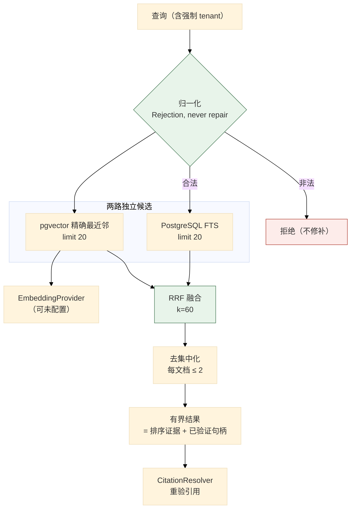
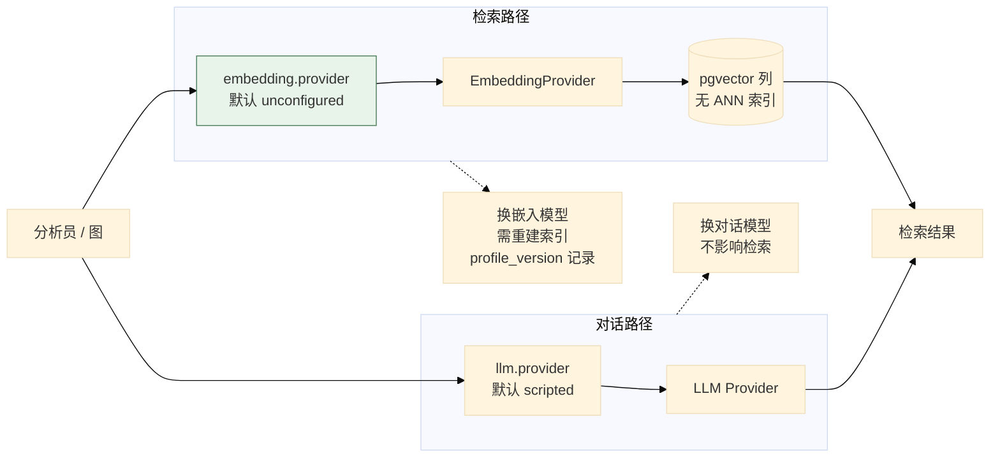
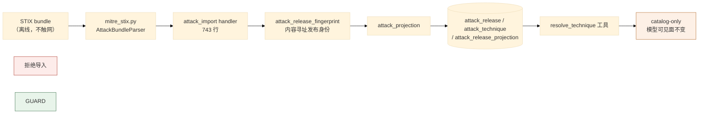
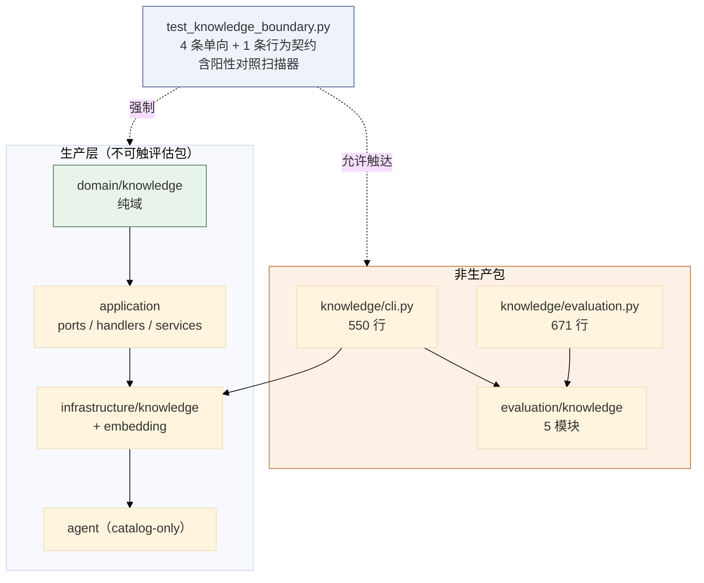

# 06 知识库与威胁情报

> **本文性质：** 代码级取证补充，**不构成契约**。`docs/README.md` 规定「Architecture and persistence documents are authority」——冲突时以 `p3/knowledge-domain.md` 为准。

> **文档类型**：子系统深挖（代码级核验，非设计提案）
> **分析对象**：`D:\Project\HISIEM-SOC-Copilot` 的 `domain/knowledge/`（6 文件）+ `knowledge/`（4 文件）+ `infrastructure/knowledge/`（6 文件）+ `infrastructure/embedding/`（3 文件）+ `application/services/knowledge_retrieval.py`（672 行）
> **取证方式**：源码直读 + grep 统计；每个关键论断附 `file:line` 锚点
> **结论以当前代码为准**（分支 `capability-mcp` @ `1e567be`）
> **文档集**：00–08 共 9 篇，见 [`README.md`](README.md)

---

## 为什么知识库独立成篇

它是一个**独立的受限上下文（bounded context）**，且带**自己的架构测试**：

```bash
tests/architecture/test_knowledge_boundary.py     # 4 条单向规则 + P3-A 闭包保证
```

**它的边界性质与其他子系统不同**：

| 维度 | 其它子系统 | 知识库 |
| --- | --- | --- |
| 数据来源 | HISIEM（运行期） | **离线导入的语料** |
| 检索方式 | 精确查询 | **混合检索（FTS + 向量 + RRF）** |
| 独立性 | — | **嵌入 provider 与对话 LLM 完全独立** |
| 模型可见面 | 工具 | **知识查找保持 catalog-only**（`test_knowledge_boundary.py:18-19`） |

---

## 1. 检索管线：四段，且**排序是纯函数**

### 1.1 关键论断

**论断 1：管线四段与「排序必须可复现」的理由写在同一段 docstring 里。**

```python
# application/services/knowledge_retrieval.py:1-19
"""Deterministic hybrid retrieval over the knowledge corpus (brief sections 39-53).

Everything in this module is pure and deterministic except the two repository
calls and the embedding call it orchestrates. That is deliberate: ranking is the
part of retrieval that must be reproducible, so ranking is plain functions of
plain data, testable without a database.

The shape of the pipeline:

1. **Normalize** the caller's query into bounded terms. Rejection, never repair.
2. **Generate candidates** independently -- PostgreSQL FTS and exact pgvector
   nearest-neighbour -- each with its own budget (sections 44/45).
3. **Fuse** the two ranked lists with Reciprocal Rank Fusion (section 47).
4. **Diversify** so one document cannot monopolize the result set (section 49).

Position on authority: a hit is RANKING EVIDENCE plus a validated handle. The
retrieval score is a ranking signal, not a judgement; the excerpt is data, not
instruction; the citation is a reference the resolver re-validates, not a grant
(section 92).
"""
```

**四段**：归一化 → 生成候选（两路独立）→ **RRF 融合** → 去集中化。

**论断 2：「Rejection, never repair」是一条查询归一化原则。**

```python
# knowledge_retrieval.py:10
1. **Normalize** the caller's query into bounded terms. Rejection, never repair.
```

**拒绝，不修补** ——**非法查询被拒，而不是被「猜着改成合法的」**。

**这条与 SIEM 侧的做法一致**（SIEM 02 篇 §3.1 论断 5 的 `not` 条件「多子条件直接拒绝」）：**宁可拒绝也不猜**。

**论断 3：排序是纯函数——「the part of retrieval that must be reproducible」。**

```python
# knowledge_retrieval.py:3-6
Everything in this module is pure and deterministic except the two repository
calls and the embedding call it orchestrates. That is deliberate: ranking is the
part of retrieval that must be reproducible, so ranking is plain functions of
plain data, testable without a database.
```

**只有三处非纯**：两次 repository 调用 + 一次 embedding 调用。**其余全部是纯函数**。

**为什么排序必须可复现**：**否则评估无法比较两次检索**（08 篇的评估体系依赖确定性）。

**论断 4：两路候选**各有自己的预算**。**

| 路径 | 机制 | 预算配置 |
| --- | --- | --- |
| **词法** | PostgreSQL FTS | `lexical_candidate_limit = 20` |
| **向量** | **精确** pgvector 最近邻 | `vector_candidate_limit = 20` |

```python
# config.py:415-418
lexical_candidate_limit: int = Field(default=20, ge=1)
vector_candidate_limit: int = Field(default=20, ge=1)
rrf_k: int = Field(default=60, ge=1)
max_hits_per_document: int = Field(default=2, ge=1)
```

**「each with its own budget」很重要**：两路**独立生成候选**，不是一路先跑再补充另一路。**这保证任何一路都不会因为另一路的结果而少取。**

**论断 5：`exact` 最近邻——**没有 ANN 索引**。**

```python
# knowledge_retrieval.py:11-12
2. **Generate candidates** independently -- PostgreSQL FTS and exact pgvector
   nearest-neighbour -- each with its own budget (sections 44/45).
```

**「exact pgvector nearest-neighbour」** ——这是**精确**最近邻，不是近似。

**对照 `pyproject.toml` 的注释**：

```toml
# pyproject.toml:24-26
# The one P3-A addition (brief §76): the official pgvector SQLAlchemy
# integration for the untyped ``vector`` column. No ANN index, no vector DB.
"pgvector>=0.3,<1",
```

**「No ANN index, no vector DB」是显式声明** ——**语料规模下精确检索够用，所以不引入 ANN 索引**。**这是一处有意的「不优化」**：ANN 索引会增加写入成本与调参负担，而收益在当前规模下为零。

**论断 6：融合是 RRF，`k=60` 是经典取值。**

```python
# config.py:417
rrf_k: int = Field(default=60, ge=1)
```

**`rrf_k = 60` 是 Reciprocal Rank Fusion 论文的原始取值** ——**这直接证明融合算法是 RRF**（不是加权分数相加）。

**RRF 的关键性质**：**只用排名的倒数求和**，所以**两路的分数尺度不必可比**。**这正是「词法分数」与「余弦距离」能融合的原因。**

**论断 7：去集中化是第 4 段——`max_hits_per_document = 2`。**

```python
# config.py:418
max_hits_per_document: int = Field(default=2, ge=1)
```

**理由（`knowledge_retrieval.py:14`）**：*「so one document cannot monopolize the result set」*。

**一份大文档可能在两路都排前**，从而**占满整页结果**。**限制每文档 2 条让结果覆盖更多来源**。

**论断 8：「权威立场」是一段四句式声明——每条都值得单独读。**

```python
# knowledge_retrieval.py:16-19
Position on authority: a hit is RANKING EVIDENCE plus a validated handle. The
retrieval score is a ranking signal, not a judgement; the excerpt is data, not
instruction; the citation is a reference the resolver re-validates, not a grant
(section 92).
```

| 声明 | 含义 |
| --- | --- |
| **hit = 排序证据 + 已验证的句柄** | 命中不是「答案」，是「可能相关 + 一个可验证的引用」 |
| **分数是排序信号，不是判断** | 高分**不代表**「这条是对的」 |
| **摘要**是数据**，不是指令** | **这是防提示注入的核心声明** |
| **引用是待重验的参考，不是授权** | **解析器会重新验证引用** |

**「the excerpt is data, not instruction」是本项目里最直接的一条提示注入防御表述** ——**检索到的语料内容永远被当作数据，不会被当作对模型的指令。**

**这一条在 03 篇的 MCP 侧有对应**：MCP 的远程内容同样被当作不可信数据（03 篇 §3.2 论断 3 的职责边界）。

**论断 9：`tenant` 作用域是每个检索入口的**强制关键字参数**。**

```python
# tests/architecture/test_knowledge_boundary.py:22-24
5. The P3-A closure's own guarantees, each asserted where it could be undone: the
   ATT&CK import path cannot reach the network, tenant scope is a mandatory
   keyword on every retrieval entry point, ...
```

**「tenant scope is a mandatory keyword on every retrieval entry point」** ——**不是可选参数，不是默认值**。

**这是多租户隔离在 API 层面的强制**：**调用方无法「忘记」传租户**。

### 1.2 四段管线



---

## 2. 嵌入 provider：与对话 LLM 完全独立

### 2.1 关键论断

**论断 1：独立性是显式声明的。**

```python
# config.py:452
"""Embedding provider configuration, INDEPENDENT of the chat LLM (section 18).
```

**「INDEPENDENT of the chat LLM」** ——**换对话模型不影响检索，换嵌入模型不影响对话**。

**为什么值得单独一篇的一节**：**嵌入是语料的属性，不是模型的属性**。语料索引一次，用很久；对话模型可能频繁更换。

**论断 2：未配置嵌入时**明确告知**，不静默降级。**

```python
# config.py:459-460
provider there is no vector retrieval, and the system says so instead of
```

**「the system says so instead of …」** ——**系统会说不存在向量检索**，而不是**悄悄只做词法检索**。

**论断 3：默认 `unconfigured`，且有 `is_configured()` 谓词。**

```python
# config.py:470,485
provider: Literal["unconfigured", "openai_compatible"] = "unconfigured"
...
def is_configured(self) -> bool:
```

**两个取值**：`unconfigured`（默认）/ `openai_compatible`。

**`dimension` 默认 0，且有注释解释为什么 0 有意义**：

```python
# config.py:473-474
# 0 means "not configured"; the provider must declare a real dimension.
dimension: int = Field(default=0, ge=0, le=8192)
```

**「0 表示未配置」** ——所以 `dimension = 0` **不是「零维向量」，而是「没有向量」**。

**论断 4：距离度量只有余弦——用类型表达。**

```python
# config.py:479
distance_metric: Literal["COSINE"] = Field(default="COSINE")
```

**`Literal` 只有一个取值** ——**「只支持余弦」是类型级事实**。

**论断 5：归一化是可配置的，但只有两档。**

```python
# config.py:478
normalization: Literal["NONE", "L2"] = Field(default="NONE")
```

**`NONE` 或 `L2`** ——**默认不归一化**（因为 `distance_metric` 是余弦，余弦本身对模长不敏感）。

**论断 6：`profile_version` 让嵌入配置的变更可被追踪。**

```python
# config.py:480
profile_version: int = Field(default=1, ge=1)
```

**换嵌入模型/维度会改变向量语义** ——`profile_version` **让「这批向量是用哪版配置生成的」可记录**。

**论断 7：有两个嵌入实现。**

```
infrastructure/embedding/deterministic.py      ← 确定性假实现（测试用）
infrastructure/embedding/openai_compatible.py  ← 真实实现
```

**`deterministic.py` 与 `llm/scripted.py` 是同一个模式**（03 篇 §4.1 论断 5）：**确定性假实现让依赖它的逻辑可被确定性测试**。

### 2.2 独立性



---

## 3. ATT&CK 与威胁情报

### 3.1 关键论断

**论断 1：ATT&CK 导入路径**不能触网**——这是一条被断言的约束。**

```python
# tests/architecture/test_knowledge_boundary.py:22-24
5. The P3-A closure's own guarantees, each asserted where it could be undone: the
   ATT&CK import path cannot reach the network, ...
```

**离线导入** ——ATT&CK 数据是**打包的 STIX bundle**，不是运行时拉取。

**论断 2：ATT&CK 相关文件分布在四层。**

| 层 | 文件 | 职责 |
| --- | --- | --- |
| `application/ports/attack.py` | `AttackTechnique` / `AttackBundle` / `AttackBundleParser` | 契约 |
| `application/services/attack_projection.py`（69 行） | — | 投影 |
| `application/services/attack_release_fingerprint.py`（167 行） | — | **发布指纹** |
| `application/handlers/attack_import.py`（**743 行**） | — | 导入处理 |
| `infrastructure/knowledge/attack_source.py` | — | 来源适配 |
| `infrastructure/knowledge/mitre_stix.py` | — | STIX 解析 |

**论断 3：「发布（release）」是 ATT&CK 数据的版本概念。**

从迁移名可见：

```
a5e93c07fd21_attack_release_projection_and_downgrade_guard.py
c41f7b2e9d08_immutable_content_chunks_and_attack_release.py
```

**「downgrade guard」**（降级守卫）**与「release projection」**（发布投影）**是两个独立概念**。

**「downgrade guard」是 Alembic schema 层面的守卫，与 ATT&CK 数据版本无关。**

实际是 **Alembic schema 降级守卫**：`_refuse_unsafe_downgrade()`（`alembic/versions/a5e93c07fd21_...py:139-162`）在**任何 `op.drop_*` 之前**检查数据库里是否存在 `ed6af82d9b13` 无法表示的状态；若有则抛 `P3ADowngradeUnsafeError` 且**不做任何改动**（docstring 原文：*「this failed run changed nothing」*）。

> **导入侧明确支持回到旧版本**——`attack_import.py:326` 与 `application/ports/knowledge.py:433` 都写「re-activating an older release restores its own projection」。全仓 `application/` 与 `domain/knowledge/` 下 **grep 不到任何 release 版本先后比较逻辑**。
>
> 所以「ATT&CK 发布不能降级」**不是**业务规则；守卫保护的是**数据库 schema 的可逆性**，不是**数据的新旧顺序**。

**论断 4：`attack_release_fingerprint.py` 是一个独立服务——发布身份是内容寻址的。**

**167 行专门算发布的指纹** ——与 SIEM 侧的 `DetectionPlanCompiler`（内容哈希）、`ResponseProposal._compute_content_hash`（内容哈希）是**同一手法在三处的应用**。

**论断 5：威胁情报端口已定义，但适配器是空命名空间。**

```python
# application/ports/threat_intel.py
ThreatIntelPort
```

```python
# infrastructure/threat_intel/__init__.py
"""Empty namespace marker."""
```

**端口已定义、适配器未实现** ——与 03 篇的 `FUTURE_CATALOG_TOOLS`（定义但未注册）是同一种状态。

**证据**：`test_knowledge_boundary.py:18-19` 提到「knowledge lookup stays catalog-only」——所以**知识查找当前只走内置目录，威胁情报查询尚未接入**。

### 3.2 ATT&CK 数据流



---

## 4. 知识包的运维面

### 4.1 关键论断

**论断 1：`knowledge/` 是**非生产包**——这是显式声明的。**

```python
# tests/architecture/test_knowledge_boundary.py:51-56
# Production layers (brief section 20). ``knowledge`` is deliberately NOT one: it
# is the operator/evaluation CLI surface, which is why it is allowed to reach the
# evaluation oracle -- see ``ALLOWED_EVALUATION_IMPORTERS``.
PRODUCTION_LAYERS = frozenset(
    {"domain", "application", "agent", "api", "infrastructure", "bootstrap"}
)
```

**「it is the operator/evaluation CLI surface」** ——**它是运维/评估的 CLI 面**。

**所以它被允许接触评估包** ——而生产层不能（00 篇 §2.1 论断 1）。

**论断 2：`knowledge/` 三个文件的分工。**

| 文件 | 行数 | 职责 |
| --- | --- | --- |
| `cli.py` | **550** | **命令行接口** |
| `evaluation.py` | **671** | **知识检索的评估** |
| `providers.py` | 69 | provider 装配 |

**`cli.py` 550 行 + `evaluation.py` 671 行** ——**知识库有完整的运维与评估工具链**，而不只是运行时依赖。

**论断 3：知识检索有自己的评估器（`knowledge/evaluation.py`，671 行）。**

**这与 `evaluation/knowledge/`（5 模块，含 `__init__` 共 6 文件）配合**：

```
evaluation/knowledge/artifact.py
evaluation/knowledge/corpus.py
evaluation/knowledge/corpus_identity.py
evaluation/knowledge/metrics.py
evaluation/knowledge/runner.py
```

**五个模块**：`artifact.py`（产物）+ `corpus.py`（语料）+ **`corpus_identity.py`（语料身份）** + `metrics.py`（指标）+ `runner.py`。

**「语料身份」（`corpus_identity.py`）值得注意** ——**评估要知道「这次评的是哪一版语料」**，否则指标不可比。

**这与 ATT&CK 的「release fingerprint」是同一个需求**：**给数据一个内容派生的身份，让「比较」有意义**。

**论断 4：知识边界测试有 5 条规则，其中 4 条是单向依赖、第 5 条是**行为契约**。**

```python
# test_knowledge_boundary.py:1-27（docstring 结构）
1. ``domain.knowledge`` is pure domain: stdlib plus sibling ``domain`` modules.
2. The knowledge ports/handlers/services in ``application`` never reach into
   ``infrastructure`` and never import a driver.
3. Raw SQL and pgvector queries stay in ``infrastructure``: no file under
   ``application/`` or ``domain/knowledge/`` names ``AsyncSession`` or
   ``cosine_distance``, calls ``text(...)``/``select(...)``, calls
   ``session.execute(...)``, or carries the ``<=>`` operator.
4. Section 88's lock: the model-selectable tool surface is EXACTLY the pre-P3-A
   set, knowledge lookup stays catalog-only, the knowledge CLI is unreachable from
   the agent, ...
5. The P3-A closure's own guarantees ...
```

**规则 3 是最细的一条**：**它扫描 6 种具体记号**（`AsyncSession` / `cosine_distance` / `text(` / `select(` / `session.execute(` / `<=>`）。

**并且它带一个**阳性对照**：**

```python
# test_knowledge_boundary.py:15-17
... The SAME scanner is
then pointed at the infrastructure repository as a positive control, so a
scanner that had silently stopped matching could not make this pass.
```

**「the SAME scanner is then pointed at the infrastructure repository as a positive control」** ——**同一个扫描器也扫 `infrastructure`，并且必须扫出东西**。

**这是本条文档集里最值得记录的一处测试设计**：

> **一个「什么都没扫到」的扫描器会让规则 3 永远通过。** 阳性对照保证了**扫描器本身是活的**——如果它因为 markdown 改写、字符串转义或者重构而失效，**阳性对照会失败**。

**这防的是「守卫静默失效」** ——与 00 篇 §2.1 论断 4 的 `evaluation_harness` 匹配 gap 是**同一类问题**：**一个以为自己生效了、其实没生效的守卫**。

**论断 5：`<=>` 是 pgvector 的余弦距离操作符——它在禁扫名单里。**

**`<=>`** 是 pgvector 的余弦距离运算符。**把它列入禁扫记号**意味着：**任何在 `application/` 或 `domain/knowledge/` 里出现的向量查询都会被测试拦下**。

**这比「禁止导入 pgvector」更严** ——因为**可以用裸 SQL 字符串写 `<=>`**，而那种写法不导入任何包。

**这正是规则 3 的价值**：**它拦的是「绕过类型系统的 SQL」**。

### 4.2 知识上下文全景



---

## 5. 关键不变式（代码强制）

| # | 不变式 | 强制点 | 违反后果 |
| --- | --- | --- | --- |
| 1 | **`domain.knowledge` 是纯域** | `test_knowledge_boundary.py` 规则 1 | 驱动进聚合 |
| 2 | **`application` 的知识代码不碰 `infrastructure`、不导入驱动** | 规则 2 | 用例层绑死驱动 |
| 3 | **裸 SQL 与 pgvector 查询只在 `infrastructure`** | 规则 3（扫描 6 种记号 + **阳性对照**） | SQL 绕过类型系统 |
| 4 | **模型可选面恰好是 P3-A 之前那一组** | 规则 4 | 知识工具被模型自选 |
| 5 | **知识查找保持 catalog-only** | `test_knowledge_boundary.py:18-19` | 动态知识工具进模型面 |
| 6 | **知识 CLI 从 agent 不可达** | 规则 4 | Agent 触达运维面 |
| 7 | **ATT&CK 导入路径不能触网** | 规则 5 | 导入期联网 |
| 8 | **tenant 作用域是每个检索入口的强制关键字参数** | 规则 5 | 跨租户检索 |
| 9 | **引用指向不可变内容，不是可重建的投影行** | 规则 5 | 引用一个会变的地址 |
| 10 | **旧嵌入配置开关没有可执行路径** | 规则 5（"the legacy embedding-profile switch flag has no executable path behind it"） | 死开关被误用 |
| 11 | **查询归一化是拒绝而非修补** | `knowledge_retrieval.py:10` | 非法查询被猜成合法 |
| 12 | **排序是纯函数（可复现）** | `knowledge_retrieval.py:3-6` | 评估不可比 |
| 13 | **两路候选各有独立预算** | `knowledge_retrieval.py:11-12`；`config.py:415-416` | 一路压制另一路 |
| 14 | **融合是 RRF（k=60）** | `config.py:417` | 分数尺度不可比 |
| 15 | **每文档最多 2 条命中** | `config.py:418` | 一份文档占满结果 |
| 16 | **摘要是数据，不是指令** | `knowledge_retrieval.py:17-18` | **提示注入** |
| 17 | **引用是待重验的参考，不是授权** | `knowledge_retrieval.py:18-19` | 引用被当作权限 |
| 18 | **嵌入独立于对话 LLM** | `config.py:452` | 换模型影响检索 |
| 19 | **未配置嵌入时明确告知，不静默降级** | `config.py:459-460` | 用户以为有向量检索 |
| 20 | **距离度量只支持余弦** | `config.py:479` `Literal["COSINE"]` | 语义不一致 |
| 21 | **无 ANN 索引** | `pyproject.toml:24-26` | 引入不必要的复杂度 |
| 22 | **schema 降级前必须确认无不可表示状态**（**Alembic schema 守卫，不是业务规则**） | `alembic/versions/a5e93c07fd21_...py:139-162` `_refuse_unsafe_downgrade` | 降级破坏数据 |

---

## 6. 待核实

**本节 12 条待核实项中 11 条已解答**，事实已并入上文；仅 1 条仍未定（见下）。

### 仍未定（1 条）

1. **`knowledge/evaluation.py` 的 artifact 渲染细节**（第 567-671 行）——artifact 落盘格式与 provenance 字段未逐段读。

### 锚点说明

chunker 配置位于 `config.py:378 / 390 / 397 / 404 / 424 / 442`；正文 §1 与 §2 里的 `config.py:415-418`、`config.py:452` 等锚点是准确的。

---

## 修订记录

| 版本 | 日期 | 变更 | 作者 |
| --- | --- | --- | --- |
| 1.0 | 2026-09-22 | 首版。基于 `capability-mcp` @ `1e567be` 取证，覆盖 `domain/knowledge` 6 + `knowledge` 4 + `infrastructure/knowledge` 6 + `infrastructure/embedding` 3 + `knowledge_retrieval.py` 文件。 | code-level-architecture-docs skill |
