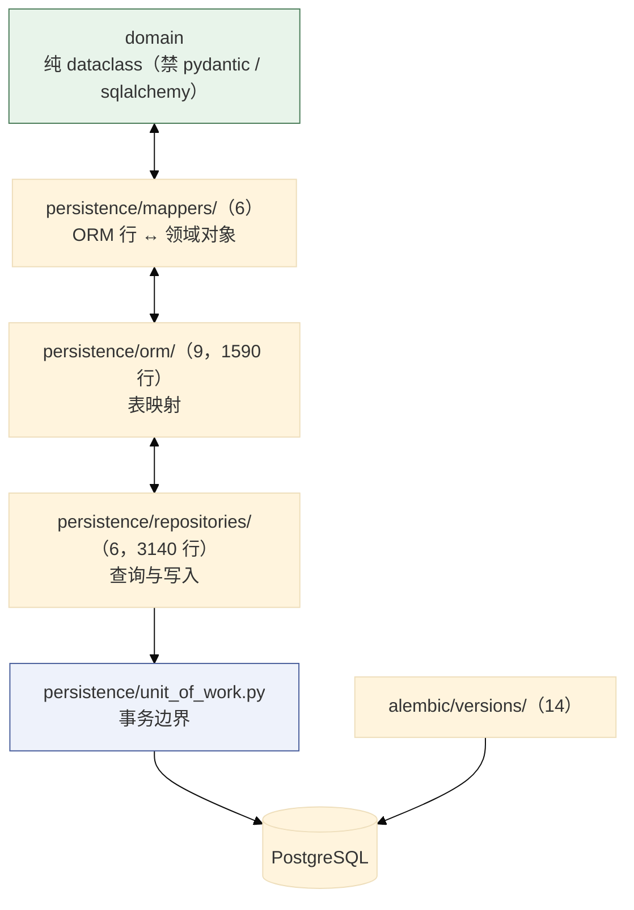
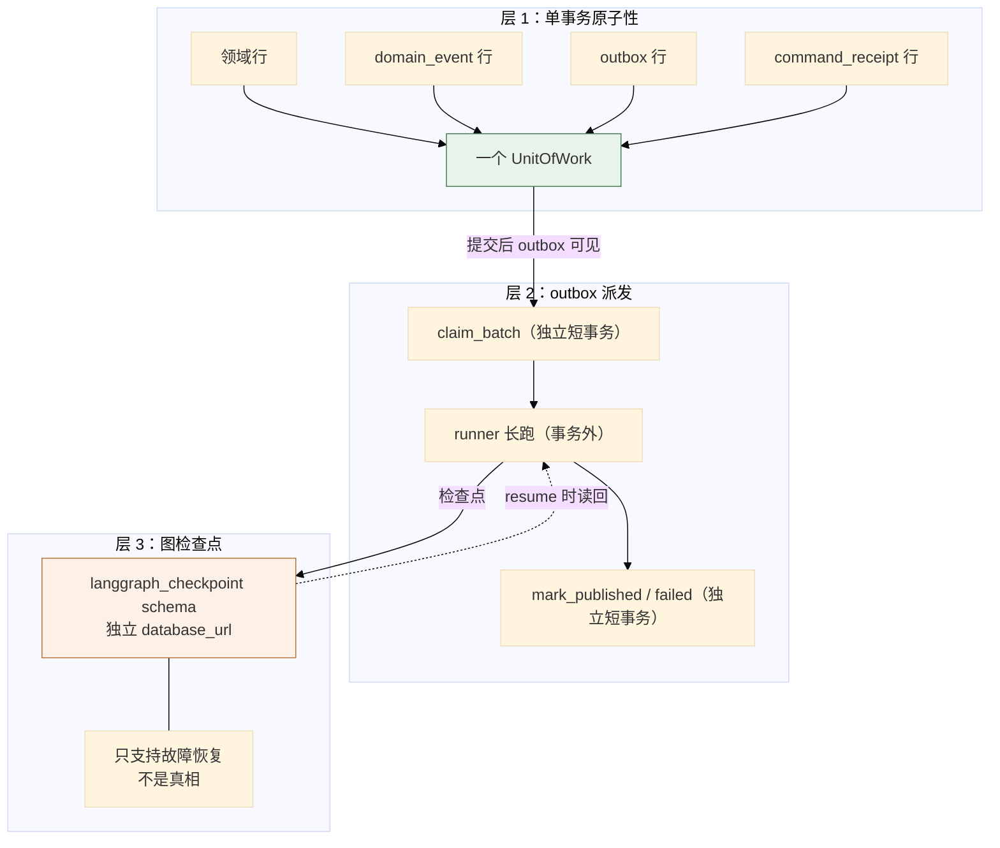
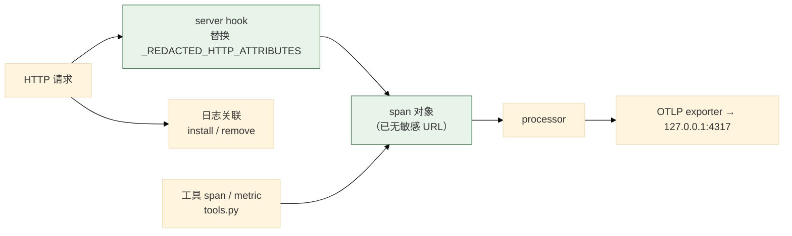

# 07 持久化、可靠性与可观测性

> **本文性质：** 代码级取证补充，**不构成契约**。`docs/README.md` 规定「Architecture and persistence documents are authority」——冲突时以 `persistence-schema.md` + `observability.md` 为准。

> **文档类型**：子系统深挖（代码级核验，非设计提案）
> **分析对象**：`D:\Project\HISIEM-SOC-Copilot` 的 `infrastructure/persistence/`（24 文件，**5912 行**）+ `infrastructure/durable/`（4）+ `infrastructure/checkpoint/`（2）+ `infrastructure/messaging/`（1）+ `infrastructure/observability/`（6，929 行）+ `alembic/`（**13 个迁移 + `__init__.py`**）
> **取证方式**：源码直读 + grep 统计；每个关键论断附 `file:line` 锚点
> **结论以当前代码为准**（分支 `capability-mcp` @ `1e567be`）
> **文档集**：00–08 共 9 篇，见 [`README.md`](README.md)

---

## 为什么这四块合一篇

它们都是**「让业务逻辑可以假设自己不会丢数据、不会静默失败、可以被观察」**的基础设施：

| 块 | 保证 |
| --- | --- |
| `persistence/` | **数据落得下、读得出、事务正确** |
| `durable/` | **意图不会丢**（outbox + 检查点 + 命令回执） |
| `checkpoint/` | **图的进度能恢复** |
| `observability/` | **失败看得见，且看不该看的看不到** |

**主线是一条分层原则**，写在 `durable.py` 的 docstring 里（见 §2.1 论断 1）：**领域行与事件行同事务；outbox 的领取/标记各自独立事务，绝不放在图/LLM/网络事务里。**

---

## 1. 持久化：四层与 13 个迁移

### 1.1 关键论断

**论断 1：持久化分四层，且职责不重叠。**

| 层 | 目录 | 文件 | 职责 |
| --- | --- | --- | --- |
| **ORM** | `persistence/orm/` | 9（**1590 行**） | 表映射 |
| **Mapper** | `persistence/mappers/` | 6 | ORM 行 ↔ 领域对象 |
| **Repository** | `persistence/repositories/` | 6（**3140 行**） | 查询与写入实现 |
| **UnitOfWork** | `persistence/unit_of_work.py` | 1 | 事务 + 端口聚合 |

**`repositories/` 是最厚的一层（3140 行）**：

| 文件 | 行数 |
| --- | --- |
| `knowledge.py` | **1330** |
| `durable.py` | **632** |
| `child.py` | **581** |
| `response.py` | 454 |
| `investigation.py` | 143 |

**`orm/knowledge.py` 也是最大的 ORM 模块（678 行）** ——**知识上下文的表最多**（chunk / embedding / profile / attack release / projection 等）。

**论断 2：`mapper` 层的存在是「domain 无框架依赖」的必然结果。**

**因为 `domain` 用纯 dataclass 且禁 pydantic / sqlalchemy**（00 篇 §2.1 论断 2），**ORM 行与领域对象必须是两套类型**——所以**必须有一层转换**。

**6 个 mapper 模块对应 5 个域**：`evidence` / `investigation` / `knowledge` / `response` / `workflow`（+ `__init__`）。

**论断 3：13 个 Alembic 迁移，编号反映能力演进。**

> `alembic/versions/` 下 14 个 `.py` 里**只有 13 个是迁移**，第 14 个是 `__init__.py`。**13 个迁移全部有真实的 `downgrade()` 实现**（无一是 `pass`），其中 3 个是**带守卫的降级**（先跑 `_refuse_unsafe_downgrade()`，不满足则抛 `P3ADowngradeUnsafeError`）。

```
d4bf8eed9e09_initial_copilot_schema_investigation_.py      ← 初始
c8f1a93d5b27_separate_investigation_response_lifecycles.py ← 分离两条生命周期
b7c2d41a90ef_response_execution_lifecycle.py
b6c2a4d19f30_outbox_trace_context.py                       ← outbox 携带 trace
72390ed8cf87_outbox_lease_fencing_token.py                 ← 租约 fencing
4c7a11f2d901_outbox_lease_reclaim_dead_letter.py           ← 回收与死信
d7681ebf99cd_command_receipt_request_fingerprint.py        ← 命令回执指纹
5a1e07c9b4f0_command_receipt_scoped_idempotency.py         ← 回执作用域幂等
979070495d4f_add_attention_required_submission_state.py    ← 「需要注意」提交态
5b85af6841f2_persist_response_proposer_provenance_.py      ← 提案人来源
ed6af82d9b13_add_versioned_security_knowledge_and_hybri.py ← 版本化知识 + 混合检索
c41f7b2e9d08_immutable_content_chunks_and_attack_release.py ← 不可变 chunk + ATT&CK 发布
a5e93c07fd21_attack_release_projection_and_downgrade_guard.py ← 发布投影 + 降级守卫
```

**四个分组**：

| 组 | 迁移 | 主题 |
| --- | --- | --- |
| 基础 | `d4bf8eed9e09` | 初始 schema |
| **响应生命周期** | `c8f1a93d5b27` / `b7c2d41a90ef` / `979070495d4f` / `5b85af6841f2` | 分离生命周期、执行态、注意态、提案人来源 |
| **outbox / 回执可靠性** | `b6c2a4d19f30` / `72390ed8cf87` / `4c7a11f2d901` / `d7681ebf99cd` / `5a1e07c9b4f0` | trace 传播、fencing、回收、指纹、作用域幂等 |
| **知识库** | `ed6af82d9b13` / `c41f7b2e9d08` / `a5e93c07fd21` | 版本化知识、不可变 chunk、发布与降级守卫 |

**「outbox / 回执可靠性」有 5 个迁移** ——**这是演进最密集的一块**。**它说明「恰好一次」这件事是迭代出来的，不是一次设计对的。**

**论断 4：`outbox_trace_context` 迁移让 outbox 行携带 traceparent。**

**证据**：迁移 `b6c2a4d19f30_outbox_trace_context.py`，以及 `dispatcher.py:174-178` 的使用：

```python
# dispatcher.py:174-178
with linked_worker_span(
    "durable.dispatch",
    traceparent=record.traceparent,
    attributes={"operation": record.destination},
):
    await self._deliver_claimed(record)
```

**一次入队请求的 trace 会延续到异步派发的 worker**（可能是几秒或几分钟后）。**这让「一次调查请求」在追踪上是一条完整的链，而不是两段无关的链。**

**论断 5：`command_receipt` 有两个迁移——指纹 + 作用域幂等。**

```
d7681ebf99cd_command_receipt_request_fingerprint.py
5a1e07c9b4f0_command_receipt_scoped_idempotency.py
```

**「request_fingerprint」+「scoped idempotency」合起来是**：**同一个命令（按指纹判定）在同一个作用域内只生效一次**。

**这是 01 篇 §3.1 论断 5 提到的「workflow commands are receipt-idempotent」的实现基础。**

### 1.2 持久化分层



---

## 2. 可靠性：三层机制

### 2.1 关键论断

**论断 1：事务边界的分工写在 `durable.py` 的 docstring 里。**

```python
# infrastructure/persistence/repositories/durable.py:1-8
"""SQLAlchemy durable-runtime repositories (events/outbox/receipt/audit/binding).

Each method is called INSIDE an existing UnitOfWork transaction (the handler owns
commit/rollback), so the rows they insert are atomic with the domain rows
(persistence-schema.md §31). The outbox claim/mark methods used by the dispatcher
each run in their OWN transaction via a session factory — never inside a graph/
LLM/network transaction.
"""
```

**两句话，两个相反的事务归属**：

| 方法类 | 事务归属 | 理由 |
| --- | --- | --- |
| **事件 / outbox 入队 / 回执 / 审计 / 绑定** | **调用方的 UnitOfWork 内** | **与领域行原子** |
| **outbox 的 claim / mark** | **各自独立事务**（经 session factory） | **绝不放在图 / LLM / 网络事务里** |

**第二句是最关键的一条**：

> **outbox 的领取与标记绝不放在图/LLM/网络事务里。**

**为什么**：**图的运行可能持续几分钟（含多次 LLM 调用）**。若把 outbox 的标记放在这个事务里，**事务会持有一个数据库连接好几分钟**，且**租约的可见性会受事务隔离影响**——别的 worker **看不到**你正在处理的租约。

**所以**：`claim_batch` 与 `mark_published` / `mark_failed` **各开一个短事务**，而 **runner 的长跑在事务之外**。

**论断 2：outbox 的可靠性机制在 01 篇 §2 已详述——这里只列全貌。**

| 机制 | 作用 | 锚点 |
| --- | --- | --- |
| **三分类失败** | 只有一类能进死信 | `dispatcher.py:10-15` |
| **解析失败永不消耗死信预算** | 保持可重试 | `dispatcher.py:196-213` |
| **耗尽 hook 先写业务事实** | 投影与 outbox 不矛盾 | `dispatcher.py:325-346` |
| **租约 + fencing token** | 跨进程不重复 | `dispatcher.py:226-235` |
| **有界指数退避（上限 120s）** | 无限重试但速率有界 | `dispatcher.py:373-376` |
| **每聚合进程内锁** | 同进程不并发 | `dispatcher.py:141-153` |

**论断 3：`durable` 有 4 个文件，其中 `response_runner.py` 783 行。**

**实测**：`dispatcher.py` 404 / `response_runner.py` **783** / `investigation_runner.py` 208 / `__init__.py` 17。

**论断 4：`checkpoint/postgres.py` 是 LangGraph 检查点的落点，用独立的 schema。**

**证据**：`config.py:43,56` 的 `LangGraphSettings` 有独立的 `database_url` 与 **`schema_name`**；`builder.py:9` 的 docstring 提到 *「the ``langgraph_checkpoint`` schema」*。

**三处独立**：

| 维度 | 独立点 |
| --- | --- |
| 连接 | 独立 `database_url` |
| schema | 独立 `schema_name`（`langgraph_checkpoint`） |
| 职责 | **只支持故障恢复 / 中断 / 恢复**（`state.py:7-8`），**不是真相** |

**「独立 schema」的好处**：**检查点表可以整体清理/重建，不会碰到业务表**。而检查点**本来就是可丢弃的**（真相在领域聚合里）。

**论断 5：`messaging/` 是空命名空间。**

```python
# infrastructure/messaging/__init__.py
"""Empty namespace marker."""
```

**当前没有消息中间件** ——outbox 走的是**数据库表**，不是 MQ。**这个空包是为将来留的位置**（与 `threat_intel/` 同）。

### 2.2 三层可靠性机制



---

## 3. 可观测性

### 3.1 关键论断

**论断 1：可观测性有 6 个模块，929 行。**

| 文件 | 行数 | 职责 |
| --- | --- | --- |
| `bootstrap.py` | **339** | OTel 生命周期 + 隐私安全的标准埋点 |
| `tools.py` | 213 | 工具执行的 span / metric |
| `context.py` | 174 | 追踪上下文（含 `linked_worker_span` / `capture_traceparent`） |
| `metrics.py` | 158 | 指标 |
| `log_correlation.py` | 44 | 日志关联 |
| `__init__.py` | 1 | — |

**论断 2：`bootstrap.py` 的定位是「可选 + 隐私安全」。**

```python
# infrastructure/observability/bootstrap.py:1
"""Optional OpenTelemetry lifecycle and privacy-safe standard instrumentation."""
```

**两个形容词都是实质约束**：

| 词 | 含义 |
| --- | --- |
| **Optional** | 追踪默认关闭（`config.py:137` `tracing_enabled = False`） |
| **privacy-safe** | 标准埋点必须脱敏 |

**论断 3：HTTP 埋点的敏感字段在**服务端 hook 处替换**，早于任何 processor 或 exporter。**

```python
# observability/bootstrap.py:22-28
# HTTP instrumentation populates these fields from request scopes. Their values may
# contain queries, resource identifiers, or caller network data; replace them at the
# server hook before they can reach a processor or exporter.
_REDACTED_HTTP_ATTRIBUTES = (
    "url.full",
    "url.original",
    "url.path",
    ...
```

**「replace them at the server hook before they can reach a processor or exporter」是本条最值得读的一句**：

> **脱敏发生在**最上游**——不是「导出前过滤」，而是「压根不产生」**。

**两者的区别很实际**：「导出前过滤」意味着**敏感值短暂存在于 span 对象里**（可能被别的 processor 看到、可能进批处理缓冲）；**「在 server hook 处替换」则让敏感值从不进入可观测管线**。

**被替换的字段含 `url.full` / `url.original` / `url.path`** ——**URL 里可能含查询参数（如日志检索的查询串）**，那是分析员输入的敏感内容。

**论断 4：追踪上下文在异步边界处显式传递。**

```python
# observability/context.py 提供
linked_worker_span, capture_traceparent
```

```python
# dispatcher.py:174-178
with linked_worker_span(
    "durable.dispatch",
    traceparent=record.traceparent,
    attributes={"operation": record.destination},
):
```

**`capture_traceparent` 在入队时抓，`linked_worker_span` 在派发时接上** ——**这是跨异步边界的追踪传播**。

**论断 5：`log_correlation.py` 只有 44 行——注入/移除日志关联。**

**名字是 `install_log_correlation` / `remove_log_correlation`**（`bootstrap.py:18` 导入）——**成对的安装与卸载**。**这很重要**：**测试里若不卸载，日志关联会泄漏到别的测试**。

**论断 6：工具遥测是一个**装饰器**，包在工具链外面，而不是让工具链自己埋点。**

```python
# infrastructure/observability/tools.py:1-12
"""Infrastructure decorator for safe semantic tool and provider telemetry."""

from __future__ import annotations

from time import perf_counter

from ...agent.knowledge.catalog import KnowledgeRetrievalCatalogAdapter
from ...agent.tools.executor import ToolExecution, ToolExecutor
from ...agent.tools.provider_router import ProviderRouter
from ...agent.tools.registry import ToolRegistry
from ...application.ports.hisiem import HisiemPort
from ...contracts.tools.types import ToolCandidate, ToolResultStatus
```

**「Infrastructure decorator」是准确的定位**：

| 观察 | 含义 |
| --- | --- |
| **它在 `infrastructure/` 下** | 而 `agent` **不得**导入 `infrastructure`（`test_import_boundaries.py:45`）——**所以埋点不可能是 agent 自己做的** |
| **它导入 `agent.tools.*`** | 依赖方向是 `infrastructure → agent`（允许） |
| **它包住 `ToolExecutor` / `ProviderRouter` / `ToolRegistry`** | **装饰器模式**：装配时套在外层 |

**这解决了一个结构性问题**：**`agent` 层禁止依赖可观测性基础设施，但工具调用又必须被观测。**

**装饰器是唯一的解法** ——业务逻辑（`agent/tools/executor.py`）保持纯净，**观测逻辑由 `bootstrap` 在装配时套上**。这与 03 篇 §2.4 论断 8 的「executor 不读模型参数」是同一取向：**关注点分离靠结构，不靠自觉**。

### 3.2 可观测性管道



> **图的形状就是设计意图**：脱敏在**最左边**，**之后所有节点都拿不到敏感值**。

---

## 4. 关键不变式（代码强制）

| # | 不变式 | 强制点 | 违反后果 |
| --- | --- | --- | --- |
| 1 | **领域行与事件/outbox/回执行同事务** | `durable.py:3-5` | 状态变了但事件丢了 |
| 2 | **outbox 领取/标记各自独立事务** | `durable.py:5-8` | 长事务持有连接、租约不可见 |
| 3 | **outbox 事务绝不包住图/LLM/网络调用** | 同上 | 连接被占几分钟 |
| 4 | **检查点库与业务库分离** | `config.py:43,56` 独立 `database_url` + `schema_name` | 清理检查点碰到业务表 |
| 5 | **检查点不是真相** | `state.py:7-8` | 从检查点恢复出与聚合不符的状态 |
| 6 | **outbox 行携带 traceparent** | 迁移 `b6c2a4d19f30`；`dispatcher.py:174-178` | 异步段追踪断链 |
| 7 | **命令回执按指纹 + 作用域幂等** | 迁移 `d7681ebf99cd` + `5a1e07c9b4f0` | 命令被重复执行 |
| 8 | **租约带 fencing token** | 迁移 `72390ed8cf87`；`dispatcher.py:226-235` | 过期持有者写入 |
| 9 | **追踪默认关闭** | `config.py:137` `tracing_enabled = False` | 未配置就尝试导出 |
| 10 | **HTTP 敏感字段在 server hook 处替换** | `bootstrap.py:22-31` | 查询串/路径进 exporter |
| 11 | **脱敏早于 processor 与 exporter** | `bootstrap.py:23-24` | 敏感值短暂存在于管线中 |
| 12 | **日志关联成对安装/卸载** | `bootstrap.py:18` | 测试间状态泄漏 |
| 13 | **嵌入配置与对话 LLM 独立** | `config.py:452` | 见 06 篇 |

---

## 5. 与其他子系统的边界

| 边界 | 方向 | 契约 | 锚点 |
| --- | --- | --- | --- |
| `application.ports.unit_of_work` ← `persistence.unit_of_work` | 入 | `UnitOfWork` | `application/ports/unit_of_work.py` |
| `application.ports.repositories` ← `persistence.repositories` | 入 | 11 个 repository **端口**（而 `UnitOfWork` 表面暴露 **21 个属性**） | `application/ports/repositories.py` |
| `application.ports.durable` ← `persistence.repositories.durable` | 入 | `OutboxStore` / `EventLedger` / `CommandReceiptStore` / `OrchestrationBindingStore` / `ToolInvocationStore` | `application/ports/durable.py` |
| `infrastructure.durable` → `persistence.repositories.durable` | 出 | outbox claim/mark | `dispatcher.py:158-164` |
| `infrastructure.durable` → `observability.context` | 出 | `linked_worker_span` | `dispatcher.py:35` |
| `bootstrap` → 全部 | 入 | 装配 | `container.py:152-171`（session factory / UoW） |
| `infrastructure` ↮ `api` | **禁** | — | `test_import_boundaries.py:52` |

**`application/ports/durable.py` 是端口最多的一个模块**（`durable.py:20-33` 从它导入 12 个名字）：`AppendableEvent` / `CommandReceiptRecord` / `CommandReceiptStore` / `DomainEventEnvelope` / `DurableCommand` / `EventLedger` / `OrchestrationBinding` / `OrchestrationBindingStore` / `OutboxRecord` / `OutboxStore` / `ToolInvocationRecord` / `ToolInvocationStore`。

**12 个名字分属 5 个概念**：事件台账、命令回执、编排绑定、outbox、工具调用记录。**这五个概念就是「持久化可靠性」的全部词汇表。**

---

## 6. 待核实

1. ~~**工具遥测装饰器的装配点**——`observability/tools.py` 是装饰器，但它在 `bootstrap/container.py` 的哪一处被套上工具链未定位；以及装饰后 `ToolExecutor` 的身份是否仍可被 `NativeToolProvider` 正确识别。~~ **已解答（2026-09-23）**：**它不是装饰器，而是子类**——`ObservedToolExecutor(ToolExecutor)`（`infrastructure/observability/tools.py:27`）重写 `execute()`（`:46`）。装配点在唯一的**闭包工厂** `container.py:255-260`：`GraphRuntime(executor=ObservedToolExecutor(hisiem=..., knowledge=..., provider_router=..., registry=...))`。注意**路由表里的 native 分支绑的是另一个实例**——`base_executor = ToolExecutor(...)`（`container.py:236-240`）被 `NativeToolProvider(base_executor)` 包住（`:241-242`，native 路由 `:242`）。所以链路是「图 → **ObservedToolExecutor** →`super().execute()`（同参数、且把 `provider_router` 传给基类，`tools.py:37`）→ `ProviderRouter` → `NativeToolProvider(base_executor)`」，观测层不在路由环里、无递归。身份识别不受影响：全仓**没有任何对执行器做 `isinstance` / `type` 判断**；`NativeToolProvider.identity` 是**类属性常量**（`agent/tools/native_provider.py:22`，`provider_type="native"` / `server_category="internal"`），不取自被包装对象；`ObservedToolExecutor` 以同一套关键字参数调用 `super().__init__`、与基类同签名，可替换（`_is_mcp` 也只用 `router.provider(...).identity.provider_type` 判断，`tools.py:125-129`）。
2. ~~**`_REDACTED_HTTP_ATTRIBUTES` 的完整清单**~~ **已解答（2026-09-23）**：元组共 **6 个字段**——`url.full` / `url.original` / `url.path` / `url.query` / `http.url` / `http.target`（`bootstrap.py:25-31`）。原写「只读到三个字段」，是因为**只读到 `:28` 就停了**，属截断失误而非元组真的只有 3 个。
3. ~~**`metrics.py` 的指标集**——`record_counter` / `record_histogram`（01 篇 §2.1 引用）之外还有哪些指标未枚举。~~ **已解答（2026-09-23）**：该模块**只有 3 个函数**，除 `record_counter`（`observability/metrics.py:119`）与 `record_histogram`（`:139`）外**只有标签校验器 `sanitize_metric_attributes`（`:104`，不记录指标）**——不存在第三个记录函数。指标全集就是三张常量表：**计数器 18 个**（`_COUNTERS`，`:11-32`）`investigation.total` / `investigation.failure` / `agent.steps` / `agent.tool_calls` / `agent.retry_count` / `agent.loop_count` / `llm.calls` / `llm.errors` / `tool.calls` / `tool.errors` / `tool.retries` / `retrieval.calls` / `retrieval.errors` / `durable.retry_count` / `durable.dead_letter_count` / `response.attention_required` / `mcp.calls` / `mcp.errors`；**直方图 10 个**（`_HISTOGRAMS`，`:33-46`）`investigation.duration` / `llm.duration` / `llm.input_tokens` / `llm.output_tokens` / `tool.duration` / `retrieval.duration` / `retrieval.hit_count` / `response.submit_duration` / `response.observe_duration` / `mcp.duration`，**合计 28 个指标名**；**标签白名单 9 键**（`_ALLOWED_LABEL_VALUES`，`:47-99`）`tool_name` / `tool_provider` / `server_category` / `model_provider` / `retrieval_mode` / `result` / `error_category` / `operation` / `response_state`。名字不在白名单、或任一标签值不在白名单的记录会被静默丢弃（`:110-116`、`:123-124`），因此这三张表即「指标集」的完备定义。
4. ~~**`checkpoint/postgres.py` 的 saver 构造与 schema 管理**——schema 是自动建还是靠迁移建未确认。~~ **已解答（2026-09-23）**：**自动建，且明确不归 Alembic**。`PostgresCheckpointer.__aenter__` 先建连 `AsyncConnection.connect(self._dsn, autocommit=True, prepare_threshold=0, row_factory=dict_row)`（`infrastructure/checkpoint/postgres.py:44-46`），再 `saver = AsyncPostgresSaver(self._conn)` 并 **`await saver.setup()`（`:47-48`）**——建表 DDL 由 **LangGraph 自己的 setup** 执行，Copilot 不写也不迁移这些表。schema 是通过 DSN 钉死的：`_checkpoint_dsn` 把 SQLAlchemy URL 降级成 `postgresql://` 并拼 `options=-csearch_path%3D<schema>`（`:21-32`），默认 schema 名 `langgraph_checkpoint`（`config.py:56-58`）。Alembic 侧文件头即写明「Owns migrations for `copilot.*` only. The `langgraph_checkpoint` schema is managed by LangGraph itself and is explicitly excluded from autogenerate」（`alembic/env.py:1-5`），13 个迁移中也没有任何 checkpoint DDL。checkpointer 按调查线程构造：`infrastructure/durable/investigation_runner.py:168-172`（未注入 `checkpointer_factory` 时用 `PostgresCheckpointer(settings.langgraph)`）。
5. ~~`unit_of_work.py` 的端口聚合方式~~ **已解答**：用**属性**暴露，且实际是 **21 个**（11 个领域 repository + 4 个 durable store + 6 个知识 repository），不是 11。11 是 `application/ports/repositories.py` 的**端口数**。
6. ~~**`repositories/knowledge.py`（1330 行）的结构**——最大的 repository，未读。~~ **已解答（2026-09-23）**：三段式。**① 文件头 1-149 行**：模块 docstring 就是该文件的 4 条设计规则（scope 只做 SQL WHERE、数据库是最终裁决者、候选只取 ACTIVE 版本的 CURRENT generation、排序语义化）+ 2 个私有类型别名 `_OrderByClause`（`:123`）/ `_ChunkViewSelect`（`:127`）。**② 模块级私有助手 11 个**（`:150-378`）：`_scope_predicate`（`:150`）、`_stable_order_columns`（`:166`）、`_generation_probe`（`:192`）、`_generation_of_version`（`:210`）、`_covering_profile_probe`（`:220`）、`_chunk_view_select`（`:259`）、`_view_from_mapping`（`:312`）、值映射 `_content_chunk_values`/`_embedding_values`/`_technique_values`（`:340`/`:355`/`:364`）、`_or_tsquery`（`:371`）。**③ 6 个 repository 类、共 49 个 async 方法**：`SqlAlchemyKnowledgeDocumentRepository`（`:379`，10 个）、`SqlAlchemyKnowledgeChunkRepository`（`:548`，12 个，含 `lexical_candidates`（`:732`）/`vector_candidates`（`:772`）两条检索通道与 `projection_state`（`:628`）/`corpus_snapshot`（`:843`））、`SqlAlchemyEmbeddingProfileRepository`（`:910`，5 个）、`SqlAlchemyAttackReleaseRepository`（`:972`，8 个）、`SqlAlchemyAttackTechniqueRepository`（`:1095`，6 个）、`SqlAlchemyAttackReleaseProjectionRepository`（`:1184`，8 个，含 `missing_techniques`/`diverged_documents`/`unusable_documents` 健康探针与 `lock_framework`（`:1316`））。类计数与第 5 条「6 个知识 repository」一致。
7. ~~**`orm/knowledge.py`（678 行）的表清单**——知识域的完整表结构未取证。~~ **已解答（2026-09-23）**：**共 9 张表**，全部继承 `CopilotBase`，映射类与表名一一对应——`KnowledgeDocumentRow`→`knowledge_document`（`infrastructure/persistence/orm/knowledge.py:75`）、`KnowledgeDocumentVersionRow`→`knowledge_document_version`（`:149`）、`EmbeddingProfileRow`→`embedding_profile`（`:201`）、`KnowledgeChunkRow`→`knowledge_chunk`（`:263`，内联 `VECTOR()` 列在 `:336`）、`KnowledgeContentChunkRow`→`knowledge_content_chunk`（`:348`）、`KnowledgeChunkEmbeddingRow`→`knowledge_chunk_embedding`（`:436`）、`AttackReleaseRow`→`attack_release`（`:483`）、`AttackTechniqueRow`→`attack_technique`（`:540`）、`AttackReleaseProjectionRow`→`attack_release_projection`（`:590`）。语义分两组：**知识文档组 6 张**——document/version 版本化（`active_version_id` + `revision`/`lock_version`），chunk 有**两种形态**：`knowledge_chunk` 是内联向量的形态，`knowledge_content_chunk` + `knowledge_chunk_embedding` 是内容与向量分离、chunk 带 `generation` 的形态；**ATT&CK 组 3 张**——release / technique / projection，其中 projection 记录 release×technique→(document_id, document_version_id, content_hash) 的投影来源。
8. ~~**`bootstrap.py` 的 339 行里标准埋点的完整清单**——只确认了 HTTP 一类，SQLAlchemy / psycopg / httpx 的埋点未逐项读。~~ **已解答（2026-09-23）**：**4 类 instrumentor + 2 项非 instrumentor 埋点**。三个库级 instrumentor 在 `_TelemetryRuntime` 首次创建时一次性实例化（`infrastructure/observability/bootstrap.py:277-281`：`HTTPXClientInstrumentor()` / `SQLAlchemyInstrumentor()` / `PsycopgInstrumentor()`），统一由 `_instrument_standard_libraries`（`:180-214`）装配：**① httpx（客户端）**（`:193-201`，含实例化处 `:278`）——先在 `_disable_httpx_header_capture()`（`:75-93`）里把 `OTEL_INSTRUMENTATION_HTTP_CAPTURE_HEADERS_CLIENT_REQUEST` / `..._CLIENT_RESPONSE` / `..._SANITIZE_FIELDS` 三个环境变量临时置空（httpx instrumentation 0.65b0 从环境变量而非 kwargs 读头捕获配置），再传 4 个 hook `request_hook=_sanitize_client_request` / `response_hook=_sanitize_client_response` / `async_request_hook=_sanitize_async_client_request` / `async_response_hook=_sanitize_async_client_response`；**② SQLAlchemy**（`:202-208`，实例化 `:279`）——`enable_commenter=False`、`capture_parameters=False`；**③ psycopg**（`:209-214`，实例化 `:280`）——`capture_parameters=False`；**④ FastAPI（服务端）**（`:288-299`）——`FastAPIInstrumentor.instrument_app(app, ..., server_request_hook=_sanitize_server_request, http_capture_headers_server_request=[], http_capture_headers_server_response=[], http_capture_headers_sanitize_fields=[])`，即服务端头捕获同样被强制清空（HTTP 这一类正是原条目已确认的 ④ + ①）。另两项非 instrumentor 埋点：**W3C 传播器** `set_global_textmap(TraceContextTextMapPropagator())`（`:309`）与**日志关联过滤器** `install_log_correlation(settings.service_name)`（`:315-320`）。擦除动作统一走 `_scrub_http_span`（`:40-47`，清 `_REDACTED_HTTP_ATTRIBUTES`）。
9. ~~**迁移的 downgrade 路径**~~ **已解答（2026-09-23）**：迁移共 **13 个**（不是 14），**全部实现了 `downgrade()`**，其中 3 个带降级守卫。
10. ~~**`log_correlation` 的关联字段**——注入的是什么（trace_id? span_id?）未读。~~ **已解答（2026-09-23）**：**trace_id 与 span_id 都注入，且分两族、共 9 个字段**。`TraceCorrelationFilter.filter()`（`infrastructure/observability/log_correlation.py:15-28`）先写 **trace 族 4 个**——`otel_trace_id` / `otel_span_id` / `otel_service_name` / `otel_operation`，取值来自 `current_span_context()`（`observability/context.py:163-174`）：trace_id 为 32 位十六进制、span_id 为 16 位十六进制，span 无效时两者为空串，operation 取 ContextVar `_active_operation`（即最近一次 `start_span` 的 span 名，`context.py:79`）。随后把 `current_log_context()` 的键**逐个 setattr 到 LogRecord**（`log_correlation.py:25-27`），这些业务关联 ID 受 `_LOG_FIELDS` 白名单限制、**只有 5 个**：`investigation_id` / `response_proposal_id` / `tool_invocation_id` / `execution_command_id` / `correlation_id`（`context.py:21-29`，由 `bind_log_context` 绑定并在退出时复位，`:145-155`）。过滤器只装在**既有的 root handler** 上、幂等（`:31-38`），且业务 ID **只进日志**——不进 span 属性、不进指标标签（`context.py:143-144`）。

> **本节状态（2026-09-23 复核）**：共 10 条，**10 条已解答**（第 1–10 条全部，见上），**0 条仍未决**。本节标题仍写作「待核实」，但条目已全部核证；`README.md`「96 条已全部核证」的旧措辞曾与本节的未决计数冲突，该措辞此前已更正，现两者不再矛盾。

---

## 修订记录

| 版本 | 日期 | 变更 | 作者 |
| --- | --- | --- | --- |
| 1.0 | 2026-09-22 | 首版。基于 `capability-mcp` @ `1e567be` 取证，覆盖 persistence 24 + durable 4 + checkpoint 2 + messaging 1 + observability 6 文件 + 13 迁移。 | code-level-architecture-docs skill |
