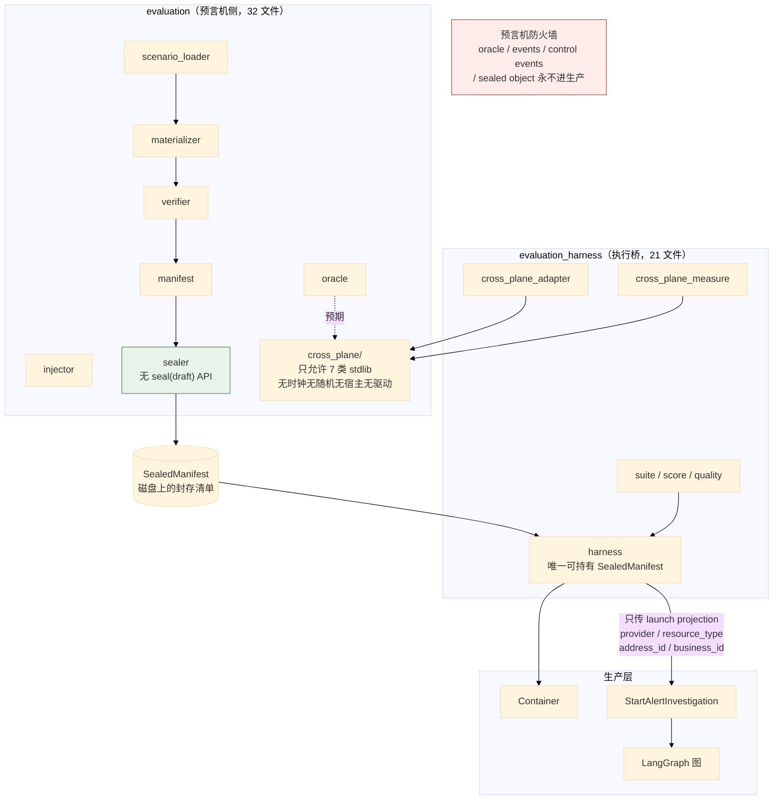
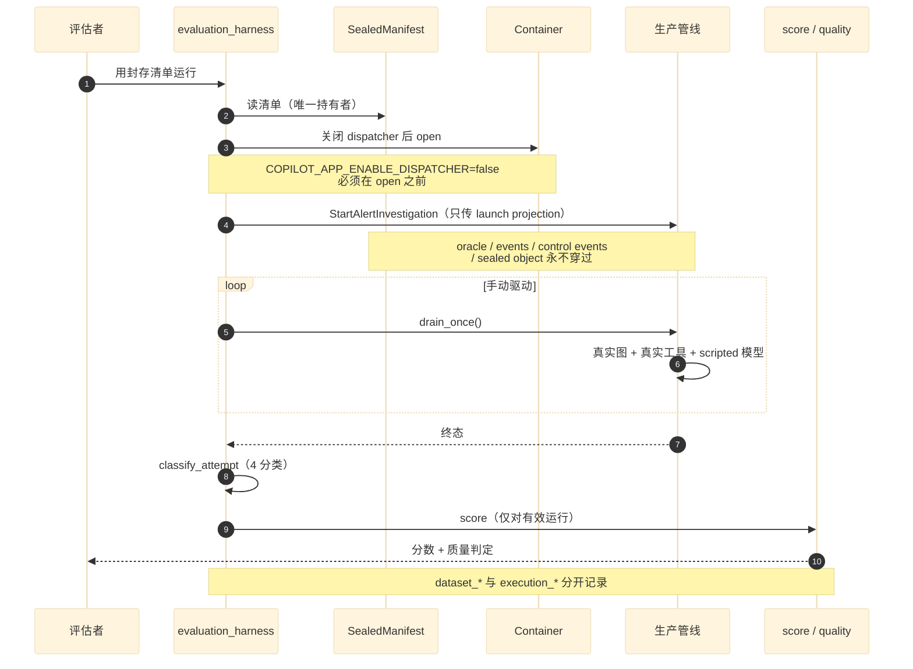
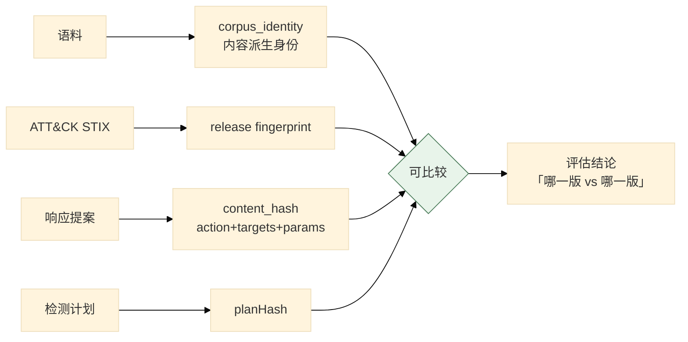

# 08 评估体系

> **本文性质：** 代码级取证补充，**不构成契约**。`docs/README.md` 规定「Architecture and persistence documents are authority」——冲突时以 `evaluation/evaluation-closure-contract.md` 为准。

> **文档类型**：子系统深挖（代码级核验，非设计提案）
> **分析对象**：`D:\Project\HISIEM-SOC-Copilot` 的 `evaluation/`（**28** 文件，**10764** 行）+ `evaluation_harness/`（21 文件，9708 行）+ `knowledge/evaluation.py`（671 行）
> **取证方式**：源码直读 + grep 统计；每个关键论断附 `file:line` 锚点
> **结论以当前代码为准**（分支 `capability-mcp` @ `1e567be`）
> **文档集**：00–08 共 9 篇，见 [`README.md`](README.md)

---

## 为什么评估独立成篇

**因为它的体量超过了业务域本身。**

```bash
$ find src/hisiem_soc_copilot/evaluation src/hisiem_soc_copilot/evaluation_harness -name "*.py" -not -path '*__pycache__*' | wc -l
49
$ find src/hisiem_soc_copilot/domain -name "*.py" -not -path '*__pycache__*' | wc -l
29
```

| 包 | 文件 | 行数 |
| --- | --- | --- |
| `evaluation`（预言机侧） | **28** | **10764** |
| `evaluation_harness`（执行桥） | **21** | **9708** |
| `domain`（业务域） | 29 | **3107** |
| **合计** | **49** | **20472** |

**评估体系的代码量是业务域的 6.6 倍。** 这本身就是一条设计陈述：**这个项目的取向是「先建可信评估，再建功能」。**

**并且它有独立于生产层的架构约束**：

```
tests/architecture/test_evaluation_boundary.py     # 生产层禁导入 evaluation
tests/architecture/test_cross_plane_boundary.py    # 生产层禁导入 evaluation_harness
```

---

## 1. 三个包的分工

### 1.1 关键论断

**论断 1：三个包的分工由各自 `__init__.py` 的 docstring 定义。**

```python
# evaluation/__init__.py:1-5
"""GP-01 evaluation package — dataset materializer (E1-B.3) + manifest sealer (E1-B.4).

This package depends one-way on production public contracts; production packages
must never import the evaluation oracle (enforced by an architecture test).
"""
```

```python
# evaluation_harness/__init__.py:1-8
"""Evaluation Execution Harness package (E1-C1).

Bridges the sealed evaluation dataset to the REAL production investigation
pipeline. This package is intentionally NOT part of ``evaluation`` (the oracle
side) and NOT a production layer: it is the only component allowed to hold a full
:class:`SealedManifest` and drive the production ``Container``. Production code
never imports this package; the graph never sees the manifest — only the typed
launch projection crosses into ``StartAlertInvestigation``.
"""
```

| 包 | 是 | 不是 | 允许持有 |
| --- | --- | --- | --- |
| `evaluation` | **预言机侧**：数据集物化 + 清单封存 | 生产层 | 场景与预期 |
| `evaluation_harness` | **执行桥**：把封存清单喂给真实生产管线 | **不是 `evaluation` 的一部分，也不是生产层** | **完整的 `SealedManifest`** |
| `knowledge/evaluation.py` | **知识检索的评估器** | 生产层 | 语料与指标 |

**三个包都不在生产层枚举里**（00 篇 §2.1 论断 3 的 `PRODUCTION_LAYERS` 只有 6 个）。

**论断 2：单向依赖是「评估依赖生产契约，生产永不依赖评估」。**

```python
# evaluation/__init__.py:3-5
This package depends one-way on production public contracts; production packages
must never import the evaluation oracle (enforced by an architecture test).
```

**方向**：`evaluation` → 生产层**公开契约**（单向）。

**「production public contracts」是关键词** ——评估可以 import 生产的**契约**，但不能 import 生产的**实现细节**。

**论断 3：两条边界测试各管一个包，且**第二条是被补上的**。**

```python
# tests/architecture/test_cross_plane_boundary.py:5-12
1. **Production layers must not import ``evaluation_harness``.** This invariant was
   already stated in the harness package docstring ("Production code never imports
   this package") but was **not enforced anywhere**: ``test_evaluation_boundary``'s
   import matcher deliberately matches the ``evaluation`` package only, and
   ``_reaches(target, "evaluation")`` does not match ``evaluation_harness`` because
   the separator is ``_`` rather than ``.``. E1 closes that gap, ...
```

**这是一条被**发现并修补**的守卫失效** ——`evaluation` 与 `evaluation_harness` 的匹配走包名，而 `_` 不是 `.`，所以**「匹配 `evaluation`」不会匹配到 `evaluation_harness`**。

**这条记录的价值**：**它承认「写在 docstring 里的保证」曾经没有生效**。而**同一个问题在 `test_knowledge_boundary.py` 里用另一种手法解决了**（阳性对照扫描器，见 06 篇 §4.1 论断 4）。

**论断 4：「预言机防火墙」是本篇最核心的机制。**

```python
# evaluation_harness/harness.py:6-9
Oracle firewall (E1-B.4 §14): production code receives ONLY the typed launch
projection (provider / resource_type / address_id / business_id) via
``StartAlertInvestigation`` — never the oracle, events, control events, or the
sealed object. The graph never sees the manifest.
```

**生产代码收到的**只有四个字段**：`provider` / `resource_type` / `address_id` / `business_id`。

**这四个字段正是 04 篇 §2.1 论断 6 里 `ResponseProposal` 内容哈希的 `target_refs` 四字段。**

**断言：生产侧永远看不到的四种东西**：

| 看不到 | 含义 |
| --- | --- |
| **oracle** | 预期答案 |
| **events** | 注入的事件序列 |
| **control events** | 控制事件 |
| **sealed object** | 封存清单本身 |

**「The graph never sees the manifest」** ——**图**不知道自己在被评估**。**

**论断 5：断言「生产源码不得出现场景 id」防的是更隐蔽的泄漏。**

```python
# tests/architecture/test_cross_plane_boundary.py:18-27
3. **No XP-01 scenario identity may appear in production source.** Scenario ids and
   gate ids are the evaluation oracle's vocabulary; finding one in a production
   layer means evaluation expectations reached the runtime. Expected/forbidden *fact
   tokens* are deliberately NOT string-scanned: they are ordinary English compounds
   that production already uses for unrelated purposes (``workspace_service``'s
   timeline label ``INVESTIGATION_COMPLETED``, ``response_runner``'s
   ``_SUBMISSION_ATTENTION_REQUIRED`` variable), so a string scan over them would
   report noise rather than a boundary violation. The structural guarantee is the
   import rule above.
```

**三段信息，每段都值得读**：

| 段 | 内容 |
| --- | --- |
| **规则** | 生产源码不得出现场景 id / gate id |
| **做法** | **只扫场景 id，不扫「预期事实 token」** |
| **理由** | 那些 token 是普通英文词组，生产已经用于无关用途（举了两个真实例子）——**扫它们只会产生噪音** |

**这是一处很好的「知道自己在做什么」的记录**：测试作者**明确解释了「为什么只扫这一种」，并且引用了生产代码里会误报的两个实际标识符**（`INVESTIGATION_COMPLETED` 与 `_SUBMISSION_ATTENTION_REQUIRED`）。

**「宁可窄而准」**——宽而吵的检查会被加进允许清单从而失效。

**论断 6：断言「结构保证是导入规则，不是字符串扫描」。**

```python
# test_cross_plane_boundary.py:26-27
so a string scan over them would report noise rather than a boundary violation. The
structural guarantee is the import rule above.
```

**这句话明确了**主要防线**与**辅助检查**的分工**：

| 层 | 手段 | 强度 |
| --- | --- | --- |
| **主防线** | **导入规则** | 结构性 |
| 辅助 | 场景 id 字符串扫描 | 启发式 |

**论断 7：`evaluation/cross_plane/` 只允许 7 类 stdlib 导入。**

```python
# tests/architecture/test_cross_plane_boundary.py:49-59
#: stdlib the pure XP-01 package may touch: serialization, identity, and pure data
#: structures. No clock, no randomness, no host, no driver — which is what makes a
#: gate verdict reproducible from the collected facts alone.
CROSS_PLANE_ALLOWED_FRAGMENTS = frozenset(
    {
        "__future__",
        "collections",
        "dataclasses",
        "enum",
        "hashlib",
        "json",
        "typing",
```

**注释里的那句是最重要的**：

> **No clock, no randomness, no host, no driver — which is what makes a gate verdict reproducible from the collected facts alone.**

**「无时钟、无随机、无宿主、无驱动」** ——**这就是判定的可复现性从哪来的**。

**这与 06 篇 §1.1 论断 3 的「排序必须是纯函数」是同一个论证在两个包上的应用**：**可复现的东西必须只依赖输入。**

**论断 8：`haslib` 在允许清单里，`time` / `random` / `socket` 不在。**

| 包 | 在清单里？ | 为什么 |
| --- | --- | --- |
| `hashlib` | **是** | 身份计算，确定性 |
| `json` / `dataclasses` / `enum` / `typing` | **是** | 纯数据结构 |
| `time` / `datetime` | **否** | **时钟不可复现** |
| `random` | **否** | **随机不可复现** |
| `socket` / `subprocess` | **否** | **宿主依赖** |

**对照 `evaluation` 的允许清单**（`test_evaluation_boundary.py:32-60`）**要宽得多** ——它含 `asyncio` / `datetime` / `os` / `pathlib` / `socket` / `subprocess` / `time` / `uuid` / `zoneinfo` / **`fcntl`** / **`msvcrt`** / `httpx`。

**两处差异的理由很具体**：

| 包 | 允许 | 理由 |
| --- | --- | --- |
| `evaluation` | `socket` / `subprocess` / `fcntl` / `msvcrt` | **它要真的物化数据集、注入事件、做跨进程发布**（`sealer.py` 的文件锁需要 `fcntl`/`msvcrt` 平台分支） |
| `evaluation/cross_plane` | **只 7 类** | **它只做「从已收集事实判定 gate」**，不需要碰任何外部世界 |

**这印证了 铁律 2 的拆篇逻辑**：**同一个 `evaluation` 包内部，`cross_plane/` 子包的约束比父包严得多**——因为它的职责是**纯判定**。

**论断 9：`sealer` 的 API 形状让「封存未验证数据集」**结构上不可能**。**

```python
# evaluation/sealer.py:1-12
"""Atomic, immutable filesystem persistence for sealed GP-01 manifests (E1-B.4).

The sealer persists only already-built :class:`contracts.SealedManifest` objects
(produced from a :class:`contracts.VerifiedDataset` by :mod:`.manifest`). There is
deliberately NO ``seal(draft)`` / ``seal(VerifiedDataset)`` API and no code path
accepting a :class:`contracts.MaterializationDraft`, so sealing an unverified
dataset is structurally impossible (E1-B.4 §2).

Immutability + idempotency (E1-B.4 §21): an existing target must byte-match the
newly computed bytes for idempotent success; any difference is a
:class:`ManifestSealConflict`. Pure filesystem work — no network, provider, or
model I/O.
"""
```

**「There is deliberately NO `seal(draft)` API」** ——**「刻意不提供某个 API」**，所以**封存未验证数据集在结构上不可能**。

**这与 04 篇 §3.1 论断 1 的 `PolicyDecision` 只有两个取值是**同一种手法**：**不给那个能力，而不是「有但不让用」**。

**这条设计在本项目里出现了三次**：

| 处 | 「不给的能力」 |
| --- | --- |
| `PolicyDecision`（04 篇） | 没有 `ALLOW_AUTOMATIC` |
| `sealer`（本篇） | 没有 `seal(draft)` |
| `_TRANSITIONS`（02 篇） | 没有 `CREATED → APPROVED` 的边 |

**论断 10：封存是**跨进程先写者胜 + 原子可见**。**

```python
# evaluation/sealer.py:14-21
Publication is CROSS-PROCESS first-writer-wins AND atomically visible. The final
``manifest.json`` is ONLY ever created by an atomic ``os.replace`` of a fully
written + fsynced same-directory temp file — it can never be observed as a torn/
partial JSON document (E1-B.4 §20).

Mutual exclusion uses a STABLE, kernel-backed advisory file lock on a guard file
``<name>.seal.lock`` that is NEVER deleted and holds no ownership record:
```

**三处工程细节**：

| 细节 | 理由 |
| --- | --- |
| **`os.replace` 同目录临时文件** | **原子替换**——`manifest.json` 永远不会被观察到半写状态 |
| **`fully written + fsynced`** | **先落盘再替换** |
| **`.seal.lock` 永不删除、不持有归属记录** | **稳定的锁文件**——删除锁文件会引入竞态 |

**「NEVER deleted and holds no ownership record」** ——**这是文件锁的经典陷阱的正确处理**：**删除锁文件会让「另一个进程正持有旧 inode 的锁」与「新进程创建新锁文件」同时成立**。

### 1.2 三包与防火墙



> **图的形状就是不变式**：**唯一穿过防火墙的是四个字段的 launch projection。**

---

## 2. 评估运行的隔离

### 2.1 关键论断

**论断 1：执行桥驱动的是**真实**运行时栈。**

```python
# evaluation_harness/harness.py:11-16
The runtime stack is REAL: real HISIEM (or an injected fake for tests), real
Copilot PostgreSQL, real LangGraph Postgres checkpoint, real domain/outbox/runner
code, real graph. The model provider is EXPLICIT and SCRIPTED (E1-C1; the real
provider is E1-C2). ``COPILOT_APP_ENABLE_DISPATCHER`` must be disabled BEFORE the
Container opens (E1-C1 isolation) and the harness drives :meth:`drain_once`
manually.
```

**「REAL」清单**：真实 HISIEM（或注入假实现）+ 真实 Copilot PostgreSQL + 真实 LangGraph 检查点 + **真实域 / outbox / runner 代码 + 真实图**。

**唯一的假实现是模型 provider，且是显式的**（`SCRIPTED`）。

**这解释了 03 篇 §4.1 论断 5 为什么 `scripted` 是默认值** ——**确定性模型是评估可复现的前提**。

**论断 2：隔离靠**在容器打开前**关闭 dispatcher，由 harness 手动驱动。**

```python
# harness.py:14-16
``COPILOT_APP_ENABLE_DISPATCHER`` must be disabled BEFORE the Container opens
(E1-C1 isolation) and the harness drives :meth:`drain_once` manually.
```

**两处严格**：

| 点 | 理由 |
| --- | --- |
| **BEFORE the Container opens** | **打开后就晚了**——`Container.open()` 若启用了 dispatcher，会自动起后台任务 |
| **harness 手动 `drain_once`** | **推进时机由评估控制**——不是「等它自己跑」 |

**「手动 drain_once」是确定性评估的关键**：**评估要知道「什么时候推进了一步」**，才能断言中间状态。

**这与 01 篇 §2.1 论断 6 的 `drain_once` 是同一个方法** ——**同一个 API 既服务生产轮询，也服务评估的手动驱动**。

**论断 3：数据集来源与执行来源是**分开记录的**。**

```python
# harness.py:18-20（截断）
E1-C1 correctness guarantees:
- Dataset vs execution provenance are SEPARATE: ``dataset_*`` comes from
  ``manifest.code``; ``execution_*`` is the CURRENT clean Copilot HEAD/worktree
```

**`dataset_*` 来自清单里记录的代码版本，`execution_*` 是**当前**的 HEAD/worktree。**

**为什么必须分开**：**评估结果要能回答「这个结果是在哪份数据上、用哪份代码跑出来的」** ——**两个问题，两个答案**。

**如果合成一个字段**，「换代码重跑旧数据」就会被误读为「数据也换了」。

**论断 4：`evaluation_harness` 有 21 个文件、9708 行。**

| 文件 | 行数 |
| --- | --- |
| `suite.py` | **790** |
| `score.py` | **540** |
| `quality_harness.py` | **467** |
| `score_harness.py` | 362 |
| `record.py` | 353 |
| `telemetry.py` | 312 |
| `cross_plane_*`（**10 个**） | **4372** |

**「执行桥」比「预言机」略小**（9708 < 10764）。

**预言机侧更大，是因为它含 `evaluation/cross_plane/`（10 文件，4372 行）与完整的物化/封存链**；执行桥虽小，但承担了隔离、注入、记录、判定与遥测。

**论断 5：`cross_plane` 场景被分成 E3 / E4 / E5 三个文件。**

```
evaluation_harness/cross_plane_e3_scenarios.py
evaluation_harness/cross_plane_e4_scenarios.py
evaluation_harness/cross_plane_e5_scenarios.py
```

**按阶段分文件** ——与 `evaluation/cross_plane/` 的 `gates.py` / `contracts.py` / `catalog.py` / `artifacts.py` 配合。

**「E3 / E4 / E5」是阶段编号。**

**项目里并存三套编号**：①宏观阶段 A–E（Knowledge closure / Observability / Capability-MCP / Analyst experience / Cross-plane acceptance）；②Stage E 内部子阶段 **E0–E7**（E1 = XP-01 contract & gate model；E3 = Authority & reliability；E4 = Observability；E5 = Workspace；E6 = 聚合；E7 = 封存）；③**GP-01 评估轨道** `E1-B.3` / `E1-B.4` / `E1-C0`…`E1-C6`。

**`E1-B` / `E1-C` 属第三套（GP-01 轨道）**，其提交（`e5c9119` 2026-09-06、`06b1435` 2026-09-09）比 Stage E/E1 的基线 `d4cfc8e`（2026-09-17）**早 11 天**；Stage E 自己的 E0 审计还把 `GP-01 (E1-C3)` 列为**既有依赖**。

**论断 6：有专门的「质量」与「分类」模块。**

```python
evaluation_harness/classification.py   # CLASS_ABORT / CLASS_INVALID_PROVIDER_TRANSIENT
                                       # / CLASS_VALID_FAIL / CLASS_VALID_PASS
evaluation_harness/quality.py + quality_harness.py
```

**实现稳定**（`evaluation_harness/__init__.py:13-15`）暴露四种分类：

| 分类 | 含义 |
| --- | --- |
| `CLASS_VALID_PASS` | 有效通过 |
| `CLASS_VALID_FAIL` | **有效失败**（产品真的错了） |
| `CLASS_INVALID_PROVIDER_TRANSIENT` | **无效失败**（provider 抽风） |
| `CLASS_ABORT` | 中止 |

**「有效失败」与「无效失败」的区分是关键**：

> **一个因 provider 瞬时故障而失败的运行，不是产品的失败。** 若不分这两类，**评估结果会被基础设施抖动污染**。

**这与 01 篇 §2.1 论断 1 的「三分类失败」是同一种思维**：**先把失败分类，再决定怎么算**。

### 2.2 评估运行链



---

## 3. 知识检索的评估

### 3.1 关键论断

**论断 1：知识评估有两处实现——`knowledge/evaluation.py`（671 行）与 `evaluation/knowledge/`（6 模块）。**

| 位置 | 包性质 | 角色 |
| --- | --- | --- |
| `knowledge/evaluation.py` | **非生产包**（CLI 面） | 评估器的入口 |
| `evaluation/knowledge/` | **预言机侧** | 语料、指标、runner |

**`evaluation/knowledge/` 的 6 个模块**：

```
artifact.py          产物
corpus.py            语料
corpus_identity.py   **语料身份**
metrics.py           指标
runner.py            运行器
```

**「语料身份」（`corpus_identity.py`）是最值得单独指出的一条**：

> **评估必须知道「这次评的是哪一版语料」。** 否则两次评估的指标不可比。

**这与 ATT&CK 的「release fingerprint」（06 篇 §3.1 论断 4）是**同一个需求**：**给数据一个内容派生的身份，让「比较」有意义**。**

**这条需求在本项目里出现三次**：

| 处 | 身份对象 |
| --- | --- |
| `evaluation/knowledge/corpus_identity.py` | **语料** |
| `evaluation/release fingerprint`（ATT&CK） | **威胁情报发布** |
| `ResponseProposal._compute_content_hash`（04 篇） | **可审批的响应契约** |
| `DetectionPlanCompiler`（SIEM 05 篇） | **检测计划** |

**四次都是「规范化内容 → 哈希」。**

**论断 2：`evaluation` 有 `ledger.py` 与 `identity.py`。**

```
evaluation/ledger.py     台账
evaluation/identity.py   身份
```

**「台账」是评估运行的记录** ——与 `evaluation_harness/record.py`（353 行）配合。

**论断 3：`evaluation/contracts.py` 是**冻结契约**，含大量 GP-01 常量。**

```python
# evaluation/__init__.py:8-22（节选）
from .contracts import (
    CANONICALIZATION_ID,
    EVENT_PLAN_CROSSES_YEAR_BOUNDARY,
    GP01_FAILURE_ROLES,
    GP01_LOGICAL_DATASET,
    GP01_REQUIRED_EVIDENCE_ROLES,
    GP01_RULE_CONDITION,
    GP01_RULE_ID,
    GP01_RULE_KEY_FIELD,
    GP01_RULE_THRESHOLD,
    GP01_RULE_WINDOW_MINUTES,
    GP01_SEMANTIC_ROLES,
    ...
```

**这些常量描述 GP-01 场景的**精确预期**：

| 常量 | 含义 |
| --- | --- |
| `GP01_RULE_ID` | 评估针对哪条规则 |
| `GP01_RULE_THRESHOLD` / `GP01_RULE_WINDOW_MINUTES` / `GP01_RULE_KEY_FIELD` | **规则的完整参数** |
| `GP01_RULE_CONDITION` | 条件 |
| `GP01_REQUIRED_EVIDENCE_ROLES` | **必须出现的证据角色** |
| `GP01_FAILURE_ROLES` | 失败角色 |
| `GP01_SEMANTIC_ROLES` | 语义角色 |
| `EVENT_PLAN_CROSSES_YEAR_BOUNDARY` | **一个拒绝码**（跨年即拒，**不是构造跨年场景**） |
| `CANONICALIZATION_ID` | **规范化算法的身份** |

**两处细节值得注意**：

**1. `GP01_RULE_*` 与 SIEM 侧那条**真实的**规则逐字段吻合——已实证。**

把五个常量与 `D:\Project\SIEM` 的规则 YAML 逐项对照：

| Copilot 常量 | 值 | SIEM `infra/rules/rule-ssh-brute-force-001.yaml` |
| --- | --- | --- |
| `GP01_RULE_ID`（`contracts.py:43`） | `rule-ssh-brute-force-001` | `id: rule-ssh-brute-force-001` |
| `GP01_RULE_KEY_FIELD`（`:44`） | `source.ip` | `keyField: source.ip` |
| `GP01_RULE_CONDITION`（`:45`） | `authentication_failure` | `condition.value: authentication_failure` |
| `GP01_RULE_THRESHOLD`（`:46`） | `5` | `threshold: 5` |
| `GP01_RULE_WINDOW_MINUTES`（`:47`） | `5` | `windowMinutes: 5` |

**五项全部一致。**

> **这条实证把评估体系与 SIEM 仓库连了起来**：**GP-01 评估的不是一个人造场景，而是 SIEM 上真实部署的那条 SSH 暴力破解规则。** 所以「评估通过」意味着「针对真实规则的端到端链路正确」——**而不是「针对一个人造靶子正确」**。
>
> **同时这也解释了一处设计**：`DetectionPlanCompiler.AUTHENTICATION_FAILURE = "authentication_failure"`（SIEM 05 篇 §3.1 论断 6）与这里的 `GP01_RULE_CONDITION` **是同一个字面量在两个仓库里的独立出现**——**两侧都硬编码了「当前检测域是认证失败」这条事实**。

**2. `EVENT_PLAN_CROSSES_YEAR_BOUNDARY` 是**拒绝码**（跨年即拒），不是「构造跨年场景」。**

实际语义：`_check_year_boundary`（`evaluation/time_plan.py:127`）在事件计划的 7 个角色**跨自然年**时**主动 raise** `EventPlanCrossesYearBoundary`（`time_plan.py:98`），docstring 原文是 *「refusal is mandatory rather than guessing parser year auto-completion」*；`materializer.py:240` 的 preflight 也以同一码拒绝。

> **代码是「跨年即拒」，不是「构造跨年场景」。** 这是**fail-closed 的时间语义防御**：与其猜解析器怎么补年份，不如直接拒绝。
>
> 计划本身的可调部分在 `build_event_time_plan`（`time_plan.py:168`）：以 Asia/Shanghai 的 `now-90s` 为锚，F1..F5 间隔 10s、S1 在 F5 后 20s（**S1 严格晚于最后一次失败**），W1 是唯一允许未来的角色。

**论断 4：`evaluation_harness/cross_plane_authority.py` 与 `cross_plane_observability.py` 说明跨平面评估关注「权威」与「可观测」。**

**「authority」**（权威）与 04 篇的「来源不进内容哈希」相关；**「observability」**与 07 篇的可观测性相关——**评估要验证「该被观测到的东西确实被观测到了」**。

### 3.2 三重身份



---

## 4. 关键不变式（代码强制）

| # | 不变式 | 强制点 | 违反后果 |
| --- | --- | --- | --- |
| 1 | **生产层不得导入 `evaluation`** | `test_evaluation_boundary.py:1-13` | 预期答案进运行时 |
| 2 | **生产层不得导入 `evaluation_harness`** | `test_cross_plane_boundary.py:5-12` | 封存清单进运行时 |
| 3 | **生产源码不得出现场景 id / gate id** | `test_cross_plane_boundary.py:18-26` | 评估词汇泄漏进生产 |
| 4 | **生产层是显式枚举，不是全集** | `test_cross_plane_boundary.py:38-42` | 新包默认不受约束 |
| 5 | **`cross_plane` 只允许 7 类 stdlib** | `test_cross_plane_boundary.py:52-59` | 判定不可复现 |
| 6 | **`cross_plane` 无时钟、无随机、无宿主、无驱动** | 同上注释 | gate 判定不可复现 |
| 7 | **`sealer` 无 `seal(draft)` API** | `evaluation/sealer.py:4-7` | 封存未验证数据集 |
| 8 | **封存 idempotent：字节必须完全匹配** | `sealer.py:9-11` | 静默覆盖已封存清单 |
| 9 | **`manifest.json` 只经 `os.replace` 创建** | `sealer.py:14-17` | 可观察到半写 JSON |
| 10 | **锁文件永不删除** | `sealer.py:19-21` | 文件锁竞态 |
| 11 | **生产只能收到 4 字段 launch projection** | `evaluation_harness/harness.py:6-9` | 预言机穿防火墙 |
| 12 | **图看不到清单** | 同上 | 图知道自己在被评估 |
| 13 | **dispatcher 必须在 Container open 前关闭** | `harness.py:14-15` | 后台任务与手动驱动竞争 |
| 14 | **数据集来源与执行来源分开记录** | `harness.py:19-20` | 「换代码重跑旧数据」被误读 |
| 15 | **失败分四类，无效失败不算产品失败** | `evaluation_harness/classification.py` | 基础设施抖动污染评估 |
| 16 | **模型 provider 在评估中是显式 scripted** | `harness.py:13-14` | 评估不可复现 |
| 17 | **语料身份是内容派生的** | `evaluation/knowledge/corpus_identity.py` | 两次评估不可比 |
| 18 | **评估包单向依赖生产公开契约** | `evaluation/__init__.py:3-4` | 评估绑死生产实现 |

---

## 5. 与其他子系统的边界

| 边界 | 方向 | 契约 | 锚点 |
| --- | --- | --- | --- |
| `evaluation` → 生产公开契约 | 出 | 单向 | `evaluation/__init__.py:3-4` |
| `evaluation_harness` → `Container` | 出 | **唯一允许**驱动生产容器 | `harness.py:4-5` |
| `evaluation_harness` → `StartAlertInvestigation` | 出 | **唯一的穿越点** | `harness.py:7-8` |
| `knowledge/` → `evaluation` | 出 | **允许**（非生产包） | `test_knowledge_boundary.py:51-53` |
| 生产层 → `evaluation*` | **禁** | — | 两条边界测试 |
| `evaluation_harness` → `evaluation/cross_plane` | 出 | adapter | `cross_plane_adapter.py` |

**一条值得强调的**：`evaluation_harness` **驱动 `Container`** ——而 `Container` 是**生产的组合根**（00 篇 §3.1 论断 1）。

**所以装配点只有一个，评估与生产共用它。** **这保证了「评估跑的路径」与「生产跑的路径」是同一条** ——若评估自己搭一套装配，**评估通过不等于生产正确**。

---

## 待核实

> **本节 9 条已解答**，其中三处结论已并入正文：阶段编号是**三套并存**而非一套；`score.py` **没有评分算法**，只是确定性布尔门；`EVENT_PLAN_CROSSES_YEAR_BOUNDARY` 是**拒绝码**。**0 条仍未定。**

---

## 修订记录

| 版本 | 日期 | 变更 | 作者 |
| --- | --- | --- | --- |
| 1.0 | 2026-09-22 | 首版。基于 `capability-mcp` @ `1e567be` 取证，覆盖 `evaluation` 32 + `evaluation_harness` 21 + `knowledge/evaluation.py` 文件。 | code-level-architecture-docs skill |
