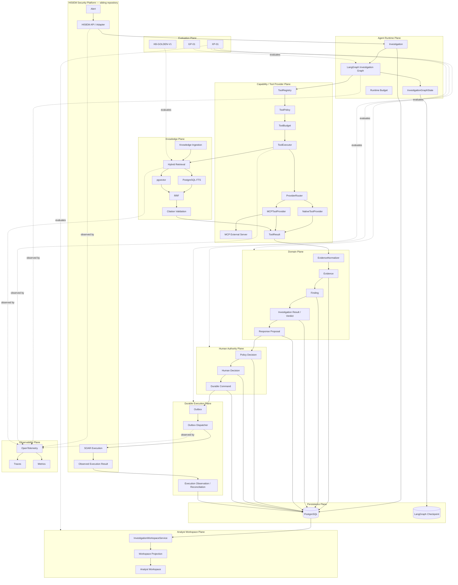
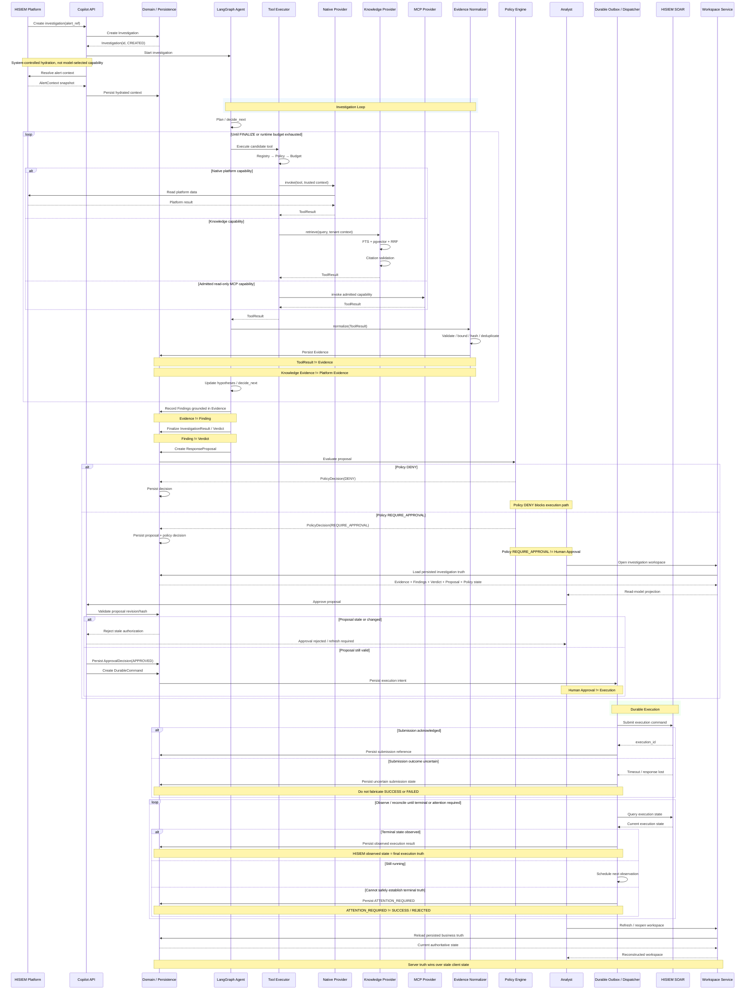

# HISIEM SOC Copilot — Architecture Diagram & Data Flow Diagram

Two canonical diagrams for the system:

1. **[Architecture diagram](#1-architecture-diagram)** — *what the system is made of*
2. **[Data flow diagram](#2-data-flow-diagram)** — *what happens across one investigation lifecycle*

Companion documents: [`architecture-overview.md`](architecture-overview.md) (eight-figure visual
model), [`domain-model.md`](domain-model.md), [`python-package-boundary.md`](python-package-boundary.md),
[`application-commands-domain-events-langgraph-state.md`](application-commands-domain-events-langgraph-state.md).

> **Scope.** These diagrams describe **this repository**. The security platform it runs on —
> ingestion, streaming detection, alerts, cases and deterministic SOAR execution — is the sibling
> repository **[HISIEM](https://github.com/xsc683/HISIEM)**, shown here as an external participant.

---

## 1. Architecture Diagram

Plane-oriented: every component grouped by the responsibility plane that owns it, with the
governance and authority chain made explicit as a flow.

> **On the plane model — why "four" and "eleven" both appear.**
> The frozen architecture contract names **eleven** responsibility planes, and this diagram
> groups components by exactly those eleven. The machine-readable form is the `Plane` enum in
> `evaluation/cross_plane/contracts.py`, whose own docstring says it is *"the planes named by
> the architecture freeze — **not a new taxonomy**"*.
>
> "**Four-plane**" is a different thing: it is the framing of which planes this repository
> **closes** (Knowledge, Capability, Observability, Analyst Experience), with the remaining
> seven treated as **reused rather than re-architected**.
>
> So the two are **not a 1:1 mapping**, and they are not competing taxonomies either: four is a
> **subset** of eleven, presented for a different purpose — *what this project closes* versus
> *which plane a gate belongs to*. **Do not change either side to make the counts agree.**



### What this diagram solves

It answers **"which plane owns which responsibility, and where does authority actually change
hands?"** The vertical chain `ToolResult → Evidence → Finding → Verdict → Proposal → Policy →
Human → Command → SOAR → Observed Result` is the whole system in one line, and each arrow is a
boundary that a plausible implementation would collapse.

### Component responsibilities

| Plane | Owns | Notable non-responsibility |
|---|---|---|
| **Agent Runtime** | Graph orchestration, bounded working state, runtime budget | **Not** business authority |
| **Capability / Tool Provider** | Discovery, admission, selection, invocation, bounded results | **Not** a policy or authorization authority |
| **Knowledge** | Retrieval, fusion, citation validation | **Not** verdict authority |
| **Domain** | Aggregates, invariants, findings, verdict, proposal | Not transport, not orchestration |
| **Human Authority** | Policy evaluation, human consent, durable command | Policy ≠ consent; consent ≠ execution |
| **Durable Execution** | Outbox, dispatch, reconciliation | Not execution truth |
| **Persistence** | PostgreSQL as business truth; LangGraph checkpoint as working memory | Checkpoint is never business state |
| **Analyst Workspace** | Presentation projection of persisted truth | **Not** an authority; invents nothing |
| **Observability** | Traces, metrics, log correlation | **Not** business truth |
| **Evaluation** | GP-01, KB-GOLDEN-V1, XP-01 | Does not write back into production |
| **HISIEM** (sibling) | Security data, detection, alerts, cases, **execution truth** | — |

### Where truth and authority live

```text
Business truth        = domain aggregates persisted in PostgreSQL
Execution truth       = the state HISIEM observes (never Copilot's belief about what it sent)
Orchestration state   = LangGraph checkpoint — working memory only, never business state
Telemetry             = fully side-channel; no business path reads spans or collector state
Model authority       = none. The model proposes; it has no code path to authorize or execute.
```

### The authority boundary

```text
Model-influenced:  ToolResult → Evidence → Finding → Verdict → Response Proposal
─────────────────────────── Authority Boundary ───────────────────────────
Deterministic / human / observed:
                   Policy → Human Decision → Durable Command → HISIEM Execution → Observation
```

Everything above the line is probabilistic. Everything below is a deterministic function, a
person, or an observed fact.

### Reliability boundaries

| # | Boundary | Where | What can go wrong |
|---|---|---|---|
| 1 | Tool boundary | `ToolExecutor` → provider | A typed failure must produce **zero Evidence**, never an empty result |
| 2 | Admission boundary | MCP discovery → registry | An unadmitted capability must be visible to operators but unselectable by the model |
| 3 | Knowledge boundary | retrieval → citation validation | A citation that does not resolve must be rejected, not rendered |
| 4 | Authority boundary | proposal → policy → human | No path may let model output authorize a side effect |
| 5 | Durability boundary | approval → outbox → dispatch | A restart must not lose the command nor create a second business intent |
| 6 | Truth boundary | HISIEM observed state vs. Copilot record | HISIEM wins, always |
| 7 | Workspace boundary | persisted state → projection | A stale client must never win over newer server truth |

---

## 2. Data Flow Diagram

One investigation, from the alert that starts it to the workspace that reconstructs it.



### What this diagram solves

It answers **"in what order does authority change hands, and where can the flow go wrong?"**
Three `alt` blocks carry most of the design:

| Branch | What it protects |
|---|---|
| `Proposal stale or changed` | An approval authorizes a **specific intent**, not a general permission |
| `Submission outcome uncertain` | The system records uncertainty instead of guessing a terminal state |
| `Cannot safely establish terminal truth` | `ATTENTION_REQUIRED` stays a distinct state from `SUCCESS` / `REJECTED` |

### The distinctions the diagram is built to preserve

```text
ToolResult              !=  Evidence
Knowledge Evidence      !=  Platform Evidence
Evidence                !=  Finding
Finding                 !=  Verdict
Policy                  !=  Human Approval
Human Approval          !=  Execution
Submission outcome      !=  Execution success
ATTENTION_REQUIRED      !=  SUCCESS / REJECTED
HISIEM observed state   ==  final execution truth
```

### Load-bearing ordering

```text
1. Hydration is SYSTEM-CONTROLLED, not a model-selected capability.
   The alert context is resolved before the model makes any choice.

2. Registry → Policy → Budget happen BEFORE the provider is invoked.
   A denied or over-budget call must cost nothing on the remote side.

3. Evidence is persisted by the DOMAIN, not held in graph state.
   The checkpoint is working memory; the persisted Evidence is the fact.

4. The approval validates the proposal revision/hash BEFORE the decision is recorded.
   A stale approval is rejected rather than silently applied.

5. Execution intent is persisted to the outbox BEFORE any submission is attempted.
   A restart resumes from the record, not from an in-flight call.

6. Observation persists the state HISIEM reports — not the state Copilot hoped for.
```

---

## Diagram source note

The two diagrams above were supplied as standalone Mermaid sources and are reproduced here as the
canonical pair. **One correction was applied against the code**, consistent with this
repository's rule that the current implementation is the authority:

| Was | Now | Evidence |
|---|---|---|
| `PolicyDecision(ALLOW)` / "Policy ALLOW != Human Approval" | `PolicyDecision(REQUIRE_APPROVAL)` / "Policy REQUIRE_APPROVAL != Human Approval" | `domain/response/enums.py` defines `PolicyDecision = DENY \| REQUIRE_APPROVAL`. There is **no `ALLOW`** value anywhere in the implementation. |

The `else` branch of the policy evaluation is therefore "not denied", which in this system always
means "approval required" — a distinction worth keeping exact, because it is precisely the branch
where human authority enters the flow.
