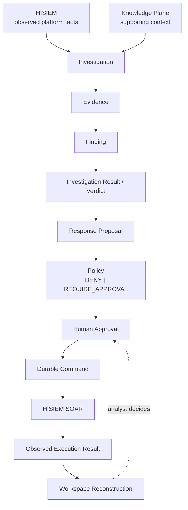
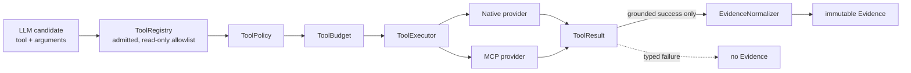
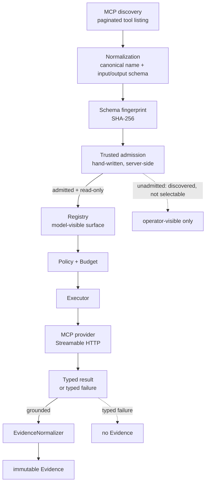
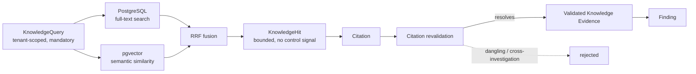
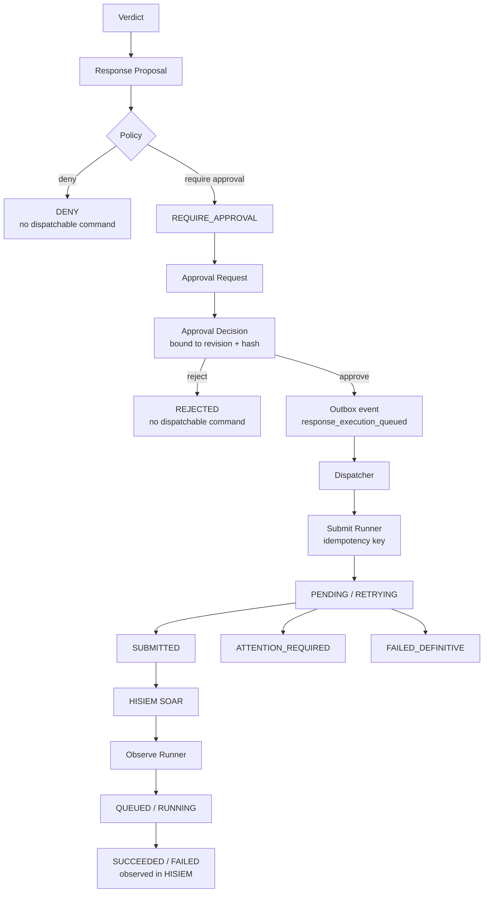
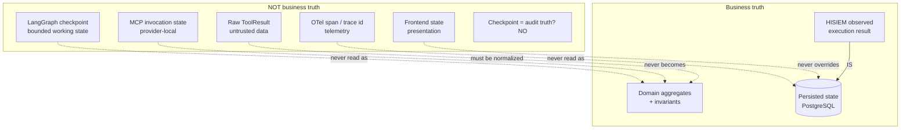
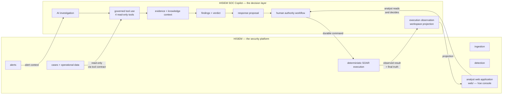

# HISIEM SOC Copilot — Architecture Overview

A concise, diagram-first model of the system. This document is visual navigation only; the
authoritative detail is in [`domain-model.md`](domain-model.md),
[`application-commands-domain-events-langgraph-state.md`](application-commands-domain-events-langgraph-state.md),
[`persistence-schema.md`](persistence-schema.md) and
[`python-package-boundary.md`](python-package-boundary.md).

For the two canonical full-size diagrams (plane architecture + end-to-end data flow),
see [`architecture-diagrams.md`](architecture-diagrams.md).

Figures 1–8, in the order they build on each other.

---

## Figure 1 — Investigation and authority chain

The whole system in one picture.



```text
Model proposes  →  Policy constrains  →  Human authorizes
Durable command records intent  →  HISIEM executes  →  Copilot observes
```

**Where the model's influence ends.** Everything above `Response Proposal` is
model-influenced. Everything from `Policy` downward is deterministic, human, or observed:
policy is a function, approval is a person, the command is durable and idempotent,
execution happens in HISIEM, and the observed result is the final truth.

---

## Figure 2 — Tool and Evidence path

How a model tool choice becomes (or fails to become) Evidence.



**Two properties to notice:**

- **Policy and budget short-circuit before any provider call.** A denied capability or an
  exhausted budget returns without touching a provider.
- **A typed failure produces no Evidence.** The dotted edge is the point of `ToolResult ≠
  Evidence`: a failed, empty or ungrounded tool call cannot be laundered into a fact. This is
  what prevents "false success evidence" — the failure mode where an agent's Evidence looks
  grounded because a broken call returned an empty result.

---

## Figure 3 — MCP admission and invocation

Discovery is not admission, and a provider is not an authority.



| Boundary | Rule |
|---|---|
| Discovery ≠ Admission | A newly discovered tool is visible to operators but is **not** model-selectable |
| Provider ≠ Authority | The server cannot widen its own trust; admission is a server-side declaration |
| Fingerprint drift | Canonical name + input schema + output schema → `SCHEMA_MISMATCH` on change |
| Protocol | A pinned production protocol version; a downgrade is **rejected**, not accepted silently |
| Transport | Trusted configured endpoints only; HTTPS unless explicitly marked internal; redirect/host changes rejected |
| Tenant | Injected server-side; a model-supplied tenant field is rejected |
| Writes | `is_model_selectable` requires `READ_ONLY` — **MCP V1 writes are never model-selectable** |

---

## Figure 4 — Knowledge path

Retrieval produces *supporting context*, never verdict authority.



| Distinction | Meaning |
|---|---|
| **Knowledge Context ≠ Platform Fact** | A knowledge item is explanation and understanding; it is *not* an observed fact. The workspace renders them with different authority labels |
| **Knowledge ≠ definitive verdict authority** | A knowledge-only basis cannot produce a definitive verdict — a hard acceptance gate |
| Tenant is mandatory | `tenant_id` is a required keyword with **no default and no scope-less variant** |
| Hits carry no control signal | `KnowledgeHit` has no `instructions`, `action`, `severity` or `authority` field, asserted against a frozen field set |
| Citations are revalidated | A citation that does not resolve, or that resolves across investigations, is rejected |

---

## Figure 5 — Response and durable execution

Where "recommend" becomes "executed", and where each step can independently fail.



**Two state machines, deliberately separate:**

| Submission status | Meaning |
|---|---|
| `PENDING` / `RETRYING` | We have not handed it over yet, or are retrying |
| `SUBMITTED` | We handed it over. **This says nothing about the outcome.** |
| `ATTENTION_REQUIRED` | We tried; the outcome is **uncertain**; a human must look |
| `FAILED_DEFINITIVE` | A definitive failure — not a guess made from a timeout |

| Execution status | Meaning |
|---|---|
| `QUEUED` / `RUNNING` | HISIEM accepted it and it is in progress |
| `SUCCEEDED` / `FAILED` | HISIEM observed a **terminal** result |

**The invariants this figure exists to protect:**

- A rejection cannot create a dispatchable command.
- An approval binds to a revision and hash — a **stale approval cannot authorize changed
  intent** (TOCTOU).
- Retries preserve **one logical durable intent** (idempotency key `response:<tenant>:<proposal>`).
- An uncertain submit **never** becomes `SUCCEEDED` or `FAILED` by assumption.
- `ATTENTION_REQUIRED` remains an explicit uncertainty state, never collapsed into a
  terminal one.
- Restart or recovery creates **no duplicate business intent**.

---

## Figure 6 — Truth-boundary map

What is *not* allowed to become business truth.



| Non-truth | Why it cannot be promoted |
|---|---|
| **LangGraph checkpoint** | Graph state is cross-step working memory; a restart must not redefine the investigation |
| **OTel span / trace id** | Telemetry loss or a stopped collector must not change any business outcome |
| **Frontend state** | The UI derives presentation from persisted state and invents nothing; server truth wins on refresh |
| **MCP invocation state** | A provider's local view of an invocation is not a durable execution record |
| **Raw ToolResult** | Untrusted data — it becomes Evidence only through the normalizer, and only on a grounded success |

> **HISIEM's observed execution result is the single final execution truth.**

---

## Figure 7 — Evaluation

Three baselines, one non-compensating acceptance pack.

```mermaid
flowchart TD
    subgraph GP01["GP-01 — investigation correctness"]
        MAT["Materializer<br/>real HISIEM resources"]
        SEAL["Sealed manifest"]
        RUN["execute_real_model_run"]
        QUAL["tool-evidence-quality"]
        SCORE["deterministic scorer"]
        REP["bounded repeatability<br/>attempt classification"]
        SUMM["suite summary"]
        MAT --> SEAL --> RUN --> QUAL --> SCORE --> REP --> SUMM
    end

    subgraph KB["KB-GOLDEN-V1 — knowledge"]
        KBC["versioned corpus"]
        KBR["retrieval / citation / ranking"]
        KBC --> KBR
    end

    subgraph XP["XP-01 — cross-plane acceptance"]
        S29["29 scenarios<br/>9 families"]
        G13["13 non-compensating gates"]
        AGG["cross-plane-suite-results/v1<br/>one deterministic aggregate"]
        S29 --> G13 --> AGG
    end
```



**Why the XP-01 aggregate is shaped the way it is:**

| Property | Meaning |
|---|---|
| Non-compensating | No score, weight or pass percentage exists anywhere in it. One FAIL → suite FAIL |
| Completeness-checked | A missing, unknown or failed scenario fails the suite; a scenario missing a required gate result also fails it |
| Deterministic | Byte-identical across reads, independent of input order, no timestamps or run ids in the identity |
| Secret-safe | Secret-scanned **before** the atomic write; no raw prompt, completion, ToolResult or telemetry payload |
| Falsifiable | Directly invalid measurements have been demonstrated to fail each gate |

---

## Figure 8 — Cross-repository boundary

Two repositories, one system.



| HISIEM owns | Copilot owns |
|---|---|
| Security event ingestion | AI-assisted investigation |
| Streaming and detection | Governed tool use |
| Alerts and operational data | Evidence organization and knowledge context |
| Case management | Findings and verdicts |
| **Deterministic SOAR execution and the execution record** | Response proposals and the human-authority workflow |
| Hosting the analyst web application | Execution observation and workspace projection |

**Copilot is never a second SIEM and never a second SOAR.**

> **The Analyst Workspace UI is implemented in the HISIEM repository.** HISIEM owns the
> platform's web application, so the analyst-facing UI — evidence authority classes,
> findings, verdict, policy decision, human decision, submission and execution state —
> lives in `HISIEM/web/`. This repository contains no frontend. The acceptance harness
> executes the real frontend module (`web/src/utils/copilot.js`) rather than restating its
> authority mapping, so the two cannot drift.

---

## Related documents

| Topic | Document |
|---|---|
| Domain model and invariants | [`domain-model.md`](domain-model.md) |
| Commands, events, LangGraph state | [`application-commands-domain-events-langgraph-state.md`](application-commands-domain-events-langgraph-state.md) |
| Persistence schema and constraints | [`persistence-schema.md`](persistence-schema.md) |
| Layer boundaries and their enforcement | [`python-package-boundary.md`](python-package-boundary.md) |
| Tool contract | [`investigation-tool-contract.md`](investigation-tool-contract.md) |
| Model provider contract | [`model-provider-contract.md`](model-provider-contract.md) |
| Knowledge plane | [`p3/`](p3/) |
| Evaluation contracts | [`evaluation/`](evaluation/) |
| Observability | [`observability.md`](observability.md) |
| Local integrated runtime | [`local-integrated-runtime.md`](local-integrated-runtime.md) |
| Engineering process and acceptance evidence | [`stage-reports/`](stage-reports/) |
