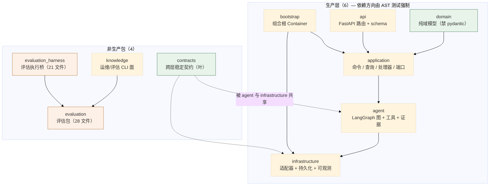
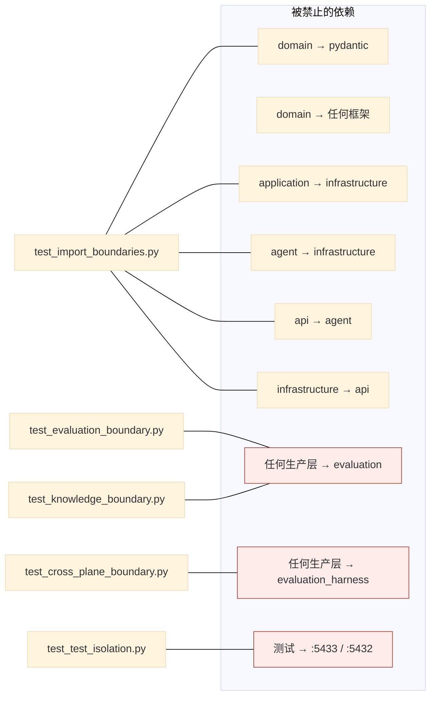
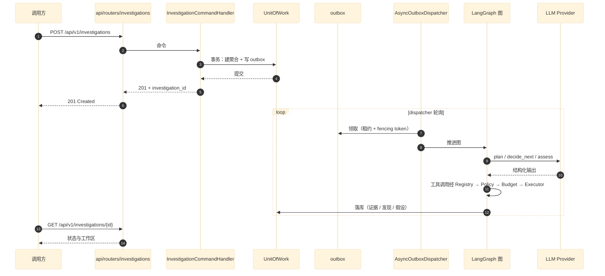

# 00 分层架构与包边界总览

> **本文性质：** 代码级取证补充，**不构成契约**。`docs/README.md` 规定「Architecture and persistence documents are authority」——冲突时以 `python-package-boundary.md` 为准（该文档现有 §1–§39；本集与代码注释引用的 §21/§22 都在其中）。

> **文档类型**：架构总览（代码级核验，非设计提案）
> **分析对象**：`D:\Project\HISIEM-SOC-Copilot`（Hatchling `src/` layout，包根 `src/hisiem_soc_copilot/`；Python 3.12 · FastAPI · LangGraph · SQLAlchemy 2 async + psycopg 3 + pgvector · Alembic · OpenTelemetry · MCP SDK）
> **取证方式**：无 `.codegraph/` 索引，采用**源码直读 + AST 边界测试直读 + grep 统计**；每个关键论断附 `file:line` 锚点
> **结论以当前代码为准**（分支 `capability-mcp` @ `1e567be`）
> **文档集**：00–08 共 9 篇，见 [`README.md`](README.md)

---

## TL;DR

这是一个**把「层边界写成可执行断言」的 AI 调查与响应协作层**——它不替代 HISIEM，而是站在 HISIEM 之上做调查编排与响应**建议**。

工程上体现为**十层包结构**，其中：

- **6 个生产层**（`domain` / `application` / `agent` / `api` / `infrastructure` / `bootstrap`）由 **5 个架构测试**用 **AST 解析**强制依赖方向——**边界不是文档里的约定，是测试会失败的约束**。
- **4 个非生产包**（`contracts` / `knowledge` / `evaluation` / `evaluation_harness`）各自有独立的存在理由，其中 `evaluation` 与 `evaluation_harness` **被禁止被任何生产层导入**——**评估预期永远不能进入运行时**。
- **唯一知道全部具体实现的类是 `Container`**（`bootstrap/container.py:75`），717 行，是整集的组合根。

**最反直觉的一点**：`domain` 层**连 Pydantic 都不能导入**（`tests/architecture/test_import_boundaries.py:32`）。域模型是**纯 Python dataclass**，所有 schema 校验在 `contracts/`。这条约束让 domain 可以被任何环境导入——**包括只有 stdlib 的环境**（`test_import_boundaries.py:97-101` 就是这条的断言）。

---

## 1. 分层总览与依赖方向

### 1.1 包拓扑



**读法**：`domain` 与 `contracts` 是两个**叶节点**（自身零项目内依赖）。`evaluation` 被 `knowledge` 与 `evaluation_harness` 引用，但**没有任何生产层指向它**。

### 1.2 规模实测

**规模**：`find src -name "*.py" -not -path "*__pycache__*" | wc -l` = **230**；`find tests -name "*.py" | wc -l` = **149**。

**逐包的文件数与行数不在此列出**——那是构建产物级别的统计，会随每次重构失真。各包的存在理由与依赖方向见 §2，职责与锚点见 §5。

## 2. 包边界如何强制

### 2.1 关键论断

**论断 1：边界由 5 个 AST 测试强制，不是文档约定。**

`tests/architecture/` 下 5 个测试文件：

| 测试文件 | 强制什么 |
| --- | --- |
| `test_import_boundaries.py` | **6 个生产层之间的依赖方向** |
| `test_evaluation_boundary.py` | 生产层**不得导入** `evaluation`；`evaluation` 自身的允许导入面 |
| `test_cross_plane_boundary.py` | 生产层不得导入 `evaluation_harness` 与 XP-01 oracle；**生产源码不得出现场景 id** |
| `test_knowledge_boundary.py` | 知识上下文的 4 条单向规则 + P3-A 闭包保证 |
| `test_test_isolation.py` | **测试不得指向运维库**（`:5433` / `:5432`）；含 `TRUNCATE`/`DELETE FROM` 的模块不得解析运维库 URL |

**这 5 个测试全部用 `ast.parse` 读源码，不 import 被测模块**——原因写在 `test_test_isolation.py:20-23`：*「导入测试模块会执行它的模块级代码，而那正是这个守卫要管的代码」*。

**论断 2：生产层的禁导入表是显式枚举的。**

```python
# tests/architecture/test_import_boundaries.py:21-53
BOUNDARIES: dict[str, tuple[str, ...]] = {
    "domain": (
        "application", "agent", "infrastructure", "api", "bootstrap",
        "sqlalchemy", "langgraph", "fastapi", "httpx",
        "pydantic", "alembic",
    ),
    "application": (
        "infrastructure", "agent", "api", "bootstrap",
        "sqlalchemy", "langgraph", "fastapi", "httpx",
    ),
    "agent": ("infrastructure", "api", "bootstrap", "sqlalchemy"),
    "api": (
        "infrastructure.persistence", "infrastructure.hisiem",
        "langgraph", "agent",
    ),
    "infrastructure": ("api",),
}
```

| 层 | 读法 |
| --- | --- |
| **`domain`** | **最严**：其他 5 个生产层，外加 `sqlalchemy` / `langgraph` / `fastapi` / `httpx` / **`pydantic`** / `alembic`——域模型是纯 Python，无任何框架 |
| `application` | 不知道适配器存在（禁 `infrastructure` / `agent` / `api` / `bootstrap` + 4 个三方库）；**但允许 `pydantic`** |
| `agent` | 不知道具体适配器与 DB（禁 `infrastructure` / `api` / `bootstrap` / `sqlalchemy`）；**但允许 `langgraph`**（它就是图引擎） |
| `api` | 禁 `infrastructure.persistence` / `infrastructure.hisiem` / `langgraph` / **`agent`** |
| `infrastructure` | 只禁 `api`——适配器不反向依赖 HTTP 层 |

**两处最值得注意**：

1. **`domain` 禁 `pydantic`，`application` 不禁**——域模型不能带 framework 类型。`test_import_boundaries.py:97-101` 用 `test_domain_imports_no_framework` 二次断言 domain 在只导入 stdlib 时可用。
2. **`api` 禁 `agent`**——这是**唯一一条「同层横向」的禁止**。API 层不能直接调图节点，必须经 `application` 的 handler/service。**这条让「HTTP 请求处理」与「AI 编排」之间隔了一层可测试的用例边界。**

**论断 3：「生产层」是一个显式枚举的集合，不是「src 下所有包」。**

`test_knowledge_boundary.py:51-56` 的注释写明 `knowledge` **刻意不是**生产层——它是 operator/evaluation CLI 面，所以允许接触评估 oracle。枚举本身是：

```python
# tests/architecture/test_knowledge_boundary.py:54-56
PRODUCTION_LAYERS = frozenset(
    {"domain", "application", "agent", "api", "infrastructure", "bootstrap"}
)
```

**新增包必须刻意加进这个集合才能被边界测试覆盖**——`test_cross_plane_boundary.py:38-39` 写明：*「a new production package must be added here deliberately before it can import the evaluation planes」*。**取舍是「宁可漏也不误伤」，由 code review 兜底。**

> **同一份枚举在三个测试文件里各写了一遍**（`test_knowledge_boundary.py:54`、`test_cross_plane_boundary.py:40`、`test_evaluation_boundary.py:25` 的 `_PRODUCTION_LAYERS`）。三份必须同时改，否则守卫之间会不一致——这是一处**已知的重复**，不是遗漏。

**论断 4：一条「只写在 docstring 里」的保证事实上没有生效——gap 被显式发现并补上。**

`test_cross_plane_boundary.py:5-12` 的 docstring 记录了这段历史：*「Production layers must not import `evaluation_harness`」* 这条不变量早已写在 harness 包的 docstring 里，**但没有任何地方强制它**——因为 `test_evaluation_boundary` 的导入匹配器**只匹配 `evaluation` 包**，而 `_reaches(target, "evaluation")` 匹配不到 `evaluation_harness`：**分隔符是 `_` 而不是 `.`**。

**修法**是把两条都写成显式常量并断言（`test_cross_plane_boundary.py:44-45`）：

```python
EVALUATION_HARNESS = f"{PACKAGE_ROOT}.evaluation_harness"
EVALUATION = f"{PACKAGE_ROOT}.evaluation"
```

> **这条记录的价值在于它承认了「文档里的保证不等于生效的保证」**。06 篇 §4 有一条同类的守卫静默失效，是同一个失效模式。

**论断 5：`test_test_isolation.py` 关注的是测试的安全性，不是产品代码。**

`test_test_isolation.py:39-46` 定义两条规则：`FORBIDDEN_FRAGMENTS = (":5433", ":5432")`（测试不得把运维库地址写进字符串字面量）与 `DESTRUCTIVE_RE = re.compile(r"\bTRUNCATE\b|\bDELETE\s+FROM\b", re.IGNORECASE)`。

**规则 2 是关键**——`:14-18` 的注释解释了原因：*「单独规则 1 不会注意到一个模块 TRUNCATE 了一个它从变量构造出来的 URL」*。

**允许清单按「文件 + 字面量的稳定子串」为键，不用行号**（`:50-53`）：*「another agent is editing the migration round-trip test, and a line-keyed allow-list would break under their edits and silently stop guarding anything.」* **这是一处很实际的工程判断**：行号键的允许清单会在别人编辑时静默失效。

### 2.2 边界全景



---

## 3. 组合根：`Container`

### 3.1 关键论断

**论断 1：只有 `Container` 知道全部具体实现，这是写在 docstring 里的定则。**

`src/hisiem_soc_copilot/bootstrap/container.py:1-7`：*「Only this layer knows every concrete implementation at once (python-package-boundary.md §21). It wires domain ports to infrastructure adapters and exposes the application services the API routers depend on. Async resources (engines, sessions, HTTP clients) are owned by the lifespan via open()/close().」*

**三条职责**：把端口接上适配器、暴露 application service 给路由、**持有异步资源的生命周期**。

**论断 2：有 5 类异步资源被显式持有。**

`bootstrap/container.py:78-95` 的 `__init__` 声明：1 个 `copilot_engine` + 1 个 `copilot_sessions` + 3 个 HTTP 适配器（`hisiem_adapter` / `soar_adapter` / `embedding_adapter`）+ **3 个 outbox dispatcher**（`dispatcher` / `response_submit_dispatcher` / `response_observe_dispatcher`）+ `_mcp_providers`。

**「3 个 dispatcher」值得注意**：调查、响应提交、响应观测**各有独立 outbox 与独立 dispatcher**——不是共用一个（01 篇 §1 论断 4 讲了为什么）。

**论断 3：组合根显式处理了「无请求作用域的 UnitOfWork」的资源泄漏。**

`bootstrap/container.py:89-95` 的注释：*「Read-only factories below hand out a UnitOfWork that no command will ever close (there is no request scope to close it). The connection they check out is returned here instead, so the pool is not left holding an in-transaction connection that is only released when the garbage collector drops it -- which is exactly the case SQLAlchemy warns about and cannot terminate safely.」*

**这是本项目里最具体的一处资源管理推理**：只读工厂发出的 `UnitOfWork` **没有请求作用域来关闭它**；若不处理，连接会挂到 GC——**而 SQLAlchemy 明确警告过这种「无法安全终结」的情形**。修法是**把连接收回到容器持有的列表里**（`container.py:619` 的 `_read_scoped_unit_of_work`）。

**论断 4：`build_container` 是带缓存的单例工厂。**

`bootstrap/container.py:712-717` 用 `@lru_cache(maxsize=1)` 装饰 `build_container()`——**比手写 `_instance` 更简洁**。

**论断 5：MCP provider 的构建被单独抽成方法，并返回 `dict[str, Any]`。**

`bootstrap/container.py:275` 的 `_build_mcp_providers(self) -> dict[str, Any]`——**返回类型是擦除的**，这是 Stage C 引入 MCP 后的一处泛化。

### 3.2 装配入口

**论断 6：进程入口 `main.py` 的 docstring 明确禁止业务逻辑。**

`src/hisiem_soc_copilot/main.py:1-5`：*「Process entrypoint — loads config, builds the app, runs uvicorn. Only composition lives here: no business logic, SQL, prompts, tool impl, or graph node logic (python-package-boundary.md §22).」*

**论断 7：Windows 上必须显式换事件循环，注释写明了根因。**

`main.py:19-29` 的 `_run_on_selector_loop` 注释：*「psycopg async (the SQLAlchemy async driver) cannot run on the ProactorEventLoop that uvicorn defaults to on Windows, so every DB-backed request and the outbox dispatcher would fail there. uvicorn 0.52 hard-codes that default and ignores the event-loop policy, so the loop factory is passed explicitly here.」*

**三段信息**：psycopg 异步驱动**不能**跑在 Proactor 循环上；uvicorn 0.52 **硬编码**了该默认值且忽略 policy；所以**必须显式传 `loop_factory`**。断言在 `main.py:35-36`（`sys.platform == "win32"`），其他平台用 uvicorn 默认。

**论断 8：FastAPI 应用由工厂函数创建，`lifespan` 管理容器生命周期。**

`api/app.py:27,41-48` 定义 `lifespan`、用 `FastAPI(title=..., lifespan=lifespan)` 建 app、注册 `/healthz` 与 `investigations_router`；`app.py:3` 的 docstring 列出装配内容（lifespan、异常处理器、健康探针）。

## 4. 配置入口

### 4.1 关键论断

**论断 1：单一配置入口 `config.py`（516 行），13 个 `BaseSettings` 分组。**

`config.py:494-511` 的 `Settings` 按域持有 13 个嵌套模型：`database` / `langgraph` / `hisiem` / `soar` / `llm` / `agent_budget` / `observability` / `mcp` / `auth` / `evaluation` / `knowledge` / `embedding` / `app`。环境变量靠 `pydantic-settings` 的 `env_nested_delimiter` 展开。

**论断 2：`get_settings` 也是 `lru_cache` 单例（`config.py:514-516`）。**

**所以「配置」在进程内只被解析一次**——测试里改环境变量需要清缓存。

**论断 3：两个数据库 URL 是分开的，且 checkpoint 库另有 `schema_name`。**

`config.py:28,37-42` 的 `DatabaseSettings.database_url`（Copilot 自己的库）与 `:43,52-55` 的 `LangGraphSettings.database_url` + `schema_name` 是**两个独立配置**。这与 07 篇的持久化分层对应。

**论断 4：`llm.provider` 有两个取值，默认 `scripted`。**

`config.py:95`：`provider: Literal["scripted", "openai_compatible"] = "scripted"`。

**默认是脚本化假模型，不是真模型**（`infrastructure/llm/scripted.py` 与之对应）。**这是一条重要的默认值选择：未配置 LLM 时系统仍可运行**（用确定性的脚本化响应），测试与本地开发都依赖它。

**论断 5：`llm` 还有 `zdr` 与 `structured_output_mode` 两个语义选项。**

`config.py:104` 的 `zdr: bool = Field(default=True)`——Zero Data Retention 默认**开**；`config.py:107` 的 `structured_output_mode: str = Field(default="auto")`。

**论断 6：Agent 预算有 6 个独立上限，但只有 4 个真正被强制。**

`config.py:119-126` 定义 `max_steps=20` / `max_tool_calls=30` / `max_tool_calls_per_step=4` / `max_llm_calls=20` / `max_llm_tokens=20_000` / `max_duration_seconds=600`，全部 `ge=1`。

| 上限 | 是否强制 | 强制点 |
| --- | --- | --- |
| `max_steps` | **是** | `RuntimeBudget.can_take_step`（`agent/graph/budget.py:66-94`） |
| `max_tool_calls` | **是** | `RuntimeBudget.can_execute_tool` |
| `max_llm_calls` | **是** | `RuntimeBudget.can_call_llm` / `can_consult_decide` |
| `max_duration_seconds` | **是** | `RuntimeBudget.deadline_exceeded` |
| **`max_tool_calls_per_step`** | **无任何强制点** | 只有定义（`config.py:121`）；`BudgetLimits` 的 5 个字段里**根本没有它** |
| **`max_llm_tokens`** | **未强制** | 代码显式标注为 *「reserved for a real provider's token accounting (**no fake accounting is done today**)」*（`domain/investigation/value_objects.py:50-53`） |

> **两个上限是惰性配置**（声明了但当前不生效）——**「配置项存在」不等于「约束生效」**。

**论断 7：`auth.trusted_context_provider` 有三档，默认 `none`。**

`config.py:321`：`Literal["none", "header", "hisiem_bearer"] = "none"`——**默认不信任任何来源**。`infrastructure/auth/` 下的 `header_provider.py` 与 `hisiem_service_provider.py` 与之对应。

**论断 8：MCP 默认关闭，且配置分三层。**

`config.py:215` 的 `enabled: bool = False`；校验入口是 `config.py:223` 的 `_validate_trusted_manifest`。三层是：

| 模型 | 作用 |
| --- | --- |
| `MCPServerSettings` | 服务端定义：`server_id` / `endpoint` / `protocol_version` / `trusted_internal_transport` / `allowed_hosts` / `auth_token_env` / `server_category` |
| `MCPAdmissionSettings` | **准入门**：`internal_name` / `external_name` / `input_schema` / `result_schema` / **`expected_external_schema_fingerprint`** / **`risk`（`READ_ONLY` / `HIGH_RISK` / `WRITE`）** / `tenant_scope` / `model_selectable` / `result_bounds` |
| `MCPResultBoundsSettings` | 结果边界：`timeout_seconds` / `max_items` / `max_serialized_bytes` / `max_text_chars` / `max_depth` |

**`protocol_version` 是 `Literal["2026-07-28"]`**（`config.py:158,216`）——**协议版本被写死在类型里**，不是字符串配置：传别的值会**校验失败**，而不是运行时降级。**`risk` 默认 `READ_ONLY`**（`config.py:203`），但准入仍要求显式声明（见 03 篇）。

**论断 9：embedding 默认 `unconfigured`，且 `distance_metric` 只有一个取值。**

`config.py:470` 的 `provider: Literal["unconfigured", "openai_compatible"] = "unconfigured"`，配套的显式谓词是 `config.py:485` 的 `is_configured()`。**`distance_metric: Literal["COSINE"]`（`config.py:479`）只有一个取值**——**用类型表达「只支持余弦距离」**，与 P3-A 的「无 ANN 索引」取向一致（见 06 篇）。

## 5. 模块职责总表

| 包 | 职责 | 关键锚点 |
| --- | --- | --- |
| `domain` | 纯域模型（聚合根、实体、值对象、事件、错误） | `domain/investigation/aggregate.py`、`domain/response/aggregate.py` |
| `application` | 用例编排（命令、查询、处理器、服务）+ 端口定义 | `application/ports/unit_of_work.py`、`application/services/workspace_service.py` |
| `agent` | LangGraph 图、工具执行、证据归一化、Prompt 与模型契约 | `agent/graph/builder.py`、`agent/tools/registry.py` |
| `api` | HTTP 交付（2 个路由模块、4 个 schema 模块） | `api/app.py`、`api/routers/investigations.py` |
| `infrastructure` | 全部具体适配器与持久化实现（**68 文件**，最大包） | `infrastructure/persistence/`、`infrastructure/durable/` |
| `bootstrap` | 组合根 | `bootstrap/container.py:75` |
| `contracts` | 跨层稳定契约（叶，被 `agent` 与 `infrastructure` 共享） | `contracts/tools/types.py`、`contracts/llm/types.py` |
| `knowledge` | 运维/评估 CLI 面（**非生产包**） | `knowledge/cli.py` |
| `evaluation` | 评估包（**禁被生产层导入**） | `evaluation/oracle.py`、`evaluation/sealer.py` |
| `evaluation_harness` | 评估执行桥（**禁被生产层导入**） | `evaluation_harness/harness.py` |

**依赖方向见 §1.1 的拓扑图，边界如何强制见 §2**——本表只回答「哪个包负责什么、从哪读起」。

## 6. 一次调查的生命周期（控制面视角）



**这张图的要点是「同步创建、异步推进」**：`POST` 只落聚合与 outbox 行就返回（`api/routers/investigations.py:53` 的 201），图由 dispatcher 在事务之外推进。**完整数据流（含失败三分类、检查点、证据归一化）见 01 篇**；关键锚点是 `container.py:309` 的 `outbox_dispatcher`、`:201` 的 `investigation_runner` 与 `agent/graph/builder.py` 的图构建。

## 7. 运行模式开关

| 开关 | 默认 | 作用 | 证据 |
| --- | --- | --- | --- |
| **`llm.provider`** | **`scripted`** | 模型提供方；`scripted` = 确定性假模型 | `config.py:95` |
| `llm.zdr` | `true` | Zero Data Retention | `config.py:104` |
| `llm.structured_output_mode` | `auto` | 结构化输出模式 | `config.py:107` |
| **`app.enable_dispatcher`** | **`false`** | 是否启用 outbox 派发（调查推进） | `config.py:272` |
| **`app.enable_response_worker`** | **`false`** | 是否启用响应观测 worker | `config.py:276` |
| `app.response_observe_interval_seconds` | `15.0` | 响应观测轮询间隔 | `config.py:282` |
| **`observability.tracing_enabled`** | **`false`** | OTel 追踪开关 | `config.py:137` |
| `observability.trace_sample_ratio` | `1.0` | 采样率 | `config.py:139` |
| **`mcp.enabled`** | **`false`** | 是否启用 MCP provider | `config.py:215` |
| `mcp.refresh_interval_seconds` | `0.0`（即不刷新） | MCP 工具重发现间隔 | `config.py:217` |
| **`auth.trusted_context_provider`** | **`none`** | 入站信任来源；`none` = 不信任 | `config.py:321` |
| **`embedding.provider`** | **`unconfigured`** | 嵌入提供方 | `config.py:470` |
| `embedding.normalization` | `NONE` | 向量归一化 | `config.py:478` |
| `app.debug` | `false` | 调试模式 | `config.py:266` |

> **默认值画像**：**7 个关键开关默认「关闭/不信任/假实现」**——`scripted` LLM、关闭的 dispatcher、关闭的响应 worker、关闭的追踪、关闭的 MCP、不信任的 auth、未配置的 embedding。
>
> **这不是保守，而是「默认不产生外部副作用」**：新克隆的仓库 `pip install -e . && uvicorn` 起来后**不会调用真模型、不会推 outbox、不会连 MCP**。要真跑必须显式开。见 07 篇。

---

## 8. 关键设计原则（从代码反推）

| # | 原则 / 变更守则 | 代码证据 |
| --- | --- | --- |
| 1 | **层边界是测试断言，不是文档约定** | 5 个 `tests/architecture/test_*.py` 用 `ast.parse` 强制 |
| 2 | **`domain` 无框架依赖** | `test_import_boundaries.py:32` 禁 `pydantic`；`:97-101` 断言仅 stdlib 可导入 |
| 3 | **「生产层」是显式枚举，不是全集** | `test_knowledge_boundary.py:54-56`；`test_cross_plane_boundary.py:38-42` |
| 4 | **评估预期永不可进运行时** | `test_evaluation_boundary.py:1-13`（禁导入 `evaluation`）；`test_cross_plane_boundary.py:18-27` 的三条规则（禁导入 harness / 禁导入 oracle / **源码不得出现场景 id**） |
| 5 | **只有组合根知道全部实现** | `bootstrap/container.py:1-7` docstring |
| 6 | **无请求作用域的资源必须显式回收** | `container.py:89-95` + `:619` |
| 7 | **契约叶节点向内收敛** | `contracts/` 被 `agent` 与 `infrastructure` 双向引用，自身不依赖任何生产层 |
| 8 | **协议版本进类型系统** | `config.py:158,216` `Literal["2026-07-28"]` |
| 9 | **默认不产生外部副作用** | 7 个关键开关默认关闭 / 不信任 / 假实现（§7） |
| 10 | **进程入口零业务逻辑** | `main.py:1-5` docstring 显式禁止 |
| 11 | **`api` 不得直接导入 `agent`** | `test_import_boundaries.py:46-51`——必须经 `application` |
| 12 | **测试不得写运维库字面量，含破坏性语句的模块不得解析运维库 URL** | `test_test_isolation.py:39-46`，允许清单按「文件 + 稳定子串」为键（`:50-53`） |
| 13 | **新增层或改依赖方向，必须同步更新 `BOUNDARIES` 与 `PRODUCTION_LAYERS`** | `test_import_boundaries.py:21-53`；三处枚举必须同时改（§2 论断 3） |

> 前 10 条是从代码反推的设计原则，后 3 条是**改代码时的守则**——两者同源（都来自那 5 个架构测试），所以合成一张表。
