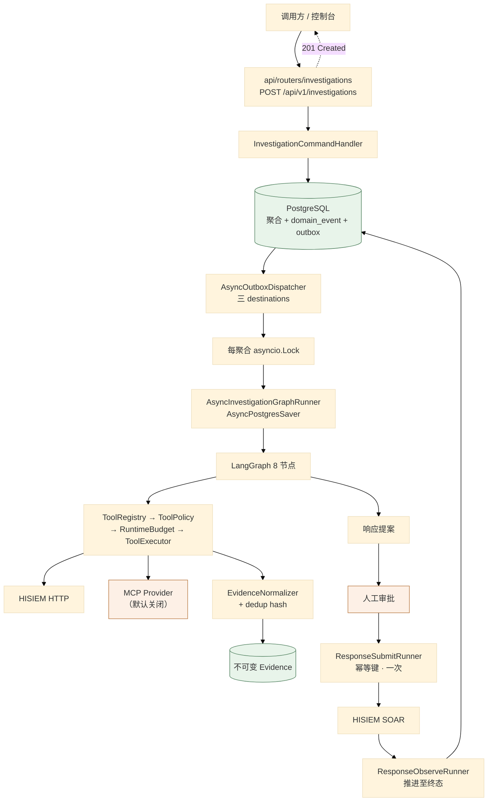
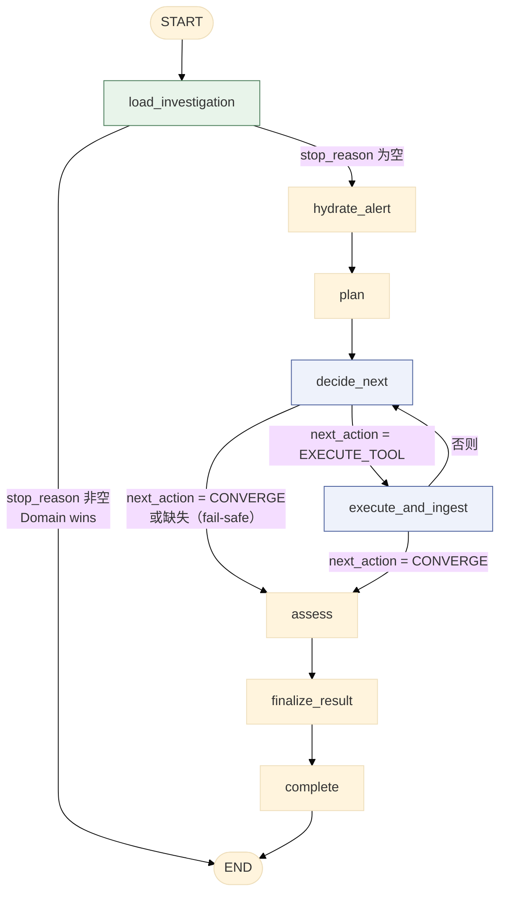

# 01 端到端关键数据流

> **本文性质：** 代码级取证补充，**不构成契约**。`docs/README.md` 规定「Architecture and persistence documents are authority」——冲突时以 `application-commands-domain-events-langgraph-state.md` 为准。

> **文档类型**：数据流取证（代码级核验，非设计提案）
> **分析对象**：`D:\Project\HISIEM-SOC-Copilot`
> **取证方式**：源码直读 + grep 统计；每个关键论断附 `file:line` 相对路径锚点
> **结论以当前代码为准**（分支 `capability-mcp` @ `1e567be`）
> **文档集**：00–08 共 9 篇，见 [`README.md`](README.md)

---

## 一句话定位

本文逐条拆解贯穿 Copilot 的 **7 条端到端数据流**——从一次 HTTP 调查请求，到响应动作被 HISIEM 执行并被观测到终态。

每条数据流的写法固定为三段：**关键论断（带 `file:line` 锚点）→ 时序图（mermaid）→ 源码落点行**。

> **模式：论断先行，图佐证论断。** 图里画的每条消息，正文都能指到对应代码行。

---

## 0. 主链总览



**源码落点行**：

| 环节 | 锚点 |
| --- | --- |
| HTTP 入口 | `api/routers/investigations.py:53`（`POST ""`） |
| 命令处理器 | `application/handlers/investigation.py` |
| outbox 派发 | `infrastructure/durable/dispatcher.py:118`（`AsyncOutboxDispatcher`） |
| 三个 destination | `dispatcher.py:45,50,51` |
| 每聚合锁 | `dispatcher.py:142,147-153` |
| 租约续期 | `dispatcher.py:268-304` |
| 图 runner | `infrastructure/durable/investigation_runner.py:63` |
| 图装配 | `agent/graph/builder.py:63-111` |
| 预算 | `agent/graph/budget.py` |
| 工具执行 | `agent/tools/executor.py`、`policy.py`、`registry.py` |
| 证据归一化 | `agent/evidence/normalizer.py:29` |
| 响应 runner | `infrastructure/durable/response_runner.py`（783 行） |

---

## 1. 数据流：调查创建（HTTP → 事务 + outbox）

### 1.1 关键论断

**论断 1：创建调查返回 `201 Created`，但工作在图里异步发生。**

`api/routers/investigations.py:50,53` 的 `@router.post("", status_code=status.HTTP_201_CREATED, ...)`。

**201 而不是 202**——语义是「资源已创建」（聚合已落库），**不是**「任务已受理」：**聚合的创建是同步的，异步的只是图的推进**。

> **与 SIEM 侧的对照**：HISIEM 的 `detection-rules/deploy` 返回 **`202 PENDING`**（SIEM 01 篇），因为那里连**期望态**都还没收敛。这里返回 201 是因为**聚合已经是完整的事实**。

**论断 2：HTTP 层不得直接碰 agent——这是 AST 强制的。**

`tests/architecture/test_import_boundaries.py:46-51` 把 `agent` 与 `langgraph` 列进 `api` 的禁导入表——所以路由层**不可能**自己构图或跑图，只能调 `application` 的 handler。**这是 00 篇 §2.1 论断 2 那条边界的具体落点。**

**论断 3：创建走「命令 → 事务内落聚合 + 写 outbox」。**

入队点不在 dispatcher 里——`infrastructure/durable/dispatcher.py:42-44` 的注释指明它住在 `infrastructure.persistence.repositories.durable._EVENT_DESTINATIONS`：*「Outbox destinations — one dispatcher claims exactly one destination. The event→destination map that enqueues these lives in `...durable._EVENT_DESTINATIONS`.」*

**所以「事件类型 → destination」是一张显式的表**，不是散落的 if-else（见 07 篇）。**destination 列与 outbox 行在同一张表上**——`claim_batch` 直接对 `OutboxMessageRow.destination` 过滤（`durable.py:442-445`），没有第二张路由表。

**论断 4：三个 destination 各有独立 dispatcher——谁也饿不死谁。**

`dispatcher.py:45-51` 定义 `INVESTIGATION_DESTINATION = "investigation.graph.run"`、`RESPONSE_SUBMIT_DESTINATION = "response.execution.submit"`、`RESPONSE_OBSERVE_DESTINATION = "response.execution.observe"`。

| destination | 语义 | 为什么独立 |
| --- | --- | --- |
| `investigation.graph.run` | 推进调查图 | — |
| `response.execution.submit` | **取得真实 provider 执行 id，恰好一次**（幂等键） | 提交是**一次性**动作 |
| `response.execution.observe` | 把已提交的执行推往终态 | 观测是**长期轮询**动作 |

**注释里那句「neither can starve the other」是关键理由**：若 submit 与 observe 共用 dispatcher，**一个慢的 observe 会阻塞所有 submit**。

## 2. 数据流：outbox 派发（**三分类失败**是核心）

### 2.1 关键论断

**这条流的全部要点是「失败分三类，只有一类可以进死信」。**

**论断 1：三分类写在类 docstring 里。**

```python
# infrastructure/durable/dispatcher.py:10-15
Failures split into three classes, and only ONE of them may ever dead-letter:
- resolution failed (we cannot even name the aggregate) → retry forever, the
  dead-letter budget is never touched;
- the runner raised a deterministic ``NonRetryableRunError`` → DEAD_LETTER at once;
- the runner failed recoverably → retry with backoff, and at budget exhaustion the
  DESTINATION's exhaustion hook writes the business fact before the DEAD_LETTER.
```

| 失败类 | 处置 | 消耗死信预算？ |
| --- | --- | --- |
| **解析失败**（连聚合都叫不出来） | **永远重试** | **否** |
| **确定性不可重试**（`NonRetryableRunError`） | **立即死信** | 是（立即） |
| **可恢复失败** | 退避重试，预算耗尽时**先写业务事实**再死信 | 是（耗尽时） |

**论断 2：解析失败永不消耗死信预算——理由是一段完整的论证。**

`dispatcher.py:196-213` 的注释：*「A failed RESOLUTION says nothing about the business outcome: we cannot even name the aggregate this delivery belongs to, so no destination hook can be consulted and no business fact can honestly be written. Spending the dead-letter budget here would drop the responsibility silently — a submit stuck at PENDING/RETRYING, an execution left RUNNING with its reconciliation gone for good, or a local event that was merely unreadable at that instant discarded permanently. The delivery stays retryable; backoff still bounds the attempt rate.」*

**论证链**：解析失败**说不出业务结果**（→ 没有 destination hook 可问 → 写不出诚实的业务事实 → 花掉死信预算就等于**静默丢弃职责**）。所以保持可重试，靠退避**限制尝试速率**而非尝试次数。

**注意日志只记 `type(exc).__name__`**（`:211`，与注释 `:206` 的「never the exception's own text」对应）——**这是「日志不泄漏供应商细节」的一条具体落点**。

**论断 3：`Resolver` 协议把「事件没了」与「读失败」拆成两个事实。**

**`None` vs 抛异常是两个不同的业务事实**：`None` = 事件真的没了 → **标记 PUBLISHED 并了结**（`dispatcher.py:214-221`）；抛异常 = 这次读失败 → **保持可重试**。**用返回值而非异常表达「没有」，正是为了让两者可分。**

**论断 4：`NonRetryableRunError` 只暴露稳定错误码，不带供应商文本。**

`infrastructure/durable/investigation_runner.py:48-60` 的类 docstring：*「A deterministic runner failure the outbox dispatcher must NEVER retry. Used for provider configuration/deployment failures (e.g. `MODEL_CONFIGURATION`) that a bounded backoff retry can never fix. Exposes ONLY a stable safe `code` — never the underlying provider/exception text.」*，`code = "RUN_FAILED_FATAL"`。**死信时只写 `exc.code`**（`dispatcher.py:243`）。

**论断 5：耗尽时的业务事实由 destination 自己写——重试预算是传输概念，业务含义不是。**

`dispatcher.py:71-86` 的 `ExhaustionHandler` 协议：*「A retry budget is a TRANSPORT concern; what it MEANS for the business is not. The generic dispatcher therefore does not guess: when a destination's attempts run out it asks the destination's own handler to persist whatever business fact the exhaustion implies (for submit: "nobody knows whether the provider accepted it, a human must look"), and only then dead-letters the row. This keeps the durable projection and the outbox from ever disagreeing — an outbox row in DEAD_LETTER while the projection still says "retrying" is a lie the workspace would keep showing.」*

**这是本文最值得单独记住的一段设计推理**：**通用 dispatcher 不猜业务含义**，而是**问 destination「耗尽意味着什么」**。

**顺序是硬约束：hook 先写业务事实，再死信**（`dispatcher.py:325-346`）。若 hook 失败，**投递保持可重试而不死信**（`:333-341` 捕获后 `_retry_later` 并 return），理由在 `:317-319`：*「死信旁边放一个仍写着 retrying 的投影，是 workspace 会一直展示的谎言」*。

**论断 6：租约在长跑期间持续续期，续期失败被忽略，最终由 token fence 裁决归属。**

`dispatcher.py:226-235`：*「A long run must not be stolen by the fixed lease: renew the lease WHILE the run is in flight. Each renewal is token-fenced, so only the current owner extends the lease; a stale worker's renewal is a no-op.」*；`:268-277` 的方法 docstring 补充：*「Renewal failures are ignored (the run continues): if the lease was genuinely lost to a reclaim, the final settlement will be rejected by the token fence and the reclaiming worker owns the row.」*

**「续期失败被忽略」是有意的**——**「谁拥有这一行」由结算时的 token 校验决定，不由续期成功与否决定。这是 fencing 的正确用法：不靠预防，靠结算时校验。**

**续期间隔 = `_LEASE_TIMEOUT_SECONDS / 2.0`**（`:278`），租约超时 60 秒（`:54`）→ 每 30 秒续一次。

**续租 SQL 的条件是 `id + status=PROCESSING + lease_token`**（`durable.py:506-536`，docstring `:516`：*「The UPDATE is conditioned on `id + status=PROCESSING + lease_token`」*）——**三条件 fencing**。

**论断 7：in-process 的每聚合锁防止同一调查并发跑两次。**

`dispatcher.py:17-18` 的 docstring：*「An in-process per-investigation lock guarantees that duplicate/concurrent outbox delivery never launches two runs of the same investigation.」*，实现在 `:141-153`（`self._running: dict[UUID, asyncio.Lock]` + `_lock_for`）。

**注意这是进程内锁**（注释 `:141` 明说 in-process）——**跨进程的重复由租约 + token fence 兜底。两级防护，各管一层。**

**`_running` 字典只增不减**：`_lock_for` 只 `get`/`set`，**没有任何清理路径**——长期运行会随聚合数持续增长。这是一处**已知的、尚未处理的**增长点，不是遗漏。

**论断 8：退避是有界指数，保证「永远重试」不等于「无限速率」。**

`dispatcher.py:373-376` 的 `_backoff_seconds`：`min(int(2**attempt_count), _MAX_BACKOFF_SECONDS)`，上界 120 秒（`:57`）。**这就是论断 2 里「retry forever」安全的依据**——次数无限但速率有界。

**论断 9：轮询循环吞掉瞬时异常保持 worker 存活，但必须重抛 `CancelledError`。**

`dispatcher.py:396-404` 的 `_loop`：`except asyncio.CancelledError: raise` 在先，`except Exception` 只 warn。**重抛是停机指令能被感知的前提**——`except Exception` 在 Python 3.8+ 本就不捕获 `CancelledError`（它继承 `BaseException`），但显式写出来更清楚。

**论断 10：destination 不匹配的行被直接死信，错误码 `UNKNOWN_DESTINATION`。**

`dispatcher.py:181-193` 的 `_deliver_claimed` 先比对 `record.destination != self._destination`。**这是防御性检查**：理论上不该发生（claim 已按 destination 过滤），但万一发生**立即死信而不是无限重试**——因为「destination 不认识」是确定性事实。

**论断 11：领取是乐观 CAS，不是 `FOR UPDATE SKIP LOCKED`，且整批一个提交。**

`durable.py:397-504` 的 `claim_batch` 分两步：先 `select` 出候选（`:421-448`，条件覆盖 PENDING 到期、FAILED 到期、PROCESSING 且租约已过期三类），再对每一行发**条件式 `UPDATE`**（`:473-486`），`rowcount == 0` 就 `continue`（`:487-488` 注释：*「another worker claimed/reclaimed it first」*）。

**所以并发安全来自「条件 UPDATE + 行数判定」这次 CAS，不是行锁**——`SELECT ... FOR UPDATE SKIP LOCKED` 在全仓并未使用。**`commit()` 在批循环之外**（`:503`）：整批一个事务。

**一处细节值得记住**（`:466-472` 的注释）：`attempt_count` 必须在 UPDATE **之前**算好并复用同一个值——因为 ORM 的 session 同步会在 UPDATE 后刷新内存实例，**再读一次 `row.attempt_count` 会让记录比落库值多 1，从而提前烧掉一轮重试预算**。

## 3. 数据流：图执行（8 节点 + 检查点）

### 3.1 关键论断

**论断 1：图是 8 个节点、两条条件边、一条回环。**

`agent/graph/builder.py:1-7` 的 docstring 给出形状：`START → load_investigation → hydrate_alert → plan → decide_next`，从 `decide_next` 分出调查回环（`execute_and_ingest → decide_next`）与收敛路径（`assess → finalize_result → complete → END`）。落地在 `builder.py:75-107`。

**唯一的回环**是 `decide_next ⇄ execute_and_ingest`（`builder.py:100-104`）。

**论断 2：路由由确定性标记驱动，不由自由文本。**

`builder.py:15-17`：*「Routing is driven by deterministic `next_action` / `assessment` markers that nodes write into state (never by free text). The model is consulted only inside nodes; edges never ask the model.」*，实现在 `:34-44` 的 `_route_decide` / `_route_after_tool`。

**`_route_decide` 结尾的 `or nodes.CONVERGE` 是 fail-safe 默认值**——状态里没有 `next_action` 时**收敛而不是继续循环**。**默认方向很重要**：选「继续」会让一次状态缺失变成无限循环。

**论断 3：`execute_and_ingest` 把「一次工具调用」与「证据落库」合并成一个节点——为了检查点安全。**

`builder.py:9-13`：*「`execute_and_ingest` performs one allowlisted read tool AND records its normalized Evidence in a single node, so the bounded ToolResult is consumed within one checkpoint step — a crash/replay re-runs the whole node, and both the tool audit (by-key) and Evidence (by dedup key) are idempotent, so a checkpointed resume never loses or duplicates evidence.」*

**这是本文里最值得单独记住的一处检查点推理**：若工具调用与证据落库分成两个节点，崩在中间会丢失证据（工具已执行但结果没落库，重放时要重新执行工具，**而工具可能有副作用或成本**）。合并成一个节点后，崩溃只会重放整节点，靠**工具审计按 key 幂等 + 证据按 dedup key 幂等**保证不重复。

**论断 4：加载节点可以直接结束图（不重跑终态调查）。**

`builder.py:47-51` 的 `_route_after_load`：`if state.get("stop_reason"): return END`；`investigation_runner.py:5-6` 的 docstring 把它概括为 *「refuses to re-run a terminal investigation (Domain wins over checkpoint)」*。

**「Domain wins over checkpoint」是一条重要的优先级**：检查点是**执行层**的进度记录，领域聚合是**业务事实**——**业务事实优先**。若聚合已是终态（取消/完成），检查点里有什么都不重要。

**论断 5：runner 的五步流程写在 docstring 里，第三步的 `thread_id` 是确定性的。**

`investigation_runner.py:1-15` 列明：加载领域调查（短事务）→ 拒绝重跑终态调查 → 确保 `OrchestrationBinding` 存在（确定性 `thread_id`）→ 用工作流启动命令把 `CREATED → RUNNING` → 针对绑定线程编译并运行图（`AsyncPostgresSaver`，从已有检查点恢复）。

**注意第 3 步与 `builder.py:114-126` 的 `thread_config` 对应**，其 docstring 写明：*「Investigation ID and LangGraph thread_id remain distinct identities; the orchestration_binding table records their mapping. Until a full runtime is wired, threads are keyed by the investigation id as a stable placeholder.」*

> **「investigation_id 与 thread_id 是两个不同身份」，但当前实现用 investigation_id 当占位**——`orchestration_binding` 表记录映射。**这是一处「设计上分离、实现上暂合」的地方**，评审时应说明。

**论断 6：检查点是可选的（`checkpointer=None` 时也能编译）。**

`builder.py:63-69,109-111` 的 `build_investigation_graph(runtime, checkpointer=None)`：docstring 说 `checkpointer` 可选，提供时（如 LangGraph 的 `AsyncPostgresSaver`，由 `langgraph_checkpoint` schema 承载）持久化有界状态；实现是 `builder.compile(checkpointer=...)` 或 `builder.compile()`。

**`checkpointer=None` 对应无持久化的运行**（测试与本地开发用）；生产走 `langgraph_checkpoint` schema（独立 DB schema，见 07 篇）。

### 3.2 图拓扑



---

## 4. 数据流：工具调用（五段链）

### 4.1 关键论断

**论断 1：五段链写在 executor 的 docstring 里。**

`agent/tools/executor.py:1-8`：*「Chain (investigation-tool-contract.md §2): candidate → schema validation → authenticated scope binding → policy/budget → provider adapter → typed ToolResult. The executor NEVER reads tenant/actor/authorization from model arguments; those come from the ToolExecutionContext the graph builds from trusted state.」*

**「executor 永不从模型参数读 tenant/actor/授权」是整条链的安全前提**。

**论断 2：策略层负责「模型选了候选，系统绑上边界」。**

`agent/tools/policy.py:1-7`：*「The policy layer is where "the model chose a candidate, the system binds the bounds". It enforces the bounded search windows / limits from investigation-tool-contract.md §15 on top of the strict per-tool argument schema, and it refuses execution when the investigation budget is exhausted.」*

**两层校验的分工**：`schema`（`args.py`）校验参数的**类型与形状**；`policy`（`policy.py`）校验参数**在业务边界内**（时间窗、上限）。

**论断 3：单次搜索窗口硬上限 24 小时，且是常量。**

`agent/tools/policy.py:16-17` 的 `MAX_SINGLE_CALL_SPAN_HOURS = 24` 与 `SECONDS_PER_HOUR = 3600`，校验在 `:28-32` 的 `validate_search_span`（docstring：*「A single agent search must not exceed the Copilot 24h bounded window.」*）。

**「Copilot 24h bounded window」是产品级约束**——模型不能通过构造一个超大时间窗拉取全量日志。

**论断 4：预算耗尽与策略违例是两个不同的异常，后者是前者的父类。**

`policy.py:20-25`：`ToolPolicyError(ValueError)` 与 `ToolBudgetExhausted(ToolPolicyError)`。**调用方可以只捕父类处理所有策略类拒绝，也可以单独捕预算耗尽**——**这个继承关系把「预算也是一种策略」表达出来了**。

**论断 5：注册表的模型可选面恰好等于 executor 真正实现的那一组。**

`agent/tools/registry.py:1-12`：*「V1 only registers READ_ONLY tools, and the registry's model-selectable surface is EXACTLY the set the executor actually implements. `hisiem.get_alert_context` is system-controlled (the graph hydrate node calls the HISIEM get_alert directly) and is never offered to the model. Spec-defined but NOT-yet-implemented tools (entity activity, threat-intel, knowledge lookups) are cataloged separately (`FUTURE_CATALOG_TOOLS`) purely as documentation — they are NOT registered, so the model can never select a tool with no executor, schema, or policy backing it.」*

| 规则 | 含义 |
| --- | --- |
| **只有 `READ_ONLY`** | `ToolCapability = Literal["READ_ONLY"]`（`registry.py:26`）——**类型里只有一个取值** |
| **模型可选面 = executor 实现集合** | 不存在「注册了但没实现」的工具 |
| **未来工具只进 `FUTURE_CATALOG_TOOLS`** | **模型永远选不到没有执行器的工具** |

**论断 6：系统控制的工具与模型可选的工具是两个集合。**

`registry.py:28` 的 `SYSTEM_CONTROLLED_TOOL = "hisiem.get_alert_context"`，与 `:31-32` 的 `AGENT_SELECTABLE_TOOLS` 分开。

**`hisiem.get_alert_context` 由 `hydrate_alert` 节点直接调 HISIEM，从不提供给模型**——**这是一条容易忽略的安全边界**：「取告警上下文」是调查的前提，不是模型的选项。若它进模型可选面，模型可以选择不取上下文就下结论。

**论断 7：预算是一个值对象，没有任何节点直接递减计数。**

`agent/graph/budget.py:1-22` 的 docstring：*「RuntimeBudget — the single deterministic authority over the run's counters. Every node-level budget decision … and every decrement goes through this one value object. No node hand-decrements `budget_remaining_*` directly. The counters and the wall-clock deadline are checkpointed in the graph state, so a crash/restart/resume naturally continues from the CONSUMED budget — never reset to full (load_investigation seeds a FRESH run from the aggregate's BudgetLimits and preserves checkpointed values on resume). The model can never raise the budget and no node may write it upward.」*

| 约束 | 理由 |
| --- | --- |
| **所有预算决策与递减都经这一个值对象** | 单一权威，没有「某节点忘了减」的可能 |
| **计数与截止时间进检查点** | **崩溃重启从「已消耗」继续，不重置为满额** |
| **模型不能提高预算，节点不能向上写** | 预算是**系统设定**，不是模型资源 |

**「never reset to full」是最关键的一条**：预算若不进检查点，**每次崩溃重启都会拿到一份满额预算**——一个反复崩溃的运行就能无限消耗。

**论断 8：`max_llm_calls` 有一个显式的保留槽位不变量。**

`budget.py:14-22`：*「the total number of model consults across the run (plan + decide + assess + verdict) is bounded by the runtime's original `max_llm_calls` for ANY `max_llm_calls >= 1`. decide reserves the final two LLM-call slots for the convergence path (assess + verdict); when fewer than two remain it stops consulting. assess and verdict themselves only consult when a slot remains (`can_call_llm`), otherwise the graph applies the deterministic low-budget fallback (hypotheses UNRESOLVED; verdict INCONCLUSIVE "model-call budget exhausted") — never an over-budget model call.」*

| 要点 | 说明 |
| --- | --- |
| **不管 `max_llm_calls` 多小（≥1），总量都被它界定** | 没有「最低要几次」的豁免 |
| **`decide` 为收敛路径预留最后 2 个槽**（assess + verdict） | **防止「调查到一半把预算用完，结论出不来」** |
| **不足 2 个槽时 `decide` 停止咨询** | 主动收敛 |
| **`assess` / `verdict` 只在有槽时咨询** | `can_call_llm` 守卫 |
| **没槽时走确定性降级**：假设 `UNRESOLVED`，结论 `INCONCLUSIVE("model-call budget exhausted")` | **绝不超预算调用模型** |

**「降级而非放弃」是这里的取向**：预算耗尽**不报错**，而是给出一个诚实标为不确定的结论——分析员看到的是「因预算耗尽而未结论」的调查，而不是一个失败的调查。

**论断 9：工具审计的身份键是 `tool:<name>:<fingerprint>`。**

`agent/graph/nodes.py:571`：`audit_key = f"tool:{tool_name}:{fingerprint}"`——**这是论断 3（§3）里「工具审计按 key 幂等」的那个 key**，让重放同一节点不会写出第二条审计。

**论断 10：MCP 落在五段链的第 5 段内部，不是一条并行链。**

MCP 是一个 provider：`agent/tools/executor.py` 的链路末端走 provider 适配，而 `infrastructure/mcp/provider.py` 实现同一接口（03 篇 §3.2）。**所以 MCP 工具与 HISIEM 工具共享第 1–4 段（候选 → schema → 作用域 → 策略/预算）**——准入、参数校验与预算对两者一致。

## 5. 数据流：证据归一化 → 不可变 Evidence

### 5.1 关键论断

**论断 1：四段链写在 normalizer 的 docstring 里。**

`agent/evidence/normalizer.py:1-8`：*「Chain (investigation-tool-contract.md §24): Typed ToolResult → Evidence Normalizer → Deduplication → RecordEvidenceBatch → Immutable Evidence. The normalizer selects bounded observations from a tool result, attaches provenance/raw-reference/collection metadata and computes the dedup/content hashes. It NEVER accepts model-supplied provenance, source ids, or authority. The graph calls RecordEvidenceBatch (application command) to persist.」*

**论断 2：normalizer 永不接受模型提供的来源、来源 id 或权威级别。**

`normalizer.py:7-8`。**这是与 executor 同一原则的延伸**（executor docstring 的「NEVER reads tenant/actor/authorization from model arguments」）。合起来是一条完整的不变式：**模型只提供「想查什么」，不提供「我是谁」「数据从哪来」「这算不算权威」。**

**论断 3：事件来源用「原始引用三元组」，因为 HISIEM 没有稳定的单事件地址 API。**

`normalizer.py:11-13`：*「Event provenance uses the log-search raw reference (investigation-tool-contract.md §17): {index, document_id, query_fingerprint} — never a fabricated ExternalResourceRef (no stable event address API in HISIEM).」*

**`{index, document_id, query_fingerprint}` 三个字段合起来表达「这条证据来自哪次查询的哪条文档」。** **「never a fabricated ExternalResourceRef」是关键**：没有稳定地址就不能编一个——**编出来的引用指向不了任何东西，比没有引用更坏**。这是一处很好的诚实设计：承认下游能力的边界，用**可复现的查询指纹**代替。

### 5.2 去重身份


> **`dedup hash` 与 `content hash` 是两个不同的哈希**（`normalizer.py:6-7`）——**前者决定「这条证据是否已存在」，后者决定「内容是否被改动」**。**不可变 Evidence 靠后者证明未被篡改。** 具体字段构成见 04 篇。

---

## 6. 数据流：响应闭环（提案 → 审批 → 提交 → 观测）

### 6.1 关键论断

**论断 1：响应侧效果被拆成两个持久职责，各有独立 dispatcher。**

`infrastructure/durable/dispatcher.py:46-51`：*「The response side effect is split into TWO durable responsibilities (spec §3): SUBMIT obtains the real provider execution id exactly once (idempotency-keyed); OBSERVE advances an already-submitted execution toward a terminal state. Each destination has its own dispatcher/worker so neither can starve the other.」*

| 职责 | 一句话 | 关键性质 |
| --- | --- | --- |
| **SUBMIT** | 取得真实 provider 执行 id | **恰好一次**（幂等键） |
| **OBSERVE** | 把已提交的执行推往终态 | **可重复**（只读后写状态） |

**这个拆分的本质是「一次性」与「可重复」的分离**：submit 有**副作用**（在 HISIEM 侧创建执行），observe 没有。**把有副作用的操作单独隔离在一个用幂等键保护的 destination 里，是让整条链可重放的前提。**

**submit 的幂等键是 `response:<tenant>:<proposal>`**（`domain/response/value_objects.py:24`）——**租户进键**，所以两个租户的同名提案不会互相顶替。

**论断 2：submit 的耗尽含义是「没人知道 provider 收没收」。**

`dispatcher.py:78-80` 的 `ExhaustionHandler` docstring：*(for submit: "nobody knows whether the provider accepted it, a human must look")*。

**这句话定义了「提交结果未知」这个业务事实**——它不同于「提交失败」。**这是本项目里对「不确定」建模最清楚的一处**：

| 事实 | 含义 | 谁能了结 |
| --- | --- | --- |
| 提交成功 | HISIEM 接受了 | 自动 |
| 提交失败 | HISIEM 明确拒绝 | 自动（重试或终态） |
| **提交未知** | **provider 可能收了** | **只能人工核查** |

**论断 3：这个「需要注意」有自己的持久状态与工作区可见性。**

状态是 `ResponseSubmissionStatus.ATTENTION_REQUIRED`（`domain/response/enums.py:74`，docstring `:61` 说明它意味着*「the AUTOMATIC retry budget ran out while the…」*），配套的领域事件在 `domain/response/events.py:216` 的 `response_submission_attention_required`。

**这个状态是专为它建的**——迁移 `979070495d4f_add_attention_required_submission_state.py` 的名字就是它的用途。

**工作区侧有三处可见**：状态字段 `attention_required_at`（`api/schemas/workspace.py:456`，取值 `workspace_service.py:535`）、时间线条目 `TL_RESPONSE_SUBMISSION_ATTENTION_REQUIRED`（`workspace_service.py:98,656-664`）、以及执行面事实 `SUBMISSION_ATTENTION_REQUIRED`（`workspace_service.py:110`）。**即「需要注意」不是日志里的一句话，而是状态 + 事件 + 时间线三处都能看到的事实。**

**论断 4：响应侧是 durable 目录里最重的一块。**

实测 `wc -l infrastructure/durable/*.py`：`dispatcher.py` 404 / `investigation_runner.py` 208 / **`response_runner.py` 783**。

**响应侧比调查侧复杂得多**——因为它涉及**跨系统的幂等**（HISIEM 侧的 provider 执行 id）、**人工审批的等待**、以及**长周期观测**。

**论断 5：响应执行与调查有分离的生命周期。**

**证据是两个专项迁移**：`c8f1a93d5b27_separate_investigation_response_lifecycles.py`（把两者的生命周期分开）与 `b7c2d41a90ef_response_execution_lifecycle.py`。

## 7. 数据流：知识检索（混合 + 引用解析）

### 7.1 关键论断

**论断 1：检索参数是 RRF 形态的——`rrf_k = 60` 是经典取值。**

`config.py:415-418`：`lexical_candidate_limit = 20`、`vector_candidate_limit = 20`、`rrf_k = 60`、`max_hits_per_document = 2`。

**四个参数**：词法候选 20 条 + 向量候选 20 条 → **RRF 融合（k=60）** → 每文档最多 2 条命中。**`rrf_k = 60` 是 Reciprocal Rank Fusion 论文的原始取值**——这直接说明融合算法是 RRF，不是加权分数。

**论断 2：`max_hits_per_document = 2` 防的是「一份长文档占满结果」。**

一份大文档可能在词法与向量两侧都排前，从而**把整页结果占满**；限制每文档 2 条让结果**覆盖更多来源**。

**论断 3：向量距离只支持余弦，且写进了类型。**

`config.py:479` 的 `distance_metric: Literal["COSINE"]`——**用类型表达「只支持余弦」**，而不是靠文档说明。

**论断 4：嵌入是独立于对话 LLM 的配置。**

`config.py:452` 的类 docstring：*「Embedding provider configuration, INDEPENDENT of the chat LLM (section 18).」*——**换对话模型不影响检索，换嵌入模型不影响对话**。并且 `:459-460` 写明未配置嵌入时**没有向量检索，且系统明确说明**——**不静默降级为纯词法，而是告知**。

**论断 5：引用解析有专门的解析器，且引用的身份是「不可变内容」。**

`Container` 里有 `knowledge_citation_resolver`（`bootstrap/container.py:614`）与 `KnowledgeCitationResolver`（`application/services/knowledge_retrieval.py`）。

`tests/architecture/test_knowledge_boundary.py:25-26` 断言：*「a citation names immutable content rather than a rebuildable projection row」*。**这是重要的区分**：投影行可以被重建（内容会变），不可变内容不会——**引用前者等于引用一个会变的地址**。

**论断 6：租户作用域是强制关键字参数，由 AST 测试守卫。**

`tests/architecture/test_knowledge_boundary.py:596-621` 的 `test_ordinary_retrieval_requires_a_mandatory_tenant_id_keyword` 直接 `ast.parse` 检索服务源码，要求每个 `tenant_id` 都是 keyword-only **且没有默认值**，否则报 `tenant_id is positional` / `tenant_id has a default`。docstring 给出理由：*「Section 40: tenant scope is an argument, never an ambient default. … A positional or defaulted scope is how a caller silently reads another tenant's knowledge, so the SHAPE of the signature is the guard -- not a runtime check a future overload could bypass.」*

**「签名的形状就是守卫」是这条约束的关键**——它不是运行时校验（未来的重载可以绕过），而是**源码结构断言**。同一约束在 `tests/unit/knowledge/test_security_boundary.py:558-602` 另有运行时版本。

## 8. 关键不变式（代码强制）

| # | 不变式 | 强制点 | 违反后果 |
| --- | --- | --- | --- |
| 1 | **`api` 不得直接导入 `agent` / `langgraph`** | `test_import_boundaries.py:46-51` | HTTP 处理与 AI 编排耦合 |
| 2 | **`domain` 不得导入 `pydantic` 或任何框架** | `test_import_boundaries.py:22-34` | 域模型带框架依赖 |
| 3 | **解析失败永不消耗死信预算** | `dispatcher.py:196-213` | 静默丢弃职责 |
| 4 | **耗尽时必须先写业务事实再死信** | `dispatcher.py:325-346` | 投影与 outbox 互相矛盾 |
| 5 | **耗尽 hook 失败则保持可重试** | `dispatcher.py:333-341` | 死信旁边挂着「重试中」的投影 |
| 6 | **不可重试失败只携带稳定错误码** | `investigation_runner.py:48-60`；`dispatcher.py:243` | 供应商异常文本进持久层 |
| 7 | **日志不记异常文本，只记类型名** | `dispatcher.py:206-212` | 日志泄漏供应商细节 |
| 8 | **租约在长跑期间持续续期** | `dispatcher.py:226-235,268-304` | 长跑被固定租约抢走 |
| 9 | **同一聚合不并发跑两次（进程内）** | `dispatcher.py:141-153` | 重复图运行 |
| 10 | **退避有上界（120s）** | `dispatcher.py:373-376` | 无限重试变成无限速率 |
| 11 | **`CancelledError` 必须重抛** | `dispatcher.py:400-401` | 停机指令被吞 |
| 12 | **`execute_and_ingest` 是单节点（工具 + 证据原子）** | `builder.py:9-13,79` | 崩溃丢证据或重复执行工具 |
| 13 | **路由只读确定性标记，边不问模型** | `builder.py:15-17,34-44` | 用自由文本驱动控制流 |
| 14 | **`next_action` 缺失时收敛而非继续** | `builder.py:35` `or nodes.CONVERGE` | 状态缺失变成无限循环 |
| 15 | **终态调查不重跑（Domain 胜过 checkpoint）** | `builder.py:47-51`；`investigation_runner.py:5-6` | 取消后仍被推进 |
| 16 | **executor 不从模型参数读 tenant/actor/授权** | `executor.py:6-7` | 模型自授权 |
| 17 | **normalizer 不接受模型提供的来源/id/权威** | `normalizer.py:7-8` | 伪造证据来源 |
| 18 | **单次搜索窗口 ≤ 24h** | `policy.py:16,28-32` | 模型拉全量日志 |
| 19 | **模型可选面 = executor 实现集合** | `registry.py:3-4,31-32` | 模型选到无执行器的工具 |
| 20 | **系统控制工具永不提供给模型** | `registry.py:28`；`registry.py:5-6` | 模型跳过取上下文直接下结论 |
| 21 | **预算递减只经 `RuntimeBudget`** | `budget.py:1-6` | 某节点漏减 |
| 22 | **预算计数进检查点，不重置为满额** | `budget.py:8-12` | 反复崩溃 = 无限预算 |
| 23 | **`decide` 为收敛预留 2 个 LLM 槽** | `budget.py:14-22` | 结论出不来 |
| 24 | **预算耗尽走确定性降级，不超预算调用** | `budget.py:18-21` | 超预算模型调用 |
| 25 | **事件来源用 `{index, document_id, query_fingerprint}`** | `normalizer.py:11-13` | 伪造不可达的引用 |
| 26 | **submit 与 observe 各有独立 dispatcher** | `dispatcher.py:48-49` | 一方饿死另一方 |
| 27 | **嵌入独立于对话 LLM** | `config.py:452` | 换模型影响检索 |
| 28 | **未配置嵌入时明确告知而非静默降级** | `config.py:459-460` | 用户以为有向量检索 |
| 29 | **余弦是唯一支持的距离度量** | `config.py:479` `Literal["COSINE"]` | 换度量导致语义不一致 |

---
