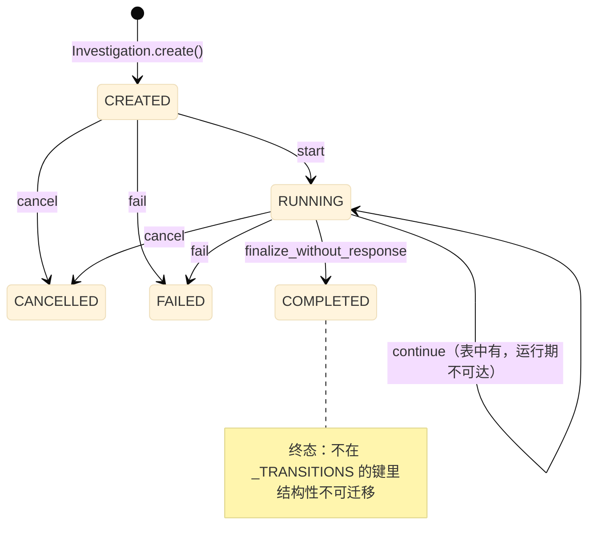
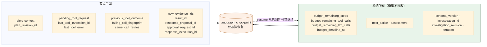

# 02 领域模型与调查编排

> **本文性质：** 代码级取证补充，**不构成契约**。`docs/README.md` 规定「Architecture and persistence documents are authority」——冲突时以 `domain-model.md` 为准。

> **文档类型**：子系统深挖（代码级核验，非设计提案）
> **分析对象**：`D:\Project\HISIEM-SOC-Copilot` 的 `domain/`（28 文件，1109 行含 shared）+ `agent/graph/`（7 文件，1788 行）
> **取证方式**：源码直读；每个关键论断附 `file:line` 锚点
> **结论以当前代码为准**（分支 `capability-mcp` @ `1e567be`）
> **文档集**：00–08 共 9 篇，见 [`README.md`](README.md)

---

## 为什么这两块合一篇

`domain` 与 `agent/graph` 是**同一个设计的两半**：

- `domain` 定义「一次调查是什么、允许发生什么状态迁移」——**业务事实**。
- `agent/graph` 定义「怎么把这次调查推进下去」——**执行过程**。

而两者之间有一条**明确的高低关系**，写在图状态的 docstring 里：

```python
# agent/graph/state.py:7-8
Graph state != Domain state. Domain is the source of truth; the graph checkpoints
(``langgraph_checkpoint`` schema) only support fault recovery/interrupt/resume.
```

**Domain 是真相，检查点只是故障恢复的辅助。** 这条关系是本篇的组织主线。

---

## 1. 领域模型：聚合根与状态机

### 1.1 关键论断

**论断 1：聚合根独占生命周期管理，外部不得直接改状态。**

`domain/investigation/aggregate.py:1-6` 的 docstring：*「The aggregate owns the lifecycle: legal status transitions, terminal-state immutability, and emitting domain events. Nothing outside the aggregate mutates status/phase directly (see python-package-boundary.md §4).」*；类 docstring（`:44-52`）列三条不变式：**租户与来源告警不可变**、**终态不迁移**、**所有生命周期变更必须经聚合方法**。

**论断 2：状态迁移表只有两个状态有出边，终态是结构性不可迁移。**

`aggregate.py:24-37` 的 `_TRANSITIONS`（注释标明出处：*Legal transitions per domain-model.md §36 / product-scope.md §14*）只以 `CREATED` 与 `RUNNING` 为键：

| 从 | 动作 | 到 |
| --- | --- | --- |
| `CREATED` | `start` | `RUNNING` |
| `CREATED` | `cancel` / `fail` | `CANCELLED` / `FAILED` |
| `RUNNING` | `continue` | `RUNNING`（自环） |
| `RUNNING` | `finalize_without_response` | `COMPLETED` |
| `RUNNING` | `cancel` / `fail` | `CANCELLED` / `FAILED` |

**终态（`COMPLETED` / `CANCELLED` / `FAILED`）不在字典的键里**——**所以「终态不迁移」是结构性的，不是靠 if 判断**：查表查不到就抛异常。

**但 `_TRANSITIONS` 的实际作用范围比它看起来窄。** 聚合的真实方法是 `start`（`:109`）/ `update_phase`（`:122`）/ `complete_without_response`（`:131`）/ `link_response_proposal`（`:136`）/ `cancel`（`:165`）/ `fail`（`:173`）——`_transition()` 只被后三个调用。

- **`continue` 全仓只出现一次**，就是 `aggregate.py:32` 这一行声明；聚合**没有 `continue()` 方法**。应用侧推进迭代走的是 `inv.update_phase(command.phase)`（`application/handlers/workflow.py:129`），**既不查 `_TRANSITIONS` 也不发 terminated 事件**。
- **`finalize_without_response` 只是迁移表里的字符串动作名**，真实方法叫 `complete_without_response`。

**所以「阶段推进」与「生命周期迁移」是两套东西**——两条看起来在 `RUNNING` 上的路径，一条受守卫表约束，一条不受。**别因为它们同在一个字段上就当成一套。**

**论断 3：调查刻意没有审批/执行状态——这是一条显式声明。**

`aggregate.py:38-41`：*「NOTE: there is deliberately NO approval/execution status here. The response workflow is an independent post-completion aggregate lifecycle (see `InvestigationStatus`); an Investigation never transitions because a proposal was approved, rejected, or executed.」*

> **这是本篇最值得单独记住的一条设计**：**响应工作流是一个独立的、完成后的聚合生命周期；调查绝不因为「提案被批准/拒绝/执行」而迁移状态。**
>
> **理由**：调查的职责是「查清楚」，响应的职责是「处置」。把两者塞进一个状态机会让「查完但没批」变成一个模糊状态——是 `COMPLETED` 还是 `AWAITING_APPROVAL`？分开后各自终态清晰。**这与 04 篇的响应生命周期是同一件事的两面**，也与迁移 `c8f1a93d5b27_separate_investigation_response_lifecycles.py` 对应。

**论断 4：不变式在构造期与状态变更期双向强制；每个领域动作是同一种四步形状。**

`aggregate.py:109-140` 的 `start` 展示了这个形状：**校验前置状态**（`status != CREATED` 就 `_raise_invalid("start")`）→ **改字段** → **`_bump()`** → **追加领域事件**。

**`InvestigationPhase` 实测 5 个取值**（`enums.py:43-50`）：`HYDRATING` / `PLANNING` / `INVESTIGATING` / `VERIFYING` / `FINALIZING`。

**两个版本字段分工明确**：

| 字段 | 谁维护 | 谁读 |
| --- | --- | --- |
| **`revision`** | `_bump()`（`aggregate.py:230-234`，**只做 `self.revision += 1`**） | 图状态（`nodes.py:232`）与领域事件（`durable_support.py:76` 的 `aggregate_revision`） |
| **`lock_version`** | **repository 独占**——域方法**永不自增**（`aggregate.py:230-234` 的注释原文） | 乐观锁 UPDATE（`repositories/investigation.py:56` 的 `WHERE lock_version=expected` 与 `:68` 的 `SET +1`） |

**所以「`_bump()` 与 `lock_version` 配合实现乐观锁」这个说法是错的**：`_bump()` 只碰 `revision`，乐观锁完全由 repository 层的 `lock_version` 负责（冲突时抛 `OptimisticConcurrencyError`）。

**论断 5：事件先积攒在聚合里，由外部统一取走——不是当场发布。**

`aggregate.py:71-76`：`_pending_events: list[ev.InvestigationEvent] = field(default_factory=list, init=False)`——**私有字段加 `init=False`**，所以外部既无法在构造时注入事件，也无法直接操作列表。

**这是标准的「聚合积攒事件、由 repository/UnitOfWork 统一发布」模式**，它让**状态变更与事件发布在同一个事务里落库**。

**论断 6：`domain` 包无框架依赖——AST 扫描与实际导入双重强制。**

`tests/architecture/test_import_boundaries.py:22-34` 把 `pydantic` / `sqlalchemy` / `langgraph` / `fastapi` / `httpx` / `alembic` 全列进 `domain` 的禁导入表；`:97-101` 的 `test_domain_imports_no_framework` 更进一步——docstring 是*「The domain package must be importable with only stdlib available.」*，并真的导入 `domain`、`domain.investigation.aggregate`、`domain.response.aggregate`。

**后者是更强的保证**：前者是静态规则，后者是在只导入 stdlib 的场景下真的 import 成功。**所以域模型是 `@dataclass` 而非 Pydantic `BaseModel`**（`aggregate.py:44`）。

### 1.2 状态机



> **图上没有审批与执行状态** ——这是论断 3 的直接体现。**响应生命周期在 04 篇。**

---

## 2. 图状态：只持有跨步工作状态

### 2.1 关键论断

**论断 1：图状态的四条「不」写在 docstring 里。**

`agent/graph/state.py:1-9`：*「Per domain-model.md §51 and python-package-boundary.md §13: the graph state holds ONLY cross-step working state. It is never a copy of the Domain database, never holds prompts/CoT/full tool results, and never holds secrets. Graph state != Domain state. Domain is the source of truth; the graph checkpoints (`langgraph_checkpoint` schema) only support fault recovery/interrupt/resume.」*

| 禁止 | 含义 |
| --- | --- |
| **不是 Domain 数据库的副本** | 只放跨步需要的东西 |
| **不放 prompt / CoT** | **思维链不进检查点** |
| **不放完整工具结果** | 只放有界摘要与 id |
| **不放 secret** | — |

**「never a copy of the Domain database」是最关键的一条**——它防止**双份真相**。状态里的标识符**引用**领域对象（`state.py:51-52`：*「All identifiers reference domain objects persisted by the application layer — never duplicated inline」*）。

**论断 2：状态字段按所有者分组，两处注释防的是同一件事。**

`state.py:48-97` 的字段清单：

| 组 | 字段 | 所有者 |
| --- | --- | --- |
| **身份** | `schema_version` / `investigation_id` / `investigation_revision` | 系统 |
| **输入** | `alert_context` / `plan_revision_id` | hydrate / plan 节点 |
| **进度** | `iteration` | 系统 |
| **预算** | 4 个 `budget_*` | **系统（注释明说 `system-authoritative, never model-settable`）** |
| **路由** | `next_action` / `assessment` | **系统（注释明说 `system-set, never model-authoritative`）** |
| **工具** | `pending_tool_request` / `last_tool_invocation_id` / `last_tool_error` | 节点 |
| **重规划** | `previous_tool_outcome` / `failing_call_fingerprint` / `same_call_retries` | 节点 |
| **产出** | `new_evidence_ids` / `result_id` / `response_proposal_id` / `approval_request_id` / `response_execution_id` / `stop_reason` | 节点 |

**两处注释的措辞值得注意**：预算组用 `system-authoritative, never model-settable`，路由组用 `system-set, never model-authoritative`——**两句话都在防同一件事：模型篡改系统状态。**

**`next_action` 的实际取值与 `state.py:74` 的代码注释不符**：那里的注释写 `# "CALL_TOOL" | "ASSESS"`，但真正的常量在 `agent/graph/nodes.py:85-86`（`EXECUTE_TOOL = "execute_and_ingest"` / `CONVERGE = "assess"`），写入点在 `nodes.py:475/502/514/525`。**`CALL_TOOL` 在源码中根本不存在**——只有那一行陈旧注释。而 `builder.py:34-44` 的两个路由函数读的正是那两个真值。**注释是过期的，代码是权威的。**

**论断 3：`alert_context` 是有界权威快照，且字段全部可选。**

`state.py:18-25` 的 `AlertContext(TypedDict)`：*「Bounded authoritative alert snapshot hydrated from HISIEM (read model). Only investigation-decision fields are carried; tenant_id is bound by the orchestrator scope and is NOT model-visible. All fields are optional so a degraded/partial hydrate never crashes the graph; the decide node reads the ones a real tool call needs (rule_id, detected_at, entity).」*

**三个设计点**：只带决策需要的字段（有界）；**`tenant_id` 由编排作用域绑定、模型不可见**（与 01 篇 §4 的「executor 不从模型参数读 tenant」一致）；**全部字段可选**——hydrate 只拿到部分告警字段时图继续跑，而不是整体失败。

**论断 4：有一个「重复尝试」三元组来约束重规划循环。**

`state.py:80-88`：*「Failure-aware re-plan context. `previous_tool_outcome` is the bounded outcome (tool_name/status/error_code/retryable) of the most recently executed tool — never raw exceptions or full results. `failing_call_fingerprint` is the deterministic request fingerprint of the last call that did not SUCCEED, and `same_call_retries` counts how many consecutive times that exact call has been re-scheduled — together they bound the repeated-attempt re-plan loop.」*

**三个字段合起来解决一个具体问题：模型反复发起同一个失败的调用怎么办？** `previous_tool_outcome` 给有界结果，`failing_call_fingerprint` 是上次未成功调用的**确定性请求指纹**，`same_call_retries` 数它被连续重排了几次。

**「确定性请求指纹」是这套机制的关键**——靠指纹相等判定「这是同一个调用」，而不是靠工具名（不同参数是不同调用）。**并且 `previous_tool_outcome` 是有界的**（*never raw exceptions or full results*）——**与 01 篇 §2 论断 4 的「不带供应商文本」是同一种克制**。代码层对应 `nodes.py:171` 的 `_repeat_budget_for` 与 `:186` 的 `_exceeded_repeat_budget`。

**论断 5：`SCHEMA_VERSION = 1` 是独立常量。**

`agent/graph/state.py:15`。**图状态有自己的版本号**——状态结构变更时，检查点可以据此判定「这个旧检查点还能不能用」。**这是检查点兼容性的基础。**

### 2.2 状态字段全景



---

## 3. 八个节点

### 3.1 关键论断

**论断 1：节点函数在 `nodes.py` 里，与 `builder.py` 分离。**

| 节点 | 行 | 职责 |
| --- | --- | --- |
| `load_investigation` | `nodes.py:202` | 加载领域聚合；判终态则设 `stop_reason` |
| `hydrate_alert` | `nodes.py:276` | 从 HISIEM 取告警快照（**系统控制工具**） |
| `plan` | `nodes.py:321` | 让模型产出初始计划 |
| `decide_next` | `nodes.py:414` | 让模型决定下一步：调工具还是收敛 |
| `execute_and_ingest` | `nodes.py:531` | **一次工具调用 + 证据落库（原子）** |
| `assess` | `nodes.py:866` | 让模型评估证据与假设 |
| `finalize_result` | `nodes.py:1123` | 固化结论 |
| `complete` | `nodes.py:1260` | 收尾 |

**`builder.py` 只做接线**（`_add` / `add_edge` / `add_conditional_edges`）与两个路由函数；`nodes.py` 只做节点逻辑。**这让「图长什么样」与「每个节点做什么」可以分开阅读与评审**——改一处不会牵动另一处。

**论断 2：节点函数签名统一为 `(runtime, state)`，由 `_bind_node` 适配。**

`builder.py:54-60` 的 `_bind_node` 把 `(runtime, state)` 协程包成 LangGraph 要的 `(state)`。

**这层适配值得存在**：节点的依赖（`runtime`）**通过闭包注入**，而不是通过 LangGraph 的 config——**节点因此可以直接单测**（传一个假 runtime）。`runtime.py` 只有 57 行，是一个薄的依赖包（见 03 篇）。

**论断 3：跨节点的通用逻辑抽成了一组辅助函数，其中确定性 UUID 是关键。**

| 辅助 | 行 | 用途 |
| --- | --- | --- |
| `_inv_id` / `_inv_str` / `_inv_key` | `:91,98,102` | 构造幂等键 |
| `_model_consult` | `:112` | **模型调用的统一包装** |
| `_deadline_passed` | `:130` | 墙钟截止检查 |
| `_outcome_for` | `:142` | 构造有界工具结果摘要 |
| `_invocation_uuid` | `:190` | **由 `(inv_id, audit_key)` 派生确定性 UUID** |

**`_invocation_uuid`（`nodes.py:190`）是最值得注意的一个**：由「调查 id + 审计键」派生确定性 UUID，所以**同一个审计键永远得到同一个 invocation id**——这正是 01 篇 §3 论断 3 里「工具审计按 key 幂等」的实现基础。而 `_inv_key(inv_id, suffix)`（`:102`）是「确定性节点键」的来源（`investigation_runner.py:13` 提到的 *「workflow commands are receipt-idempotent (deterministic node keys)」*）。

**论断 4：模型调用的包装函数返回 `None` 而不是抛异常。**

`nodes.py:112` 的 `async def _model_consult(coro) -> Any | None`。**所以模型调用失败由节点决定如何降级，而不是让异常穿过图**——与 01 篇 §4 论断 8 的「预算耗尽走确定性降级」是同一种取向：**模型相关的问题降级为「无模型输出」，而不是让整个调查失败**。

**论断 5：`decide_next` 与 `assess` 是两个最长的节点函数。**

`decide_next`（`:414-531`，117 行）与 `assess`（`:866-1049`，183 行）。**它们是唯一两个「需要向模型要结构化决策」的节点**——前者要 `next_action`，后者要 `assessment`；其余节点要么是纯数据操作，要么是最终固化。

## 4. 关键不变式（代码强制）

| # | 不变式 | 强制点 | 违反后果 |
| --- | --- | --- | --- |
| 1 | **终态不可迁移** | `aggregate.py:25-37`（终态不在 `_TRANSITIONS` 键中） | 完成的调查被重新打开 |
| 2 | **所有生命周期变更经聚合方法** | `aggregate.py:1-6,50-51` docstring + 私有字段 | 状态绕过不变式被改 |
| 3 | **租户与来源告警不可变** | `aggregate.py:49-50` | 调查被改挂到别的租户 |
| 4 | **调查不含审批/执行状态** | `aggregate.py:38-41` 显式注释 | 调查状态与响应状态混淆 |
| 5 | **每次状态变更必发领域事件** | `aggregate.py:71-76` 每次 `_bump()` 后 `append` | 状态变了但无事件，下游不知 |
| 6 | **`_pending_events` 私有且 `init=False`** | `aggregate.py:71-73` | 外部注入伪造事件 |
| 7 | **`domain` 无框架依赖** | `test_import_boundaries.py:22-34,97-101` | 域模型绑死框架 |
| 8 | **图状态不是领域数据库的副本** | `state.py:5-6` | 双份真相 |
| 9 | **图状态不放 prompt / CoT / 完整工具结果 / secret** | `state.py:4-5` | 提示与思维链进检查点 |
| 10 | **Domain 胜过 checkpoint** | `state.py:7-8`；`builder.py:47-51` | 终态被检查点复活 |
| 11 | **预算计数器模型不可设** | `state.py:70-71` 注释 | 模型提高自己预算 |
| 12 | **路由信号模型不可写** | `state.py:75-76` 注释 | 模型决定控制流 |
| 13 | **`alert_context` 字段全可选** | `state.py:22-24` | 降级 hydrate 让图崩溃 |
| 14 | **`tenant_id` 模型不可见** | `state.py:22-23` | 模型跨租户 |
| 15 | **工具结果摘要有界（不含原始异常/完整结果）** | `state.py:82-84` | 大数据进检查点 |
| 16 | **重复尝试由确定性指纹界定** | `state.py:85-88`；`nodes.py:171,186` | 无限重试同一失败调用 |

---

## 5. 与其他子系统的边界

| 边界 | 方向 | 契约 | 锚点 |
| --- | --- | --- | --- |
| `domain` ← `application` | 入 | 命令/查询经聚合方法 | `aggregate.py` 的 `start`(:109) / `update_phase`(:122) / `complete_without_response`(:131) / `link_response_proposal`(:136) / `cancel`(:165) / `fail`(:173) |
| `domain` ← `infrastructure.persistence` | 入 | mapper 在 ORM 与聚合间转换 | `infrastructure/persistence/mappers/investigation.py` |
| `agent/graph` → `application` | 出 | **节点只能经 application 命令改领域** | `nodes.py` 导入 `application.commands.investigation` |
| `agent/graph` → `agent/tools` | 出 | 工具执行经五段链 | `nodes.py:531` `execute_and_ingest` |
| `agent/graph` → `agent/evidence` | 出 | 证据归一化 | `nodes.py` 内调 `EvidenceNormalizer` |
| `agent/graph` → `contracts/llm` | 出 | 模型契约 | `nodes.py:60-71` 导入 |
| `infrastructure.durable` → `agent/graph` | 入 | runner 编译并跑图 | `investigation_runner.py:24` |

**一条值得强调的**：`agent` **不得导入 `infrastructure`**（`test_import_boundaries.py:45`）——**所以图节点不能直接读数据库**。它只能经 `application` 的命令/查询端口，**而端口的具体实现由 `bootstrap` 注入**。

**这是「图逻辑可单测」的结构性原因**：节点的所有副作用都经端口，端口在测试里可以换成假实现。

---
