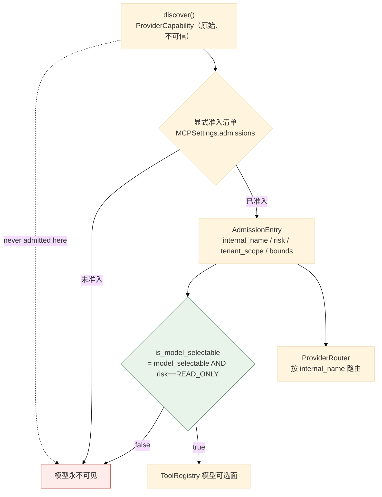
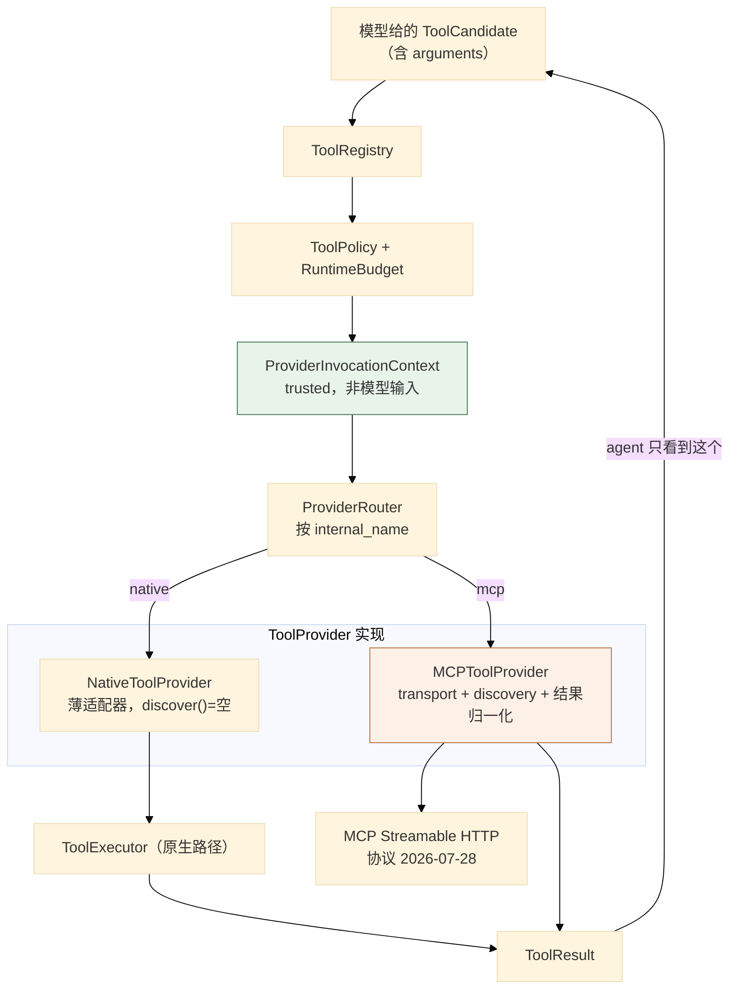
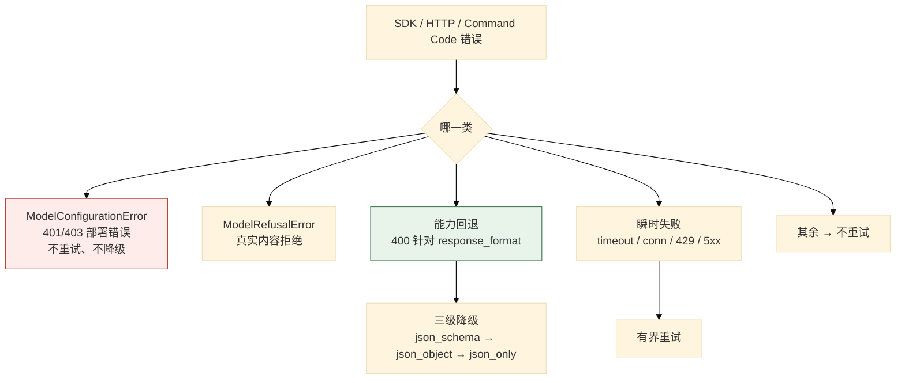
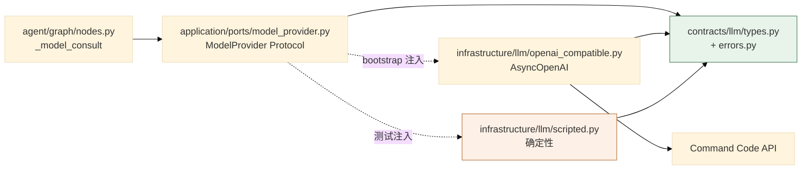

# 03 工具执行、策略与模型 Provider

> **本文性质：** 代码级取证补充，**不构成契约**。`docs/README.md` 规定「Architecture and persistence documents are authority」——冲突时以 `investigation-tool-contract.md` + `model-provider-contract.md` 为准。

> **文档类型**：子系统深挖（代码级核验，非设计提案）
> **分析对象**：`D:\Project\HISIEM-SOC-Copilot` 的 `agent/tools/`（8 文件）+ `contracts/`（**7 文件**）+ `infrastructure/llm/`（**10 文件**）+ `infrastructure/mcp/`（2 文件）
> **取证方式**：源码直读 + 在项目 venv 中实跑测试；每个关键论断附 `file:line` 锚点
> **结论以当前代码为准**（分支 `capability-mcp` @ `1e567be`）
> **文档集**：00–08 共 9 篇，见 [`README.md`](README.md)

---

## 为什么这三块合一篇

它们共同构成一条**从「模型说想做什么」到「系统决定做什么」的全部判断链**：

| 块 | 回答的问题 |
| --- | --- |
| `agent/tools/` | 模型可以选什么？参数合不合法？预算够不够？ |
| `contracts/` | 跨层传什么形状的数据？ |
| `infrastructure/llm/` + `mcp/` | 真去调外部时，协议怎么说话、失败怎么分类？ |

**主线是一句话**：**模型只提供「想查什么」，系统提供「我是谁、能查多少、从哪查」。**

---

## 1. 工具注册表与准入

### 1.1 关键论断

**论断 1：注册表的模型可选面恰好等于 executor 实现集合——不多不少。**

`agent/tools/registry.py:3-12` 的 docstring：*「V1 only registers READ_ONLY tools (investigation-tool-contract.md §3), and the registry's model-selectable surface is EXACTLY the set the executor actually implements. `hisiem.get_alert_context` is system-controlled … and is never offered to the model. Spec-defined but NOT-yet-implemented tools (entity activity, threat-intel, knowledge lookups) are cataloged separately (`FUTURE_CATALOG_TOOLS`) purely as documentation — they are NOT registered, so the model can never select a tool with no executor, schema, or policy backing it.」*

| 集合 | 内容 | 模型可见？ |
| --- | --- | --- |
| `SYSTEM_CONTROLLED_TOOL` | `hisiem.get_alert_context` | **否** |
| `AGENT_SELECTABLE_TOOLS` | executor 真正实现的只读工具 | **是** |
| `FUTURE_CATALOG_TOOLS` | 规格定义但未实现 | **否**（仅作文档） |

**`FUTURE_CATALOG_TOOLS` 是「只作文档」的**——**这是一处很好的克制**：把「计划中」的工具写在代码里让读者知道，但**不注册**。

**论断 2：能力类型只有一个取值，而 MCP 侧的风险分级有三档。**

`registry.py:26` 的 `ToolCapability = Literal["READ_ONLY"]`——**「只支持只读」是类型级的事实**，不是运行时判断。对照 `providers.py:25` 的 `RiskClass = Literal["READ_ONLY", "HIGH_RISK", "WRITE"]`。

**原生工具只有一档，MCP 准入有三档**——因为**原生工具由本仓库自己实现**（当然都是只读），而 **MCP 工具来自外部**，必须能表达风险分级。

**论断 3：准入条目把「风险」与「模型可选」合成为一个属性。**

`agent/tools/providers.py:87-106` 的 `AdmissionEntry` 里，最终判定不是 `model_selectable` 本身，而是：

```python
@property
def is_model_selectable(self) -> bool:
    return self.model_selectable and self.risk == "READ_ONLY"
```

**这是本篇最关键的一处安全设计**：

> **即使有人在配置里写了 `model_selectable: true`，只要 `risk` 不是 `READ_ONLY`，模型仍然选不到它。**

**配置错误不会导致越权**——因为风险分级是一道独立、不可绕过的闸门。`config.py:203` 的默认 `risk = "READ_ONLY"` 只是默认值，**准入仍要求显式声明**。

**论断 4：准入条目携带期望的外部 schema 指纹，用于检测漂移。**

`expected_external_schema_fingerprint`（`providers.py:87-106`）与 `ProviderCapability.with_fingerprint()`（`providers.py:73-84`）配合。指纹的输入是三元组 `(external_name, input_schema, output_schema)`，实现是 `providers.py:165-176`：**对 `{external_tool_name, input_schema, output_schema}` 取 SHA-256，`output_schema` 为 `None` 时用 `{"__absent__": True}` 作缺席标记**。

**编码是规范化的**（`providers.py:160-162` 的 `canonical_json`）：`sort_keys=True` + `separators=(",", ":")`——**键序与空白都不影响指纹**，所以只有真正的契约变化才会让它变。**重发现时指纹不等即 `SCHEMA_MISMATCH`**（`providers.py:21` 的失败码枚举里有它）。**这防的是「外部工具悄悄改了契约」**——一个真实的供应链风险。

**论断 5：`ProviderCapability` 被显式标注为原始且不可信。**

`providers.py:61-63`：*「A raw, untrusted capability observed during provider discovery.」*——**「discovered」与「admitted」是两个不同的状态**：发现到的能力**不进注册表**，只有**显式准入**的才进。

`bootstrap/container.py:277-279` 有对应的实现注释：*「Build one MCP provider per trusted configured server. Admissions are grouped by configured server before provider creation. A discovered capability is never admitted here; only the explicit trusted settings manifest enters the registry and router.」*

**论断 6：路由只按显式准入的名字路由，绝不按用户输入。**

`agent/tools/provider_router.py:16-27` 的 `ProviderRouter`：类 docstring 是*「Routes only explicitly admitted names; it never routes by user input.」*，实现按 `admission.internal_name` 建表，重复注册抛 `ValueError`。

| 细节 | 意义 |
| --- | --- |
| **键是 `admission.internal_name`** | 路由表按**内部名**建，不按外部名——**模型看到的名字是内部名**，外部名只存在于准入条目里 |
| **重复注册抛异常** | 构造期 fail-fast |

**论断 7：`providers.py` 是内部边界——外部协议对象、凭据、原始异常永不穿过它。**

`agent/tools/providers.py:1-6`：*「The agent sees only the existing `ToolCandidate`/`ToolResult` contracts. The provider contracts in this module are an internal boundary used by the executor; external protocol objects, credentials, and raw provider exceptions never cross it.」*

**所以 Stage C 引入的 Provider 架构对 agent 完全透明**：图节点仍然只看到原生的两个契约类型。**这是一次「加架构不加表面积」的扩展。**

**论断 8：失败分类是 11 个稳定码的枚举。**

`providers.py:18-25` 定义 `ProviderFailureCode`（11 个：`TIMEOUT` / `UNAVAILABLE` / `AUTH_FAILURE` / `RATE_LIMITED` / `REMOTE_TOOL_ERROR` / `PROTOCOL_ERROR` / `UNSUPPORTED_INTERACTION` / `SCHEMA_MISMATCH` / `INVALID_RESULT` / `RESULT_TOO_LARGE` / `PROVIDER_ERROR`）、`ProviderResultStatus`（4 个）、`TenantScope`（2 个）、`RiskClass`（3 个）。

**每个失败码都是稳定字符串，不是异常类名**——所以**失败可以被持久化、被断言、被跨进程传递**，而不必带着异常对象。MCP 侧另有一份 `_FAILURE_CODES` 白名单（`infrastructure/mcp/provider.py:64-78`），**与这 11 个取值逐值一致**；翻译函数在 `:722` 用它过滤，**不在集合里的统一降级为 `PROVIDER_ERROR`**——**所以「出现了一个新码」在结构上不可能悄悄穿透**。

**论断 9：结果边界是硬拒绝，不是截断指令。**

`providers.py:28-49` 的 `ResultBounds`：`timeout_seconds=30.0` / `max_items=100` / `max_serialized_bytes=256_000` / `max_text_chars=32_000` / `max_depth=8`。

| 设计 | 理由 |
| --- | --- |
| **`Hard rejection limits; no limit is a truncation instruction`** | 超界**拒绝**（`RESULT_TOO_LARGE`），**不静默截断**——截断会让模型看到不完整数据却不知情 |
| **per-capability 不得超 global**（`:43-49`） | 全局上限是**天花板**，单项只能更严——**不能说「我这个工具特别，可以放宽」** |

**`validate` 在配置期就抛异常**，所以越界配置**启动失败**而不是运行时才发现。**度量本身也是显式函数**（`providers.py:179-188` 的 `json_depth` 与 `serialized_size`），MCP 侧在同一次检查里用它们（`mcp/provider.py:517,519`）：序列化字节单独一条，**`max_items` 与 `max_depth` 同点判定**。

### 1.2 三层过滤



---

## 2. 五段链的深入

> 五段链的**流程**见 01 篇 §4。这里深入每一段的实现细节。

### 2.1 schema 段：`args.py`

**论断 1：参数类型是 4 个显式数据类。**

`agent/tools/executor.py:28-32` 从 `.args` 导入 `DetectionRuleArgs` / `ResolveTechniqueArgs` / `RetrieveGuidanceArgs` / `SearchEventsArgs`——**四个工具，四个 args 类型：每个工具有自己的强制 schema**，不是通用的 `dict`。

### 2.2 policy 段

**论断 2：单次搜索窗口上限是 24 小时常量。**

`agent/tools/policy.py:16-17` 的 `MAX_SINGLE_CALL_SPAN_HOURS = 24` 与 `SECONDS_PER_HOUR = 3600`；校验在 `:28-32` 的 `validate_search_span`（docstring：*「A single agent search must not exceed the Copilot 24h bounded window.」*）。**「Copilot 24h bounded window」是产品级约束**——模型不能靠构造大时间窗拉全量日志。

**论断 3：策略异常有继承关系，把「预算也是一种策略」表达出来。**

`policy.py:20-25`：`ToolPolicyError(ValueError)` 与 `ToolBudgetExhausted(ToolPolicyError)`。**两者的基类是内置的 `ValueError`**——所以即使调用方不 import 这两个类，也能用 `except ValueError` 兜住。

### 2.3 budget 段

**论断 4：预算是唯一权威，模型不能提高它、节点不能向上写。**

`agent/graph/budget.py:1-12`：*「Every node-level budget decision … and every decrement goes through this one value object. No node hand-decrements `budget_remaining_*` directly. The counters and the wall-clock deadline are checkpointed in the graph state, so a crash/restart/resume naturally continues from the CONSUMED budget — never reset to full. The model can never raise the budget and no node may write it upward.」*（完整读法见 01 篇 §4 论断 7。）

**论断 5：保留槽不变量是预算设计里最精细的一处。**

`budget.py:14-22`：*「the total number of model consults across the run (plan + decide + assess + verdict) is bounded by the runtime's original `max_llm_calls` for ANY `max_llm_calls >= 1`. decide reserves the final two LLM-call slots for the convergence path (assess + verdict); when fewer than two remain it stops consulting. … otherwise the graph applies the deterministic low-budget fallback (hypotheses UNRESOLVED; verdict INCONCLUSIVE "model-call budget exhausted") — never an over-budget model call.」*

**「for ANY `max_llm_calls >= 1`」**——**即使把预算配成 1，总量仍被界定**，没有「至少要几次」的豁免。**降级结果是确定性的**：假设 `UNRESOLVED` + 结论 `INCONCLUSIVE("model-call budget exhausted")`——**这是「诚实的不确定」而非「失败」。**

### 2.4 executor 段

**论断 6：executor 是 `agent/tools/` 里最大的文件（492 行）。**

实测 `wc -l`：`executor.py` **492** > `registry.py` 211 > `providers.py` 199 > `args.py` 138 > `native_provider.py` 79 > `provider_router.py` 59 > `policy.py` 58。

**论断 7：五段链的顺序里，「作用域绑定」在「策略/预算」之前。**

`agent/tools/executor.py:1-8`：*「Chain (investigation-tool-contract.md §2): candidate → schema validation → authenticated scope binding → policy/budget → provider adapter → typed ToolResult. The executor NEVER reads tenant/actor/authorization from model arguments; those come from the ToolExecutionContext the graph builds from trusted state.」*（链的流程见 01 篇 §4。）

**顺序有意义**：**先绑定作用域，再判策略**——因为**策略判定本身就可能依赖租户**（`tenant_scope: GLOBAL_READ_ONLY` vs `TENANT_SCOPED`）。

**论断 8：执行上下文的参数没有一个来自模型输入。**

`native_provider.py:37-45` 调 `executor.execute(...)` 时传的 7 个参数全部来自 `ProviderInvocationContext`（`providers.py:109-120`），其类 docstring 直接写着*「Trusted runtime context injected by the executor, never model input.」*。

**`budget_already_reserved` 这一对字段值得注意**：它表达「**图已经为这次调用预留了一个槽**」——防止**重复扣减**。**`budget_remaining=None` 表示「直接调用方，不参与图预算」**（测试与手工调用用）。

## 3. Provider 架构

### 3.1 关键论断

**论断 1：原生工具经一个薄适配器接进 Provider 架构——不重复行为。**

`agent/tools/native_provider.py:1,19-25`：*「Thin NativeToolProvider adapter around the sealed native executor.」* / *「Adapt the existing native ToolExecutor without duplicating its behavior.」*，且类属性 `identity = ProviderIdentity(provider_type="native", server_category="internal")`。**`discover()` 返回空列表**（`native_provider.py:27-28`）。

**这是正确的**：原生工具的能力**不是「发现」来的**，而是**编译期注册的**；`discover` 是给**外部** provider（MCP）用的接口。

**论断 2：`ProviderIdentity` 的 `server_id` 只信任配置。**

`providers.py:52-58`：*「Safe provider metadata. `server_id` is trusted only from config.」*——所以它**不能来自外部发现结果**，只能来自 `MCPServerSettings.server_id`。

### 3.2 MCP 侧：`infrastructure/mcp/provider.py`（796 行）

**论断 3：MCP 的职责边界写在 docstring 里，是一句「只做三件事」。**

`infrastructure/mcp/provider.py:1-6`：*「MCP is an external capability adapter. This module owns transport, discovery, and safe provider-result normalization only; registry admission, policy, budget, audit, and Evidence remain in the existing application path.」*

| MCP 自己做 | 仍在原有路径 |
| --- | --- |
| **transport** | registry admission |
| **discovery** | policy |
| **安全的 provider 结果归一化** | budget / audit / Evidence |

**这是「加一个外部适配器，不改任何既有语义」的准确表述**——**MCP 不引入第二套注册表、策略、预算、证据或真相系统**。

**论断 4：协议版本被三处独立固定。**

`mcp/provider.py:40` 的 `PRODUCTION_PROTOCOL = "2026-07-28"`，加 `config.py:158,216` 的 `Literal["2026-07-28"]`，加 `config.py:224-225` 的显式校验（*「MCP protocol_version must be 2026-07-28」*）——**配置类型、配置校验、provider 常量三处各写一遍**，所以**协议版本降级在结构上不可能**。

**论断 5：有一份运行时保留参数清单，模型不得使用。**

`mcp/provider.py:42-44` 的注释：*「These names are runtime-owned. A model may not use them to change routing, tenant scope, or credential selection.」*，清单是 `_PROTECTED_ARGUMENTS`（`:44-63`）。

| 类 | 参数名 |
| --- | --- |
| **路由 / 端点** | `server_id` / `endpoint` / `scheme` / `host` / `port` / `transport` |
| **租户** | `tenant_id` |
| **凭据** | `credential` / `token` / `password` / `passphrase` / `secret` / `api_key` / `access_token` / `authorization` / `bearer` |

**这是 01 篇 §4 论断 1（「executor 永不从模型参数读 tenant/actor/授权」）在 MCP 侧的具体实现**——**不是靠「我们不去读它」，而是靠「这些名字被显式列为保留」**。**同一原则的另一面**：SDK 抛出的 `InputRequiredRoundsExceededError` 也在这里被翻译成 provider 失败码（`mcp/provider.py:342`），原始 SDK 异常不向上抛。

**论断 6：`httpx2` 来自 `mcp` 的传递依赖，本项目并未直接声明它。**

`mcp/provider.py:18` 直接 `import httpx2`，但 `pyproject.toml` 里只有 `httpx>=0.27` 与 `opentelemetry-instrumentation-httpx`（`:22,31`）——`httpx2` 是 `mcp>=2.2,<3` 的传递依赖（`mcp-2.2.0.dist-info/METADATA` 的 `Requires-Dist: httpx2>=2.5.0`）。

> **这是一处值得记录的依赖形态**：**本项目在 `pyproject.toml` 里没有声明 `httpx2`，却直接 `import httpx2`**。它靠**传递依赖**满足——**如果 `mcp` 将来换了 HTTP 客户端或改了包名，这个模块会直接 ImportError**。
>
> **建议**（本文档集不修改代码，仅记录）：把 `httpx2` 提升为显式直接依赖。**这是「间接依赖被当作直接依赖使用」的典型情形**——不是 bug，但是一个真实的可维护性风险。

**论断 7：MCP 的验证是唯一实跑过的——24 个测试通过。**

```bash
$ ./.venv/Scripts/python.exe -m pytest \
    tests/unit/agent/test_mcp_provider.py \
    tests/integration/test_mcp_streamable_http.py -q
24 passed in 1.21s
```

覆盖单元契约（`test_mcp_provider.py`）与**真实本地 Streamable HTTP 集成**（`test_mcp_streamable_http.py`，配 `tests/support/mcp_scenario_fixture.py` 的本地服务器）。**这一条是本集里少数实际执行过验证的论断**——其余为静态取证。**如实标注。**

### 3.3 Provider 全景



---

## 4. 模型 Provider

### 4.1 关键论断

**论断 1：适配器是唯一对 OpenAI SDK 说话的地方。**

`infrastructure/llm/openai_compatible.py:1-8`：*「Layering (docs/model-provider-contract.md §2): Graph/Application → ModelProvider Protocol → OpenAICompatibleModelProvider (this adapter) → AsyncOpenAI → Command Code API. The adapter is the ONLY place that speaks to the OpenAI SDK (agent/application never import it).」*

**这与 00 篇 §2.1 论断 2 的 `agent` 禁导入表一致**（`agent` 层没有把 `openai` 列为禁止项，但**分层意图**是 adapter 独占 SDK）。

**论断 2：8 项职责逐条列出，每一条都是可核验的约束。**

| # | 职责 | 关键点 |
| --- | --- | --- |
| 1 | 建 `AsyncOpenAI` 客户端 | **SDK 自带的 retry 被禁用**，总重试次数在这里控制 |
| 2 | 设 ZDR 头 | `x-cmd-zdr: 1`，当 `llm.zdr` 启用时 |
| 3 | **结构化输出三级降级** | `json_schema` → `json_object` → JSON-only prompt |
| 4 | 收集**真实**有界用量 | request id + tokens，**缺失即 `None`，绝不猜** |
| 5 | **只对瞬时失败重试** | timeout / connection / 429 / retryable 5xx |
| 6 | 错误 taxonomy 翻译 | 见论断 4 |
| 7 | **不存 API key / 完整 prompt / 原始响应 / CoT** | — |
| 8 | SDK import 延迟到构造期 | 仅 import 本模块**不需要** SDK |

**第 1 条的「SDK 自带的 retry 被禁用」很重要**——否则**两层重试会相乘**（SDK 重试 3 次 × 适配器重试 2 次 = 最多 9 次调用），且总量不可控。

**第 4 条的「missing → None, never guessed」是一条诚实性约束**——usage 缺失时记 `None`，不估算。**宁可标缺失，不可编造。**

**第 8 条的「import 延迟到构造期」解释了默认值**：仅 import 这个模块不会引入 SDK，所以**未安装 SDK 的环境仍能导入模块**，也因此 00 篇 §4.1 论断 4 的 `llm.provider` 默认可以是 `scripted`——**默认路径不碰 SDK**。

**论断 3：结构化输出的三级降级，且决策按进程缓存。**

`openai_compatible.py:13-18`：*「in `auto` mode probe `response_format=json_schema` first and downgrade to `json_object` then JSON-only prompt when the provider rejects the format (the decision is cached per process, so only the first call probes). The json_only mode REBUILDS the messages via the operation's prompt builder with `json_only=True` so a clear ONLY-JSON instruction is present (never the json_only=False messages).」*

| 细节 | 理由 |
| --- | --- |
| **决策按进程缓存** | 只有第一次调用探测——避免每次调用都付一次失败的往返 |
| **json_only 模式重建 messages** | 必须让 prompt 里真的含「只输出 JSON」的指令 |

**第二条是一个容易做错的点**：降级到 prompt 级约束时，**如果不重建 prompt，模型根本不知道要输出 JSON**。

**论断 4：401/403 被定为部署错误，重试无意义。**

`openai_compatible.py:23-27`：*「translate every SDK/HTTP/Command Code error into the provider-neutral taxonomy (contracts/llm/errors.py). 401/403 → ModelConfigurationError (a deployment bug: never retried, never silently downgraded); genuine content refusal → ModelRefusalError; a 400 against a requested response_format is a capability fallback, not a config error.」*

| 输入 | 归类 | 处置 |
| --- | --- | --- |
| **401 / 403** | `ModelConfigurationError` | **不重试、不静默降级**——这是部署错误 |
| **真实内容拒绝** | `ModelRefusalError` | 是一种业务结果 |
| **请求的 `response_format` 被打 400** | **能力回退，不是配置错误** | 走三级降级 |

**第三条最微妙**：同样是 400，「参数写错了」与「这个 provider 不支持 `json_schema`」是**两件不同的事**——后者应该降级重试，前者不应该。**区分依据是「这个 400 是不是针对我们请求的 `response_format` 回来的」。**

**论断 5：`scripted.py` 是默认实现，也是确定性测试与评估的基础。**

`openai_compatible.py:31-32`：*「ScriptedModelProvider remains the default for tests.」*；`config.py:95` 的默认值是 `scripted`（见 00 篇 §4.1 论断 4）。

**`ScriptedModelProvider`（`scripted.py:45`）不是无状态桩，而是有状态的调用游标**：它持有一个 `script`（`:60`）与一个 `calls` 记录列表（`:102` 的 `self.calls.append("decide_next")`），**`decide` 是列表时逐次取出**（docstring `:52`：*「when `decide` is a list, each item names the tool to call」*）。

**同一个输入永远得到同一个输出序列**——**所以图的端到端行为可断言**，**这也解释了评估体系为什么能工作**（08 篇）：评估需要可复现的输出，脚本化 provider 正是为此存在。

### 4.2 错误 taxonomy



---

## 5. Prompt 与 LLM 契约

### 5.1 关键论断

**论断 1：Prompt 被按「操作」拆成 5 个 builder。**

`infrastructure/llm/prompts/` 下是 `common.py`（70 行，共用片段）/ `plan.py`（38）/ `decide.py`（156，最长）/ `assess.py`（84）/ `verdict.py`（59）。

**五个 builder 对应四种模型操作**：`plan` / `decide_next` / `assess` / `verdict`。**`decide.py` 最长**——因为它是唯一需要把**工具目录 + 预算状态 + 前次工具结果**都放进 prompt 的操作。

**这解释了 `budget.py:14-22` 里为什么把 `verdict` 与 `assess` 并列为「收敛路径」**：它们各有一个 prompt builder，是两次独立的模型调用。

**论断 2：`json_only=True` 会让 builder 重建消息。**

**所以 prompt builder 必须接受一个 `json_only` 开关**——这是三级降级能工作的前提（见 §4.1 论断 3）。

**论断 3：LLM 契约有独立的错误类型与类型定义。**

`contracts/llm/errors.py`（102 行）与 `contracts/llm/types.py`（107 行）。

**`contracts/` 是叶包**（00 篇 §1.1）——**所以 `ModelProvider` 协议与错误 taxonomy 不依赖任何生产层**，`agent` 与 `infrastructure` 都能安全引用。**`application/ports/model_provider.py:17,23` 导入 `contracts.llm`**，所以端口层也用同一套契约。

**错误的形状是一条单继承链**：一个基类（`ModelProviderError`）+ 若干子类，每个子类带自己的稳定 `code`——例如 `ModelConfigurationError(ModelProviderError)`（`contracts/llm/errors.py:93`）带 `code = "MODEL_CONFIGURATION"`（`:101`），docstring 写明它*「NEVER retried and never silently defaulted — configuration problems must surface, not hide.」*

### 5.2 模型调用的契约边界



---

## 6. 关键不变式（代码强制）

| # | 不变式 | 强制点 | 违反后果 |
| --- | --- | --- | --- |
| 1 | **模型可选面 = executor 实现集合** | `registry.py:3-4,31-32` | 模型选到无执行器的工具 |
| 2 | **系统控制工具永不提供给模型** | `registry.py:28`；`registry.py:5-6` | 模型跳过取上下文 |
| 3 | **未来工具只作文档，不注册** | `registry.py:8-11` | 模型选到无实现的工具 |
| 4 | **非 `READ_ONLY` 的工具模型永远选不到** | `providers.py:104-106` `is_model_selectable` | 配置写错导致越权 |
| 5 | **准入需显式声明（含风险分级）** | `providers.py:88-102`；`config.py:193-207` | 发现即准入 |
| 6 | **发现到的能力永不自动准入** | `container.py:277-279` | 外部改契约自动生效 |
| 7 | **schema 漂移可被检测** | `providers.py:73-84,97`；失败码 `SCHEMA_MISMATCH` | 外部悄悄改契约 |
| 8 | **路由只按显式准入的内部名** | `provider_router.py:17,24-27` | 按用户输入路由 |
| 9 | **route 重复注册 fail-fast** | `provider_router.py:25-26` | 静默覆盖 |
| 10 | **provider 契约是内部边界** | `providers.py:3-5` | 外部协议对象/凭据/原始异常外泄 |
| 11 | **`server_id` 只信任配置** | `providers.py:54` | 外部伪造服务身份 |
| 12 | **结果超界是硬拒绝，不截断** | `providers.py:30` | 模型看到不完整数据却不知情 |
| 13 | **per-capability 边界不得超全局** | `providers.py:43-49` | 单项放宽全局上限 |
| 14 | **executor 不从模型参数读 tenant/actor/授权** | `executor.py:6-7` | 模型自授权 |
| 15 | **调用上下文全部来自可信状态** | `providers.py:111`；`native_provider.py:37-45` | 模型注入作用域 |
| 16 | **运行时保留参数模型不得使用** | `mcp/provider.py:42-60` `_PROTECTED_ARGUMENTS` | 模型改路由/租户/凭据 |
| 17 | **MCP 协议版本三处独立固定** | `mcp/provider.py:40`；`config.py:158,216,224-225` | 协议静默降级 |
| 18 | **单次搜索窗口 ≤ 24h** | `policy.py:16,28-32` | 拉全量日志 |
| 19 | **预算递减只经 `RuntimeBudget`** | `budget.py:4-6` | 某节点漏减 |
| 20 | **预算计数进检查点，不重置为满额** | `budget.py:8-12` | 反复崩溃 = 无限预算 |
| 21 | **模型不能提高预算，节点不能向上写** | `budget.py:11-12` | 模型给自己加预算 |
| 22 | **`decide` 为收敛预留 2 个 LLM 槽** | `budget.py:14-22` | 结论出不来 |
| 23 | **预算耗尽走确定性降级，不超预算调用** | `budget.py:18-21` | 超预算调用模型 |
| 24 | **SDK 自带重试被禁用** | `openai_compatible.py:10-11` | 两层重试相乘 |
| 25 | **usage 缺失记 `None`，绝不猜** | `openai_compatible.py:19-20` | 伪造用量数据 |
| 26 | **只对瞬时失败重试** | `openai_compatible.py:21-22` | 对拒绝/配置错误重试 |
| 27 | **401/403 是部署错误，不重试不降级** | `openai_compatible.py:24-25` | 配置错了却反复重试 |
| 28 | **不存 API key / prompt / 原始响应 / CoT** | `openai_compatible.py:28` | 敏感数据落盘 |
| 29 | **仅 import 模块不需要 SDK** | `openai_compatible.py:30-32` | 无 SDK 环境无法导入 |

---

## 7. 与其他子系统的边界

| 边界 | 方向 | 契约 | 锚点 |
| --- | --- | --- | --- |
| `agent/graph` → `agent/tools` | 出 | 五段链 | `nodes.py:531` `execute_and_ingest` |
| `agent/tools` → `contracts/tools` | 出 | `ToolCandidate` / `ToolResult` | `contracts/tools/types.py` |
| `agent/tools` → `agent/knowledge` | 出 | 知识检索目录适配 | `executor.py:24` |
| `agent/graph` → `contracts/llm` | 出 | 模型操作请求/响应 | `nodes.py:60-71` |
| `application/ports` → `contracts/llm` | 出 | `ModelProvider` 协议 | `application/ports/model_provider.py:17,23` |
| `infrastructure/llm` → `contracts/llm` | 出 | 错误 taxonomy | `openai_compatible.py:24` |
| `infrastructure/mcp` → `agent/tools/providers` | **入** | provider 契约 | `mcp/provider.py:22-36` |
| `bootstrap` → 全部 | 入 | 装配 | `container.py:275-300` |

> **特别注意第 7 行**：`infrastructure/mcp` 导入 **`agent/tools/providers`**——这是**唯一一处 `infrastructure` 依赖 `agent` 的地方**。
>
> **它不违反 AST 边界**：`test_import_boundaries.py:45` 只禁止 `agent` 导入 `infrastructure`（单向），**反向依赖 `agent` 的契约是允许的**；而且这里依赖的是 **provider 契约模块**（无外部协议细节），不是图的实现。

**`agent/tools/providers.py` 因此扮演了一个特殊的角色**：**它虽然位于 `agent` 包内，但事实上是跨层契约**（被 `agent/evidence/normalizer.py:26`、`infrastructure/mcp/provider.py:22`、`evaluation_harness` 多处导入）。

**为什么不放进 `contracts/`**：这不是「会产生循环」的技术障碍——`contracts/tools/types.py` 是**叶模块**（只 import `dataclasses` + `typing`，`:14-15`），`contracts/` 全包**零处** import `agent`，且 `BOUNDARIES` 字典里**根本没有 `contracts` 条目**（`contracts` 内部没有 AST 约束）。**所以这是一处纯包放置的取舍：放在 `agent/tools/` 让契约贴近它的使用者，代价是「跨层契约」这个名字与它所在的层不一致。**
