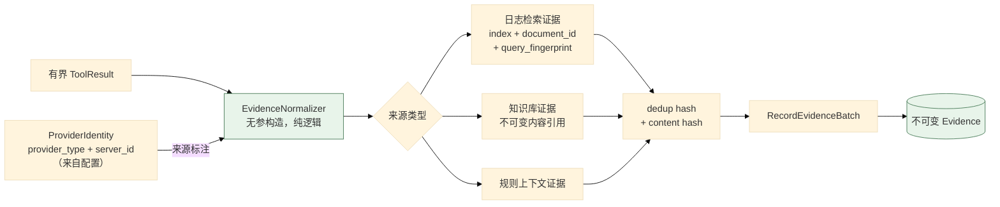
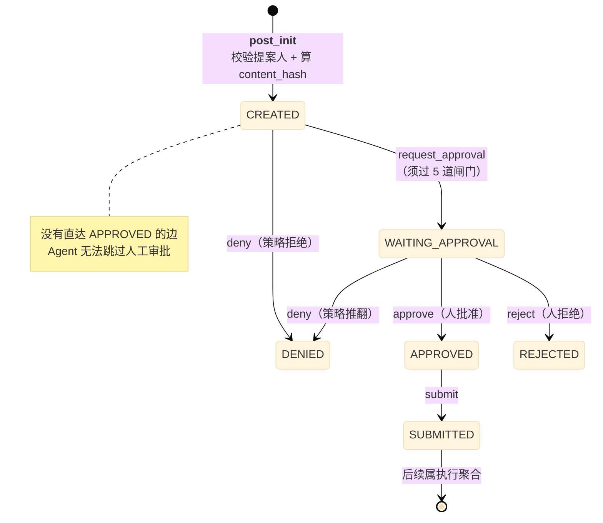
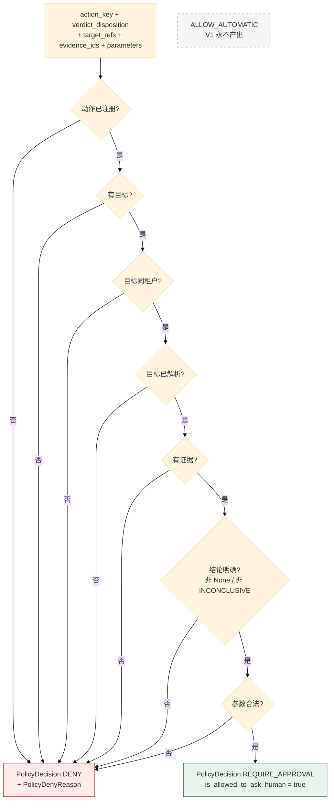

# 04 证据归一化与响应闭环

> **本文性质：** 代码级取证补充，**不构成契约**。`docs/README.md` 规定「Architecture and persistence documents are authority」——冲突时以 `investigation-tool-contract.md` 为准。

> **文档类型**：子系统深挖（代码级核验，非设计提案）
> **分析对象**：`D:\Project\HISIEM-SOC-Copilot` 的 `agent/evidence/`（2 文件）+ `domain/response/`（9 文件，1023 行）+ `infrastructure/soar/`（2 文件）
> **取证方式**：源码直读；每个关键论断附 `file:line` 锚点
> **结论以当前代码为准**（分支 `capability-mcp` @ `1e567be`）
> **文档集**：00–08 共 9 篇，见 [`README.md`](README.md)

---

## 为什么这三块合一篇

它们共同构成**「调查得出的结论 → 变成一个有记录、可授权、可执行的响应意图」**这条链：

| 块 | 角色 |
| --- | --- |
| `agent/evidence/` | **把工具结果变成不可变证据**——后续一切判断的事实基础 |
| `domain/response/` | **把证据 + 结论变成受策略约束的响应提案**——本项目的核心不变式所在 |
| `infrastructure/soar/` | **把提案变成对 HISIEM 的真实调用** |

**主线是本项目的核心不变式**：

> **Agent 建议，不能授权。**

这条不变式在前两块里是**结构性**的（策略只能产出 `DENY` / `REQUIRE_APPROVAL`），在第三块里是**协议性**的（HISIEM 侧另有独立授权）。

---

## 1. 证据归一化

### 1.1 关键论断

**论断 1：四段链与「永不接受模型提供的来源」写在同一段 docstring 里。**

`agent/evidence/normalizer.py:1-14`：*「Chain (investigation-tool-contract.md §24): Typed ToolResult → Evidence Normalizer → Deduplication → RecordEvidenceBatch → Immutable Evidence. The normalizer selects bounded observations from a tool result, attaches provenance/raw-reference/collection metadata and computes the dedup/content hashes. It NEVER accepts model-supplied provenance, source ids, or authority. … Event provenance uses the log-search raw reference (§17): {index, document_id, query_fingerprint} — never a fabricated ExternalResourceRef (no stable event address API in HISIEM).」*

**两条禁令**：

| 禁令 | 含义 |
| --- | --- |
| **永不接受模型提供的来源 / 来源 id / 权威级别** | 模型不能说「这条证据来自 X」 |
| **永不编造 `ExternalResourceRef`** | HISIEM 没有稳定单事件地址 API，所以用三件套 |

**论断 2：`query_fingerprint` 是「这次查询」的确定性身份。**

| 字段 | 回答 |
| --- | --- |
| `index` | 哪个索引 |
| `document_id` | 哪条文档 |
| `query_fingerprint` | **通过哪次查询找到的** |

**第三个字段最有意思**：**同一条文档可能被不同查询命中**，而「通过查询 Q 找到文档 D」才是完整的来源。**这让证据可复现**——重放同一个查询应当找到同一条文档。

**论断 3：两个哈希不是 normalizer 算的——docstring 与实现之间有落差。**

| 哈希 | 定义位置 | 回答 |
| --- | --- | --- |
| **dedup key** | `domain/investigation/content.py:62-68` | 「这条证据是否已存在」 |
| **content hash** | `domain/investigation/content.py` 的 `compute_content_hash` | 「内容是否被改动」 |

**`EvidenceNormalizer` 本身两个都不算**，它只算 `query_fingerprint`（`normalizer.py:291-297`）；两个哈希的调用点在 `application/handlers/workflow.py`（dedup 在 `:266-273`，content 在 `:706`）。**normalizer 的 docstring（`normalizer.py:6-7`）说它「computes the dedup/content hashes」，与实现不符**——这是一处注释与实现的落差。

**dedup 决定幂等**（01 篇 §8 不变式 12 的检查点安全依赖它），**content 决定不可变性**。**dedup key 的输入是四元组** `{provider, operation, raw_reference, resource_address}`（`content.py:62-68`），经 `sort_keys=True, separators=(",",":")` 的规范 JSON 取 SHA-256；**采集时间刻意不入 key**（否则同一观测每次采集都会产生新证据）。知识检索有特例：`knowledge` + `retrieve_security_guidance` 时用 `raw_reference["citation_identity"]` 替换整个 raw_reference，并剔除 `retrieval_mode` / `retrieval_profile_id` / `retrieved_at`（`content.py:45-61`）。

**论断 4：归一化器构造器无参，所以可以被纯单元测试。**

`normalizer.py:29-33` 的 `EvidenceNormalizer.__init__(self) -> None`——**不需要任何 fixture**。这是「把易错逻辑做成纯函数」的做法。

> **一处小瑕疵**：它不是完全无状态——`self._now`（`normalizer.py:33`）被赋值后**从未被读取**，是一个死属性。

**论断 5：证据来源类型是显式枚举，且外部 provider 的身份被打进来源。**

`normalizer.py:25` 导入 `EvidenceSourceType`（区分日志检索 / 知识库 / 规则上下文 / …）——**「这条证据是外部事实还是内部文档」在类型上可辨**。`normalizer.py:26` 导入 `ProviderIdentity`——**所以一条来自 MCP 工具的证据可以追溯回「哪个受信服务」**，而 `server_id` 只来自配置（`providers.py:52-58`）。

**这是 Stage C 与证据层的连接点**：MCP 引入后，**证据的来源多了「provider 类型 + 服务 id」两个维度**，而**它们都来自配置、不是发现结果**。

### 1.2 证据链

---

## 2. 响应提案聚合根

### 2.1 关键论断

**论断 1：聚合根的定位是「把审批绑定到精确的内容修订 + 哈希」。**

`domain/response/aggregate.py:1-6`：*「Encodes the intent to perform a deterministic, HISIEM-resolved security action, subject to policy validation and human approval. The aggregate binds approval to an exact content revision + hash, per domain-model.md §21/§24.」*

**「binds approval to an exact content revision + hash」是本篇的核心机制**——**审批的不是「这个提案」，而是「这个提案的这一版内容」**。

**论断 2：提案状态迁移表只到 `SUBMITTED` 为止。**

`aggregate.py:27-40` 的 `_TRANSITIONS`：

| 从 | 动作 | 到 |
| --- | --- | --- |
| `CREATED` | `deny` | `DENIED` |
| `CREATED` | `request_approval` | `WAITING_APPROVAL` |
| `WAITING_APPROVAL` | **`approve`** | `APPROVED` |
| `WAITING_APPROVAL` | **`reject`** | `REJECTED` |
| `WAITING_APPROVAL` | `deny` | `DENIED` |
| `APPROVED` | `submit` | `SUBMITTED` |

| 点 | 含义 |
| --- | --- |
| **`SUBMITTED` 没有出边** | 提交之后的状态属于**执行聚合**，不是提案 |
| **`WAITING_APPROVAL → DENY` 仍可达** | 待审批期间**策略仍可推翻**（例如目标解析失效） |
| **`REJECTED` 与 `DENIED` 是两个不同的状态** | **`REJECTED` = 人拒绝**；**`DENIED` = 策略拒绝**。**这是「人」与「系统」的区分** |

**`REJECTED` vs `DENIED` 的区分很重要**：它让「为什么没执行」有准确答案——**是人否决了，还是策略不允许**。

**论断 3：`CREATED` 没有直达 `APPROVED` 的边。**

**结构上**：从 `CREATED` 只能 `deny` 或 `request_approval`——**没有任何路径能让提案跳过 `WAITING_APPROVAL` 直接到 `APPROVED`**。**这是「Agent 不能授权」在状态机层面的强制**：不是靠「我们不去调 approve」，而是**没有那条边**。

**论断 4：`MISSING_PROPOSER` 是一个哨兵值，让缺失变成响亮的构造错误。**

`aggregate.py:22-25`：*「Sentinel that makes "no proposer recorded" a loud construction error instead of a silently blank provenance column. Every legitimate caller must supply the server-derived subject; only a missing argument reaches this value.」*，`MISSING_PROPOSER = ""`。

`aggregate.py:74-78` 的 `__post_init__` 在构造时校验提案人非空白并计算 `content_hash`——所以**「没有提案人」的提案根本构造不出来**。

**论断 5：提案人来源是服务端派生的，且刻意排除在内容哈希之外。**

`aggregate.py:53-59`：*「Immutable proposer provenance, ALWAYS server-derived from the authenticated trusted context — never a body field, and never borrowed from `Investigation.initiated_by` (that answers a different question: who ran the investigation, not who proposed this response). Deliberately OUTSIDE the content hash: provenance is not part of the approvable contract, so it can never be used to make an approval hash match or mismatch.」*

**三个独立的设计判断**：

| 判断 | 理由 |
| --- | --- |
| **ALWAYS server-derived，never a body field** | 客户端不能声称「我是谁提案」 |
| **绝不借用 `Investigation.initiated_by`** | **两者回答不同问题**：谁**发起调查** ≠ 谁**提出这个响应** |
| **刻意排除在内容哈希之外** | **来源不是「可审批契约」的一部分，所以不能用它让审批哈希匹配/不匹配** |

**第三条最精细**：来源若进了哈希，**换一个提案人就会让已有的审批失效**——而审批针对的是**内容**（做什么动作、针对什么目标、什么参数），不是**谁提的**。

**论断 6：内容哈希是三个语义字段的规范化 JSON。**

`aggregate.py:106-121` 的 `_compute_content_hash` 只取 `action_key`（做什么）、`target_refs`（对谁做）、`parameters`（怎么做）：

| 细节 | 理由 |
| --- | --- |
| **`target_refs` 只取四个身份字段** | `provider` / `resource_type` / `address_id` / `business_id`——**不取整个对象**，`ExternalResourceRef` 可能携带展示用字段（标题、描述），**它们变了不该让审批失效** |
| **`sort_keys=True`** | 确定性序列化（同 SIEM 05 篇 §2 论断 6 的 `ORDER_MAP_ENTRIES_BY_KEYS`——**同一个手法在两个项目里解决同一类问题**） |
| **`default=str`** | 非 JSON 原生类型统一字符串化，避免序列化失败 |
| **`sha256`** | — |

**论断 7：审批绑定校验是两个字段同时相等，这是纵深防御。**

`aggregate.py:123-125` 的 `content_hash_matches(revision, content_hash)`：*「Approval contract must bind the exact revision+hash that was requested.」*

| 字段 | 防什么 |
| --- | --- |
| `content_revision` | **快速判「改过没」**（单调整数，廉价） |
| `content_hash` | **防「修订号没变但内容变了」**（例如直接改字段绕过修订递增，昂贵但强） |

**论断 8：审批前的五道闸门有领域方法，但生产路径不调用它。**

`aggregate.py:89-103` 的 `validate_for_approval` 收集五条：动作在系统允许清单内 / 目标已解析 / **有支撑证据** / 策略校验已完成 / **策略不是 DENY**。

**两个设计点**：**收集所有错误再抛**（`errors: list[str]`），调用方一次就能看到全部问题；**第 3 条是硬性的**——没有证据的响应提案进不了审批，这防的是「模型凭猜测提议处置」。

**但这处校验在生产路径上从不被调用**：全仓只有定义（`aggregate.py:89`）与一条单元测试（`tests/unit/domain/test_response_proposal.py:133`）。**生产路径的等价前置条件由 handler 内联强制**（`application/handlers/response.py:115-157`：COMPLETED 状态、result 存在、证据服务端解析、目标服务端派生、动作可执行、策略已算）。**所以 §5 不变式表第 13 条标注为「领域方法存在但生产未调用」**——把「已定义但未调用」的校验列为「代码强制的不变式」是**高估**。

**论断 9：动作必须在系统允许清单内，而域清单 ≠ 可执行清单。**

`aggregate.py:82-87` 的 `action_allowed`（*「Actions must come from the system allowlist」*）；注意 `from .enums import ResponseActionKey` 写在函数体内，是**延迟导入**。**模型不能发明动作**，只能从枚举里选。

**域允许清单 4 个**（`domain/response/enums.py:42-45`）：`BLOCK_SOURCE_IP` / `DISABLE_ACCOUNT` / `ISOLATE_HOST` / `START_SOAR_PLAYBOOK`。**但可执行子集 `EXECUTABLE_ACTION_KEYS` 只有 1 个**——`START_SOAR_PLAYBOOK`（`domain/response/actions.py:50-64` 的 `_SPECS` 只注册了它）。

`enums.py:35-39` 的 docstring 把这条写死了：*「This is the DOMAIN allowlist (domain-model.md §22). Only the subset in `response.actions.EXECUTABLE_ACTION_KEYS` can actually be executed against HISIEM in V1 — the rest are reserved semantic keys that map to no supported HISIEM capability yet and therefore can never form an executable proposal.」*

**所以 V1 的响应面很窄：4 个域动作里只有 1 个真能执行**，其余 3 个的 `is_executable()` 返回 `False`，实际拒绝点在更外层的 handler（抛 `DomainError`，`handlers/response.py:135-137`）。

**论断 10：提案、提交、执行是三条独立的状态生命周期。**

这是读本篇最容易混淆的一处——三个都叫「状态」，但互不代偿：

| 生命周期 | 枚举 | 锚点 | 它回答 |
| --- | --- | --- | --- |
| **提案** | `ResponseProposalStatus`（6 值：`CREATED` / `DENIED` / `WAITING_APPROVAL` / `APPROVED` / `REJECTED` / `SUBMITTED`） | `enums.py:11-17` | 审批走到哪了 |
| **提交** | `ResponseSubmissionStatus` | `enums.py:48` | 本地提交命令被 HISIEM 接受了没 |
| **执行** | `ResponseExecutionStatus`（`QUEUED` / `RUNNING` / `SUCCEEDED` / …） | `enums.py:91-101` | 副作用事实 |

**代码用两段 docstring 明确禁止把它们混为一谈**。`ResponseSubmissionStatus`（`enums.py:49-58`）说它是*「Local lifecycle of the ONE approved submission to the provider. This is deliberately NOT a provider execution status. … WITHOUT inventing a provider execution identity (which would be a lie, and would collide on `(provider, execution_id)`). `FAILED_DEFINITIVE` means the provider did not accept the submission. It is NOT `ResponseExecutionStatus.FAILED`: no provider execution was ever created…」*

`ResponseExecutionStatus`（`enums.py:92-96`）说它是*「Lifecycle of one approved response execution (a ResponseExecutionRef). Distinct from `ResponseProposalStatus`: the proposal tracks the approval lifecycle, the execution ref tracks the side-effect fact. Neither is the other's status.」*

**「编一个 provider execution id 会是谎言」是这段的核心**：提交被拒时若借用「执行失败」表达，就等于凭空造了一个不存在的执行身份。

### 2.2 提案状态机

---

## 3. 响应策略：只能 DENY 或 REQUIRE_APPROVAL

### 3.1 关键论断

**论断 1：这是全项目最核心的一句不变式。**

`domain/response/policy.py:1-5`：*「Policy lives in the domain so no caller can bypass it. V1 only ever yields DENY or REQUIRE_APPROVAL — never ALLOW_AUTOMATIC (domain-model.md §25).」*

| 保证 | 含义 |
| --- | --- |
| **Policy lives in the domain** | **没有调用方能绕过它**——策略在域层，不在某个 service 里 |
| **only DENY or REQUIRE_APPROVAL** | **不存在「自动放行」这个取值** |

**第二条在类型层面就成立**：`domain/response/enums.py:20-24` 的 `PolicyDecision(enum.StrEnum)` 只有 `DENY` 与 `REQUIRE_APPROVAL` 两个取值——**`ALLOW_AUTOMATIC` 根本不存在，不是「存在但不用」**。

> **这是全项目里最强形式的一条不变式**：它不靠「所有调用点都记得检查」，也不靠「代码评审会拦住」——**它靠「那个取值在类型系统里不存在」**。任何想让策略放行自动执行的改动，**都必须先新增一个枚举值**，而那是一次显眼的、必然被看见的改动。

**论断 2：`is_allowed_to_ask_human` 把「能不能问人」表达为一个谓词。**

`policy.py:32-34`：`return self.decision == PolicyDecision.REQUIRE_APPROVAL`。**命名很准确**——不是 `is_allowed`（那听起来像可以执行），而是 **`is_allowed_to_ask_human`（只允许去问人）**。**这个命名本身就是不变式的表达**：策略通过不等于可以执行，**只等于可以进入人工审批**。

**论断 3：拒绝原因是 7 个具名枚举，不是自由文本。**

`policy.py:16-23` 的 `PolicyDenyReason(StrEnum)`：`UNKNOWN_ACTION` / `MISSING_TARGET` / **`CROSS_TENANT_TARGET`** / `UNRESOLVED_TARGET` / `MISSING_EVIDENCE` / **`DENYING_VERDICT`** / `INVALID_PARAMETERS`。

**`StrEnum` 而非普通 `Enum`**——所以它能直接序列化进 JSON / 落库，不需要 `.value` 转换。

**两个值得单独看的**：**跨租户目标是策略拒绝**（不是「先放过后面再查」）；**`DENYING_VERDICT`：结论不明确时拒绝**——`policy.py:75-87` 的判定是 `verdict_disposition is None or == INCONCLUSIVE` 时 `DENY`，detail 是*「V1 policy DENies responses without a definitive MALICIOUS/BENIGN verdict」*。

> **`BENIGN`（明确判为良性）反而进入 `REQUIRE_APPROVAL`**——`policy.py:75` 的行内注释是*「Low-confidence/unknown verdicts never bypass the human gate in V1」*。**拒绝的不是「清白」，而是「不确定」。**

**论断 4：策略函数是模块级纯函数，且全部关键字参数。**

`policy.py:37-45`：`action_is_registered(action_key)` 与 `evaluate_response_policy(*, action_key, verdict_disposition, target_refs, ...)`。**模块级纯函数**——与 `EvidenceNormalizer` 同为「无状态、可直接单测」。**`evaluate_response_policy` 的 `*` 之后全部 keyword-only**，7 个参数调用点无法靠位置传错。

**论断 5：`PolicyOutcome` 是不可变 dataclass，`reason` 允许自由字符串。**

`policy.py:26-30`：`decision: PolicyDecision` + `reason: PolicyDenyReason | str | None` + `detail: str | None`。**`reason` 允许字符串**，因为可能存在「枚举没覆盖到」的情形——**一种务实的宽松**：新原因可以先用字符串，稳定后再入枚举。

### 3.2 策略判定流

> **图的形状本身就是不变式**：**所有叶子要么是 `DENY`，要么是 `REQUIRE_APPROVAL`。** 没有通向「自动放行」的路径。

---

## 4. 与 HISIEM 的集成

### 4.1 关键论断

**论断 1：`infrastructure/soar/` 只有 2 个文件——适配器很薄。**

`infrastructure/soar/__init__.py` + `infrastructure/soar/adapter.py`。`HisiemSoarAdapter`（`bootstrap/container.py:327` 的 `soar()` 返回它）实现 `SoarPort`（`application/ports/soar.py`）。

**论断 2：SOAR 配置与 HISIEM 配置是两组独立设置，但默认值相同。**

`config.py:285-303` 的 `SoarSettings` 与 `config.py:61-75` 的 `HisiemSettings` 字段几乎相同（`base_url` = `http://127.0.0.1:8080`、`bearer_token` = 空、`timeout_seconds` = `10.0`）。

**分开是有意的**：**读（HISIEM 告警/日志）与写（SOAR 执行）用不同的凭据**——**这是权限分离在配置层的体现**。

> **但 `HisiemSettings` 多的那个 `tenant_header`（`config.py:75`）是死配置**：**全仓只有这一处出现，没有任何消费点**。不要以为「查询侧会带租户头」——真实行为里没有。这与 00 篇 §7 记的「配置项存在 ≠ 约束生效」是同一类事实。

**论断 3：响应执行走的是 HISIEM 的内部服务端点。**

Copilot 侧的锚点是 `config.py:325` 的 `hisiem_service_token_env`（默认 `HISIEM_COPILOT_SERVICE_TOKEN`）与 `infrastructure/auth/hisiem_service_provider.py`；HISIEM 侧的对应实现在 SIEM 03 篇 §4 论断 4。

| 维度 | Copilot 侧 | HISIEM 侧 |
| --- | --- | --- |
| 端点 | `/api/internal/soar/executions`（`infrastructure/soar/adapter.py`） | `SecurityConfig.java:53` `securityMatcher("/api/internal/**")` |
| 凭据 | `HISIEM_COPILOT_SERVICE_TOKEN` 环境变量 | `app.internal-service.token` 配置 |
| 租户 | 请求头 `X-Tenant-ID` | `InternalServiceAuthFilter.java:49` 读同名字段 |
| 令牌比较 | — | `InternalServiceAuthFilter.java:52` 的 `MessageDigest.isEqual`（常量时间） |
| 失败 | 凭据空串默认 | **令牌为空即全拒（fail closed）** |

**这是两个仓库之间唯一一条带认证的跨系统契约。**

**论断 4：`response_runner.py`（783 行）是响应侧的实现主体。**

实测 `wc -l infrastructure/durable/*.py`：`response_runner.py` **783** > `dispatcher.py` 404 > `investigation_runner.py` 208。

**为什么响应侧远大于调查侧**：

| 原因 | 说明 |
| --- | --- |
| **跨系统幂等** | submit 要在 HISIEM 侧「恰好一次」创建执行（01 篇 §6 论断 1） |
| **人工等待** | 审批可能等很久，恢复路径复杂 |
| **长周期观测** | observe 是持续轮询直到终态（默认 15 秒间隔） |
| **两个 destination** | submit 与 observe 各有自己的 runner 逻辑 |

**论断 5：`infrastructure/threat_intel/` 是空命名空间，但端口已定义。**

`infrastructure/threat_intel/__init__.py` 的内容只有一句「Empty namespace marker.」；而 `application/ports/threat_intel.py` 有 `ThreatIntelPort`——**端口已定义，适配器未实现**。**这与 03 篇 `registry.py` 的「future catalog tools 只作文档」是同一种「定义但不接」的状态**。

## 5. 关键不变式（代码强制）

| # | 不变式 | 强制点 | 违反后果 |
| --- | --- | --- | --- |
| 1 | **策略只产出 DENY 或 REQUIRE_APPROVAL** | `policy.py:3-4` | 自动放行处置动作 |
| 2 | **策略在域层，调用方不可绕过** | `policy.py:3` | 某条路径绕开策略 |
| 3 | **`REQUIRE_APPROVAL` 只等于「可以问人」** | `policy.py:32-34` `is_allowed_to_ask_human` | 把「可问人」误当「可执行」 |
| 4 | **提案状态机无 `CREATED → APPROVED` 直达边** | `aggregate.py:27-40` | Agent 跳过人工审批 |
| 5 | **`REJECTED`（人拒）与 `DENIED`（策略拒）分离** | `aggregate.py:29-35` | 无法区分「谁否决的」 |
| 6 | **审批绑定精确 `content_revision` + `content_hash`** | `aggregate.py:123-125` | 审批后内容被换 |
| 7 | **提案人必须存在，否则构造失败** | `aggregate.py:22-25,74-78` | 无来源的处置记录 |
| 8 | **提案人由服务端派生，非请求体字段** | `aggregate.py:53-56` | 客户端伪造提案人 |
| 9 | **提案人**不进**内容哈希** | `aggregate.py:56-59` | 换提案人让审批失效 |
| 10 | **内容哈希只取三个语义字段** | `aggregate.py:106-121` | 展示字段变化让审批失效 |
| 11 | **内容哈希用 `sort_keys=True`** | `aggregate.py:120` | 哈希不可复现 |
| 12 | **`target_refs` 只取四个身份字段** | `aggregate.py:109-116` | 同上 |
| 13 | **进审批前必须过五道闸门**（**领域方法存在，但生产路径不调用——实际由 `handlers/response.py:115-157` 内联强制**） | `aggregate.py:89-103`（领域）/ `handlers/response.py:115-157`（生产） | 无证据的处置提案进审批 |
| 14 | **闸门一次性报全部错误** | `aggregate.py:91,102-103` | 调用方反复试错 |
| 15 | **动作必须来自系统允许清单** | `aggregate.py:82-87`；`policy.py:37-38` | 模型发明动作 |
| 16 | **无支撑证据不得进审批** | `aggregate.py:96-97` | 凭猜测提议处置 |
| 17 | **DENY 的策略结果不得进审批** | `aggregate.py:100-101` | 被拒的提案仍可被批准 |
| 18 | **normalizer 不接受模型提供的来源/id/权威** | `normalizer.py:7-8` | 伪造证据来源 |
| 19 | **永不编造 `ExternalResourceRef`** | `normalizer.py:11-13` | 不可达的引用 |
| 20 | **事件来源用三件套** | `normalizer.py:12` | 来源不可复现 |
| 21 | **`server_id` 只来自配置** | `providers.py:54`；`normalizer.py:26` | 外部伪造服务身份 |
| 22 | **读写凭据分两组配置** | `config.py:61,285` | 读凭据被用来执行处置 |

---

## 6. 与其他子系统的边界

| 边界 | 方向 | 契约 | 锚点 |
| --- | --- | --- | --- |
| `agent/graph` → `agent/evidence` | 出 | 归一化工具结果 | `nodes.py` 内调 `EvidenceNormalizer` |
| `agent/evidence` → `application/commands` | 出 | `RecordEvidenceBatch` | `normalizer.py:23` |
| `domain/response` → `domain/investigation` | 出 | `VerdictDisposition` / `ExternalResourceRef` | `policy.py:12`；`aggregate.py:17` |
| `agent/graph` → `application/commands/response` | 出 | 提案命令 | `nodes.py` 的响应节点 |
| `application/handlers/response` → `domain/response` | 入 | 聚合方法 | `aggregate.py` 的 `request_approval` / `approve` / `reject` / `submit` |
| `infrastructure/durable/response_runner` → `application/ports/soar` | 出 | `SoarPort` | `application/ports/soar.py` |
| `infrastructure/soar/adapter` → HISIEM | 出 | `/api/internal/soar/executions` | `adapter.py` |

**一条值得强调的**：`domain/response` **依赖** `domain/investigation`（`policy.py:12` 导入 `VerdictDisposition`，`aggregate.py:17` 导入 `ExternalResourceRef`）——**同层内的单向依赖**。

**方向是「响应依赖调查」而非反之** ——因为**响应需要知道调查的结论**（`DENYING_VERDICT` 就是基于结论做判断）。**反转会让调查依赖响应，形成环。**

**这与 02 篇 §1.1 论断 3 的「调查**没有**审批/执行状态」互为印证**：**调查不知道响应的存在，响应知道调查的结论。**

---
