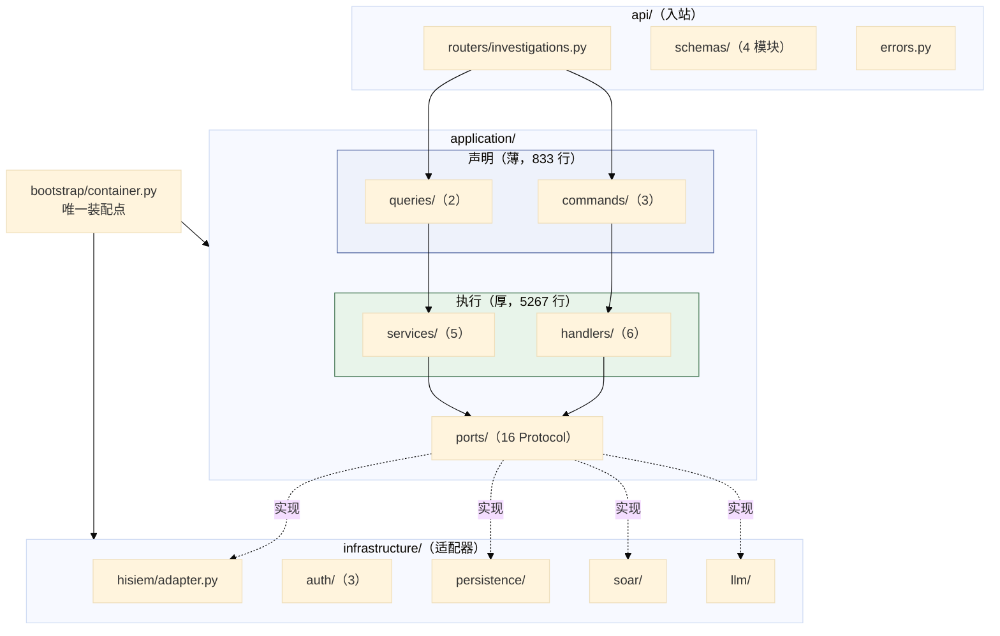
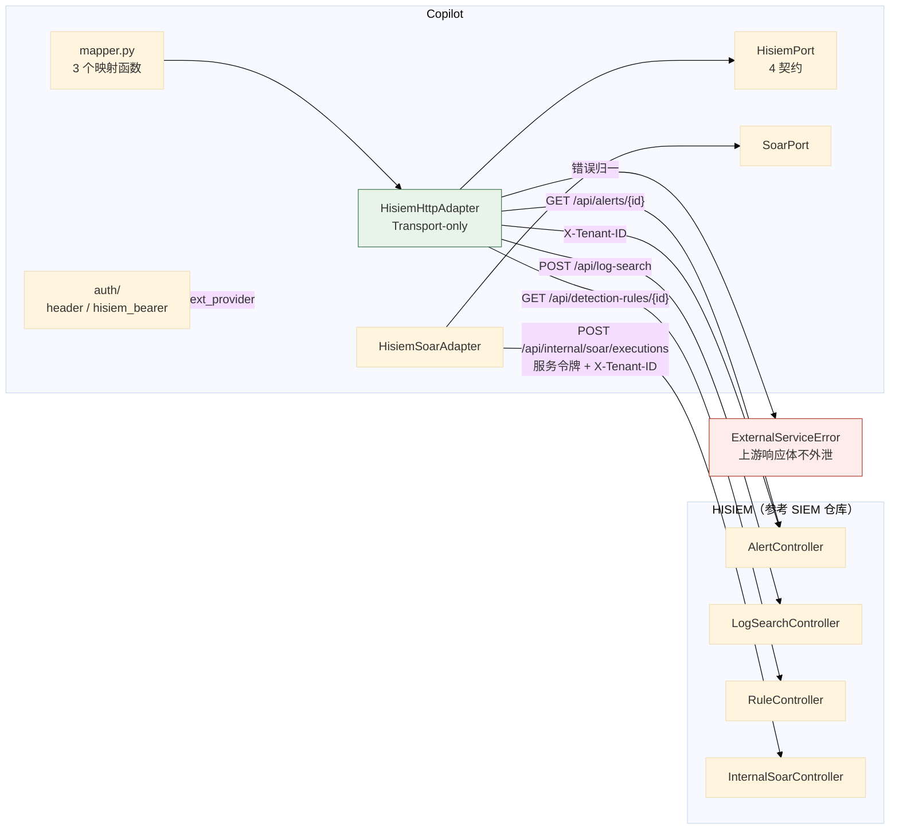
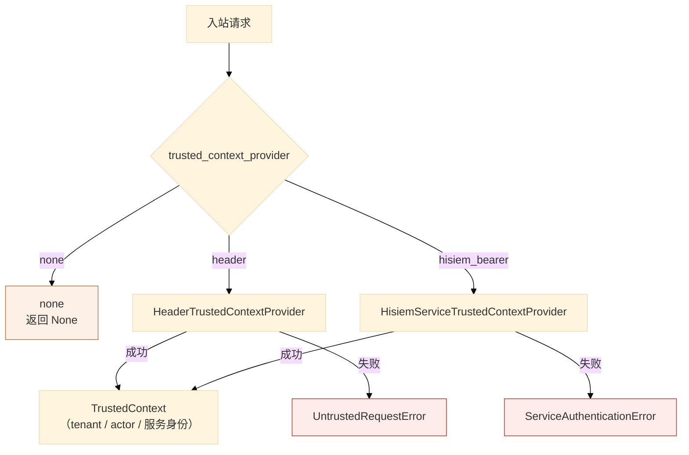

# 05 应用层、上游集成与 API 交付

> **本文性质：** 代码级取证补充，**不构成契约**。`docs/README.md` 规定「Architecture and persistence documents are authority」——冲突时以 `hisiem-integration-contract.md` 为准。

> **文档类型**：子系统深挖（代码级核验，非设计提案）
> **分析对象**：`D:\Project\HISIEM-SOC-Copilot` 的 `application/`（38 文件，6104 行）+ `infrastructure/hisiem/`（3 文件）+ `infrastructure/auth/`（3 文件）+ `api/`（10 文件）
> **取证方式**：源码直读 + grep 统计；每个关键论断附 `file:line` 锚点
> **结论以当前代码为准**（分支 `capability-mcp` @ `1e567be`）
> **文档集**：00–08 共 9 篇，见 [`README.md`](README.md)

---

## 为什么这四块合一篇

它们回答同一个问题：**「外面进来的请求，怎么变成域上的合法操作；域上的事实，怎么变成外面能读的东西」。**

| 块 | 角色 | 方向 |
| --- | --- | --- |
| `api/` | HTTP 交付：路由、schema、错误映射 | **入站** |
| `infrastructure/auth/` | 信任来源：谁在调用 | **入站** |
| `application/` | 用例编排：命令、查询、处理器、服务、端口 | **中枢** |
| `infrastructure/hisiem/` | 上游读适配：查告警、查日志、查规则 | **出站** |

**主线是「端口—适配器」的分离**：`application/ports/` 的 **15 个模块**里定义 **36 个 `Protocol` 类**（AST 实测；`repositories.py` 11 / `knowledge.py` 7 / `durable.py` 5 / 其余各 1–2），`infrastructure/` 提供实现，`bootstrap/` 把两者接起来。**这条链的每一段都可被替换与单测。**

> **口径说明**：`application/ports/` 的**文件数是 16**（15 模块 + `__init__.py`），**协议类数是 36**——两者不可混用。

---

## 1. 应用层：四个子包的职责分工

### 1.1 关键论断

**论断 1：`application/` 的四个子包有清晰的语义分工，且重量极不均匀。**

| 子包 | 文件 | 语义 |
| --- | --- | --- |
| `commands/` | 3 | **意图的声明**（数据类） |
| `queries/` | 2 | **读取的声明** |
| `handlers/` | 6 | **命令的执行者**（含事务、幂等、事件发布） |
| `services/` | 5 | **跨用例的服务**（工作区投影、知识检索） |
| `ports/` | 16 | **对外依赖的接口** |

**重量集中在 `handlers/` 与 `services/`**（`handlers` 3321 行 + `services` 1946 行，占应用层 6104 行的 86%），而声明层很薄。最重的三个文件是 `services/workspace_service.py`（964 行）、`handlers/knowledge.py`（790 行）、`handlers/workflow.py`（755 行）。

**论断 2：`commands/` 与 `queries/` 是薄声明，不是逻辑所在。**

最薄的命令模块只有 63 行（`application/commands/response.py`），执行在 `handlers/response.py`（432 行）。

**CQRS 式的读写分离在包结构上成立**：`commands` + `queries` 分开，但**两者共用同一套端口与聚合**——不是完整的 CQRS（没有独立读库）。

**这解释了 `queries/workspace.py` 与 `services/workspace_service.py` 的分工**：前者是**纯数据层**（查询端口的调用），后者是**执行层**（在 `UnitOfWork` 里编排、投影成只读模型）。**名字相近，层次不同。**

**论断 3：工作区投影服务是纯读，四条禁止写进 docstring。**

`application/services/workspace_service.py:1-14`：*「This service performs a PURE READ: it loads the Investigation aggregate and its child rows through tenant-scoped repository/query ports inside ONE UnitOfWork, then projects them into an immutable `InvestigationWorkspaceReadModel`. It MUST NOT (docs/investigation-workspace.md §7): - mutate any domain state, - run the Agent / LangGraph / a model / a tool, - touch ORM or SQL directly (it depends on the `UnitOfWork` port only). The composed timeline is derived deterministically from persisted facts; no entry is fabricated and no debug/telemetry fact is exposed.」*

| # | 禁止 | 理由 |
| --- | --- | --- |
| 1 | 改任何域状态 | 它是读服务 |
| 2 | **跑 Agent / LangGraph / 模型 / 工具** | **读路径不得有 AI 副作用** |
| 3 | **直接碰 ORM 或 SQL** | **只依赖 `UnitOfWork` 端口** |
| 4 | 编造时间线条目 / 暴露 debug 事实 | 投影必须来自持久事实 |

**第 2 条是最值得注意的**：**打开工作区不会触发任何模型调用。** 这与「图只在 outbox 派发时推进」（01 篇 §1 论断 1）是同一件事的两面——**读是读，推是推**。

**第 3 条在 AST 层面有强制**：`test_knowledge_boundary.py` 的规则 3 用同一个扫描器检查「`application/` 下没有文件出现 `AsyncSession`、`select(...)`、`session.execute(...)`、`<=>`」。

**论断 4：964 行的工作区投影，是为了在一个 `UnitOfWork` 里读完整个聚合树。**

它要把 **`Investigation` 聚合 + 全部子行**（证据、发现、假设、假设评估、结果、计划修订、响应提案、审批、提交、执行）读出来并投影成一个只读模型。

**「inside ONE UnitOfWork」是一条一致性要求**——工作区看到的所有东西来自**同一个快照**，不会出现「证据读了但发现还没读」的撕裂。

### 1.2 应用层结构



---

## 2. 上游集成：HISIEM HTTP 适配器

### 2.1 关键论断

**论断 1：适配器是纯传输，且端点「已对参考 SIEM 仓库验证」。**

`infrastructure/hisiem/adapter.py:1-8`：*「Transport-only over HISIEM's control API. Endpoints follow the real HISIEM contract (verified against the reference SIEM repo): `GET /api/alerts/{id}`, `POST /api/log-search`, `GET /api/detection-rules/{id}` and the X-Tenant-ID convention. Errors map to ExternalServiceError; upstream bodies never leak.」*

| 信息 | 含义 |
| --- | --- |
| **"Transport-only"** | 不含业务判断——映射在 `mapper.py` |
| **"verified against the reference SIEM repo"** | **端点是实证过的，不是猜的** |
| **"upstream bodies never leak"** | 上游响应体不外泄 |

**三个真实端点**与 SIEM 侧逐一对上：`GET /api/alerts/{id}` ↔ `AlertController`、`POST /api/log-search` ↔ `LogSearchController`、`GET /api/detection-rules/{id}` ↔ `RuleController`（SIEM 03 篇 §5 论断 1 的控制器表）。

**论断 2：「upstream bodies never leak」是错误处理的一条硬约束。**

`adapter.py:6-7`——**所有错误归一为 `ExternalServiceError`**（`application/errors.py`），**HISIEM 的响应体不进 Copilot 的错误路径**。

**这与 SIEM 侧形成对照**：SIEM 的 `ElasticsearchGateway.java:72` **把 `e.getMessage()` 放进响应体**（SIEM 03 篇 §6 论断 2）。**Copilot 侧更严格。**

**论断 3：映射被抽成独立的 `mapper.py`，有三个具名函数。**

`adapter.py:24-28` 从 `.mapper` 导入 `map_alert_detail` / `map_detection_rule` / `map_log_search_response`——**三个映射函数对应三个端点**。**适配器只管「发请求、收响应、报错」，形状转换在 mapper**，**这让 mapper 可以被纯单元测试**（喂一个 HISIEM 响应 JSON，断言产出的 `HisiemAlertData`）。

**论断 4：`HisiemPort` 定义了四个数据契约 + 一个端口。**

`application/ports/hisiem.py` 导出 `HisiemAlertData`（告警详情，`hydrate_alert` 节点用）/ `LogEventHit`（单条日志命中）/ `EventSearchResult`（日志检索结果集）/ `DetectionRuleContext`（检测规则上下文）+ `HisiemPort`。

**端口不是「一个万能 HTTP 客户端」，而是四个有语义的读操作。**

**论断 5：读凭据与处置凭据是两组独立配置，字段几乎相同。**

`config.py:61-75` 的 `HisiemSettings`（读）与 `config.py:285-303` 的 `SoarSettings`（写）字段几乎一致（`base_url` = `http://127.0.0.1:8080`、`bearer_token` = 空、`timeout_seconds` = `10.0`）。

**分开是有意的**：**读告警的凭据与执行处置的凭据应当不同**——这是权限分离在配置层的体现。

> **唯一差异 `tenant_header` 是死配置**：`config.py:75` 是全仓唯一出现处，**没有任何消费点**（04 篇 §4 论断 2 记的是同一条事实）。

### 2.2 出入站全景



---

## 3. 信任边界

### 3.1 关键论断

**论断 1：信任来源有三档，默认 `none`（不信任任何来源）。**

`config.py:321`：`trusted_context_provider: Literal["none", "header", "hisiem_bearer"] = "none"`。

| 取值 | 实现 | 语义 |
| --- | --- | --- |
| **`none`（默认）** | — | **不信任任何入站上下文** |
| `header` | `infrastructure/auth/header_provider.py` | 从请求头取可信上下文 |
| `hisiem_bearer` | `infrastructure/auth/hisiem_service_provider.py` | 从 HISIEM 服务令牌派生 |

**默认 `none` 是 fail-closed 的**——新部署的实例**不会凭请求头就相信调用方是谁**。

> **`header` 这一档是 dev/test 专用，且它自己把这件事写在了文件头**（`header_provider.py:1-13`）：*「Header-based TrustedContextProvider (development/test adapter). … This is NOT a production authenticator: an ordinary client can forge these headers. It exists so local development and integration tests can exercise the API/application paths without standing up a real IdP. The Composition Root must not select this adapter for a production deployment — see `TrustProviderSettings` in the container and the "no default trusted provider in production" invariant.」*
>
> **实现也确实没有任何签名或令牌校验**：它只要求 `x-tenant-id` 非空（否则抛 `UntrustedRequestError("missing tenant identity")`），`x-actor-subject` 缺失时**默认成 `"system"`**。**所以「默认 `none`」不是保守，而是唯一安全的默认**——把这一档打开就等于让调用方自报身份。

**论断 2：`TrustedContext` 与错误类型同在一个端口模块里。**

`application/ports/trust.py` 导出 `TrustedContext`、`UntrustedRequestError`、`ServiceAuthenticationError`、`TrustedContextProvider`。

| 错误 | 语义 |
| --- | --- |
| `UntrustedRequestError` | 请求本身不可信（**客户端问题**：该带的东西没带对） |
| `ServiceAuthenticationError` | **服务认证失败**（**部署问题**：服务令牌配错了） |

**区分这两者是有意义的**——它让「为什么被拒」在日志与指标上是两类不同的事实。

**论断 3：`container.py` 里有一个请求级的信任上下文提供者，返回类型是可空的。**

`bootstrap/container.py:437`：`def trusted_context_provider(self, request: Request) -> TrustedContextProvider | None`。

**返回 `| None`**——**当 `trusted_context_provider = none` 时返回 `None`**，调用方必须显式处理「没有信任来源」的情形，不能默认它一定存在。

**论断 4：`bootstrap` 是唯一 import 两个具体实现的地方。**

`bootstrap/container.py:50-53` 导入 `HeaderTrustedContextProvider` 与 `HisiemServiceTrustedContextProvider`——**两个实现都只在组合根被装配**；`application` 只看到 `TrustedContextProvider` 协议（`container.py:35-38` 从 ports 导入）。

### 3.2 信任判定



---

## 4. API 交付

### 4.1 关键论断

**论断 1：只有一个路由模块，前缀 `/api/v1/investigations`，共 8 个端点。**

`api/routers/investigations.py:50` 定义 `APIRouter(prefix="/api/v1/investigations", tags=["investigations"])`。

| 行 | 方法 | 路径（相对前缀） | 说明 |
| --- | --- | --- | --- |
| `:53` | `POST` | `""` | **创建调查（201）** |
| `:89` | `GET` | `/lookup` | **按告警查已有调查** |
| `:113` | `GET` | `/{investigation_id}` | 读调查 |
| `:126` | `GET` | `/{investigation_id}/workspace` | 读工作区投影 |
| `:146` | `POST` | `/{investigation_id}/cancel` | 取消 |
| `:166` | `POST` | `/{investigation_id}/response-proposals` | **派生响应提案（201）** |
| `:200` | `POST` | `/response-approvals/{approval_request_id}/approve` | **批准** |
| `:216` | `POST` | `/response-approvals/{approval_request_id}/reject` | **拒绝** |

> **`/lookup` 是一条值得注意的端点**：它按**告警**查已有调查，而不是按调查 id——**三个必填 Query 参数**（`provider` / `resource_type` / `address_id`，各 `min_length=1`）。它的 docstring（`:97-100`）写明*「Returns the at-most-one ACTIVE Investigation for the source alert plus the most recent Investigation of any status, so HISIEM can render the correct Alert action (start / continue / view). Tenant is derived from the trusted context — never declared by the caller — so a foreign alert can never be resolved.」* **两个要点**：「这条告警是否已经查过」是一次查询（避免重复调查）；**租户由可信上下文派生，不由调用方声明**——所以别家的告警根本查不到。
>
> **审批端点的位置也值得注意**：`approve` / `reject` 挂在 `/response-approvals/{id}/...` 下，**不带 `investigation_id` 路径段**——审批的身份是审批请求本身，不是它属于哪个调查。

**论断 2：`api` 层的禁导入是四条，含一条同层横向的。**

`tests/architecture/test_import_boundaries.py:46-51`：`"infrastructure.persistence"` / `"infrastructure.hisiem"` / `"langgraph"` / **`"agent"`**。

**注意禁的是两个具体子包，不是整个 `infrastructure`**——所以 `api` **可以**导入 `infrastructure` 的其它部分。**这是精细的粒度**：不是「api 不许碰 infrastructure」，而是「**api 不许碰持久化与上游**」。

**论断 3：schema 与领域模型是两套类型，转换发生在 `api` 层。**

`api/schemas/` 下是 `common.py` / `response.py` / `workspace.py`，**都是 Pydantic 模型**——而 `domain` 是 dataclass 且禁 pydantic（00 篇 §2.1 论断 2）。**所以 API 边界上必然有一次转换**：领域 dataclass → Pydantic schema，**而 `domain` 完全不知道 HTTP 的存在**。

**论断 4：应用由工厂函数创建，只 include 一个 router。**

`api/app.py:41,48`：`FastAPI(title="HISIEM SOC Copilot", version="0.1.0", lifespan=lifespan)` + `include_router(investigations_router)`。**这一版的 HTTP 面很窄**（8 个端点），而内部能力（知识摄取、ATT&CK 导入）走 CLI（见 06 / 08 篇）。

**论断 5：错误处理分四层，逐层向上翻译。**

```
api/errors.py                  ← HTTP 层错误映射
application/errors.py          ← 应用层错误（ExternalServiceError 等）
domain/shared/errors.py        ← 域错误（DomainError / StateTransitionError）
contracts/llm/errors.py        ← 模型错误 taxonomy
```

**域不知道 HTTP 状态码，HTTP 不知道领域语义。**

**论断 6：健康探针是唯一不认证的端点。**

`api/app.py:44` 的 `@app.get("/healthz", tags=["ops"])` 挂在 `/api/v1/**` **之外**——所以它不经过任何租户/信任路径。**这是标准做法**：探针必须能被编排系统无凭据调用。

## 5. 关键不变式（代码强制）

| # | 不变式 | 强制点 | 违反后果 |
| --- | --- | --- | --- |
| 1 | **`api` 不得导入 `agent` / `langgraph`** | `test_import_boundaries.py:46-51` | HTTP 层直接编排 AI |
| 2 | **`api` 不得导入 `infrastructure.persistence`** | 同上 | API 层出 SQL |
| 3 | **`api` 不得导入 `infrastructure.hisiem`** | 同上 | API 层直连上游 |
| 4 | **`application` 不得导入 `infrastructure`** | `test_import_boundaries.py:35-44` | 用例层绑死适配器 |
| 5 | **工作区读服务是纯读** | `workspace_service.py:3-5` | 读路径改状态 |
| 6 | **读路径不跑 Agent / 模型 / 工具** | `workspace_service.py:9` | 打开页面触发模型调用 |
| 7 | **读服务不碰 ORM / SQL** | `workspace_service.py:10`；`test_knowledge_boundary.py` 规则 3 | 绕过端口直连数据库 |
| 8 | **投影不编造时间线条目** | `workspace_service.py:12-13` | 展示不存在的事实 |
| 9 | **投影不暴露 debug / telemetry 事实** | `workspace_service.py:13` | 内部细节泄漏给分析员 |
| 10 | **工作区投影在一个 UnitOfWork 内完成** | `workspace_service.py:4-5` | 投影内部撕裂 |
| 11 | **上游响应体不外泄** | `hisiem/adapter.py:6-7` | HISIEM 内部细节泄漏 |
| 12 | **上游错误归一为 `ExternalServiceError`** | 同上 | 错误类型泄漏到上层 |
| 13 | **默认不信任任何入站上下文** | `config.py:321` `= "none"` | 凭请求头冒充身份 |
| 14 | **「请求不可信」与「服务认证失败」是两个错误** | `application/ports/trust.py` | 无法区分客户端问题与部署问题 |
| 15 | **`TrustedContextProvider` 可以为 `None`** | `container.py:437` | 调用方忽略「无信任来源」 |
| 16 | **读凭据与处置凭据是两组配置** | `config.py:61` vs `:285` | 读凭据被用于执行处置 |
| 17 | **`/healthz` 不认证** | `api/app.py:44`（在 `/api/v1/**` 之外） | 探针无法被编排系统调用 |
| 18 | **`domain` 用 dataclass，`api` 用 Pydantic** | `test_import_boundaries.py:32` + `api/schemas/` | 域模型绑死 HTTP 框架 |

---

## 6. 与其他子系统的边界

| 边界 | 方向 | 契约 | 锚点 |
| --- | --- | --- | --- |
| `api` → `application` | 入 | 命令 / 查询 | `api/routers/investigations.py` |
| `api` → 三个 `contracts` | 入 | `contracts/api` | `contracts/api/__init__.py` |
| `application.ports` ← `infrastructure.hisiem` | 入 | `HisiemPort` | `application/ports/hisiem.py` |
| `application.ports` ← `infrastructure.soar` | 入 | `SoarPort` | `application/ports/soar.py` |
| `application.ports` ← `infrastructure.persistence` | 入 | `UnitOfWork` + 11 个 repository 端口 | `application/ports/repositories.py` |
| `application.ports` ← `infrastructure.auth` | 入 | `TrustedContextProvider` | `application/ports/trust.py` |
| `application` → `domain` | 出 | 聚合方法 | `domain/*/aggregate.py` |
| `application` → `contracts/llm` | 出 | 模型契约 | `application/ports/model_provider.py:17,23` |

**端口清单实测是 16 个**（`application/ports/` 下 15 个模块 + `__init__`）：

`attack` / `chunking` / `clock` / `durable` / `embedding` / `event_publisher` / `hisiem` / `investigation_runtime` / `knowledge` / `model_provider` / `repositories` / `soar` / `threat_intel` / `trust` / `unit_of_work`

> **`clock` 端口值得单独指出**：`application/ports/clock.py` 里有 `ClockPort` + `SystemClock` ——**时间是可注入的**。这让「超时 / 截止时间」相关逻辑**可以被确定性测试**（不需要真的等）。

---
