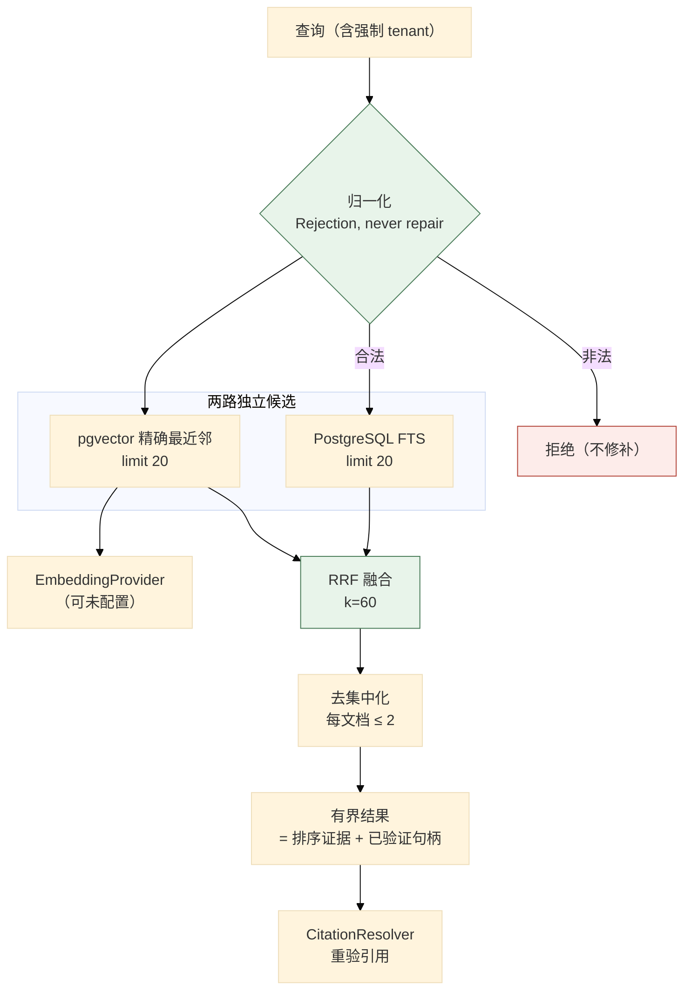
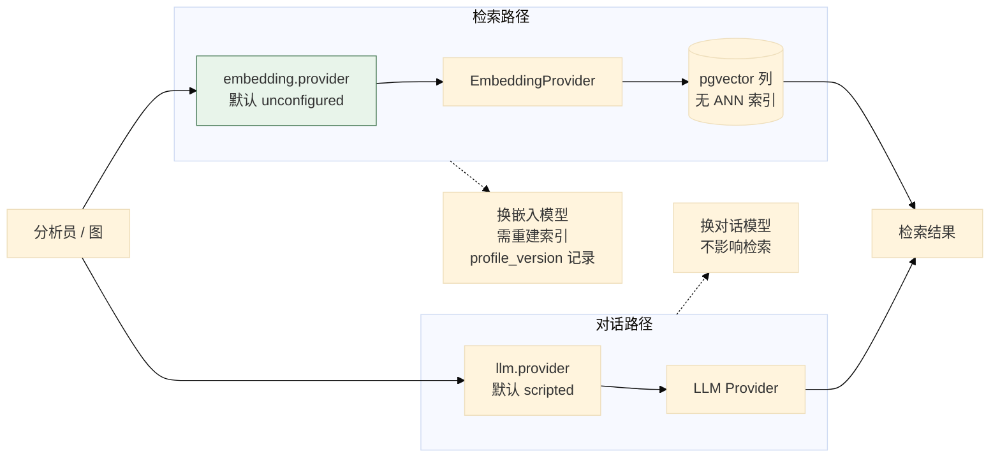
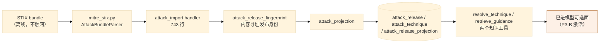
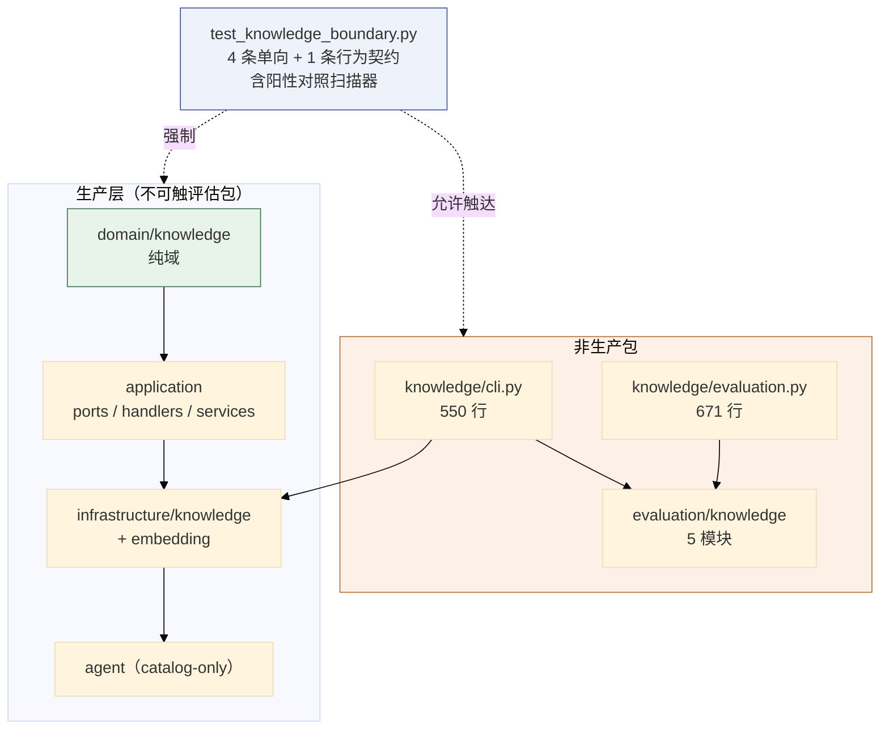

# 06 知识库与威胁情报

> **本文性质：** 代码级取证补充，**不构成契约**。`docs/README.md` 规定「Architecture and persistence documents are authority」——冲突时以 `knowledge/domain.md` 为准。

> **文档类型**：子系统深挖（代码级核验，非设计提案）
> **分析对象**：`D:\Project\HISIEM-SOC-Copilot` 的 `domain/knowledge/`（6 文件）+ `knowledge/`（4 文件）+ `infrastructure/knowledge/`（6 文件）+ `infrastructure/embedding/`（3 文件）+ `application/services/knowledge_retrieval.py`（672 行）
> **取证方式**：源码直读 + grep 统计；每个关键论断附 `file:line` 锚点
> **结论以当前代码为准**（分支 `capability-mcp` @ `1e567be`）
> **文档集**：00–08 共 9 篇，见 [`README.md`](README.md)

---

## 为什么知识库独立成篇

它是一个**独立的受限上下文（bounded context）**，且带**自己的架构测试**：

```bash
tests/architecture/test_knowledge_boundary.py     # 4 条单向规则 + P3-A 闭包保证
```

**它的边界性质与其他子系统不同**：

| 维度 | 其它子系统 | 知识库 |
| --- | --- | --- |
| 数据来源 | HISIEM（运行期） | **离线导入的语料** |
| 检索方式 | 精确查询 | **混合检索（FTS + 向量 + RRF）** |
| 独立性 | — | **嵌入 provider 与对话 LLM 完全独立** |
| 模型可见面 | 工具 | **知识查找保持 catalog-only**（`test_knowledge_boundary.py:18-19`） |

---

## 1. 检索管线：四段，且**排序是纯函数**

### 1.1 关键论断

**论断 1：管线四段与「排序必须可复现」的理由写在同一段 docstring 里。**

`application/services/knowledge_retrieval.py:1-19`：*「Everything in this module is pure and deterministic except the two repository calls and the embedding call it orchestrates. That is deliberate: ranking is the part of retrieval that must be reproducible, so ranking is plain functions of plain data, testable without a database. The shape of the pipeline: 1. **Normalize** the caller's query into bounded terms. Rejection, never repair. 2. **Generate candidates** independently -- PostgreSQL FTS and exact pgvector nearest-neighbour -- each with its own budget (sections 44/45). 3. **Fuse** the two ranked lists with Reciprocal Rank Fusion (section 47). 4. **Diversify** so one document cannot monopolize the result set (section 49).」*

**四段**：归一化 → 生成候选（两路独立）→ **RRF 融合** → 去集中化。

**论断 2：「Rejection, never repair」是一条查询归一化原则。**

`knowledge_retrieval.py:10`——**拒绝，不修补**：非法查询被拒，而不是被「猜着改成合法的」。**这条与 SIEM 侧的做法一致**（SIEM 02 篇 §3.1 论断 5 的 `not` 条件「多子条件直接拒绝」）：**宁可拒绝也不猜**。

**论断 3：排序是纯函数——「the part of retrieval that must be reproducible」。**

`knowledge_retrieval.py:3-6`——**只有三处非纯**：两次 repository 调用 + 一次 embedding 调用，**其余全部是纯函数**。**为什么排序必须可复现**：否则评估无法比较两次检索（08 篇的评估体系依赖确定性）。

**论断 4：两路候选各有自己的预算。**

| 路径 | 机制 | 预算配置 |
| --- | --- | --- |
| **词法** | PostgreSQL FTS | `lexical_candidate_limit = 20` |
| **向量** | **精确** pgvector 最近邻 | `vector_candidate_limit = 20` |

`config.py:415-418` 给出四个参数：`lexical_candidate_limit` / `vector_candidate_limit` / `rrf_k = 60` / `max_hits_per_document = 2`。

**「each with its own budget」很重要**：两路**独立生成候选**，不是一路先跑再补充另一路——**这保证任何一路都不会因为另一路的结果而少取**。

> 分块（chunk）参数在 `config.py:378 / 390 / 397 / 404 / 424 / 442`——**本篇不展开分块本身**，只记它的位置。

**论断 5：精确最近邻——没有 ANN 索引。**

`knowledge_retrieval.py:11-12` 写的是 *「exact pgvector nearest-neighbour」*；`pyproject.toml:24-26` 的注释把口径写死：*「The one P3-A addition (brief §76): the official pgvector SQLAlchemy integration for the untyped `vector` column. **No ANN index, no vector DB.**」*

**这是一处有意的「不优化」**：ANN 索引会增加写入成本与调参负担，而收益在当前语料规模下为零。

**论断 6：融合是 RRF，`k=60` 是经典取值。**

`config.py:417`。**`rrf_k = 60` 是 Reciprocal Rank Fusion 论文的原始取值**——这直接说明融合算法是 RRF，不是加权分数相加。**RRF 只用排名的倒数求和，所以两路的分数尺度不必可比**——**这正是「词法分数」与「余弦距离」能融合的原因。**

**论断 7：去集中化是第 4 段——`max_hits_per_document = 2`。**

`config.py:418`，理由在 `knowledge_retrieval.py:14`：*「so one document cannot monopolize the result set」*。**一份大文档可能在两路都排前**，从而占满整页结果；**限制每文档 2 条让结果覆盖更多来源**。

**论断 8：「权威立场」是一段四句式声明——每条都值得单独读。**

`knowledge_retrieval.py:16-19`：*「a hit is RANKING EVIDENCE plus a validated handle. The retrieval score is a ranking signal, not a judgement; the excerpt is data, not instruction; the citation is a reference the resolver re-validates, not a grant (section 92).」*

| 声明 | 含义 |
| --- | --- |
| **hit = 排序证据 + 已验证的句柄** | 命中不是「答案」，是「可能相关 + 一个可验证的引用」 |
| **分数是排序信号，不是判断** | 高分**不代表**「这条是对的」 |
| **摘要是数据，不是指令** | **防提示注入的核心声明** |
| **引用是待重验的参考，不是授权** | **解析器会重新验证引用** |

**「the excerpt is data, not instruction」是本项目里最直接的一条提示注入防御表述**——**检索到的语料内容永远被当作数据，不会被当作对模型的指令**。**03 篇的 MCP 侧有对应**：远程内容同样被当作不可信数据。

**论断 9：`tenant` 作用域是每个检索入口的强制关键字参数。**

`tests/architecture/test_knowledge_boundary.py:22-24` 的规则 5 写着 *「tenant scope is a mandatory keyword on every retrieval entry point」*——**不是可选参数，不是默认值**。**这是多租户隔离在签名层面的强制**：调用方无法「忘记」传租户（AST 守卫见 01 篇 §7 论断 6）。

### 1.2 四段管线



---

## 2. 嵌入 provider：与对话 LLM 完全独立

### 2.1 关键论断

**论断 1：独立性是显式声明的。**

`config.py:452`：*「Embedding provider configuration, INDEPENDENT of the chat LLM (section 18).」*——**换对话模型不影响检索，换嵌入模型不影响对话**。

**为什么值得单独一节**：**嵌入是语料的属性，不是模型的属性**。语料索引一次，用很久；对话模型可能频繁更换。

**论断 2：未配置嵌入时明确告知，不静默降级。**

`config.py:459-460`：*「the system says so instead of …」*——**系统会说不存在向量检索**，而不是悄悄只做词法检索。

**论断 3：默认 `unconfigured`，`dimension = 0` 表示「没有向量」。**

`config.py:470` 的 `provider: Literal["unconfigured", "openai_compatible"] = "unconfigured"` 与 `:485` 的 `is_configured()` 谓词。

`config.py:473-474` 的注释把 0 的语义写死了：*「0 means "not configured"; the provider must declare a real dimension.」*——**所以 `dimension = 0` 不是「零维向量」，而是「没有向量」**。

**论断 4：距离度量只有余弦——用类型表达。**

`config.py:479` 的 `distance_metric: Literal["COSINE"]`——**「只支持余弦」是类型级事实**，不是文档说明。

**论断 5：归一化可配置，但只有两档。**

`config.py:478` 的 `normalization: Literal["NONE", "L2"] = "NONE"`——**默认不归一化**（因为 `distance_metric` 是余弦，余弦本身对模长不敏感）。

**论断 6：`profile_version` 让嵌入配置的变更可被追踪。**

`config.py:480` 的 `profile_version: int = Field(default=1, ge=1)`。**换嵌入模型或维度会改变向量语义**——`profile_version` 让「这批向量是用哪版配置生成的」可记录。

**论断 7：有两个嵌入实现，假实现让依赖它的逻辑可被确定性测试。**

`infrastructure/embedding/deterministic.py`（确定性假实现）+ `infrastructure/embedding/openai_compatible.py`（真实实现）。**`deterministic.py` 与 `llm/scripted.py` 是同一个模式**（03 篇 §4 论断 5）。

### 2.2 独立性



---

## 3. ATT&CK 与威胁情报

### 3.1 关键论断

**论断 1：ATT&CK 导入路径不能触网——这是一条被断言的约束。**

`tests/architecture/test_knowledge_boundary.py:22-24` 的规则 5：*「the ATT&CK import path cannot reach the network」*。**离线导入**——ATT&CK 数据是**打包的 STIX bundle**，不是运行时拉取。

**论断 2：ATT&CK 相关文件分布在四层。**

| 层 | 文件 | 职责 |
| --- | --- | --- |
| 契约 | `application/ports/attack.py`（`AttackTechnique` / `AttackBundle` / `AttackBundleParser`） | 端口与数据类 |
| 服务 | `application/services/attack_projection.py`（69 行）、`application/services/attack_release_fingerprint.py`（167 行） | 投影、**发布指纹** |
| 处理 | `application/handlers/attack_import.py`（**743 行**） | 导入编排 |
| 适配 | `infrastructure/knowledge/attack_source.py`、`infrastructure/knowledge/mitre_stix.py` | 来源适配、STIX 解析 |

**论断 3：「降级守卫」是 schema 层面的，不是数据版本规则——这是一处容易读错的地方。**

从迁移名可见 `a5e93c07fd21_attack_release_projection_and_downgrade_guard.py` 与 `c41f7b2e9d08_immutable_content_chunks_and_attack_release.py`——**「downgrade guard」与「release projection」是两个独立概念**。

**「downgrade guard」是 Alembic schema 层面的守卫，与 ATT&CK 数据的新旧无关**：`_refuse_unsafe_downgrade()`（`alembic/versions/a5e93c07fd21_...py:139-162`）在**任何 `op.drop_*` 之前**检查数据库里是否存在目标版本无法表示的状态；若有则抛 `P3ADowngradeUnsafeError` 且**不做任何改动**（docstring 原文：*「this failed run changed nothing」*）。

> **导入侧明确支持回到旧版本**——`attack_import.py:326` 与 `application/ports/knowledge.py:433` 都写「re-activating an older release restores its own projection」，且全仓 `application/` 与 `domain/knowledge/` 下 **grep 不到任何 release 版本先后比较逻辑**。
>
> 所以「ATT&CK 发布不能降级」**不是**业务规则；守卫保护的是**数据库 schema 的可逆性**，不是**数据的新旧顺序**。

**论断 4：发布身份是内容寻址的——`attack_release_fingerprint.py` 是一个独立服务。**

**167 行专门算发布的指纹**——与 SIEM 侧的 `DetectionPlanCompiler`、本仓 `ResponseProposal._compute_content_hash`（04 篇 §2 论断 6）是**同一手法在三处的应用**：**给数据一个内容派生的身份，让「比较」有意义**。

**论断 5：威胁情报端口已定义，但适配器是空命名空间。**

`application/ports/threat_intel.py` 定义 `ThreatIntelPort`，而 `infrastructure/threat_intel/__init__.py` 的内容只有一句「Empty namespace marker.」——**端口已定义、适配器未实现**。**这与 03 篇的 `FUTURE_CATALOG_TOOLS`（定义但未注册）是同一种状态**。

> **注意**：不要引用 `test_knowledge_boundary.py:18-19` 的「knowledge lookup stays catalog-only」来论证这一点——那句话属于该文件**已过时的 docstring**（见 §4 论断 4 的说明）。**威胁情报未接入的锚点是上面那两个文件，不是那句 docstring。**

### 3.2 ATT&CK 数据流



---

## 4. 知识包的运维面

### 4.1 关键论断

**论断 1：`knowledge/` 是非生产包——这是显式声明的。**

`tests/architecture/test_knowledge_boundary.py:51-56`：*「Production layers (brief section 20). `knowledge` is deliberately NOT one: it is the operator/evaluation CLI surface, which is why it is allowed to reach the evaluation oracle -- see `ALLOWED_EVALUATION_IMPORTERS`.」*，随后是六个层的 `PRODUCTION_LAYERS` 枚举。

**所以它被允许接触评估包**——而生产层不能（00 篇 §2.1 论断 1 与论断 3）。

**论断 2：`knowledge/` 三个文件的分工。**

| 文件 | 行数 | 职责 |
| --- | --- | --- |
| `cli.py` | **550** | **命令行接口** |
| `evaluation.py` | **671** | **知识检索的评估** |
| `providers.py` | 69 | provider 装配 |

**知识库有完整的运维与评估工具链**（1221 行），而不只是运行时依赖。

**论断 3：知识检索有自己的评估器，产物身份与落盘都有讲究。**

`knowledge/evaluation.py`（671 行）与 `evaluation/knowledge/` 的五个模块配合：`artifact.py`（产物）+ `corpus.py`（语料）+ **`corpus_identity.py`（语料身份）** + `metrics.py`（指标）+ `runner.py`。

**「语料身份」值得注意**——**评估要知道「这次评的是哪一版语料」**，否则指标不可比。**这与 ATT&CK 的 release fingerprint 是同一个需求**（论断 4）。

**产物的身份编码在文件名里**：`knowledge/evaluation.py:567-592` 的 `_artifact_path` 把运行的前提条件写进文件名——*「Where the artifact lands, with every caveat the run carries in its NAME. The two markers compose rather than override each other: a run over an ambient corpus with the deterministic fixture is neither a baseline nor a semantic measurement, and the file name has to say both.」*，产出形如 `kb-golden-v1-k{k}{markers}.json`。

**而汇总必须从产物渲染，不从活对象渲染**：`_render_summary`（`:595`）的 docstring 是*「Render a human summary from the artifact, never from the live objects. Reporting from the artifact is a small discipline with a large payoff…」*——**同一个道理在 `knowledge/evaluation.py:530-565` 的 `_embedding_profile` 上也成立**：它记录的是「这次运行用的是哪个嵌入 provider」，并明确标注*「the semantic validity of the model itself is outside what this harness can assert」*。

**论断 4：知识边界测试有 5 条规则，其中 4 条是单向依赖、第 5 条是行为契约。**

`test_knowledge_boundary.py:1-27` 的 docstring 列了五条：`domain.knowledge` 是纯域；`application` 的知识代码不碰 `infrastructure`；裸 SQL 与 pgvector 查询只在 `infrastructure`；模型可选面**保持 P3-A 之前那一组**；以及 P3-A 闭包自身的保证。

> **第 4 条已过时——不要按它的字面读。** 这段是**测试 docstring 的逐字引用**，而该 docstring 与**同一文件里真正的断言**矛盾：`:104-111` 的 `EXPECTED_MODEL_SELECTABLE` 明确包含 `knowledge.resolve_attack_technique` 与 `knowledge.retrieve_security_guidance`，`:102-103` 的注释也写着 "P3-B activated the two knowledge tools"。
>
> **当前事实是**：模型可选面是**四个**只读工具（两个 `hisiem.*` + 两个 `knowledge.*`），见 `agent/tools/registry.py:31-38` 与 `investigation-tool-contract.md`。`hisiem.get_alert_context` 由系统控制；`FUTURE_CATALOG_TOOLS` 里只剩两个情报/实体工具（仍不可选）。知识 CLI 确实不可从 agent 到达——这一句仍然成立。
>
> **Implementation Gap（只登记，本轮不改测试）**：该 docstring 是 P3-A 时期的文本，P3-B 激活两个知识工具时没有同步更新，于是「测试的说明」与「测试的断言」互相矛盾。**证据层不复述它，改述断言。**

**规则 3 是最细的一条**：它扫描 6 种具体记号（`AsyncSession` / `cosine_distance` / `text(` / `select(` / `session.execute(` / `<=>`），**并且带一个阳性对照**（`:15-17`）：*「The SAME scanner is then pointed at the infrastructure repository as a positive control, so a scanner that had silently stopped matching could not make this pass.」*

**这是本集里最值得记录的一处测试设计**：

> **一个「什么都没扫到」的扫描器会让规则 3 永远通过。** 阳性对照保证了**扫描器本身是活的**——如果它因为改写、转义或者重构而失效，阳性对照会失败。**这防的是「守卫静默失效」**，与 00 篇 §2.1 论断 4 的 `evaluation_harness` 匹配 gap 是同一类问题。

**论断 5：`<=>` 是 pgvector 的余弦距离操作符——它为什么必须在禁扫名单里。**

**这比「禁止导入 pgvector」更严**——因为**可以用裸 SQL 字符串写 `<=>`**，而那种写法不导入任何包。**规则 3 拦的正是「绕过类型系统的 SQL」。**

### 4.2 知识上下文全景



---

## 5. 关键不变式（代码强制）

| # | 不变式 | 强制点 | 违反后果 |
| --- | --- | --- | --- |
| 1 | **`domain.knowledge` 是纯域** | `test_knowledge_boundary.py` 规则 1 | 驱动进聚合 |
| 2 | **`application` 的知识代码不碰 `infrastructure`、不导入驱动** | 规则 2 | 用例层绑死驱动 |
| 3 | **裸 SQL 与 pgvector 查询只在 `infrastructure`** | 规则 3（扫描 6 种记号 + **阳性对照**） | SQL 绕过类型系统 |
| 4 | **模型可选面恰好是四个只读工具**（2 个 `hisiem.*` + 2 个 `knowledge.*`） | `test_knowledge_boundary.py:104-111` 的 `EXPECTED_MODEL_SELECTABLE`（**该文件的 docstring 条目已过时，见 §4 论断 4**） | 模型自选到无执行器的工具 |
| 5 | **边界扫描器带阳性对照**（同一扫描器也扫 `infrastructure` 且必须命中） | `test_knowledge_boundary.py:15-17` | 守卫静默失效，规则永远通过 |
| 6 | **知识 CLI 从 agent 不可达** | 规则 4 | Agent 触达运维面 |
| 7 | **ATT&CK 导入路径不能触网** | 规则 5 | 导入期联网 |
| 8 | **tenant 作用域是每个检索入口的强制关键字参数** | 规则 5 | 跨租户检索 |
| 9 | **引用指向不可变内容，不是可重建的投影行** | 规则 5 | 引用一个会变的地址 |
| 10 | **旧嵌入配置开关没有可执行路径** | 规则 5（"the legacy embedding-profile switch flag has no executable path behind it"） | 死开关被误用 |
| 11 | **查询归一化是拒绝而非修补** | `knowledge_retrieval.py:10` | 非法查询被猜成合法 |
| 12 | **排序是纯函数（可复现）** | `knowledge_retrieval.py:3-6` | 评估不可比 |
| 13 | **两路候选各有独立预算** | `knowledge_retrieval.py:11-12`；`config.py:415-416` | 一路压制另一路 |
| 14 | **融合是 RRF（k=60）** | `config.py:417` | 分数尺度不可比 |
| 15 | **每文档最多 2 条命中** | `config.py:418` | 一份文档占满结果 |
| 16 | **摘要是数据，不是指令** | `knowledge_retrieval.py:17-18` | **提示注入** |
| 17 | **引用是待重验的参考，不是授权** | `knowledge_retrieval.py:18-19` | 引用被当作权限 |
| 18 | **嵌入独立于对话 LLM** | `config.py:452` | 换模型影响检索 |
| 19 | **未配置嵌入时明确告知，不静默降级** | `config.py:459-460` | 用户以为有向量检索 |
| 20 | **距离度量只支持余弦** | `config.py:479` `Literal["COSINE"]` | 语义不一致 |
| 21 | **无 ANN 索引** | `pyproject.toml:24-26` | 引入不必要的复杂度 |
| 22 | **schema 降级前必须确认无不可表示状态**（**Alembic schema 守卫，不是业务规则**） | `alembic/versions/a5e93c07fd21_...py:139-162` `_refuse_unsafe_downgrade` | 降级破坏数据 |

---

### 仍未定（1 条）

1. **`knowledge/evaluation.py` 的 artifact 渲染细节**（第 567-671 行）——artifact 落盘格式与 provenance 字段未逐段读。

### 锚点说明

chunker 配置位于 `config.py:378 / 390 / 397 / 404 / 424 / 442`；正文 §1 与 §2 里的 `config.py:415-418`、`config.py:452` 等锚点是准确的。

---
