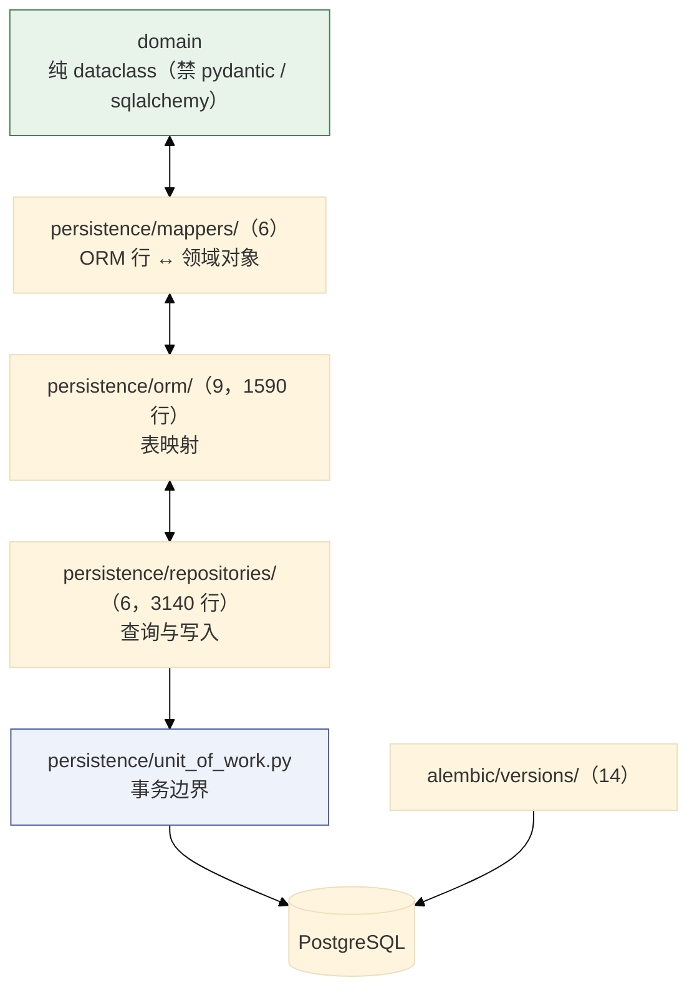
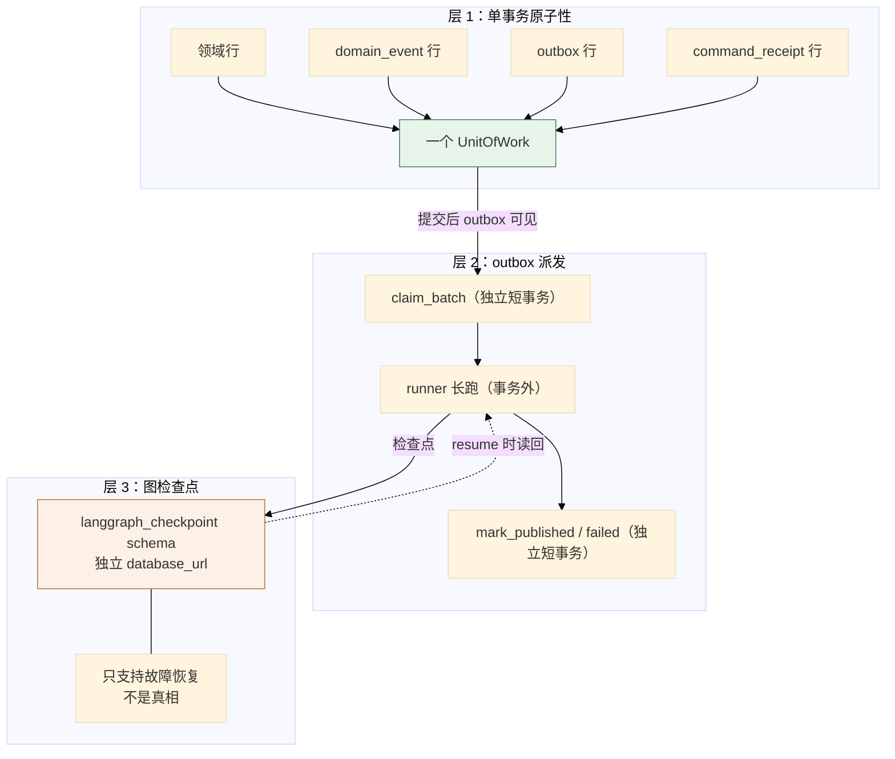
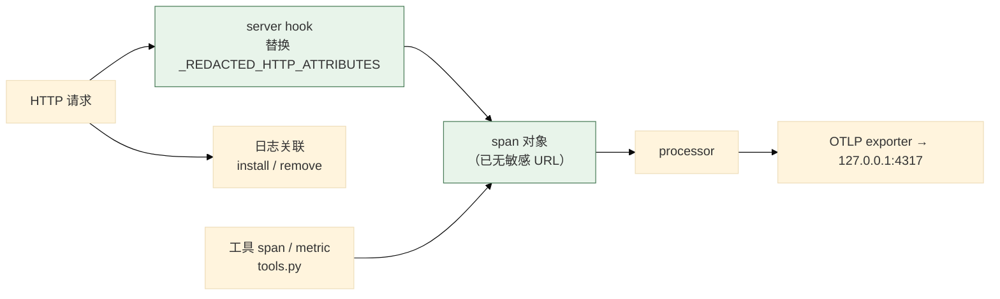

# 07 持久化、可靠性与可观测性

> **本文性质：** 代码级取证补充，**不构成契约**。`docs/README.md` 规定「Architecture and persistence documents are authority」——冲突时以 `persistence-schema.md` + `observability.md` 为准。

> **文档类型**：子系统深挖（代码级核验，非设计提案）
> **分析对象**：`D:\Project\HISIEM-SOC-Copilot` 的 `infrastructure/persistence/`（24 文件，**5912 行**）+ `infrastructure/durable/`（4）+ `infrastructure/checkpoint/`（2）+ `infrastructure/messaging/`（1）+ `infrastructure/observability/`（6，929 行）+ `alembic/`（**13 个迁移 + `__init__.py`**）
> **取证方式**：源码直读 + grep 统计；每个关键论断附 `file:line` 锚点
> **结论以当前代码为准**（分支 `capability-mcp` @ `1e567be`）
> **文档集**：00–08 共 9 篇，见 [`README.md`](README.md)

---

## 为什么这四块合一篇

它们都是**「让业务逻辑可以假设自己不会丢数据、不会静默失败、可以被观察」**的基础设施：

| 块 | 保证 |
| --- | --- |
| `persistence/` | **数据落得下、读得出、事务正确** |
| `durable/` | **意图不会丢**（outbox + 检查点 + 命令回执） |
| `checkpoint/` | **图的进度能恢复** |
| `observability/` | **失败看得见，且看不该看的看不到** |

**主线是一条分层原则**，写在 `durable.py` 的 docstring 里（见 §2.1 论断 1）：**领域行与事件行同事务；outbox 的领取/标记各自独立事务，绝不放在图/LLM/网络事务里。**

---

## 1. 持久化：四层与 13 个迁移

### 1.1 关键论断

**论断 1：持久化分四层，且职责不重叠。**

| 层 | 目录 | 职责 |
| --- | --- | --- |
| **ORM** | `persistence/orm/`（9 个模块） | 表映射 |
| **Mapper** | `persistence/mappers/`（6） | ORM 行 ↔ 领域对象 |
| **Repository** | `persistence/repositories/`（6 个模块，最厚的一层） | 查询与写入实现 |
| **UnitOfWork** | `persistence/unit_of_work.py` | 事务 + 端口聚合 |

**最厚的两个文件都在知识域**：`repositories/knowledge.py` 与 `orm/knowledge.py`——**知识上下文的表最多**。

**知识域的 ORM 实测 9 张表**（`orm/knowledge.py`，全部继承 `CopilotBase`），分两组：

| 组 | 表 |
| --- | --- |
| **知识文档 6 张** | `knowledge_document` / `knowledge_document_version`（版本化：`active_version_id` + `revision`/`lock_version`）、`embedding_profile`、`knowledge_chunk`、`knowledge_content_chunk`、`knowledge_chunk_embedding` |
| **ATT&CK 3 张** | `attack_release` / `attack_technique` / `attack_release_projection` |

**chunk 有两种形态**：`knowledge_chunk` 是**内联向量**的形态；`knowledge_content_chunk` + `knowledge_chunk_embedding` 是**内容与向量分离、chunk 带 `generation`** 的形态。**这是 06 篇「不可变内容 vs 可重建投影」在表结构上的落点。**

**知识域 repository 是三段式**：文件头的模块 docstring 就是该文件的四条设计规则（scope 只做 SQL WHERE、数据库是最终裁决者、候选只取 ACTIVE 版本的 CURRENT generation、排序语义化）；中间是模块级私有助手；最后是 6 个 repository 类，其中 chunk repository 带 `lexical_candidates` / `vector_candidates` **两条检索通道**与 `projection_state` / `corpus_snapshot` 两个探针。

**论断 2：`mapper` 层的存在是「domain 无框架依赖」的必然结果。**

**因为 `domain` 用纯 dataclass 且禁 pydantic / sqlalchemy**（00 篇 §2.1 论断 2），**ORM 行与领域对象必须是两套类型**——所以**必须有一层转换**。6 个 mapper 模块对应 5 个域：`evidence` / `investigation` / `knowledge` / `response` / `workflow`。

**论断 3：13 个 Alembic 迁移，编号反映能力演进；四个分组。**

`alembic/versions/` 下 14 个 `.py` 里只有 **13 个是迁移**（第 14 个是 `__init__.py`）。**13 个迁移全部有真实的 `downgrade()` 实现**（无一是 `pass`），其中 3 个是**带守卫的降级**。

| 组 | 迁移 | 主题 |
| --- | --- | --- |
| 基础 | `d4bf8eed9e09` | 初始 schema |
| **响应生命周期** | `c8f1a93d5b27` / `b7c2d41a90ef` / `979070495d4f` / `5b85af6841f2` | 分离两条生命周期、执行态、注意态、提案人来源 |
| **outbox / 回执可靠性** | `b6c2a4d19f30` / `72390ed8cf87` / `4c7a11f2d901` / `d7681ebf99cd` / `5a1e07c9b4f0` | trace 传播、fencing、回收与死信、回执指纹、作用域幂等 |
| **知识库** | `ed6af82d9b13` / `c41f7b2e9d08` / `a5e93c07fd21` | 版本化知识、不可变 chunk、发布投影与降级守卫 |

**「outbox / 回执可靠性」占了 5 个迁移**——**这是演进最密集的一块，说明「恰好一次」是迭代出来的，不是一次设计对的。**

**论断 4：`outbox_trace_context` 迁移让 outbox 行携带 traceparent。**

迁移 `b6c2a4d19f30`，使用点在 `dispatcher.py:174-178`：派发时用 `linked_worker_span("durable.dispatch", traceparent=record.traceparent, ...)` 接上入队时抓到的追踪上下文。**一次入队请求的 trace 会延续到异步派发的 worker**（可能几秒或几分钟后）——**这让「一次调查请求」在追踪上是一条完整的链，而不是两段无关的链。**

**论断 5：`command_receipt` 有两个迁移——指纹 + 作用域幂等。**

`d7681ebf99cd`（request fingerprint）+ `5a1e07c9b4f0`（scoped idempotency）合起来是：**同一个命令（按指纹判定）在同一个作用域内只生效一次**。**这是 01 篇 §3 论断 5 提到的「workflow commands are receipt-idempotent」的实现基础。**

### 1.2 持久化分层

---

## 2. 可靠性：三层机制

### 2.1 关键论断

**论断 1：事务边界的分工写在 `durable.py` 的 docstring 里，两句话是相反的归属。**

`infrastructure/persistence/repositories/durable.py:1-8`：*「Each method is called INSIDE an existing UnitOfWork transaction (the handler owns commit/rollback), so the rows they insert are atomic with the domain rows (persistence-schema.md §31). The outbox claim/mark methods used by the dispatcher each run in their OWN transaction via a session factory — never inside a graph/LLM/network transaction.」*

| 方法类 | 事务归属 | 理由 |
| --- | --- | --- |
| **事件 / outbox 入队 / 回执 / 审计 / 绑定** | **调用方的 UnitOfWork 内** | **与领域行原子** |
| **outbox 的 claim / mark** | **各自独立事务**（经 session factory） | **绝不放在图 / LLM / 网络事务里** |

**第二句是最关键的一条**。**为什么**：**图的运行可能持续几分钟（含多次 LLM 调用）**。若把 outbox 的标记放进这个事务，**事务会持有一个数据库连接好几分钟**，且**租约的可见性会受事务隔离影响**——别的 worker **看不到**你正在处理的租约。**所以 `claim_batch` 与 `mark_published` / `mark_failed` 各开一个短事务，runner 的长跑在事务之外。**

**论断 2：outbox 的可靠性机制在 01 篇 §2 已详述——这里只列全貌。**

| 机制 | 作用 | 锚点 |
| --- | --- | --- |
| **三分类失败** | 只有一类能进死信 | `dispatcher.py:10-15` |
| **解析失败永不消耗死信预算** | 保持可重试 | `dispatcher.py:196-213` |
| **耗尽 hook 先写业务事实** | 投影与 outbox 不矛盾 | `dispatcher.py:325-346` |
| **租约 + fencing token** | 跨进程不重复 | `dispatcher.py:226-235` |
| **有界指数退避（上限 120s）** | 无限重试但速率有界 | `dispatcher.py:373-376` |
| **每聚合进程内锁** | 同进程不并发 | `dispatcher.py:141-153` |

**论断 3：`durable` 有 4 个文件，重量集中在 `response_runner.py`（783 行）。**

`dispatcher.py` 404 / `response_runner.py` **783** / `investigation_runner.py` 208 / `__init__.py` 17——**响应侧是调查侧的近四倍**，原因见 04 篇 §4 论断 4。

**论断 4：LangGraph 检查点用自己的库与 schema，且建表不归 Alembic。**

`config.py:43,56` 的 `LangGraphSettings` 有独立的 `database_url` 与 `schema_name`。

**三处独立**：

| 维度 | 独立点 |
| --- | --- |
| 连接 | 独立 `database_url` |
| schema | 独立 `schema_name`（`langgraph_checkpoint`） |
| 职责 | **只支持故障恢复 / 中断 / 恢复**（`state.py:7-8`），**不是真相** |

**「独立 schema」的好处**：检查点表可以整体清理/重建，不会碰到业务表——**而检查点本来就是可丢弃的**（真相在领域聚合里）。

**建表 DDL 由 LangGraph 自己执行，Copilot 不写也不迁移这些表**：`PostgresCheckpointer.__aenter__` 建连后 `saver = AsyncPostgresSaver(self._conn)` 再 **`await saver.setup()`**（`infrastructure/checkpoint/postgres.py:44-48`）。schema 是通过 DSN 钉死的：`_checkpoint_dsn` 把 SQLAlchemy URL 降级成 `postgresql://` 并拼 `options=-csearch_path%3D<schema>`（`:21-32`）。

**Alembic 侧的文件头把这条边界写死了**（`alembic/env.py:1-5`）：*「Owns migrations for `copilot.*` only. The `langgraph_checkpoint` schema is managed by LangGraph itself and is explicitly excluded from autogenerate.」*——**13 个迁移里也确实没有任何 checkpoint DDL。**

**论断 5：`messaging/` 是空命名空间。**

`infrastructure/messaging/__init__.py` 的内容只有一句「Empty namespace marker.」——**当前没有消息中间件**：outbox 走的是**数据库表**，不是 MQ。**这个空包是为将来留的位置**（与 `threat_intel/` 同）。

### 2.2 三层可靠性机制

---

## 3. 可观测性

### 3.1 关键论断

**论断 1：可观测性有 6 个模块，`bootstrap.py` 最重。**

| 文件 | 职责 |
| --- | --- |
| `bootstrap.py` | OTel 生命周期 + 隐私安全的标准埋点 |
| `tools.py` | 工具执行的 span / metric |
| `context.py` | 追踪上下文（含 `linked_worker_span` / `capture_traceparent`） |
| `metrics.py` | 指标 |
| `log_correlation.py` | 日志关联 |
| `__init__.py` | — |

**论断 2：`bootstrap.py` 的定位是「可选 + 隐私安全」。**

`infrastructure/observability/bootstrap.py:1`：*「Optional OpenTelemetry lifecycle and privacy-safe standard instrumentation.」*

| 词 | 含义 |
| --- | --- |
| **Optional** | 追踪默认关闭（`config.py:137` 的 `tracing_enabled = False`） |
| **privacy-safe** | 标准埋点必须脱敏 |

**论断 3：HTTP 埋点的敏感字段在服务端 hook 处替换，早于任何 processor 或 exporter。**

`bootstrap.py:22-24` 的注释：*「HTTP instrumentation populates these fields from request scopes. Their values may contain queries, resource identifiers, or caller network data; replace them at the server hook before they can reach a processor or exporter.」*

> **脱敏发生在最上游——不是「导出前过滤」，而是「压根不产生」。**
>
> 两者的区别很实际：「导出前过滤」意味着**敏感值短暂存在于 span 对象里**（可能被别的 processor 看到、可能进批处理缓冲）；**「在 server hook 处替换」则让敏感值从不进入可观测管线**。

**被替换的字段实测是 11 个**（`bootstrap.py:25-36` 的 `_REDACTED_HTTP_ATTRIBUTES`），三类：

| 类 | 字段 |
| --- | --- |
| **URL**（可能含查询串） | `url.full` / `url.original` / `url.path` / `url.query` / `http.url` / `http.target` |
| **请求头**（凭据） | `http.request.header.authorization` / `http.request.header.cookie` |
| **网络地址** | `net.peer.ip` / `network.peer.address` / `client.address` |

**`authorization` 与 `cookie` 两类是这个清单里最要紧的**——URL 里可能含分析员输入的查询串，而请求头里直接就是凭据。**另有一层兜底**：`_scrub_http_span`（`:39-45`）对每个键 `set_attribute(key, "")`——**注意它是置空，不是删除**（该 API 只能改值），docstring 里写作 "Remove" 是宽松的说法。

**论断 4：追踪上下文在异步边界处显式传递。**

`observability/context.py` 提供 `linked_worker_span` 与 `capture_traceparent`：**`capture_traceparent` 在入队时抓，`linked_worker_span` 在派发时接上**（`dispatcher.py:174-178`）——**这是跨异步边界的追踪传播**。

**论断 5：日志关联成对安装/卸载，注入 9 个字段、分两族。**

`log_correlation.py` 只有 44 行，导出的名字是 `install_log_correlation` / `remove_log_correlation`（`bootstrap.py:18`）——**成对的安装与卸载**。**这很重要**：**测试里若不卸载，日志关联会泄漏到别的测试**。

**注入的字段有两族**：**trace 族 4 个**（`otel_trace_id` / `otel_span_id` / `otel_service_name` / `otel_operation`）与**业务关联 ID 族 5 个**（`investigation_id` / `response_proposal_id` / `tool_invocation_id` / `execution_command_id` / `correlation_id`，受 `_LOG_FIELDS` 白名单限制）。**业务 ID 只进日志——不进 span 属性、也不进指标标签。**

**论断 6：工具遥测是一个子类，不是装饰器。**

`infrastructure/observability/tools.py:27` 定义的是 `class ObservedToolExecutor(ToolExecutor)`——**它是子类**，docstring 为*「Add telemetry at the composition edge without coupling the Agent layer.」*：`__init__` 以同一套关键字参数调 `super().__init__(...)`（`:29-44`），并重写 `execute()`。

**这解决了一个结构性问题**：**`agent` 层禁止依赖可观测性基础设施**（`test_import_boundaries.py:45` 禁 `agent` 导入 `infrastructure`），**但工具调用又必须被观测**。

| 观察 | 含义 |
| --- | --- |
| **它在 `infrastructure/` 下** | 所以埋点不可能是 agent 自己做的 |
| **它导入 `agent.tools.*`** | 依赖方向是 `infrastructure → agent`（允许） |
| **它继承并重写 `ToolExecutor`** | **装配时被当作那条链本身**，而不是套在外面 |

**业务逻辑（`agent/tools/executor.py`）保持纯净，观测逻辑由装配处换上子类**——与 03 篇 §2 论断 7 的「executor 不读模型参数」是同一取向：**关注点分离靠结构，不靠自觉**。

**装配点是一个闭包工厂**（`bootstrap/container.py:255-260`）：`GraphRuntime(executor=ObservedToolExecutor(hisiem=..., knowledge=..., provider_router=..., registry=...))`。**注意路由表里的 native 分支绑的是另一个实例**——`base_executor = ToolExecutor(...)`（`container.py:236-240`）被 `NativeToolProvider(base_executor)` 包住。所以链路是「图 → **ObservedToolExecutor** → `super().execute()`（把 `provider_router` 传给基类，`tools.py:37`）→ `ProviderRouter` → `NativeToolProvider(base_executor)`」——**观测层不在路由环里，不存在递归**。

**身份识别也不受影响**：全仓**没有任何对执行器做 `isinstance` / `type` 判断**；`NativeToolProvider.identity` 是**类属性常量**（`agent/tools/native_provider.py:22`），不取自被包装对象；`ObservedToolExecutor` 以同一套关键字参数调用 `super().__init__`、与基类同签名，可替换。

**论断 7：标准埋点是 4 类 instrumentor + 2 项非 instrumentor。**

三个库级 instrumentor 在 `_TelemetryRuntime` 首次创建时一次性实例化（`bootstrap.py:277-281`：`HTTPXClientInstrumentor()` / `SQLAlchemyInstrumentor()` / `PsycopgInstrumentor()`），统一由 `_instrument_standard_libraries`（`:180-214`）装配：

| 类 | 关键设置 |
| --- | --- |
| **httpx（客户端）** | 先在 `_disable_httpx_header_capture()`（`:75-93`）里把三个 `OTEL_INSTRUMENTATION_HTTP_CAPTURE_HEADERS_*` 环境变量**临时置空**（该 instrumentation 从环境变量而非 kwargs 读头捕获配置），再传 4 个脱敏 hook |
| **SQLAlchemy** | `enable_commenter=False`、`capture_parameters=False` |
| **psycopg** | `capture_parameters=False` |
| **FastAPI（服务端）** | `server_request_hook=_sanitize_server_request`，且三个头捕获参数**都传空列表**——服务端头捕获被强制清空 |

另两项非 instrumentor 埋点：**W3C 传播器** `set_global_textmap(TraceContextTextMapPropagator())`（`:309`）与**日志关联过滤器** `install_log_correlation(...)`（`:315-320`）。**擦除动作统一走 `_scrub_http_span`。**

**论断 8：指标集是三张常量表的完备定义。**

`observability/metrics.py` **只有 3 个函数**：`record_counter`（`:119`）、`record_histogram`（`:139`）、以及**不记录指标的标签校验器** `sanitize_metric_attributes`（`:104`）。

**指标全集 = 计数器 18 个 + 直方图 10 个 = 28 个名字**（`_COUNTERS` `:11-32`、`_HISTOGRAMS` `:33-46`），外加**标签白名单 9 键**（`_ALLOWED_LABEL_VALUES` `:47-99`）。**名字不在白名单、或任一标签值不在白名单的记录会被静默丢弃**（`:110-116`、`:123-124`）——**所以这三张表就是「哪些指标存在」的完备答案**。

### 3.2 可观测性管道

> **图的形状就是设计意图**：脱敏在**最左边**，**之后所有节点都拿不到敏感值**。

---

## 4. 关键不变式（代码强制）

| # | 不变式 | 强制点 | 违反后果 |
| --- | --- | --- | --- |
| 1 | **领域行与事件/outbox/回执行同事务** | `durable.py:3-5` | 状态变了但事件丢了 |
| 2 | **outbox 领取/标记各自独立事务** | `durable.py:5-8` | 长事务持有连接、租约不可见 |
| 3 | **outbox 事务绝不包住图/LLM/网络调用** | 同上 | 连接被占几分钟 |
| 4 | **检查点库与业务库分离** | `config.py:43,56` 独立 `database_url` + `schema_name` | 清理检查点碰到业务表 |
| 5 | **检查点不是真相** | `state.py:7-8` | 从检查点恢复出与聚合不符的状态 |
| 6 | **outbox 行携带 traceparent** | 迁移 `b6c2a4d19f30`；`dispatcher.py:174-178` | 异步段追踪断链 |
| 7 | **命令回执按指纹 + 作用域幂等** | 迁移 `d7681ebf99cd` + `5a1e07c9b4f0` | 命令被重复执行 |
| 8 | **租约带 fencing token** | 迁移 `72390ed8cf87`；`dispatcher.py:226-235` | 过期持有者写入 |
| 9 | **追踪默认关闭** | `config.py:137` `tracing_enabled = False` | 未配置就尝试导出 |
| 10 | **HTTP 敏感字段在 server hook 处替换**（11 个字段，含 `authorization` / `cookie` 头） | `bootstrap.py:22-36` | 查询串 / 凭据 / 地址进 exporter |
| 11 | **脱敏早于 processor 与 exporter** | `bootstrap.py:23-24` | 敏感值短暂存在于管线中 |
| 12 | **日志关联成对安装/卸载** | `bootstrap.py:18` | 测试间状态泄漏 |
| 13 | **嵌入配置与对话 LLM 独立** | `config.py:452` | 见 06 篇 |

---

## 5. 与其他子系统的边界

| 边界 | 方向 | 契约 | 锚点 |
| --- | --- | --- | --- |
| `application.ports.unit_of_work` ← `persistence.unit_of_work` | 入 | `UnitOfWork` | `application/ports/unit_of_work.py` |
| `application.ports.repositories` ← `persistence.repositories` | 入 | 11 个 repository **端口**（而 `UnitOfWork` 表面暴露 **21 个属性**） | `application/ports/repositories.py` |
| `application.ports.durable` ← `persistence.repositories.durable` | 入 | `OutboxStore` / `EventLedger` / `CommandReceiptStore` / `OrchestrationBindingStore` / `ToolInvocationStore` | `application/ports/durable.py` |
| `infrastructure.durable` → `persistence.repositories.durable` | 出 | outbox claim/mark | `dispatcher.py:158-164` |
| `infrastructure.durable` → `observability.context` | 出 | `linked_worker_span` | `dispatcher.py:35` |
| `bootstrap` → 全部 | 入 | 装配 | `container.py:152-171`（session factory / UoW） |
| `infrastructure` ↮ `api` | **禁** | — | `test_import_boundaries.py:52` |

**`application/ports/durable.py` 是端口最多的一个模块**（`durable.py:20-33` 从它导入 12 个名字）：`AppendableEvent` / `CommandReceiptRecord` / `CommandReceiptStore` / `DomainEventEnvelope` / `DurableCommand` / `EventLedger` / `OrchestrationBinding` / `OrchestrationBindingStore` / `OutboxRecord` / `OutboxStore` / `ToolInvocationRecord` / `ToolInvocationStore`。

**12 个名字分属 5 个概念**：事件台账、命令回执、编排绑定、outbox、工具调用记录。**这五个概念就是「持久化可靠性」的全部词汇表。**

---
