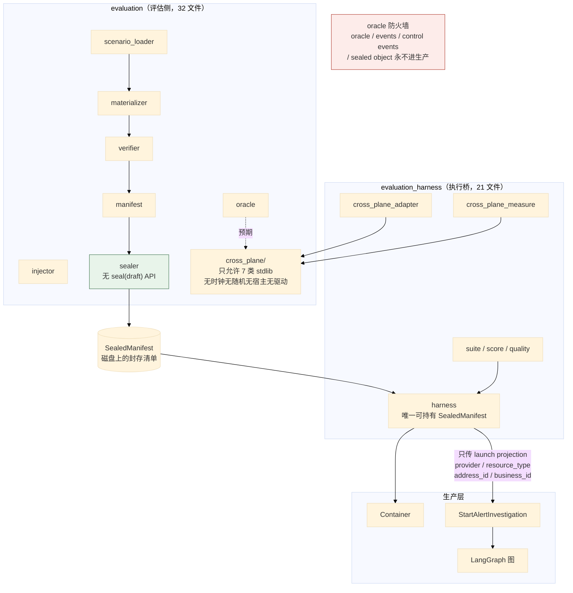
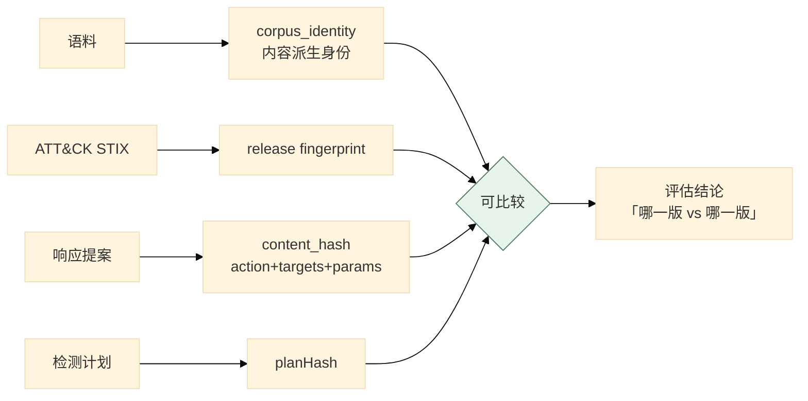

# 08 评估体系

> **本文性质：** 代码级取证补充，**不构成契约**。`docs/README.md` 规定「Architecture and persistence documents are authority」——冲突时以 `evaluation/evaluation-closure-contract.md` 为准。

> **文档类型**：子系统深挖（代码级核验，非设计提案）
> **分析对象**：`D:\Project\HISIEM-SOC-Copilot` 的 `evaluation/`（**28** 文件，**10764** 行）+ `evaluation_harness/`（21 文件，9708 行）+ `knowledge/evaluation.py`（671 行）
> **取证方式**：源码直读 + grep 统计；每个关键论断附 `file:line` 锚点
> **结论以当前代码为准**（分支 `capability-mcp` @ `1e567be`）
> **文档集**：00–08 共 9 篇，见 [`README.md`](README.md)

---

## 为什么评估独立成篇

**因为它的体量超过了业务域本身。**

```bash
$ find src/hisiem_soc_copilot/evaluation src/hisiem_soc_copilot/evaluation_harness -name "*.py" -not -path '*__pycache__*' | wc -l
49
$ find src/hisiem_soc_copilot/domain -name "*.py" -not -path '*__pycache__*' | wc -l
29
```

| 包 | 文件 | 行数 |
| --- | --- | --- |
| `evaluation`（评估侧） | **28** | **10764** |
| `evaluation_harness`（执行桥） | **21** | **9708** |
| `domain`（业务域） | 29 | **3107** |
| **合计** | **49** | **20472** |

**评估体系的代码量是业务域的 6.6 倍。** 这本身就是一条设计陈述：**这个项目的取向是「先建可信评估，再建功能」。**

**并且它有独立于生产层的架构约束**：

```
tests/architecture/test_evaluation_boundary.py     # 生产层禁导入 evaluation
tests/architecture/test_cross_plane_boundary.py    # 生产层禁导入 evaluation_harness
```

---

## 1. 三个包的分工

### 1.1 关键论断

**论断 1：三个包的分工由各自 `__init__.py` 的 docstring 定义。**

| 包 | 是 | 不是 | 允许持有 |
| --- | --- | --- | --- |
| `evaluation` | **评估侧**：数据集物化（E1-B.3）+ 清单封存（E1-B.4） | 生产层 | 场景与预期 |
| `evaluation_harness` | **执行桥**（E1-C1）：把封存清单喂给真实生产管线 | **不是 `evaluation` 的一部分，也不是生产层** | **完整的 `SealedManifest`** |
| `knowledge/evaluation.py` | **知识检索的评估器** | 生产层 | 语料与指标 |

`evaluation_harness/__init__.py:1-8` 把自己的定位写死了：*「Bridges the sealed evaluation dataset to the REAL production investigation pipeline. … it is the only component allowed to hold a full `SealedManifest` and drive the production `Container`. Production code never imports this package; the graph never sees the manifest — only the typed launch projection crosses into `StartAlertInvestigation`.」*

**三个包都不在生产层枚举里**（00 篇 §2.1 论断 3 的 `PRODUCTION_LAYERS` 只有 6 个）。

**论断 2：单向依赖是「评估依赖生产契约，生产永不依赖评估」。**

`evaluation/__init__.py:3-5`：*「This package depends one-way on production public contracts; production packages must never import the evaluation oracle (enforced by an architecture test).」*

**「production public contracts」是关键词**——评估可以 import 生产的**契约**，但不能 import 生产的**实现细节**。

**论断 3：两条边界测试各管一个包，第二条是被补上的。**

`tests/architecture/test_cross_plane_boundary.py:5-12` 记录了这段历史：*「Production layers must not import `evaluation_harness`. This invariant was already stated in the harness package docstring … but was **not enforced anywhere**: `test_evaluation_boundary`'s import matcher deliberately matches the `evaluation` package only, and `_reaches(target, "evaluation")` does not match `evaluation_harness` because the separator is `_` rather than `.`」*

**这是一条被「发现并修补」的守卫失效**：**「匹配 `evaluation`」不会匹配到 `evaluation_harness`**。**同一个问题在 `test_knowledge_boundary.py` 里用另一种手法解决了**（阳性对照扫描器，06 篇 §4 论断 4）。

**论断 4：oracle 防火墙是本篇最核心的机制。**

`evaluation_harness/harness.py:6-9`：*「Oracle firewall (E1-B.4 §14): production code receives ONLY the typed launch projection (provider / resource_type / address_id / business_id) via `StartAlertInvestigation` — never the oracle, events, control events, or the sealed object. The graph never sees the manifest.」*

**生产代码收到的只有四个字段**——而这四个正是 04 篇 §2 论断 6 里 `ResponseProposal` 内容哈希的 `target_refs` 四字段。

| 生产侧看不到 | 含义 |
| --- | --- |
| **oracle** | 预期答案 |
| **events** | 注入的事件序列 |
| **control events** | 控制事件 |
| **sealed object** | 封存清单本身 |

**「The graph never sees the manifest」——图不知道自己在被评估。**

**论断 5：「生产源码不得出现场景 id」防的是更隐蔽的泄漏，而测试作者解释了为什么只扫这一种。**

`test_cross_plane_boundary.py:18-27`：*「No XP-01 scenario identity may appear in production source. Scenario ids and gate ids are the evaluation oracle's vocabulary; finding one in a production layer means evaluation expectations reached the runtime. Expected/forbidden *fact tokens* are deliberately NOT string-scanned: they are ordinary English compounds that production already uses for unrelated purposes (`workspace_service`'s timeline label `INVESTIGATION_COMPLETED`, `response_runner`'s `_SUBMISSION_ATTENTION_REQUIRED` variable), so a string scan over them would report noise rather than a boundary violation. The structural guarantee is the import rule above.」*

**三段信息**：规则是「不得出现场景 id / gate id」；做法是**只扫场景 id、不扫「预期事实 token」**；理由是那些 token 是普通英文词组、生产已用于无关用途——**扫它们只会产生噪音**。**「宁可窄而准」——宽而吵的检查会被加进允许清单从而失效。**

**这也明确了主要防线与辅助检查的分工**：**主防线是导入规则（结构性）**，场景 id 字符串扫描只是启发式。

**论断 6：`evaluation/cross_plane/` 只允许 7 类 stdlib 导入。**

`test_cross_plane_boundary.py:49-59` 的注释给出了理由：*「stdlib the pure XP-01 package may touch: serialization, identity, and pure data structures. **No clock, no randomness, no host, no driver** — which is what makes a gate verdict reproducible from the collected facts alone.」*，清单是 `__future__` / `collections` / `dataclasses` / `enum` / `hashlib` / `json` / `typing`。

**「无时钟、无随机、无宿主、无驱动」就是判定可复现性的来源**——与 06 篇 §1 论断 3 的「排序必须是纯函数」是同一个论证在两个包上的应用。

| 包 | 在清单里？ | 为什么 |
| --- | --- | --- |
| `hashlib` / `json` / `dataclasses` / `enum` / `typing` | **是** | 身份计算与纯数据结构，确定性 |
| `time` / `datetime` | **否** | **时钟不可复现** |
| `random` | **否** | **随机不可复现** |
| `socket` / `subprocess` | **否** | **宿主依赖** |

**对照 `evaluation` 的允许清单**（`test_evaluation_boundary.py:32-60`）**要宽得多**——含 `asyncio` / `datetime` / `os` / `pathlib` / `socket` / `subprocess` / `time` / `uuid` / `zoneinfo` / `fcntl` / `msvcrt` / `httpx`，因为**它要真的物化数据集、注入事件、做跨进程发布**（`sealer.py` 的文件锁需要 `fcntl`/`msvcrt` 平台分支）。**同一个包内部，子包的约束比父包严得多——因为子包的职责是纯判定。**

**论断 7：`sealer` 的 API 形状让「封存未验证数据集」结构上不可能。**

`evaluation/sealer.py:1-12`：*「The sealer persists only already-built `contracts.SealedManifest` objects (produced from a `contracts.VerifiedDataset` by `.manifest`). **There is deliberately NO `seal(draft)` / `seal(VerifiedDataset)` API** and no code path accepting a `contracts.MaterializationDraft`, so sealing an unverified dataset is structurally impossible (E1-B.4 §2).」*

**「刻意不提供某个 API」与 04 篇的 `PolicyDecision` 只有两个取值是同一种手法：不给那个能力，而不是「有但不让用」。** 这条设计在本集里出现了三次：

| 处 | 「不给的能力」 |
| --- | --- |
| `PolicyDecision`（04 篇 §3 论断 1） | 没有 `ALLOW_AUTOMATIC` |
| `sealer`（本篇） | 没有 `seal(draft)` |
| `_TRANSITIONS`（02 篇 §1 论断 3） | 没有 `CREATED → APPROVED` 的边 |

**论断 8：封存是跨进程先写者胜 + 原子可见。**

`sealer.py:14-21`：*「Publication is CROSS-PROCESS first-writer-wins AND atomically visible. The final `manifest.json` is ONLY ever created by an atomic `os.replace` of a fully written + fsynced same-directory temp file — it can never be observed as a torn/partial JSON document. Mutual exclusion uses a STABLE, kernel-backed advisory file lock on a guard file `<name>.seal.lock` that is NEVER deleted and holds no ownership record.」*

| 细节 | 理由 |
| --- | --- |
| **`os.replace` 同目录临时文件** | **原子替换**——`manifest.json` 永远不会被观察到半写状态 |
| **`fully written + fsynced` 之后才替换** | 先落盘再替换 |
| **`.seal.lock` 永不删除、不持有归属记录** | **删除锁文件会引入竞态**：「另一个进程正持有旧 inode 的锁」与「新进程创建新锁文件」会同时成立 |

**另有一条幂等规则**（`sealer.py:9-11`）：**已存在的目标必须与新算出的字节完全匹配才算成功**，任何差异都是 `ManifestSealConflict`——**所以覆盖已封存清单也会失败，而不是静默生效**。

**论断 9：`sealer` 是纯文件系统工作。**

`sealer.py:11` 写的是 *「Pure filesystem work — no network, provider, or model I/O.」*

### 1.2 三包与防火墙



> **图的形状就是不变式**：**唯一穿过防火墙的是四个字段的 launch projection。**

---

## 2. 评估运行的隔离

### 2.1 关键论断

**论断 1：执行桥驱动的是真实运行时栈。**

`evaluation_harness/harness.py:11-16`：*「The runtime stack is REAL: real HISIEM (or an injected fake for tests), real Copilot PostgreSQL, real LangGraph Postgres checkpoint, real domain/outbox/runner code, real graph. The model provider is EXPLICIT and SCRIPTED (E1-C1; the real provider is E1-C2). `COPILOT_APP_ENABLE_DISPATCHER` must be disabled BEFORE the Container opens (E1-C1 isolation) and the harness drives `drain_once` manually.」*

**唯一的假实现是模型 provider，且是显式的**——**这解释了 03 篇 §4 论断 5 为什么 `scripted` 是默认值**：确定性模型是评估可复现的前提。

**论断 2：隔离靠在容器打开前关闭 dispatcher，由 harness 手动驱动。**

| 点 | 理由 |
| --- | --- |
| **BEFORE the Container opens** | **打开后就晚了**——`Container.open()` 若启用了 dispatcher，会自动起后台任务 |
| **harness 手动 `drain_once`** | **推进时机由评估控制**，不是「等它自己跑」——评估要知道「什么时候推进了一步」才能断言中间状态 |

**这与 01 篇 §2 的 `drain_once` 是同一个方法**——**同一个 API 既服务生产轮询，也服务评估的手动驱动**。

**论断 3：数据集来源与执行来源是分开记录的。**

`harness.py:18-20`：*「Dataset vs execution provenance are SEPARATE: `dataset_*` comes from `manifest.code`; `execution_*` is the CURRENT clean Copilot HEAD/worktree」*

**为什么必须分开**：评估结果要能回答「这个结果是在哪份数据上、用哪份代码跑出来的」——**两个问题，两个答案**。**如果合成一个字段，「换代码重跑旧数据」就会被误读为「数据也换了」。**

**论断 4：执行桥与预言机体量相当，预言机侧略大——因为跨平面那一半在它这边。**

`evaluation_harness` 21 个文件、9708 行；`evaluation` 28 个文件、10764 行。**预言机侧更大，是因为它含 `evaluation/cross_plane/` 与完整的物化/封存链**；执行桥虽小，却承担了隔离、注入、记录、判定与遥测。

**论断 5：项目里并存三套阶段编号——不要把它们当成一套。**

`evaluation_harness/cross_plane_e3_scenarios.py` / `e4` / `e5` 这种按阶段分文件的名字，依赖读者知道「E3/E4/E5」是什么。**实测有三套并存的编号体系**：

| 套 | 形态 | 例子 |
| --- | --- | --- |
| ① 宏观阶段 | 字母 | A–E（Knowledge closure / Observability / Capability-MCP / Analyst experience / Cross-plane acceptance） |
| ② Stage E 内部子阶段 | `E0`–`E7` | `E1` = XP-01 contract & gate model；`E3` = Authority & reliability；`E4` = Observability；`E5` = Workspace；`E6` 聚合；`E7` 封存 |
| ③ **GP-01 评估轨道** | `E1-B.*` / `E1-C*` | `E1-B.3` / `E1-B.4` / `E1-C0`…`E1-C6` |

**`E1-B` / `E1-C` 属第三套**，其提交（`e5c9119` 2026-09-06、`06b1435` 2026-09-09）比 Stage E/E1 的基线 `d4cfc8e`（2026-09-17）**早 11 天**；Stage E 自己的 E0 审计还把 `GP-01 (E1-C3)` 列为**既有依赖**。**所以「E1」在两套体系里指的不是同一件事，读文档时必须先确认是哪一套。**

**论断 6：失败分四类，无效失败不算产品失败。**

`evaluation_harness/classification.py` 与 `quality.py` / `quality_harness.py` 实现四种分类（`evaluation_harness/__init__.py:13-15` 暴露）：

| 分类 | 含义 |
| --- | --- |
| `CLASS_VALID_PASS` | 有效通过 |
| `CLASS_VALID_FAIL` | **有效失败**（产品真的错了） |
| `CLASS_INVALID_PROVIDER_TRANSIENT` | **无效失败**（provider 抽风） |
| `CLASS_ABORT` | 中止 |

**「有效失败」与「无效失败」的区分是关键**：**一个因 provider 瞬时故障而失败的运行，不是产品的失败**——不分这两类，评估结果会被基础设施抖动污染。**这与 01 篇 §2 论断 1 的「三分类失败」是同一种思维：先把失败分类，再决定怎么算。**

**论断 7：`score.py` 里没有相似度评分——它是确定性的机器判定。**

`evaluation_harness/score.py` 的 docstring 把口径写死：*「Scoring is DETERMINISTIC and MACHINE-ONLY (§2/§6). It is computed from the sealed oracle (expected verdict + required evidence roles), the persisted `InvestigationResult` (disposition + `finding_ids`), the E1-C3 tool/evidence quality facts, and the E1-C2 model telemetry gate. **It NEVER parses verdict prose, NEVER scores natural-language similarity, NEVER uses embeddings/fuzzy matching, and NEVER calls a model or a tool. The confidence value is INFORMATIONAL only and never carries a threshold** (§4/§7).」*

**所以「分」不是打出来的，是**与封存预言机逐项比对**出来的**：预期处置 + 必需证据角色 vs 实际落库的 `InvestigationResult`。**置信度不进判定**。

**同一条 docstring 还划了防火墙在这份产物上的边界**（§18）：**封存预言机允许出现在 `score.json` 里**（它本来就要点名预期处置与角色），**但绝不允许进入 `execution.json`、`model-telemetry.json`、图、prompt 或工具。**

## 3. 知识检索的评估

### 3.1 关键论断

**论断 1：知识评估有两处实现。**

| 位置 | 包性质 | 角色 |
| --- | --- | --- |
| `knowledge/evaluation.py`（671 行） | **非生产包**（CLI 面） | 评估器入口 |
| `evaluation/knowledge/`（5 模块 + `__init__`） | **预言机侧** | 产物、语料、指标、runner |

**「语料身份」（`corpus_identity.py`）是最值得单独指出的一条**：**评估必须知道「这次评的是哪一版语料」**，否则两次评估的指标不可比。

**这与 ATT&CK 的 release fingerprint（06 篇 §3 论断 4）是同一个需求**。**这条需求在本集里出现四次**，都是「规范化内容 → 哈希」：

| 处 | 身份对象 |
| --- | --- |
| `evaluation/knowledge/corpus_identity.py` | **语料** |
| ATT&CK release fingerprint | **威胁情报发布** |
| `ResponseProposal._compute_content_hash`（04 篇 §2 论断 6） | **可审批的响应契约** |
| `DetectionPlanCompiler`（SIEM 05 篇 §3 论断 3） | **检测计划** |

**论断 2：台账与身份是评估侧的两个基础模块。**

`evaluation/ledger.py`（台账——评估运行的记录，与 `evaluation_harness/record.py` 配合）与 `evaluation/identity.py`（身份）。

**论断 3：`evaluation/contracts.py` 是冻结契约，其中的规则常量与 SIEM 上真实部署的规则逐字段吻合。**

`evaluation/__init__.py:8-22` 从 `.contracts` 导入一大批 GP-01 常量。它们描述 GP-01 场景的**精确预期**：

| 常量 | 含义 |
| --- | --- |
| `GP01_RULE_ID` | 评估针对哪条规则 |
| `GP01_RULE_THRESHOLD` / `GP01_RULE_WINDOW_MINUTES` / `GP01_RULE_KEY_FIELD` / `GP01_RULE_CONDITION` | **规则的完整参数** |
| `GP01_REQUIRED_EVIDENCE_ROLES` / `GP01_FAILURE_ROLES` / `GP01_SEMANTIC_ROLES` | 证据角色、失败角色、语义角色 |
| `CANONICALIZATION_ID` | **规范化算法的身份** |

**把五个规则常量与 `D:\Project\SIEM` 的规则 YAML 逐项对照，五项全部一致**：

| Copilot 常量 | 值 | SIEM `infra/rules/rule-ssh-brute-force-001.yaml` |
| --- | --- | --- |
| `GP01_RULE_ID`（`contracts.py:43`） | `rule-ssh-brute-force-001` | `id: rule-ssh-brute-force-001` |
| `GP01_RULE_KEY_FIELD`（`:44`） | `source.ip` | `keyField: source.ip` |
| `GP01_RULE_CONDITION`（`:45`） | `authentication_failure` | `condition.value: authentication_failure` |
| `GP01_RULE_THRESHOLD`（`:46`） | `5` | `threshold: 5` |
| `GP01_RULE_WINDOW_MINUTES`（`:47`） | `5` | `windowMinutes: 5` |

> **这条实证把评估体系与 SIEM 仓库连了起来**：**GP-01 评估的不是人造场景，而是 SIEM 上真实部署的那条 SSH 暴力破解规则。** 所以「评估通过」意味着「针对真实规则的端到端链路正确」，**而不是「针对一个人造靶子正确」**。
>
> **同时它解释了一处设计**：`DetectionPlanCompiler.AUTHENTICATION_FAILURE = "authentication_failure"`（SIEM 05 篇 §3 论断 5）与这里的 `GP01_RULE_CONDITION` **是同一个字面量在两个仓库里的独立出现**——**两侧都硬编码了「当前检测域是认证失败」这条事实**。

**论断 4：`EVENT_PLAN_CROSSES_YEAR_BOUNDARY` 是拒绝码，不是「构造跨年场景」——这是 fail-closed 的时间语义防御。**

`_check_year_boundary`（`evaluation/time_plan.py:127`）在事件计划的 7 个角色**跨自然年**时**主动 raise** `EventPlanCrossesYearBoundary`（`time_plan.py:98`），docstring 原文是 *「refusal is mandatory rather than guessing parser year auto-completion」*；`materializer.py:240` 的 preflight 也以同一码拒绝。

> **代码是「跨年即拒」。** 与其猜解析器怎么补年份，不如直接拒绝。
>
> **计划本身的可调部分**在 `build_event_time_plan`（`time_plan.py:168`）：以 Asia/Shanghai 的 `now-90s` 为锚，F1..F5 间隔 10s、S1 在 F5 后 20s（**S1 严格晚于最后一次失败**），W1 是唯一允许落在未来的角色。

**论断 5：跨平面评估关注「权威」与「可观测」两件事。**

`evaluation_harness/cross_plane_authority.py` 与 `cross_plane_observability.py`——**「authority」对应 04 篇的「来源不进内容哈希」，「observability」对应 07 篇**：**评估要验证「该被观测到的东西确实被观测到了」**。

### 3.2 三重身份



---

## 4. 关键不变式（代码强制）

| # | 不变式 | 强制点 | 违反后果 |
| --- | --- | --- | --- |
| 1 | **生产层不得导入 `evaluation`** | `test_evaluation_boundary.py:1-13` | 预期答案进运行时 |
| 2 | **生产层不得导入 `evaluation_harness`** | `test_cross_plane_boundary.py:5-12` | 封存清单进运行时 |
| 3 | **生产源码不得出现场景 id / gate id** | `test_cross_plane_boundary.py:18-26` | 评估词汇泄漏进生产 |
| 4 | **生产层是显式枚举，不是全集** | `test_cross_plane_boundary.py:38-42` | 新包默认不受约束 |
| 5 | **`cross_plane` 只允许 7 类 stdlib** | `test_cross_plane_boundary.py:52-59` | 判定不可复现 |
| 6 | **`cross_plane` 无时钟、无随机、无宿主、无驱动** | 同上注释 | gate 判定不可复现 |
| 7 | **`sealer` 无 `seal(draft)` API** | `evaluation/sealer.py:4-7` | 封存未验证数据集 |
| 8 | **封存 idempotent：字节必须完全匹配** | `sealer.py:9-11` | 静默覆盖已封存清单 |
| 9 | **`manifest.json` 只经 `os.replace` 创建** | `sealer.py:14-17` | 可观察到半写 JSON |
| 10 | **锁文件永不删除** | `sealer.py:19-21` | 文件锁竞态 |
| 11 | **生产只能收到 4 字段 launch projection** | `evaluation_harness/harness.py:6-9` | 预言机穿防火墙 |
| 12 | **图看不到清单** | 同上 | 图知道自己在被评估 |
| 13 | **dispatcher 必须在 Container open 前关闭** | `harness.py:14-15` | 后台任务与手动驱动竞争 |
| 14 | **数据集来源与执行来源分开记录** | `harness.py:19-20` | 「换代码重跑旧数据」被误读 |
| 15 | **失败分四类，无效失败不算产品失败** | `evaluation_harness/classification.py` | 基础设施抖动污染评估 |
| 16 | **模型 provider 在评估中是显式 scripted** | `harness.py:13-14` | 评估不可复现 |
| 17 | **语料身份是内容派生的** | `evaluation/knowledge/corpus_identity.py` | 两次评估不可比 |
| 18 | **评估包单向依赖生产公开契约** | `evaluation/__init__.py:3-4` | 评估绑死生产实现 |

---

## 5. 与其他子系统的边界

| 边界 | 方向 | 契约 | 锚点 |
| --- | --- | --- | --- |
| `evaluation` → 生产公开契约 | 出 | 单向 | `evaluation/__init__.py:3-4` |
| `evaluation_harness` → `Container` | 出 | **唯一允许**驱动生产容器 | `harness.py:4-5` |
| `evaluation_harness` → `StartAlertInvestigation` | 出 | **唯一的穿越点** | `harness.py:7-8` |
| `knowledge/` → `evaluation` | 出 | **允许**（非生产包） | `test_knowledge_boundary.py:51-53` |
| 生产层 → `evaluation*` | **禁** | — | 两条边界测试 |
| `evaluation_harness` → `evaluation/cross_plane` | 出 | adapter | `cross_plane_adapter.py` |

**一条值得强调的**：`evaluation_harness` **驱动 `Container`** ——而 `Container` 是**生产的组合根**（00 篇 §3.1 论断 1）。

**所以装配点只有一个，评估与生产共用它。** **这保证了「评估跑的路径」与「生产跑的路径」是同一条** ——若评估自己搭一套装配，**评估通过不等于生产正确**。

---
