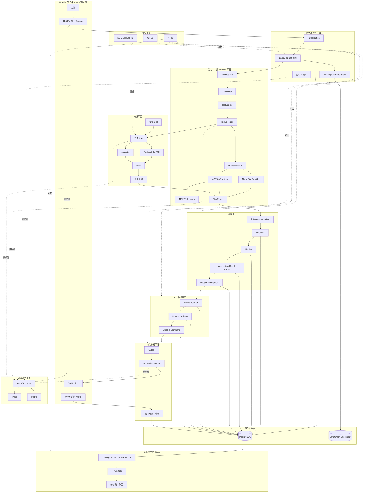
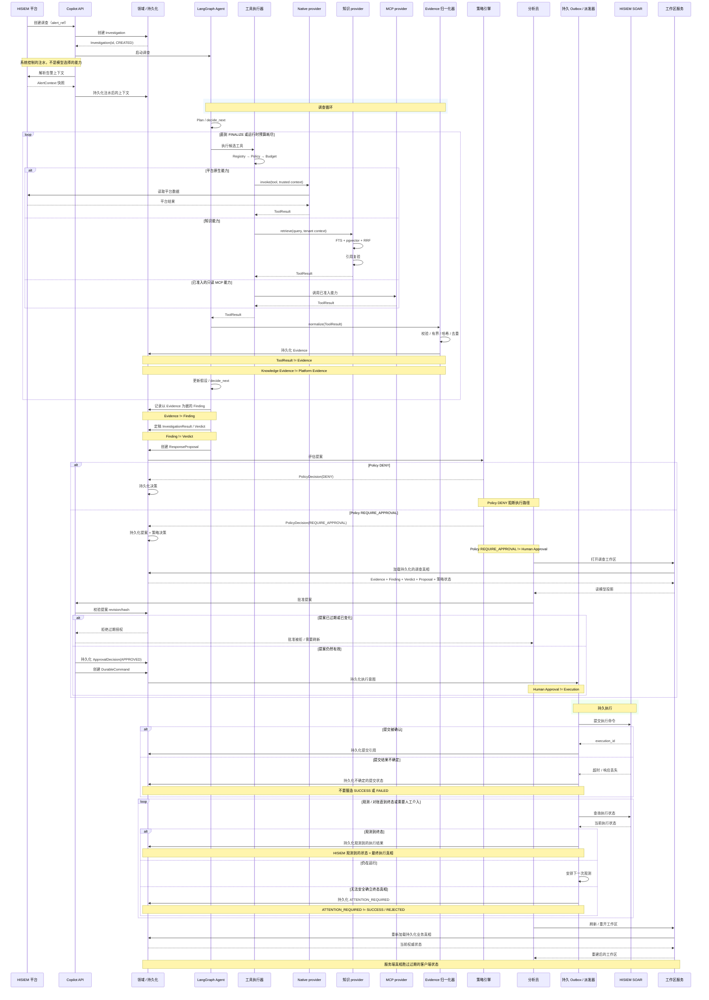

# HISIEM SOC Copilot — 架构图与数据流图

本系统的两张规范图：

1. **[架构图](#1-架构图)** — *系统由什么构成*
2. **[数据流图](#2-数据流图)** — *一次调查生命周期里发生了什么*

配套文档：[`architecture-overview.md`](architecture-overview.md)（八图视觉模型）、[`domain-model.md`](../contracts/domain-model.md)、[`python-package-boundary.md`](../contracts/python-package-boundary.md)、
[`application-commands-domain-events-langgraph-state.md`](../contracts/application-commands-domain-events-langgraph-state.md)。

> **范围。** 这两张图描述的是**本仓**。它所运行于其上的安全平台——摄取、流式检测、告警、案件与确定性
> SOAR 执行——是兄弟仓库 **[HISIEM](https://github.com/xsc683/HISIEM)**，此处作为外部参与者出现。

---

## 1. 架构图

按平面组织：每个组件都归到拥有它的那个职责平面，并把治理与权威链显式画成一条流。

> **关于平面模型——为什么「四」和「十一」都会出现。**
> 冻结的架构契约命名了 **十一个** 职责平面，本图就按这十一个分组。机器可读的形式是
> `evaluation/cross_plane/contracts.py` 里的 `Plane` 枚举，它自己的 docstring 说它是
> *"the planes named by the architecture freeze — **not a new taxonomy**"*。
>
> 「**四平面**」说的是另一件事：它是「本仓**闭环**了哪几个平面」（知识、能力、可观测性、分析员体验）
> 这个说法，其余七个按**复用而非重构**对待。
>
> 所以两者**不是 1:1 映射**，但也不是互相竞争的分类法：四是十一的**子集**，只是为不同目的呈现——
> *本项目闭环了什么* vs *某道闸门属于哪个平面*。**不要为了对齐数字去改任何一边。**



### 这张图解决了什么

它回答的是「**哪个平面拥有哪项职责，以及权威究竟在哪一步易手？**」那条竖链
`ToolResult → Evidence → Finding → Verdict → Proposal → Policy → Human → Command → SOAR →
观测到的结果` 就是整个系统压成的一行，而每一支箭头都是一条「看起来合理的实现会把它抹掉」的边界。

### 组件职责

| 平面 | 拥有 | 值得点明的「不负责」 |
|---|---|---|
| **Agent 运行时** | 图编排、有界工作状态、运行时预算 | **不是**业务权威 |
| **能力 / 工具 provider** | 发现、准入、选择、调用、有界结果 | **不是**策略或授权权威 |
| **知识** | 检索、融合、引用复验 | **不是**判定权威 |
| **领域** | 聚合、不变式、发现、判定、提案 | 不管传输，不管编排 |
| **人工权威** | 策略评估、人工同意、持久命令 | 策略 ≠ 同意；同意 ≠ 执行 |
| **持久执行** | Outbox、派发、对账 | 不是执行真相 |
| **持久化** | PostgreSQL 作为业务真相；LangGraph checkpoint 作为工作记忆 | checkpoint 永远不是业务状态 |
| **分析员工作区** | 持久化真相的呈现投影 | **不是**权威；什么都不发明 |
| **可观测性** | Trace、Metric、日志关联 | **不是**业务真相 |
| **评估** | GP-01、KB-GOLDEN-V1、XP-01 | 不回写生产 |
| **HISIEM**（兄弟仓） | 安全数据、检测、告警、案件、**执行真相** | — |

### 真相与权威分别住在哪

```text
Business truth        = domain aggregates persisted in PostgreSQL
Execution truth       = the state HISIEM observes (never Copilot's belief about what it sent)
Orchestration state   = LangGraph checkpoint — working memory only, never business state
Telemetry             = fully side-channel; no business path reads spans or collector state
Model authority       = none. The model proposes; it has no code path to authorize or execute.
```

### 权威边界

```text
Model-influenced:  ToolResult → Evidence → Finding → Verdict → Response Proposal
─────────────────────────── Authority Boundary ───────────────────────────
Deterministic / human / observed:
                   Policy → Human Decision → Durable Command → HISIEM Execution → Observation
```

横线以上的每一步都是概率性的。横线以下的，要么是一个确定性函数，要么是一个人，要么是一个
被观测到的事实。

### 可靠性边界

| # | 边界 | 位置 | 可能出什么错 |
|---|---|---|---|
| 1 | 工具边界 | `ToolExecutor` → provider | 类型化失败必须产出**零 Evidence**，绝不能是一个空结果 |
| 2 | 准入边界 | MCP 发现 → 注册表 | 未准入的能力必须对运维可见，但模型不可选 |
| 3 | 知识边界 | 检索 → 引用复验 | 解析不了的引用必须被拒绝，而不是被渲染出去 |
| 4 | 权威边界 | 提案 → 策略 → 人 | 不允许存在任何让模型输出授权副作用的路径 |
| 5 | 持久性边界 | 批准 → outbox → 派发 | 重启既不能丢掉命令，也不能造出第二个业务意图 |
| 6 | 真相边界 | HISIEM 观测状态 vs Copilot 记录 | HISIEM 永远赢 |
| 7 | 工作区边界 | 持久化状态 → 投影 | 过期客户端绝不能赢过更新的服务端真相 |

---

## 2. 数据流图

一次调查，从启动它的那条告警，到重建它那个工作区。



### 这张图解决了什么

它回答的是「**权威按什么次序易手，以及这条流会在哪里出错？**」三个 `alt` 块承载了大部分设计：

| 分支 | 它保护什么 |
|---|---|
| `Proposal stale or changed` | 一次批准授权的是一个**具体意图**，不是一份通用许可 |
| `Submission outcome uncertain` | 系统记录不确定性，而不是猜一个终态 |
| `Cannot safely establish terminal truth` | `ATTENTION_REQUIRED` 始终与 `SUCCESS` / `REJECTED` 是不同的状态 |

### 这张图刻意保留的区分

```text
ToolResult              !=  Evidence
Knowledge Evidence      !=  Platform Evidence
Evidence                !=  Finding
Finding                 !=  Verdict
Policy                  !=  Human Approval
Human Approval          !=  Execution
Submission outcome      !=  Execution success
ATTENTION_REQUIRED      !=  SUCCESS / REJECTED
HISIEM observed state   ==  final execution truth
```

### 承重次序

```text
1. Hydration is SYSTEM-CONTROLLED, not a model-selected capability.
   The alert context is resolved before the model makes any choice.

2. Registry → Policy → Budget happen BEFORE the provider is invoked.
   A denied or over-budget call must cost nothing on the remote side.

3. Evidence is persisted by the DOMAIN, not held in graph state.
   The checkpoint is working memory; the persisted Evidence is the fact.

4. The approval validates the proposal revision/hash BEFORE the decision is recorded.
   A stale approval is rejected rather than silently applied.

5. Execution intent is persisted to the outbox BEFORE any submission is attempted.
   A restart resumes from the record, not from an in-flight call.

6. Observation persists the state HISIEM reports — not the state Copilot hoped for.
```

---

## 图源说明

上面两张图是以独立的 Mermaid 源提供的，在此作为规范的一对原样收录。**对代码做过一处订正**，
这符合本仓「当前实现就是权威」的规则：

| 原 | 现 | 证据 |
|---|---|---|
| `PolicyDecision(ALLOW)` / "Policy ALLOW != Human Approval" | `PolicyDecision(REQUIRE_APPROVAL)` / "Policy REQUIRE_APPROVAL != Human Approval" | `domain/response/enums.py` 定义 `PolicyDecision = DENY \| REQUIRE_APPROVAL`。实现里**任何地方都没有 `ALLOW`** 这个取值。 |

因此策略评估的 `else` 分支实际是「没被拒」，而在本系统里这永远意味着「需要批准」——这个区分值得
保持精确，因为人正是在这条分支上进入流程的。
