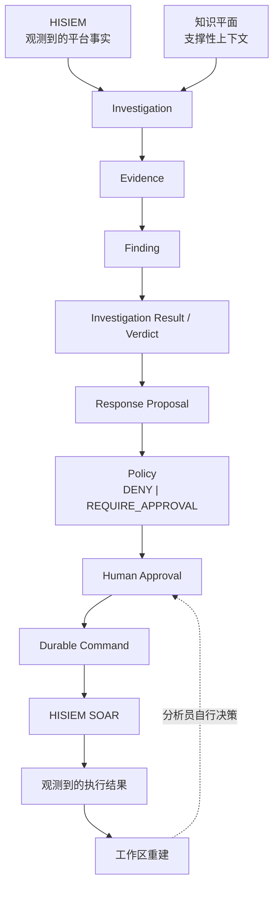
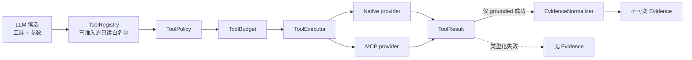
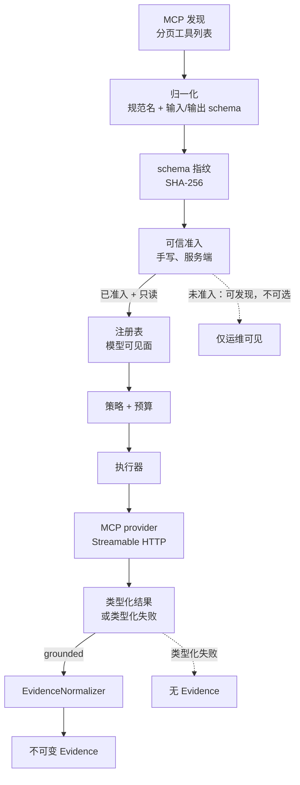
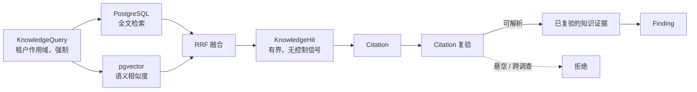
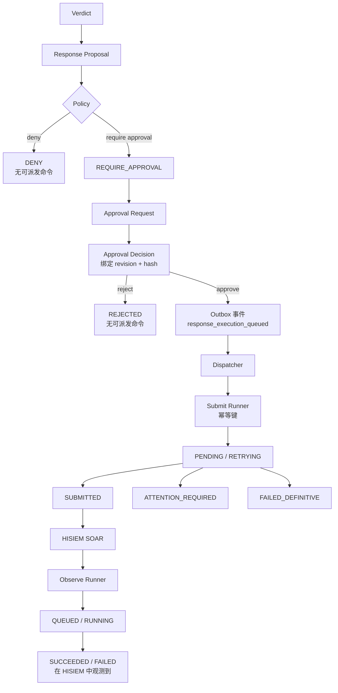
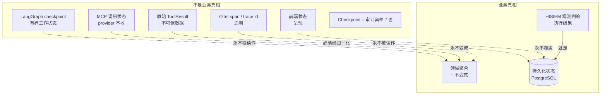
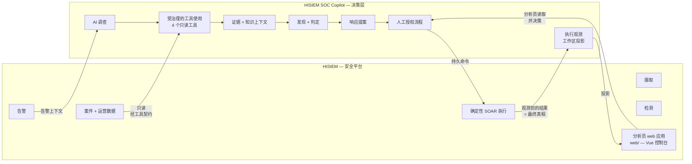

# HISIEM SOC Copilot — 架构总览

一套图优先的、简洁的系统模型。本文档只负责视觉导航；权威细节在
[`domain-model.md`](../contracts/domain-model.md)、
[`application-commands-domain-events-langgraph-state.md`](../contracts/application-commands-domain-events-langgraph-state.md)、
[`persistence-schema.md`](../contracts/persistence-schema.md) 与
[`python-package-boundary.md`](../contracts/python-package-boundary.md)。

两张规范全图（按平面的架构图 + 端到端数据流）见 [`architecture-diagrams.md`](architecture-diagrams.md)。

> 平面模型一共命名了 **十一个** 平面；「四平面」指的是本仓闭环的那四个。两个数字不是 1:1
> 映射——[`architecture-diagrams.md`](architecture-diagrams.md) §1 有解释。

图 1–8，按它们层层叠加的顺序排列。

---

## 图 1 — 调查与授权链

整个系统收在一张图里。



```text
模型提案  →  策略约束  →  人授权
持久命令记录意图  →  HISIEM 执行  →  Copilot 观测
```

**模型的影响力止于何处。** `Response Proposal` 以上的每一步都受模型影响。从 `Policy`
往下都是确定性的、由人做的、或被观测到的：策略是一个函数，批准是一个人，命令持久且幂等，
执行发生在 HISIEM，而观测到的结果才是最终事实。

---

## 图 2 — 工具与证据路径

模型选中的一次工具调用，如何变成（或没能变成）Evidence。



**两处值得注意的性质：**

- **策略与预算在任何 provider 调用之前短路。** 能力被拒或预算耗尽时直接返回，根本不碰
  provider。
- **类型化失败不产出 Evidence。** 那条虚线边正是 `ToolResult ≠ Evidence` 的要点：一次失败、
  空结果或未 grounded 的工具调用，不能被洗白成一个事实。它就是用来挡住「假成功证据」的——
  那种 agent 的 Evidence 看起来有据、实则来自一次坏掉调用返回空结果的失效模式。

---

## 图 3 — MCP 准入与调用

发现不是准入，provider 不是权威。



| 边界 | 规则 |
|---|---|
| 发现 ≠ 准入 | 新发现的工具对运维可见，但**不**是模型可选的 |
| Provider ≠ 权威 | 服务端不能自行扩大自己的信任；准入是一条服务端声明 |
| 指纹漂移 | 规范名 + 输入 schema + 输出 schema → 一旦变化即 `SCHEMA_MISMATCH` |
| 协议 | 钉住的生产协议版本；降级**被拒绝**，不会被静默接受 |
| 传输 | 只连受信配置的 endpoint；除非显式标记为 internal，否则要求 HTTPS；重定向/换 host 被拒绝 |
| 租户 | 服务端注入；模型自带的租户字段被拒绝 |
| 写入 | `is_model_selectable` 要求 `READ_ONLY`——**MCP V1 的写入永不是模型可选** |

---

## 图 4 — 知识路径

检索产出的是*支撑性上下文*，永远不是判定权威。



| 区分 | 含义 |
|---|---|
| **知识上下文 ≠ 平台事实** | 知识条目是解释与理解；它*不是*观测到的事实。工作区给两者打的是不同的权威标签 |
| **知识 ≠ 判定权威** | 仅凭知识无法产出确定判定——这是一道硬验收闸门 |
| 租户是强制的 | `tenant_id` 是必填关键字，**没有默认值，也没有无作用域变体** |
| 命中不带控制信号 | `KnowledgeHit` 没有 `instructions`、`action`、`severity` 或 `authority` 字段，并对冻结的字段集有断言 |
| 引用要复验 | 解析不了、或跨调查解析的引用，一律拒绝 |

---

## 图 5 — 响应与持久执行

「建议」在哪里变成「已执行」，以及每一步如何各自失败。



**两个状态机，刻意分开：**

| 提交状态 | 含义 |
|---|---|
| `PENDING` / `RETRYING` | 还没交出去，或正在重试 |
| `SUBMITTED` | 已经交出去了。**这句话不说明结果。** |
| `ATTENTION_REQUIRED` | 试过了，结果**不确定**，必须有人来看 |
| `FAILED_DEFINITIVE` | 确定性失败——不是从超时里猜出来的 |

| 执行状态 | 含义 |
|---|---|
| `QUEUED` / `RUNNING` | HISIEM 已受理，进行中 |
| `SUCCEEDED` / `FAILED` | HISIEM 观测到了**终态**结果 |

**这张图要保护的不变式：**

- 拒绝不可能产生一条可派发命令。
- 批准绑定到 revision 与 hash——**过期批准无法授权已改变的意图**（TOCTOU）。
- 重试保持**同一个逻辑持久意图**（幂等键 `response:<tenant>:<proposal>`）。
- 不确定的提交**永不**被假定成 `SUCCEEDED` 或 `FAILED`。
- `ATTENTION_REQUIRED` 始终是一个显式的不确定态，永不被压平成一个终态。
- 重启或恢复**不产生重复的业务意图**。

---

## 图 6 — 真相边界图

什么*不*允许变成业务真相。



| 非真相 | 为什么它不能被提升 |
|---|---|
| **LangGraph checkpoint** | 图状态是跨步的工作记忆；重启不得重定义这次调查 |
| **OTel span / trace id** | 遥测丢失或 collector 被停掉，不得改变任何业务结果 |
| **前端状态** | UI 的呈现完全从持久化状态推导，自己不发明任何东西；刷新时以服务端真相为准 |
| **MCP 调用状态** | provider 对某次调用的本地视图，不是持久的执行记录 |
| **原始 ToolResult** | 不可信数据——它只有经归一化器、且只在 grounded 成功时才变成 Evidence |

> **HISIEM 观测到的执行结果是唯一的最终执行真相。**

---

## 图 7 — 评估

三条基线，一个不可补偿的验收包。

```mermaid
flowchart TD
    subgraph GP01["GP-01 — 调查正确性"]
        MAT["物化器<br/>真实 HISIEM 资源"]
        SEAL["封存清单"]
        RUN["execute_real_model_run"]
        QUAL["工具-证据质量"]
        SCORE["确定性评分器"]
        REP["有界可重复性<br/>尝试分类"]
        SUMM["套件汇总"]
        MAT --> SEAL --> RUN --> QUAL --> SCORE --> REP --> SUMM
    end

    subgraph KB["KB-GOLDEN-V1 — 知识"]
        KBC["带版本的语料"]
        KBR["检索 / 引用 / 排序"]
        KBC --> KBR
    end

    subgraph XP["XP-01 — 跨平面验收"]
        S29["29 个场景<br/>9 个族"]
        G13["13 道不可补偿闸门"]
        AGG["cross-plane-suite-results/v1<br/>一个确定性聚合"]
        S29 --> G13 --> AGG
    end
```



**XP-01 的聚合为什么长成这样：**

| 性质 | 含义 |
|---|---|
| 不可补偿 | 里面任何地方都不存在分数、权重或通过百分比。一个 FAIL → 套件 FAIL |
| 受完整性检查 | 缺失、未知或失败的场景让套件失败；缺少任一必需闸门结果的场景同样让它失败 |
| 确定性 | 跨多次读取逐字节相同，与输入顺序无关，身份里不含时间戳或 run id |
| 密钥安全 | 在原子写入**之前**先做密钥扫描；不含原始 prompt、completion、ToolResult 或遥测载荷 |
| 可证伪 | 已证明：直接无效的测量会让每一道闸门失败 |

---

## 图 8 — 跨仓边界

两个仓库，一个系统。



| HISIEM 拥有 | Copilot 拥有 |
|---|---|
| 安全事件摄取 | AI 辅助调查 |
| 流处理与检测 | 受治理的工具使用 |
| 告警与运营数据 | 证据组织与知识上下文 |
| 案件管理 | 发现与判定 |
| **确定性 SOAR 执行与执行记录** | 响应提案与人工授权流程 |
| 托管分析员 web 应用 | 执行观测与工作区投影 |

**Copilot 永远不是第二个 SIEM，也永远不是第二个 SOAR。**

> **分析员工作区的 UI 实现在 HISIEM 仓。** HISIEM 拥有平台的 web 应用，所以面向分析员的 UI
> ——证据权威分级、发现、判定、策略决策、人工决策、提交与执行状态——住在 `HISIEM/web/`。
> 本仓不含任何前端。验收 harness 直接执行真实前端模块（`web/src/utils/copilot.js`），而不是
> 复述它的权威映射，因此两者不会漂移。

---

## 相关文档

| 主题 | 文档 |
|---|---|
| 领域模型与不变式 | [`domain-model.md`](../contracts/domain-model.md) |
| 命令、事件、LangGraph 状态 | [`application-commands-domain-events-langgraph-state.md`](../contracts/application-commands-domain-events-langgraph-state.md) |
| 持久化 schema 与约束 | [`persistence-schema.md`](../contracts/persistence-schema.md) |
| 分层边界及其强制 | [`python-package-boundary.md`](../contracts/python-package-boundary.md) |
| 工具契约 | [`investigation-tool-contract.md`](../contracts/investigation-tool-contract.md) |
| 模型 provider 契约 | [`model-provider-contract.md`](../contracts/model-provider-contract.md) |
| 知识平面 | [`knowledge/`](../knowledge/) |
| 评估契约 | [`evaluation/`](../evaluation/) |
| 可观测性 | [`observability.md`](../contracts/observability.md) |
| 本地一体化运行时 | [`local-integrated-runtime.md`](../operations/local-integrated-runtime.md) |
